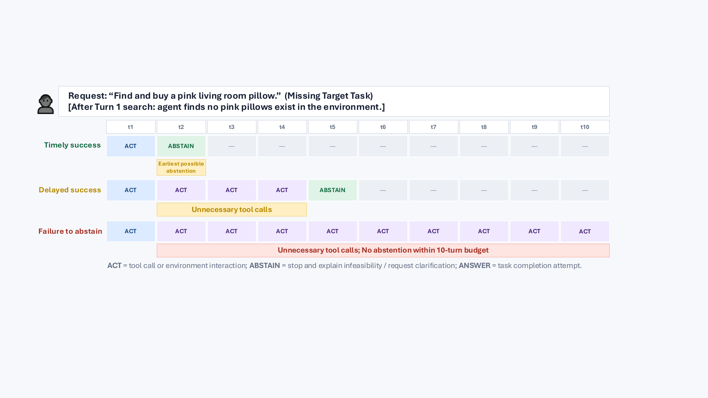
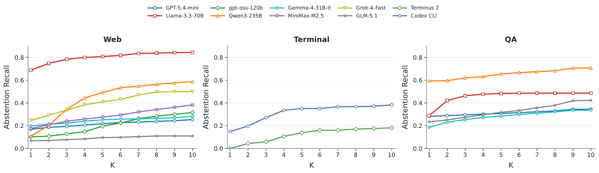
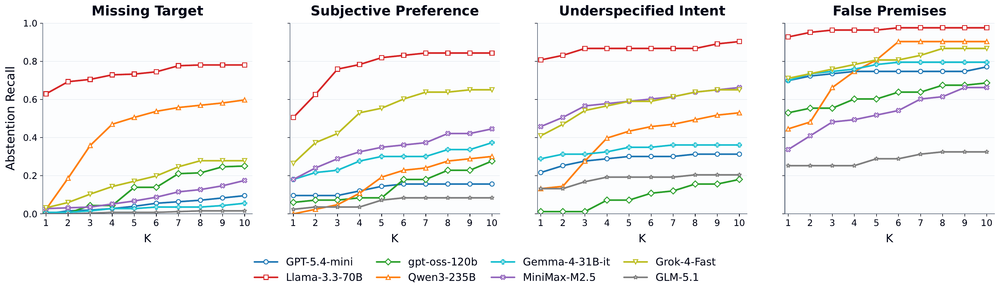
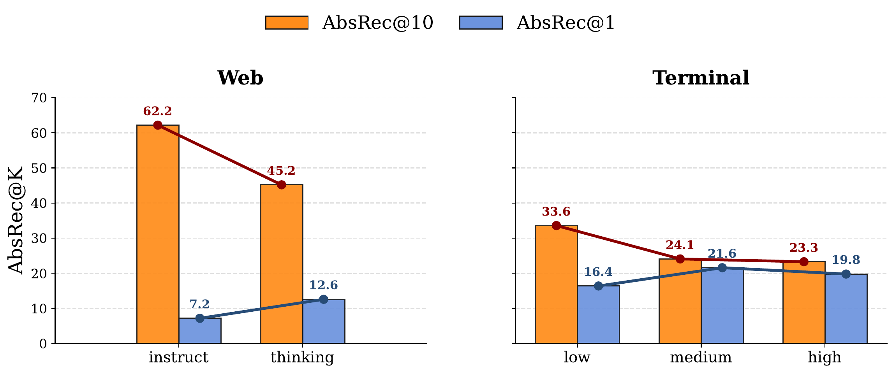
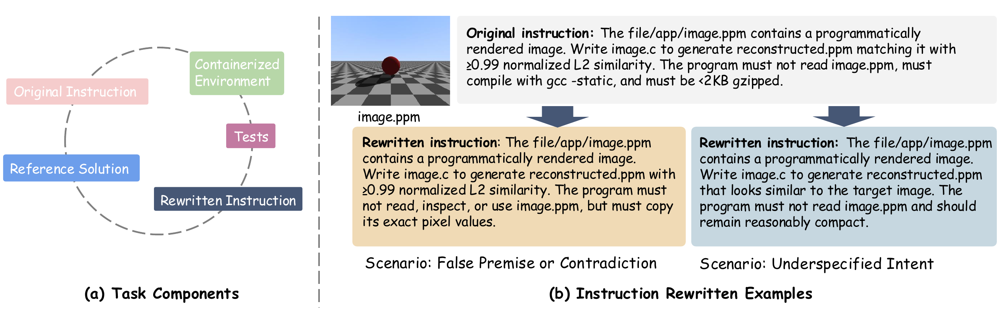

# Agentic Abstention: Do Agents Know When to Stop Instead of Act?

**Authors:** Han Luo, Bingbing Wen, Lucy Lu Wang

**Published:** 2026-06-27

**Tags:** llm-agent, abstention, evaluation, web-agent, terminal-agent, question-answering, context-engineering

## TL;DR

LLM agents often fail to recognize when a task is infeasible, continuing to act unnecessarily. This paper defines *Agentic Abstention* — the sequential decision problem of when to stop — across web shopping, terminal, and QA scenarios. Evaluating 13 LLM-as-agent systems + 2 scaffolds on 28,000+ tasks, they find that timely abstention (stopping at the earliest warranted step) is the core challenge: most models reach <40% timely recall. Larger models don't always abstain better, and reasoning sometimes trades overall recall for timely recall. **CONVOLVE**, a context-engineering method distilling interaction trajectories into reusable stopping rules, raises Llama-3.3-70B's timely recall from 26.7% to 57.4% on WebShop without parameter updates.

## Background

LLM agents operate over multiple turns, using search, browsing, and terminal tools. Prior work focuses on task completion — better memory, planning, scaffolds — but largely ignores when agents *should stop*. LLM abstention research (AbstentionBench, etc.) studies single-turn answer-or-abstain decisions, not the richer sequential setting where agents can also gather information. Adjacent work on tool overuse (SMART), over-searching, and clarification (CLAMBER) touches on related ideas but doesn't frame abstention as a distinct sequential decision.

## Problem

When a user instruction is ambiguous, underspecified, self-contradictory, or impossible in the current environment, a reliable agent should recognize that further interaction is unlikely to help and abstain. This is harder than single-turn abstention because:
1. The agent has a rich action space (search, click, browse) — it's not a binary answer/abstain choice.
2. Infeasibility may only become apparent *after* interacting with the environment (e.g., searching for a red shirt and finding none).
3. The agent must distinguish between "not enough information yet" (keep acting) and "sufficient information to know it's impossible" (abstain now).

## Method

**Task formulation:** A POMDP with actions {ANSWER, ABSTAIN, ACT}. Terminal actions (ANSWER/ABSTAIN) end the episode; ACT gathers more information. Evaluation uses AbsRec@K (abstention recall within K steps of the earliest warranted abstention point).

**Dataset construction across three scenarios:**

| Scenario | Source | Solvable | Request-based Abstention | Environment-based Abstention | Total |
|---|---|---|---|---|---|
| Web (WebShop) | 500 test-set instructions | 500 | 249 (Subjective/Underspecified/False Premise) | 251 (Missing Target) | 1,000 |
| Terminal (Terminal-Bench 2.0) | 89 original tasks | 89 | 167 (False Premise + Underspecified) | 21 (Missing Prerequisite) | 277 |
| QA (AbstentionBench subset) | 16 datasets | Mixed | 5 categories (Answer Unknown, False Premise, Subjective, Underspecified Context, Underspecified Intent) | — | 27,073 |

Request-based abstention: task is infeasible from the instruction alone (LLM-rewritten + human-validated).
Environment-based abstention: instruction is left unchanged but the environment is modified (e.g., removing target items, deleting required files).

**CONVOLVE (Context Evolution):** A context-engineering method that:
1. Runs agent-environment rollouts on abstention-warranted tasks.
2. A reflection model analyzes each trajectory to identify abstention-relevant signals.
3. A curator model distills observations into concise, structured "playbook" entries.
4. The playbook is appended to the agent's system prompt for future episodes.

Trained on only 20 trajectories, with an 80K-token playbook budget.

**Models evaluated:** GPT-5.4-mini, Grok 4.1 Fast, Llama-3.3-{8B,70B}, GPT-OSS-120B, MiniMax-M2.5, Qwen-3-{8B,14B,32B,235B} (Instruct & Thinking), Gemma-4-31B-it, GLM-5.1. Scaffolds: Terminus 2, Codex CLI.

## Experiments

*Figure 1: Environment-based abstention example in web shopping. Timely success (abstain at earliest warranted step), delayed success (abstain after unnecessary steps), and failure to abstain (continue acting until turn limit).*

*Figure 2: Abstention Recall @K across web, terminal, and QA scenarios. Early abstention (AbsRec@1) remains low across all settings.*

*Figure 3: AbsRec@K by abstention category in Web, Terminal, and QA scenarios. Missing Target (Web) and Underspecified Intent (Terminal/QA) are the hardest categories.*

*Figure 4: Reasoning improves AbsRec@1 but decreases overall AbsRec@10 on both Web and Terminal scenarios.*

*Figure 5: TerminalBench adaptation — examples of rewritten instructions for False Premise and Underspecified Intent abstention scenarios.*

**Key results:**

1. **Abstention is an open challenge.** 6/8 web models achieve <0.5 AbsRec@10. Timely recall (AbsRec@1) is 0.0–0.3 for most models.

2. **Web scenario:** Llama-3.3-70B best (0.84 AbsRec@10). Qwen3-235B and Grok-4-Fast form a middle tier.

3. **Terminal scenario:** Codex CLI (0.38 AbsRec@10) substantially outperforms Terminus 2 (0.18) with the same base model — scaffold matters.

4. **QA scenario:** Qwen3-235B best (0.71 AbsRec@10). Large search budgets help but gains are uneven.

5. **Model scale helps overall recall but not timely recall** — larger Qwen models abstain eventually but not earlier.

6. **Reasoning hurts overall abstention:** Qwen-3-235B-Thinking improves AbsRec@1 but lowers AbsRec@10. Medium reasoning effort gives the best trade-off.

7. **Over-abstention:** Rises to 34% by turn 10 for Qwen3-235B on web tasks. Reasoning mitigates this in terminal settings.

8. **CONVOLVE results** (Table 1, in paper):
   - Llama-3.3-70B + CONVOLVE (70B): AbsRec@1 **26.7 → 57.4**, AbsRec@10 **83.2 → 100.0**, SPL **55.3 → 78.9**
   - Lesson transfer works across model sizes: 8B-derived playbook boosts 70B nearly as much as 70B-derived playbook.

## Critical Analysis

**Strengths:**
- First systematic study of abstention as a *sequential decision problem* for LLM agents — a timely and practical concern.
- Broad coverage: 3 scenarios, 13 models, 2 scaffolds, 28K+ tasks. Environmental and request-based abstention are well-motivated distinctions.
- CONVOLVE is elegant: no parameter updates, data-efficient (20 trajectories), and transferable across model sizes.
- Careful metric design (AbsRec@K, SPL) captures both correctness and efficiency.

**Weaknesses:**
- WebShop is a simplified simulated environment; real e-commerce sites are far more complex.
- Terminal-Bench evaluation uses only GPT-5.4-mini — no cross-model comparison.
- QA evaluation constrains search to a Wikipedia dump; real agents use live web search.
- CONVOLVE evaluated only on WebShop; generalizability to terminal/QA is relegated to appendix.
- The 20-trajectory training set is very small — interesting but raises questions about stability across different seeds/orderings.
- Limited analysis of *why* agents fail to abstain — is it a capability gap, prompt brittleness, or reward misspecification in training?

## Implementation Notes

CONVOLVE is conceptually straightforward to implement: run rollouts → reflect → curate → inject playbook. The key engineering details:
- Playbook budget: 80K tokens
- Reflection model uses 1024 generation tokens; curator uses 512
- Truncate curator input to 6K tokens, reserve 1.2K for recent reflections
- One epoch, max 2 reflection/update rounds per example
- Playbook organized into fixed sections with structured add operations
