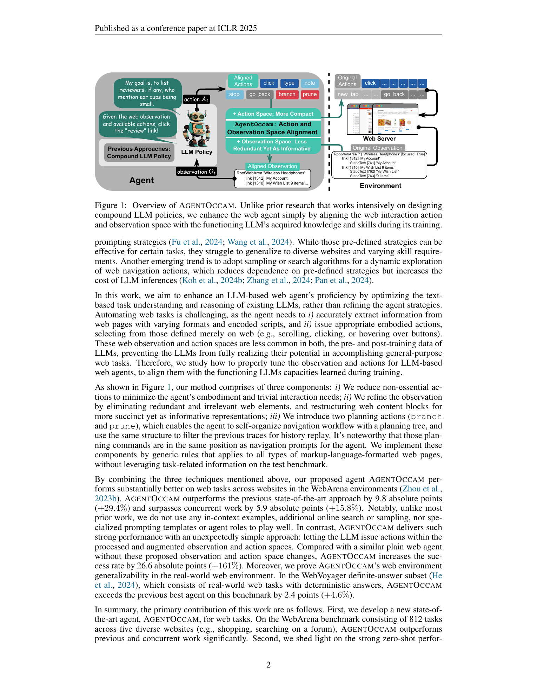
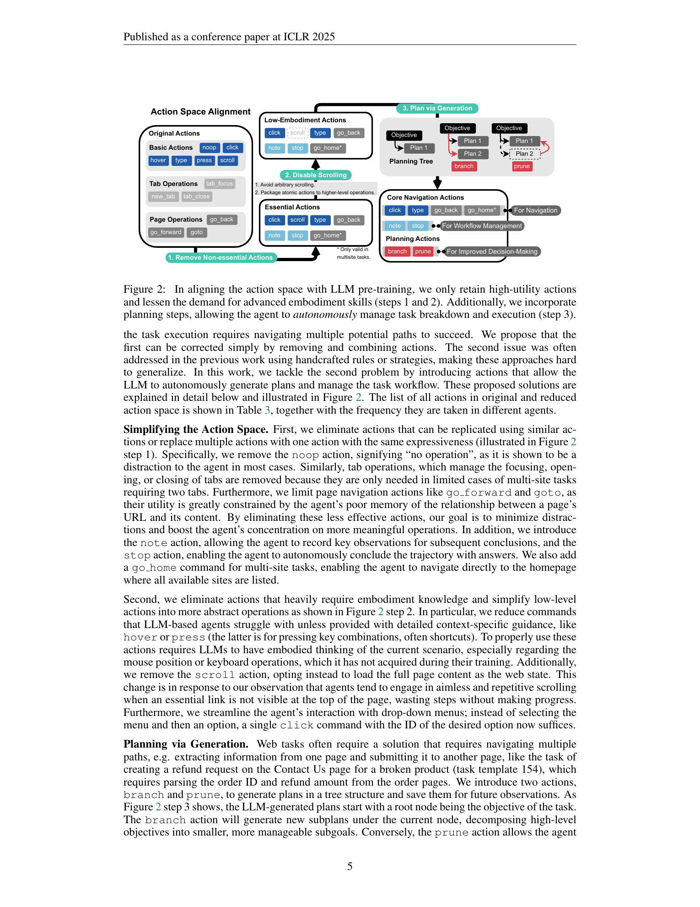
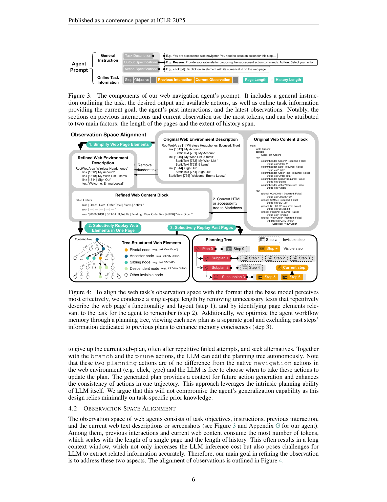
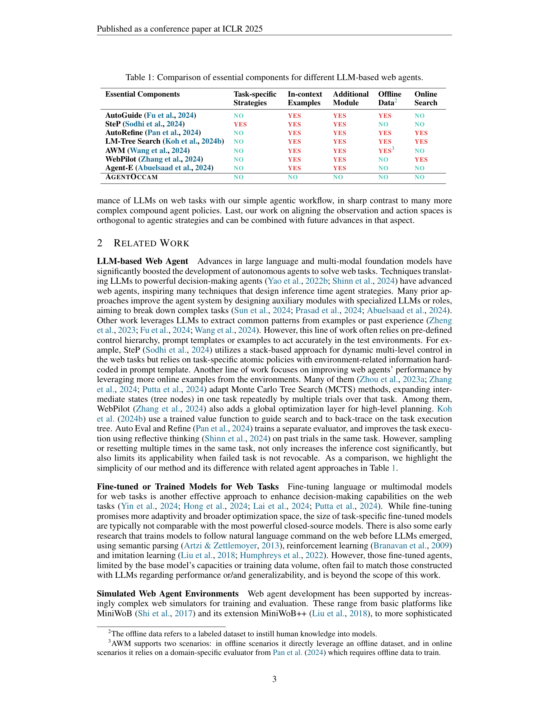
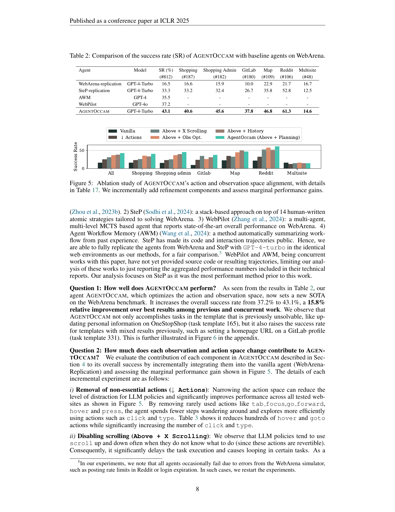
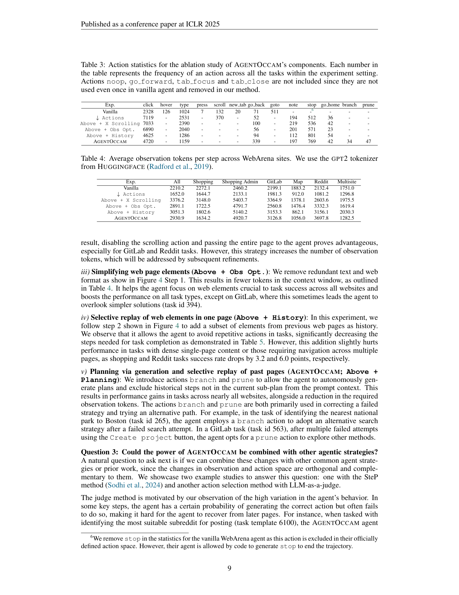

# AgentOccam: A Simple Yet Strong Baseline for LLM-Based Web Agents

## TL;DR

AgentOccam argues that web-agent performance can improve substantially without adding complex agent scaffolding. Instead of new roles, search loops, demonstrations, or fine-tuning, the paper changes the observation and action spaces exposed to the base LLM. It removes rarely useful or embodiment-heavy actions, rewrites web observations into a more compact text format, keeps only pivotal past page elements, and adds `branch` / `prune` planning actions. With GPT-4-Turbo, this simple policy reaches 43.1% success on WebArena, ahead of WebPilot's 37.2% and SteP's 33.3%, and transfers to a deterministic subset of WebVoyager with 54.3% success.

Source: [arXiv:2410.13825](https://arxiv.org/abs/2410.13825), [PDF](https://arxiv.org/pdf/2410.13825.pdf), [code](https://github.com/amazon-science/AgentOccam)

## Background

Many web-agent systems try to improve reliability by adding more inference-time machinery: handcrafted prompt policies, specialist roles, reflection, workflow memory, search, sampling, or learned evaluators. These systems can work, but they also increase cost and often bake benchmark-specific assumptions into the agent.

AgentOccam starts from a different observation. A browser agent asks an LLM to reason over representations that are unlike normal pre-training text: accessibility trees, repeated HTML labels, element IDs, low-level actions such as hover and scroll, and long histories of prior pages. If the interface between browser and LLM is poorly aligned, the LLM may waste effort on actions it cannot ground well, or lose important information inside noisy observations.

The paper therefore treats web-agent design as an interface-alignment problem. The goal is not to invent a stronger planner, but to expose the same web task through a representation that a general-purpose LLM can use more naturally.

## Problem

The paper formalizes web interaction as a POMDP:

\[
\langle O, S, A, P, R, p_0, \gamma \rangle.
\]

At each step, the agent observes a partial web state \(o_t \in O\), chooses an action \(a_t \in A\), and receives success only through a task evaluator after a trajectory. Prior compound agents usually modify the policy with extra modules, for example evaluators, memory systems, or tree-search controllers.

AgentOccam studies a narrower class of policies:

\[
\pi(g(a_t) \mid h_t) = \pi_{\mathrm{LLM}}(a_t \mid f(h_t)).
\]

Here \(f\) maps the observation history into an LLM-friendly prompt, while \(g\) maps the LLM's textual action into browser-executable commands. The research question is whether strong web-agent performance can come mainly from better \(f\) and \(g\), while leaving the LLM policy itself and the control loop simple.

## Method

AgentOccam has two main alignment targets: actions and observations.

For action-space alignment, it removes actions that are easy for the model to misuse or that demand physical browser intuition. The reduced action set keeps high-utility commands such as `click`, `type`, `go_back`, `note`, `stop`, and, for multisite tasks, `go_home`. It removes or collapses actions such as `noop`, tab operations, `go_forward`, `goto`, `hover`, `press`, and `scroll`. Rather than letting the agent repeatedly scroll when it is uncertain, the system loads the full page content into the text observation. Drop-down interaction is also simplified so the agent can click a desired option directly.

The paper then adds two planning actions:

- `branch`: create subplans under the current objective.
- `prune`: abandon a failed subplan and return to another point in the plan tree.

These are not implemented as a separate planner module. They are presented as ordinary available actions, so the LLM decides when to call them.

For observation-space alignment, AgentOccam compresses the browser representation. Redundant static text is merged with corresponding interactive elements, and table/list structures are rewritten into Markdown-like blocks. This keeps the page information but removes repeated accessibility-tree scaffolding such as `StaticText`, `columnheader`, and `gridcell` tokens.

History replay is also filtered. When the agent marks a web element as pivotal, future prompts keep the node's ancestors, siblings, and descendants rather than replaying the whole page. The plan tree further scopes history: when a new branch is active, observations from unrelated earlier subplans can be omitted. In effect, the prompt contains the current goal, selected recent interactions, compact current page text, and only task-relevant traces from previous pages.

## Experiments

The main evaluation uses WebArena with 812 tasks across shopping, shopping administration, GitLab, map, Reddit, and multisite settings. AgentOccam uses GPT-4-Turbo-2024-04-09 and is compared with a replicated WebArena CoT baseline, replicated SteP, AWM, and WebPilot.

On WebArena, AgentOccam reaches 43.1% overall success. The replicated WebArena baseline gets 16.5%, SteP gets 33.3%, AWM reports 35.5%, and WebPilot reports 37.2%. The strongest domain result is Reddit at 61.3%, while the weakest is multisite at 14.6%, where long-horizon navigation remains difficult.

The ablation is useful because it shows the gain is not from one magic prompt. Starting from 16.5%, removing non-essential actions raises success to 25.9%. Disabling scrolling and passing full page content raises it to 31.7%. Simplifying observations raises it to 37.1%. Selective history replay reaches 38.2%. Adding branch/prune planning and plan-scoped history gives the final 43.1%.

The same pattern appears on a 190-task WebArena development subset with Gemini-1.5-Flash: the full AgentOccam setup improves from an 11.6% vanilla baseline to 33.7%. This supports the paper's claim that the interface changes are not specific to GPT-4-Turbo.

The paper also evaluates a deterministic-answer subset of WebVoyager with 129 tasks across 13 real-world websites. AgentOccam reaches 54.3% success compared with 51.9% for the replicated Agent-E baseline. This result is narrower than full WebVoyager because the authors exclude open-ended or time-sensitive tasks and omit GitHub tasks due to anti-scraping and loading issues.

## Critical Analysis

The strongest part of the paper is its restraint. It demonstrates that a web agent can improve by removing confusing affordances and formatting observations for the model, not just by stacking more LLM calls. That is a valuable result for practitioners because observation/action design is cheaper, easier to audit, and often more portable than benchmark-specific prompting policies.

The ablation is also convincing. The gains are incremental and mostly interpretable: fewer distracting actions, fewer useless scroll loops, shorter observations, less noisy history, and better recovery from failed subplans. The comparison table makes the engineering point clear: AgentOccam uses no task-specific strategies, no in-context examples, no extra module, no offline data, and no online search.

There are still limitations. First, some choices are hand-engineered heuristics. Removing scroll works well in WebArena, but real sites often lazy-load content or expose information only after scrolling. The authors acknowledge this and suggest that a trained agent might learn when scroll is useful rather than removing it entirely.

Second, the full-page observation strategy can increase token volume before later compression. This is practical for current long-context models, but it shifts work from browser grounding to prompt management and may become costly on large pages.

Third, WebArena success remains far below human-level reliability. A 43.1% success rate is a strong benchmark result, but production web automation still needs stronger recovery from dynamic layouts, authentication failures, popups, irreversible actions, and stale page states.

Finally, the WebVoyager result is intentionally restricted to deterministic-answer tasks. That makes evaluation cleaner, but it does not fully test messy real-world workflows where answer validity changes over time or requires human judgment.

## Implementation Notes

The paper suggests several practical patterns for browser-agent builders.

First, design the action schema as a model-facing API, not as a direct mirror of browser primitives. Actions that are technically valid can still be harmful if the model lacks the grounding needed to use them consistently.

Second, convert page structure into compact text that preserves task-relevant hierarchy. A table rendered as Markdown is often easier for an LLM to use than a long accessibility tree with repeated role labels.

Third, separate current-page observation from replayed memory. The current page can be broad, but history should be filtered through pivotal elements and the active plan. A useful replay object is:

\[
H_t^{\mathrm{replay}} =
\{ \mathrm{ancestors}(v), \mathrm{siblings}(v), \mathrm{descendants}(v) : v \in V_{\mathrm{pivotal}} \}.
\]

Fourth, planning actions can be part of the same action language as browser commands. A simple agent loop can still support recovery if `branch` and `prune` update an external plan tree that affects future prompt construction.

For implementation, the main risk is overfitting action pruning to one environment. A robust version should log action failures, detect when removed actions would have been useful, and make the mapping \(f, g\) configurable per website or per browser environment.

## Captured Figures and Tables

