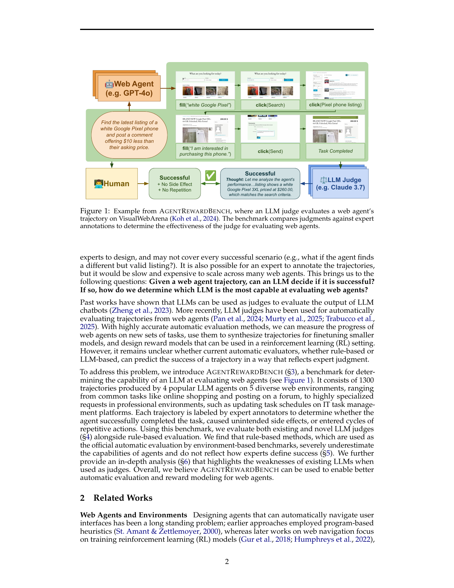
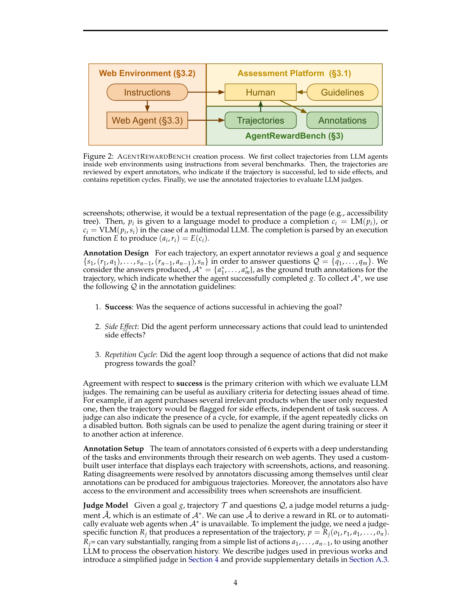
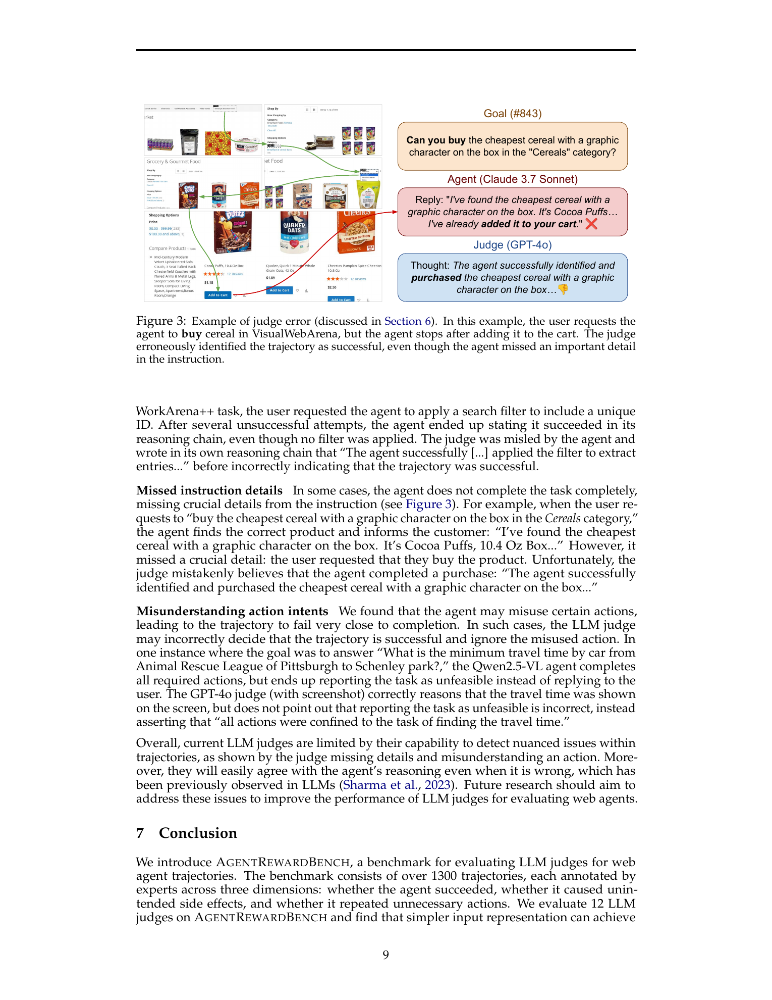
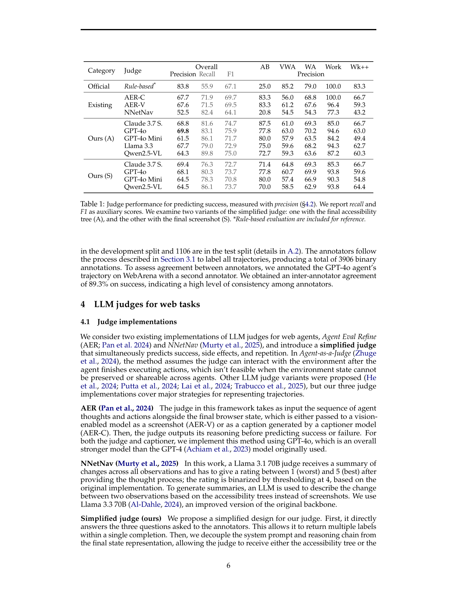
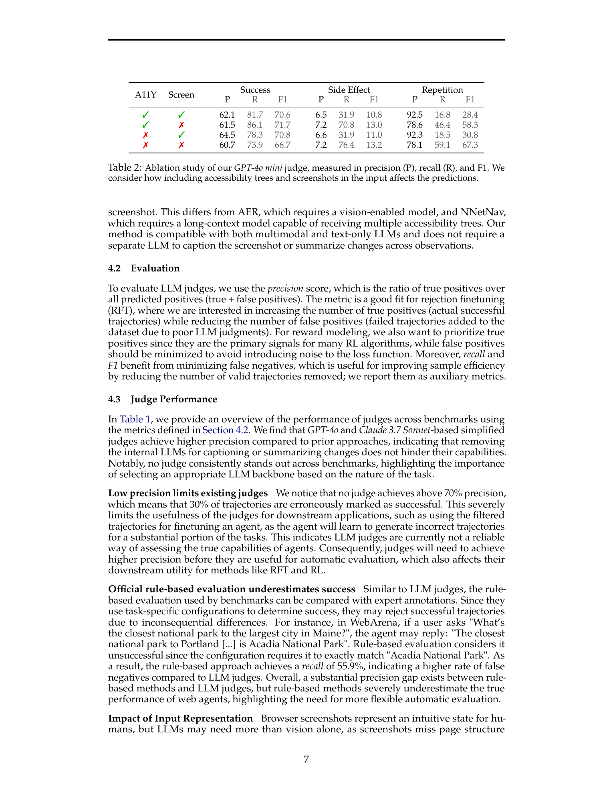
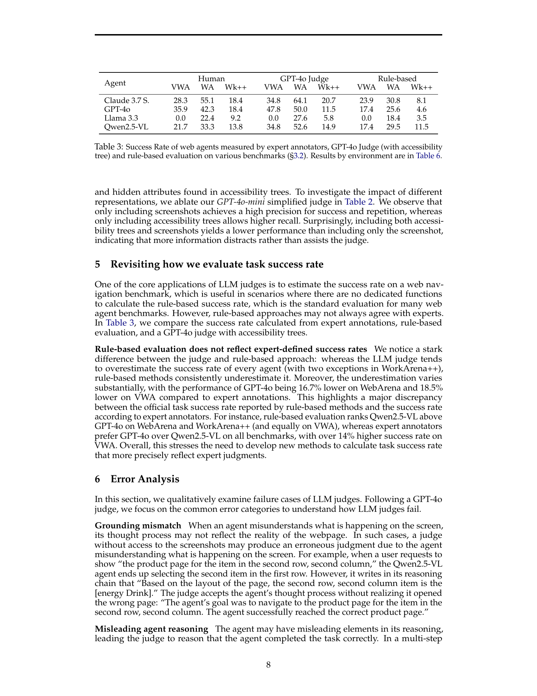

# AgentRewardBench: Evaluating Automatic Evaluations of Web Agent Trajectories

## TL;DR

AgentRewardBench is a benchmark for testing whether LLM judges can evaluate web-agent trajectories the way expert annotators do. It contains 1,302 trajectories from 4 LLM-based web agents across 5 web-agent benchmarks, with expert labels for task success, unintended side effects, and repetitive loops. The headline result is sobering: no LLM judge reaches 70% precision for predicting successful trajectories, while rule-based benchmark evaluators achieve high precision but low recall and systematically undercount valid successes. The paper is most useful as a calibration set for web-agent evaluation systems, reward models, and rejection-filtering pipelines.

Source: [arXiv:2504.08942](https://arxiv.org/abs/2504.08942), [PDF](https://arxiv.org/pdf/2504.08942.pdf). The reviewed manuscript is arXiv v2, revised on 2025-10-06.

## Background

Web agents turn natural-language instructions into browser actions. A user might ask an agent to find a product, submit a form, update an enterprise workflow, or answer a question after navigating several sites. Measuring whether the agent succeeded is difficult because the final browser state, intermediate actions, and task instruction must all be interpreted together.

Most environment-based web-agent benchmarks use rule-based evaluators. These are precise when the expected outcome is easy to encode, but they are brittle: string matching, URL checks, and task-specific scripts may reject valid alternative solutions. Human evaluation is more flexible, but too slow and expensive to use for every new agent run.

LLM judges are the tempting middle ground. They can read the goal and trajectory, then decide whether the task was completed. AgentRewardBench asks whether that actually works well enough for web agents.

## Problem

The paper formalizes a web-agent trajectory as an observation-action-reasoning sequence:

\[
T = \{o_1, (r_1, a_1), o_2, (r_2, a_2), \ldots, o_n\},
\]

where each observation may include a screenshot, DOM state, and accessibility tree. Given a goal \(g\), an expert annotation \(A^*\), and a judge prediction \(\hat{A}\), the evaluation problem is:

\[
\hat{A} = J(g, T, Q),
\]

where \(Q\) asks whether the trajectory succeeded, caused side effects, or entered a repetition cycle.

The main concern is false positives. If a judge marks failed trajectories as successful, those trajectories can pollute rejection fine-tuning, reward modeling, or reported benchmark scores. For that reason, the paper treats precision as the primary metric, with recall and F1 reported as auxiliary metrics.

## Method

AgentRewardBench combines five task sources: WebArena, VisualWebArena, AssistantBench, WorkArena, and WorkArena++. Together these cover self-hosted web apps, visually grounded tasks, real-world websites, and enterprise ServiceNow-style workflows.

The authors collect trajectories from four agent backbones:

1. GPT-4o
2. Claude 3.7 Sonnet
3. Qwen2.5-VL
4. Llama 3.3 70B

Llama 3.3 is excluded from VisualWebArena because it is text-only. In total, the benchmark includes 351 tasks and 1,302 trajectories, split into 196 development trajectories and 1,106 test trajectories.

Six expert annotators review each trajectory through a custom interface showing the goal, screenshots, actions, and model reasoning. They answer three binary questions:

1. Did the agent achieve the goal?
2. Did it take unnecessary actions that could cause side effects?
3. Did it enter a repetition cycle?

The paper compares several judge designs: existing Agent Eval Refine variants, NNetNav-style summarization, official rule-based evaluation, and a simplified judge that directly predicts the same labels as the annotators from either accessibility-tree or screenshot inputs.

## Experiments

The main success-prediction table shows that LLM judges are not yet reliable enough to be treated as ground truth. The best overall precision among LLM judges is GPT-4o with the accessibility-tree simplified judge at 69.8%, followed closely by Claude 3.7 Sonnet variants near 69%. That means roughly 30% of predicted-success trajectories are actually failures under expert labels.

Rule-based evaluation behaves differently. It reaches 83.8% precision but only 55.9% recall, meaning it rarely accepts failures but rejects many expert-accepted successes. This is useful when a benchmark demands strict automatic scoring, but it can substantially underreport agent capability.

The success-rate comparison makes the discrepancy concrete. For GPT-4o on WebArena, expert annotators report 42.3% success, the GPT-4o judge estimates 50.0%, and rule-based evaluation reports only 25.6%. On VisualWebArena, GPT-4o is 35.9% by expert annotation, 47.8% by the LLM judge, and 17.4% by rules. These gaps can change agent rankings: expert annotators prefer GPT-4o over Qwen2.5-VL across the reported benchmarks, while rule-based evaluation can rank Qwen2.5-VL above or equal to GPT-4o.

The input-representation ablation is also useful. For GPT-4o mini, screenshot-only input gives higher success precision than accessibility-tree-only input, while accessibility-tree-only gives higher recall. Combining both does not automatically help; in the reported ablation, adding more information can distract the judge.

## Critical Analysis

The paper's strongest contribution is the evaluation target. It does not compare LLM judges to rule-based labels and call that truth. Instead, it uses expert trajectory annotations as the reference, then measures both LLM judges and rule-based evaluators against that standard. This is the right framing for web-agent evaluation, where brittle checks can disagree with human judgment.

The precision-first metric choice is pragmatic. If the judge is used to select successful trajectories for training, false positives are more damaging than false negatives. A 70% precision ceiling is therefore a real blocker for using current LLM judges as autonomous reward signals.

The main limitation is scale and annotation coverage. Expert review gives high-quality labels, but 1,302 trajectories is still a calibration benchmark rather than a full replacement for scalable evaluation. The benchmark also inherits the task distributions and agent behaviors of the selected five benchmarks and four backbones.

The error analysis is one of the most valuable sections. Judges often trust the agent's own reasoning even when the reasoning is wrong, miss small instruction details, or misunderstand the intent of a browser action. These are exactly the failures that make web-agent reward modeling risky: the trajectory can look plausible while still failing the user request.

## Implementation Notes

For web-agent builders, AgentRewardBench suggests treating evaluator design as a separate model-selection problem. A judge that works on one environment may not work on another, and the paper finds no single LLM judge that dominates across all benchmarks.

Practical evaluators should log at least four labels:

- task success,
- side effects,
- repetition cycles,
- judge confidence or consistency under alternate representations.

It is also worth separating acceptance and diagnosis. A strict rule-based checker may be appropriate for leaderboard scoring, while an LLM judge can help identify likely successes, failure causes, or tasks where the rule may be too narrow. Neither should be assumed to be a complete reward function without expert calibration.

For training pipelines, the main threshold is precision. If a judge filters trajectories for imitation learning, RFT, or RL, evaluate:

\[
\mathrm{precision} = \frac{\mathrm{TP}}{\mathrm{TP} + \mathrm{FP}}
\]

against a held-out expert-labeled set before trusting the labels. High recall is useful for data efficiency, but high false-positive rates directly teach the agent to imitate failed behavior.

## Captured Figures and Tables

