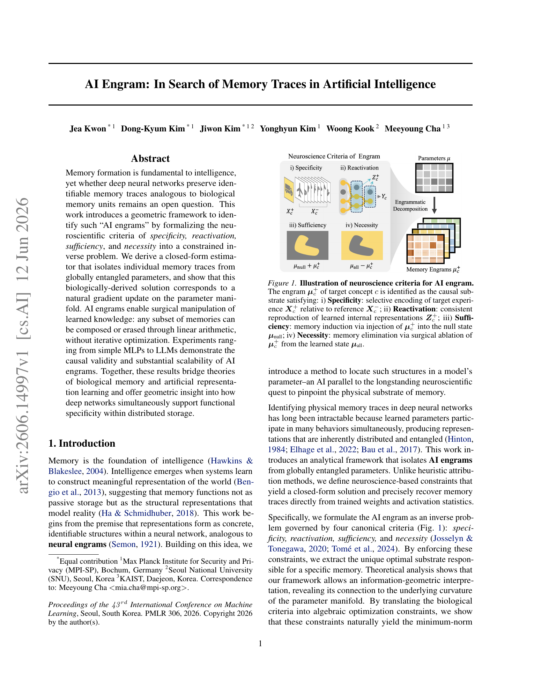
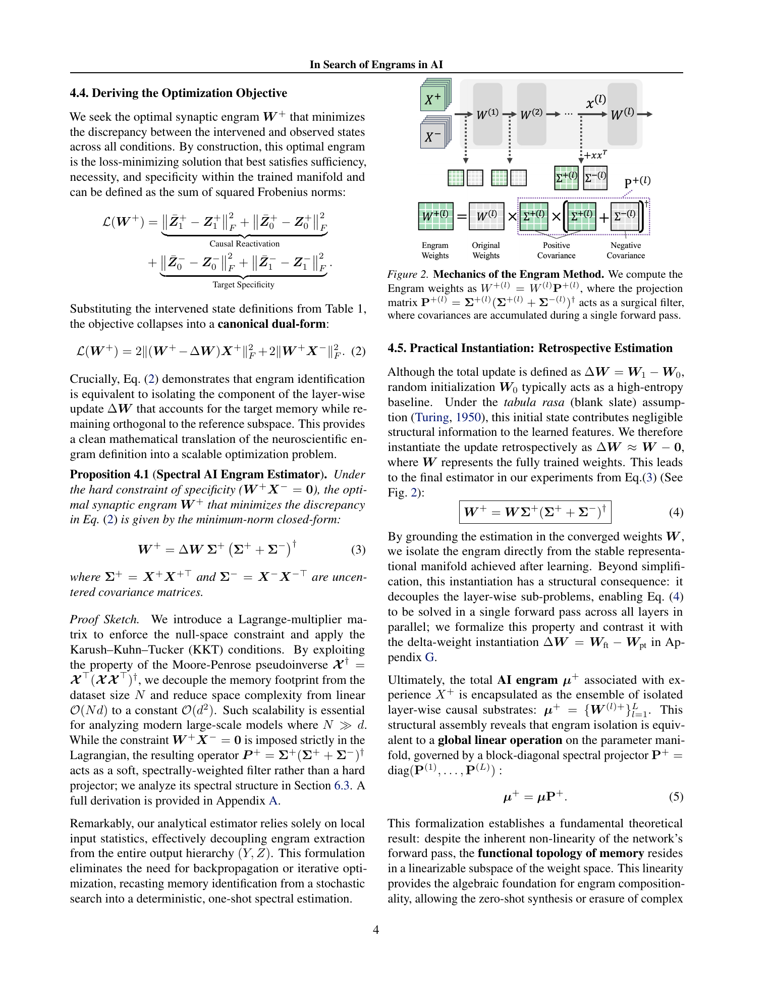
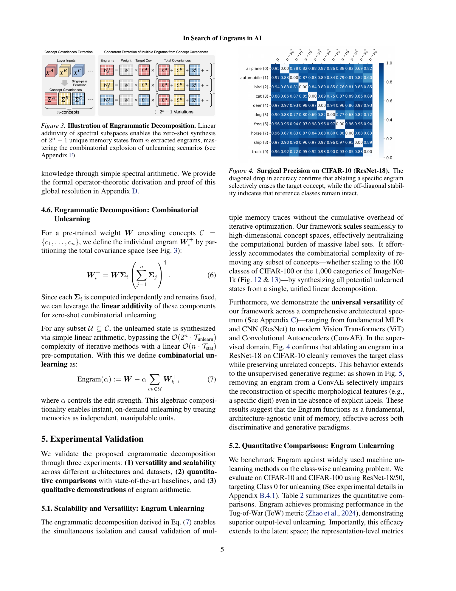
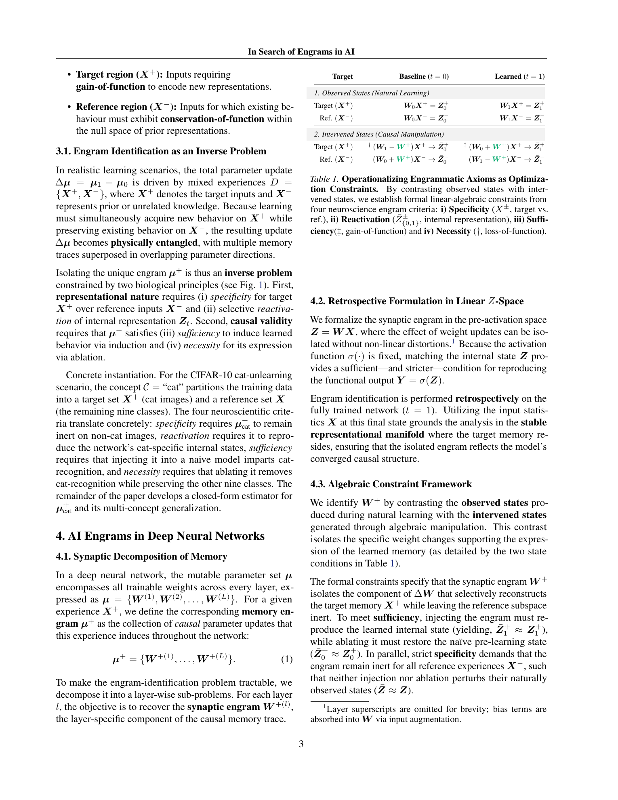
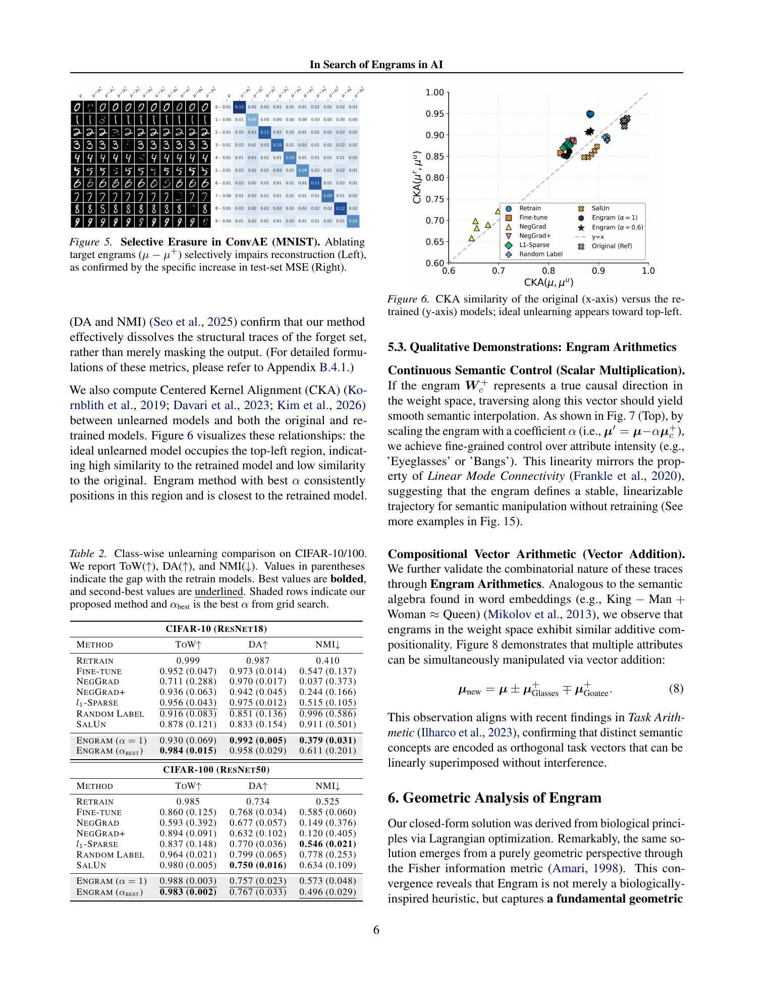
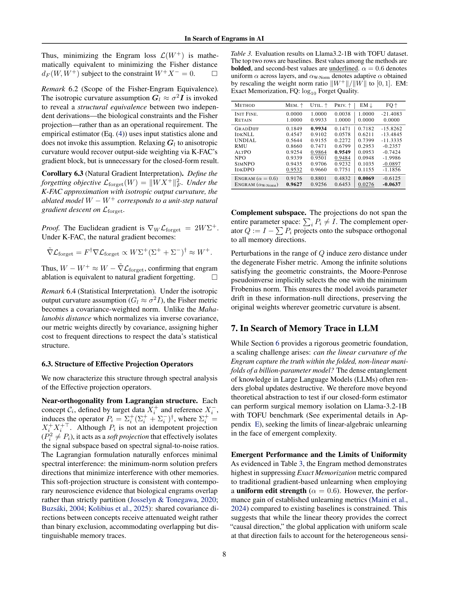

# AI Engram: In Search of Memory Traces in Artificial Intelligence

## TL;DR

AI Engram proposes a closed-form way to identify and manipulate concept-specific "memory traces" in neural network weights. The method translates neuroscience criteria for engrams - specificity, reactivation, sufficiency, and necessity - into a constrained inverse problem over parameter space. The resulting estimator uses layer input covariances to isolate a concept's causal weight component, enabling one-shot composition or erasure of learned concepts without iterative optimization. Experiments span MLPs, ResNets, ViTs, generative autoencoders, and Llama-3.2-1B unlearning.

Source: [arXiv:2606.14997](https://arxiv.org/abs/2606.14997), [PDF](https://arxiv.org/pdf/2606.14997.pdf), [code](https://github.com/jeakwon/ai-engram/)

## Background

The paper starts from a neuroscience analogy. In biology, an engram is a physical substrate of memory: a cell ensemble or circuit whose activation can retrieve a memory and whose disruption can impair it. The analogous question for deep networks is whether learned concepts have identifiable causal substrates inside distributed parameters.

This is hard because neural networks store capabilities in superposed, entangled parameter directions. A single weight matrix participates in many behaviors. Existing machine-unlearning, editing, pruning, and parameter-decomposition methods can remove or localize knowledge, but many require iterative gradient optimization, sensitive hyperparameters, or coarse global task vectors.

AI Engram reframes the problem as structural identification. Instead of asking "which gradient update removes this concept?", it asks "which component of the trained weights is necessary and sufficient for this concept while remaining inert on reference concepts?"

## Problem

For a target concept \(c\), the paper partitions inputs into a target region \(X^+\) and a reference region \(X^-\). The desired engram \(\mu_c^+\) should satisfy four criteria:

- specificity: it should selectively encode \(X^+\) rather than \(X^-\);
- reactivation: it should reproduce the learned internal representation for the target;
- sufficiency: injecting it into a null or naive state should induce the target memory;
- necessity: removing it from the learned state should erase the target memory.

Layer-wise, the paper models a linear pre-activation state:

\[
Z = WX.
\]

The target is to isolate a synaptic engram \(W^+\), a component of the weight update that reconstructs target behavior while leaving reference behavior unchanged. The objective collapses to:

\[
L(W^+)
=
2\|(W^+ - \Delta W)X^+\|_F^2
+
2\|W^+X^-\|_F^2.
\]

This makes engram identification a constrained inverse problem: recover the target-specific part of \(\Delta W\) while projecting away the reference subspace.

## Method

The main estimator is the Spectral AI Engram estimator. Under the hard specificity constraint \(W^+X^- = 0\), the minimum-norm solution is:

\[
W^+
=
\Delta W \Sigma^+(\Sigma^+ + \Sigma^-)^\dagger,
\]

where

\[
\Sigma^+ = X^+X^{+\top},
\qquad
\Sigma^- = X^-X^{-\top}.
\]

In practice, the authors use a retrospective version because random initialization is treated as a high-entropy null state:

\[
W^+
=
W \Sigma^+(\Sigma^+ + \Sigma^-)^\dagger.
\]

This is the key engineering advantage. The covariance matrices are sufficient statistics and can be accumulated in one forward pass. After that, each layer's engram is computed by a pseudoinverse, without backpropagation or iterative optimization.

For multiple concepts \(c_1,\ldots,c_n\), the method computes individual engrams:

\[
W_i^+
=
W\Sigma_i\left(\sum_{j=1}^n \Sigma_j\right)^\dagger.
\]

This gives a linear arithmetic rule for combinatorial unlearning:

\[
\mathrm{Engram}(\alpha)
=
W - \alpha \sum_{c_k \in U} W_k^+.
\]

The paper also gives an information-geometric interpretation. Under K-FAC-style Fisher approximation and isotropic output curvature, minimizing the engram objective is equivalent to a minimum-norm projection under the Fisher metric. The ablated model \(W-W^+\) corresponds to a unit-step natural-gradient forgetting direction for the target.

## Experiments

The paper validates three claims: engrams can be extracted across architectures, they support competitive unlearning, and they allow linear semantic manipulation.

For vision classification, the authors evaluate class-wise unlearning on CIFAR-10 and CIFAR-100 with ResNet models. In Table 2, Engram reaches the best Tug-of-War score on CIFAR-10 with \(\alpha_{\mathrm{best}}\), scoring 0.984, and strong CIFAR-100 performance, with 0.988 at \(\alpha=1\) and 0.983 at \(\alpha_{\mathrm{best}}\). The CIFAR-10 heatmap shows a diagonal accuracy drop for each forgotten class while off-diagonal classes remain stable, supporting the specificity claim.

The method also works outside ordinary classifiers. On MNIST with a convolutional autoencoder, ablating digit-specific engrams selectively damages reconstruction for the target digit. On CelebA with a Wasserstein autoencoder, scaling an attribute engram continuously adjusts attributes such as glasses, bangs, hats, or goatees while mostly preserving identity. Vector arithmetic combines attribute edits, e.g. adding or subtracting glasses and goatee engrams.

For large language models, the paper tests Llama-3.2-1B on TOFU forget10. Adaptive Engram scaling based on relative engram weight norm reaches Memorization 0.9627, Utility 0.9256, Privacy 0.6453, Exact Memorization 0.0276, and Forget Quality -0.0637. Against gradient-free closed-form baselines, Table 4 reports Engram at Overall 0.818 versus 0.659 for UCE and 0.584 for Task Arithmetic. The paper is careful to note that iterative methods such as AltPO, NPO, and SimNPO still lead on some aggregate privacy and overall metrics, but require substantially more computation.

The LLM analysis also identifies where target memories concentrate. Relative engram weight norms are strongest in query/key attention projections and MLP gate projections. A layer-type ablation in the appendix reports that using Q/K plus Gate projections matches the all-layer overall score, while excluding them collapses unlearning performance.

## Critical Analysis

The strongest contribution is the closed-form bridge between concept-specific covariance statistics and weight-space manipulation. Many unlearning methods are procedural: run a training objective until a metric improves. AI Engram is more structural: compute the target/reference covariances, solve a spectral projection, and edit the weights directly.

The method's compositionality is also attractive. If engrams are approximately additive, then unlearning arbitrary concept subsets does not require training one model per subset. That matters for real unlearning workloads, where deletion requests are combinatorial and arrive over time.

The biological framing is useful but should not be overread. The paper borrows neuroscience criteria to define causal constraints, but the extracted object is still a mathematical component of model weights under a chosen representation, covariance estimator, and layer-wise approximation. Calling it an "engram" is a productive analogy, not proof that deep networks store memories like biological circuits.

The main technical caveat is the linearization. The derivation operates in layer pre-activation space and relies on covariance-based projections. Deep nonlinear networks can violate the assumptions behind clean layer-wise decomposition, especially when edits interact across layers. The LLM results are promising precisely because they test this boundary, but they also reveal it: uniform scaling is weak, and adaptive layer scaling is needed.

Evaluation also depends on unlearning metrics. Low exact memorization and good TOFU scores are useful, but unlearning remains hard to validate. A model can forget surface strings while retaining latent associations, or preserve utility while failing privacy-style indistinguishability. The paper uses several metrics, but the broader field still lacks a universally accepted gold standard.

Finally, the method requires access to weights and layer activations. That is reasonable for open or internally deployed models, but less useful for black-box hosted models. At larger scales, covariance storage can also become expensive, though the paper's Q/K/Gate localization suggests a practical path to reduce that cost.

## Implementation Notes

The implementation pattern is straightforward:

1. Choose target inputs \(X^+\) and reference inputs \(X^-\).
2. Run a forward pass and collect each edited layer's input activations.
3. Accumulate \(\Sigma^+=X^+X^{+\top}\) and \(\Sigma^-=X^-X^{-\top}\).
4. Compute \(P^+=\Sigma^+(\Sigma^+ + \Sigma^-)^\dagger\).
5. Form \(W^+=WP^+\).
6. Edit the model by subtracting or scaling \(W^+\).

Numerical stability matters. The appendix uses SVD-based Moore-Penrose pseudoinverses with singular-value thresholding. In production code, covariance dtype, activation normalization, batching, and layer selection will likely matter as much as the high-level formula.

For LLMs, the paper suggests a practical optimization: focus first on query/key attention and MLP gate projections. Those layers carried the strongest relative engram norms in Llama-3.2-1B TOFU unlearning and avoid some of the heaviest covariance matrices.

For safety-sensitive unlearning, this should be treated as a fast structural editing primitive rather than a complete deletion guarantee. It is useful to pair it with post-edit audits: held-out forget prompts, paraphrase probes, membership-inference tests, retain-set utility, and representation-level similarity checks.

## Captured Figures and Tables

