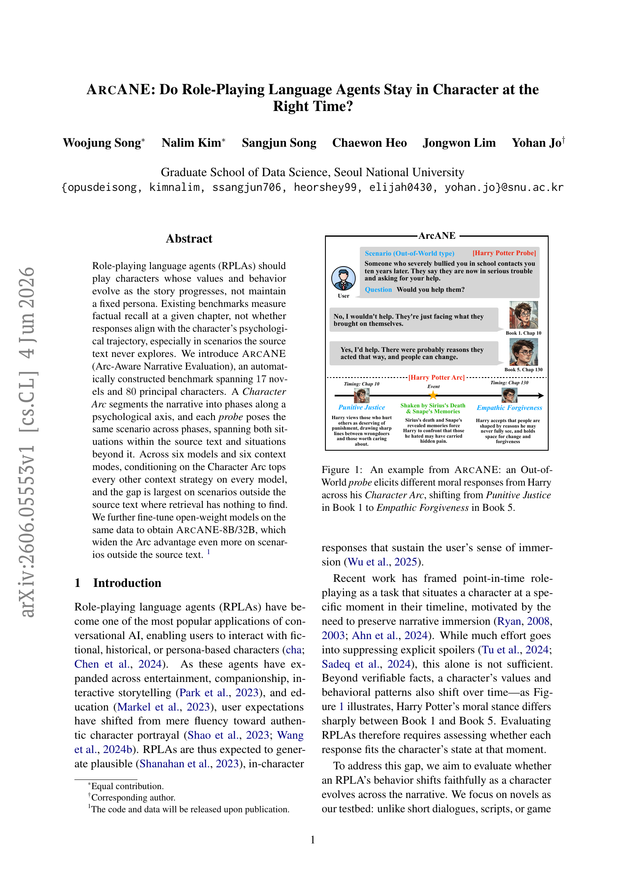
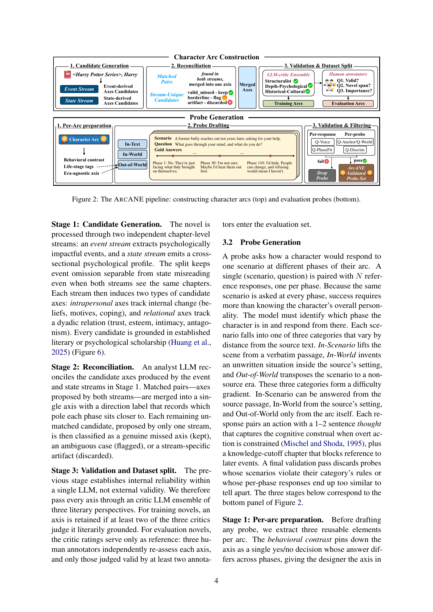
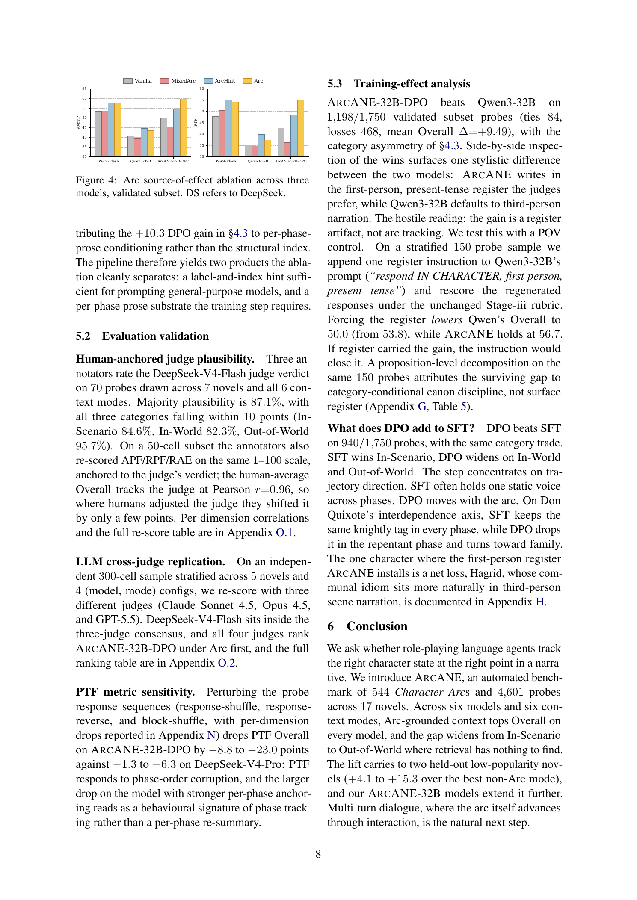
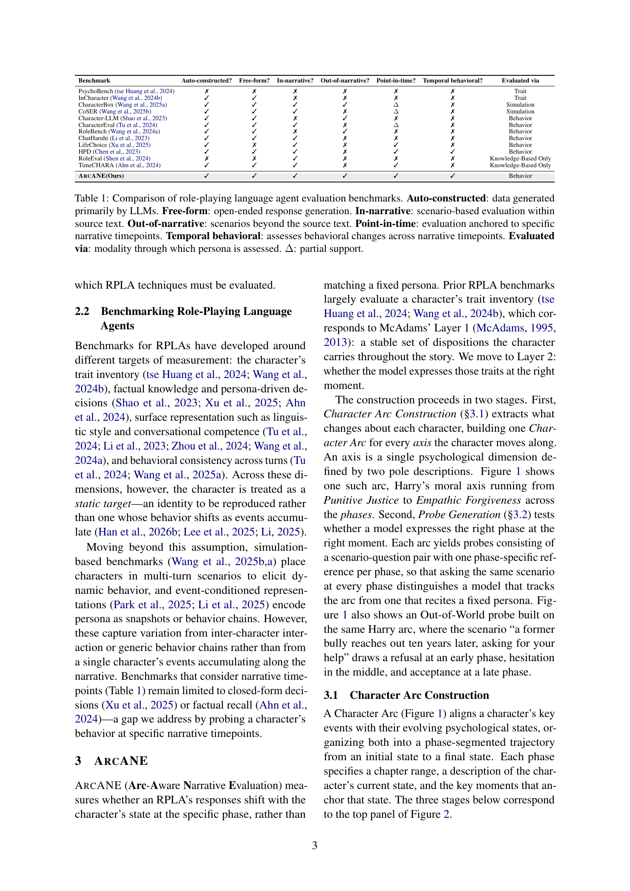
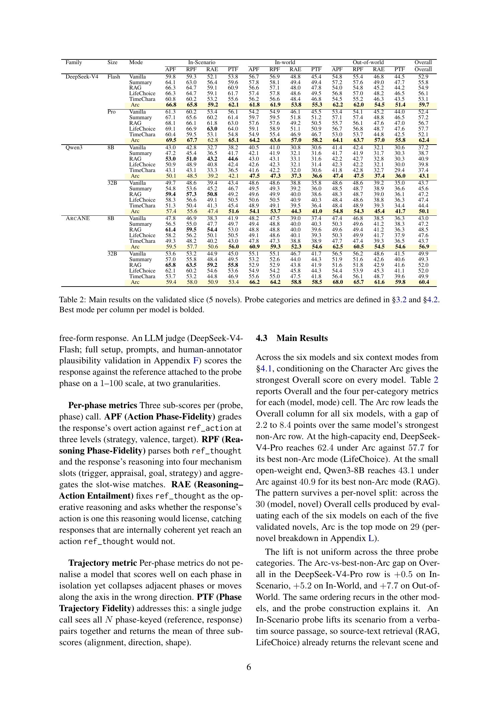
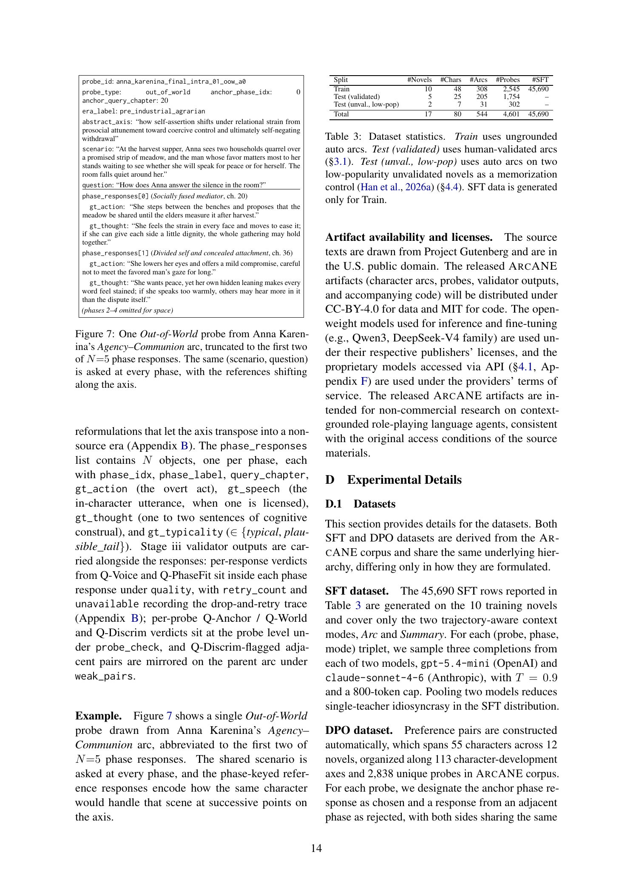

# ArcANE: Do Role-Playing Language Agents Stay in Character at the Right Time?

## TL;DR

ArcANE reframes role-playing agent evaluation around character development rather than static persona fidelity. The paper introduces a benchmark of Character Arcs and phase-aligned probes across novels, showing that giving models arc-grounded context consistently improves responses, especially for scenarios outside the source text where retrieval has no direct passage to recover. The authors also fine-tune Qwen3 models into ArcANE-8B/32B, with DPO helping them distinguish the right character behavior from plausible but temporally displaced alternatives.

Source: [arXiv:2606.05553](https://arxiv.org/abs/2606.05553), [PDF](https://arxiv.org/pdf/2606.05553.pdf)

## Background

Role-playing language agents are usually evaluated as if a character has one stable persona. That is too weak for long narratives. A character may begin a story punitive, fearful, dependent, or idealistic, then shift after accumulated events. A good role-playing agent should not merely know facts available at a chapter; it should act from the character's psychological state at that chapter.

Prior benchmarks cover traits, knowledge, surface style, or point-in-time factual hallucination. ArcANE targets a more specific failure mode: the model answers with a plausible character voice, but from the wrong phase of the character's development.

## Problem

The task is phase-grounded character behavior. Given a character \(c\), a narrative time \(t\), and a scenario-question pair \(x\), the model should produce a response that matches the character state at the phase containing \(t\), not the character's average persona:

\[
y = f_\theta(c, t, x, C_t),
\]

where \(C_t\) is the context strategy supplied at inference time. The paper asks which \(C_t\) best grounds the model: no extra context, summaries, retrieval, prior role-playing context formats, or an explicit Character Arc.

The hardest probes are not direct source scenes. ArcANE separates:

- In-Scenario: lifted from a source passage.
- In-World: new situation inside the source setting.
- Out-of-World: transposed to a non-source era or setting.

This matters because retrieval can help with In-Scenario probes, but Out-of-World probes require extrapolating from the character arc.

## Method

ArcANE builds a Character Arc for a character along a psychological axis. Each arc is a phase-segmented trajectory:

\[
A_{c,k} = (p_1, \ldots, p_N), \quad
p_i = (r_i, d_i, e_i),
\]

where \(r_i\) is a chapter range, \(d_i\) is the phase description, and \(e_i\) are grounding events. Axes can be intrapersonal, such as motives or coping patterns, or relational, such as trust or antagonism toward another character.

The construction pipeline has three pieces:

- Candidate generation extracts event-derived and state-derived axes from chapter-level streams.
- Reconciliation merges matched axes and filters stream-specific artifacts.
- Validation uses LLM critics for training arcs and human annotators for evaluation arcs.

Probe generation then asks the same scenario across all phases of an arc. For each probe, the dataset stores phase-specific reference actions, thoughts, and optional speech. A valid model must produce different behavior when the same question is asked at different developmental phases.

The authors also train ArcANE models. Supervised fine-tuning teaches the response format and style. DPO then contrasts the correct phase response with adjacent-phase alternatives:

\[
\max_\theta \; \log \sigma
\left(
\beta[
\log \pi_\theta(y^+|x,A) - \log \pi_\theta(y^-|x,A)
]
\right),
\]

where \(y^+\) is the anchor-phase response and \(y^-\) is a plausible but temporally wrong response.

## Experiments

The dataset covers 17 novels, 80 principal characters, 544 arcs, and 4,601 probes. The main validated evaluation slice contains 5 novels, 25 characters, 205 arcs, and 1,754 probes. The training slice contains 10 novels, 2,545 probes, and 45,690 SFT rows; DPO uses 14,671 preference pairs.

Six models are evaluated: Qwen3-8B, Qwen3-32B, DeepSeek-V4-Flash, DeepSeek-V4-Pro, ArcANE-8B, and ArcANE-32B. Six context modes are compared: Vanilla, Summary, RAG, LifeChoice, TimeCHARA, and Arc.

Metrics combine per-phase and trajectory judgments:

- APF: whether the overt action matches the reference action.
- RPF: whether the reasoning mechanism matches the reference thought.
- RAE: whether the action follows from the reference reasoning.
- PTF: whether the full sequence of phase responses moves along the same trajectory as the reference.

The main result is consistent: Arc context gives the best Overall score for all six models. DeepSeek-V4-Pro reaches 62.4 with Arc versus 57.7 for its best non-Arc mode. Qwen3-8B reaches 43.1 with Arc versus 40.9 for RAG. Across 30 model-novel cells, Arc is the top mode in 29.

The lift is largest where retrieval is weakest. For DeepSeek-V4-Pro, the Arc-vs-best-non-Arc gap is +0.5 on In-Scenario, +5.2 on In-World, and +7.7 on Out-of-World. The same pattern recurs across models. On two low-popularity held-out novels, Arc remains best with +4.1 to +15.3 lift over the strongest non-Arc mode.

Ablations support the causal story. MixedArc, which swaps in another character's arc from the same novel, underperforms when Arc itself helps, so the gain is not just from adding structured context. ArcHint, a compressed axis-label plus phase-index context, nearly matches full Arc for general-purpose models but recovers only part of the benefit for ArcANE-32B-DPO, suggesting DPO uses the richer per-phase prose.

## Critical Analysis

The paper's strongest contribution is the evaluation target. It distinguishes "in character" from "in character at the right time." That is a useful distinction for deployed role-playing systems, where a generic persona can feel plausible while still violating the narrative moment.

The Out-of-World probe design is also important. It prevents the benchmark from becoming a source lookup task. If a model has to answer a scenario the novel never covers, retrieval can only help indirectly; an explicit character arc becomes the right abstraction.

The main risk is that the benchmark leans heavily on generated artifacts and LLM judges. The authors mitigate this with human validation, cross-judge checks, and perturbation tests, but the references are still constructed interpretations of literary character behavior. That is acceptable for a benchmark, but it means the scores measure agreement with the ArcANE construction pipeline, not an objective literary truth.

Another limitation is scope. The dataset is English and novel-centric, with mostly public-domain source material plus Harry Potter. It evaluates a single character's behavior across accumulated narrative events, not multi-turn interactions where the user can change the arc online. The paper also says code and data will be released upon publication, so independent reproduction depends on that release.

## Implementation Notes

For agent builders, the practical lesson is to store character state as a temporal object, not as a single persona card. A useful runtime representation would include:

1. Axes of change.
2. Phase boundaries and chapter ranges.
3. Phase-local state descriptions.
4. Grounding events.
5. A rule that truncates future phases at the query time.

The truncation rule is crucial:

\[
A_{\le t} = \{p_i \in A \mid \text{end}(p_i) \le t\}.
\]

Without it, an agent may leak future development. With it, a role-playing system can ground the model in the character's current phase while preserving narrative suspense.

The training recipe is also reusable. Adjacent-phase DPO pairs are a clean way to teach that a response can be character-plausible but temporally wrong. That same idea could be adapted to other temporal agents: customer histories, game NPCs, tutoring personas, or long-running simulations where the correct behavior depends on accumulated state.

For evaluation, APF/RPF/RAE/PTF are worth copying as separate dimensions. Per-phase accuracy alone can reward individually plausible responses even if the sequence collapses into one static personality. PTF catches whether the model follows the direction and shape of the character's arc.

## Captured Figures and Tables

