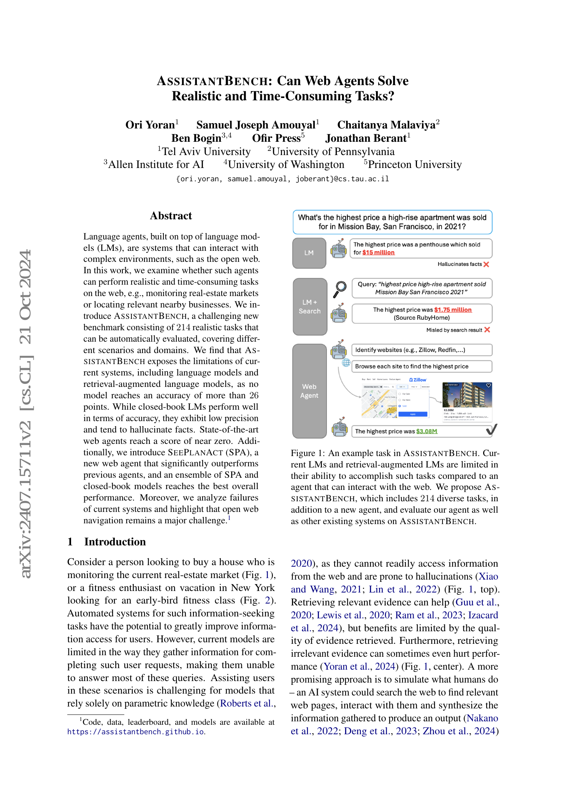
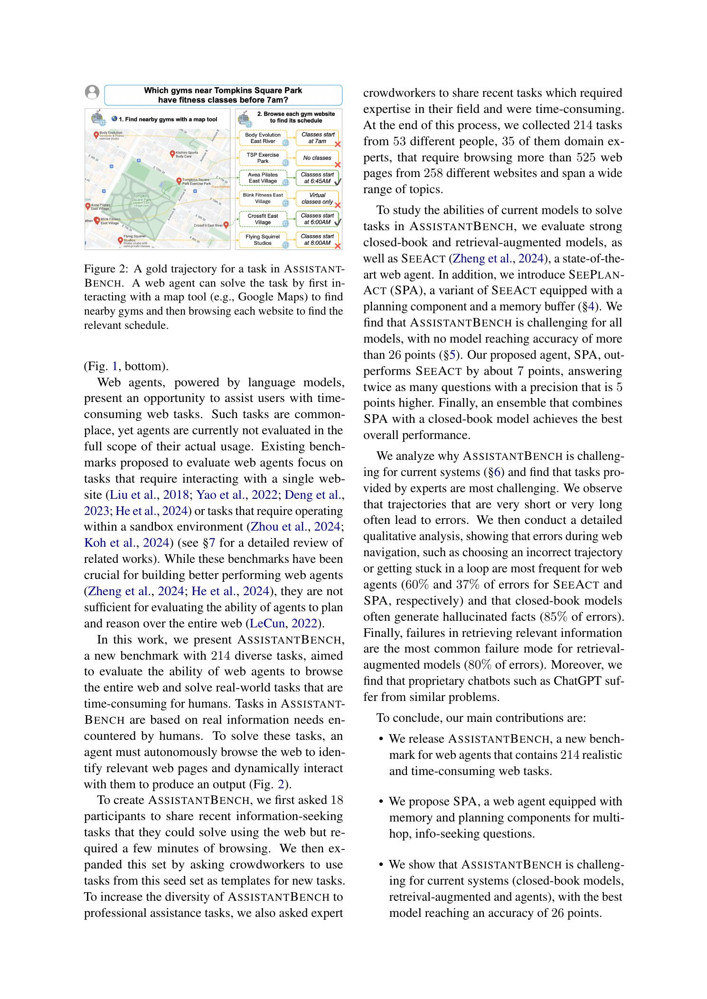
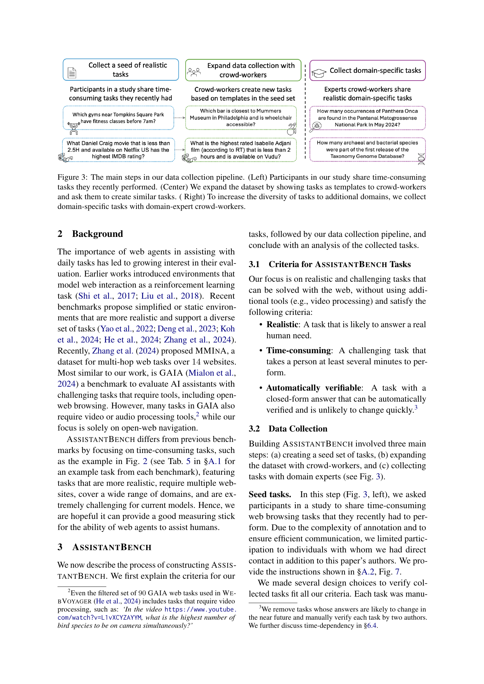
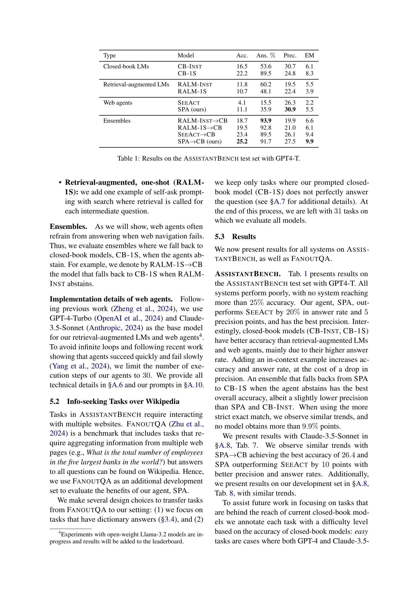
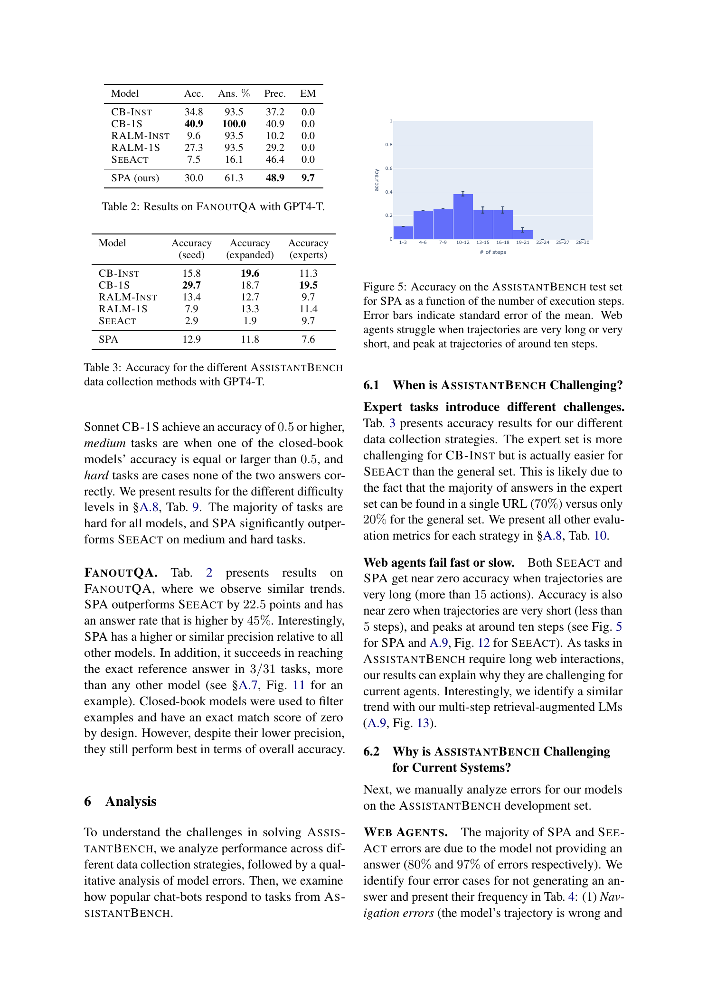
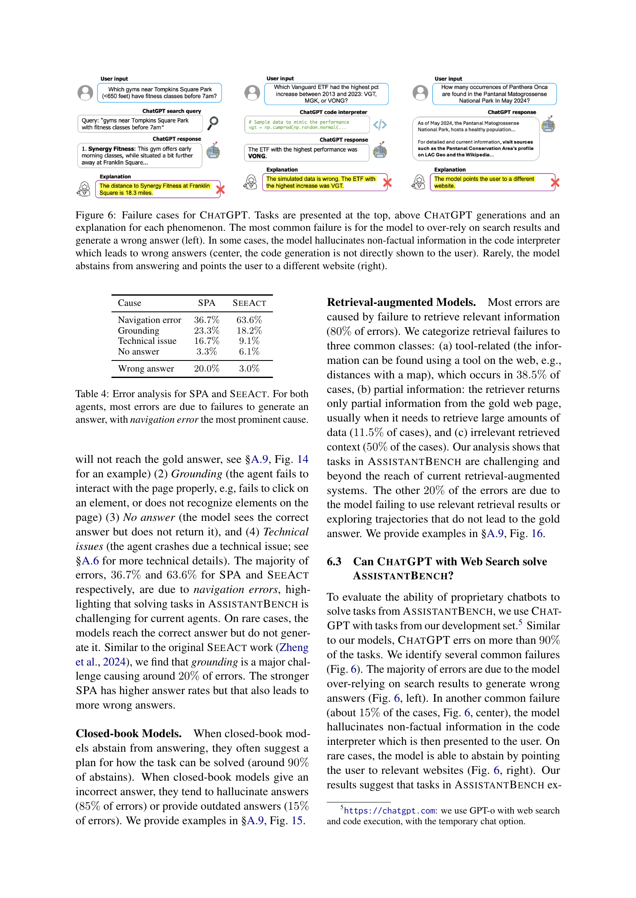

# AssistantBench: Can Web Agents Solve Realistic and Time-Consuming Tasks?

## TL;DR

AssistantBench evaluates whether web agents can solve realistic, time-consuming open-web information tasks. The benchmark contains 214 tasks drawn from real user needs, crowdworker expansions, and domain-expert requests; answers span more than 525 webpages and 258 websites. The core result is that current systems are far from reliable: no evaluated system exceeds roughly 26 accuracy points. SeePlanAct (SPA), the paper's SeeAct-based agent with planning and memory, substantially improves over SeeAct, but closed-book models and fallback ensembles still achieve higher overall accuracy because agents often fail to finish navigation or return an answer.

Source: [arXiv:2407.15711](https://arxiv.org/abs/2407.15711), [PDF](https://arxiv.org/pdf/2407.15711.pdf). The reviewed manuscript is arXiv v2, revised on 2024-10-21.

## Background

Many web-agent benchmarks test controlled websites, sandbox environments, or short single-site tasks. Those settings are valuable, but they miss a common real-world pattern: a user asks for a useful answer that requires browsing the open web, comparing information across pages, and synthesizing a result.

AssistantBench targets that harder setting. Example tasks include monitoring real-estate markets, locating nearby businesses with schedule constraints, or finding domain-specific information across professional websites. These tasks often require several minutes of human browsing and cannot be solved by a single search result.

The paper asks a direct question: can current language models, retrieval-augmented systems, and browser agents solve this kind of realistic open-web task?

## Problem

Each benchmark task has a user request, a gold answer, verification URLs, and an explanation of how the task can be solved. Systems may either answer or abstain. The paper reports:

\[
\mathrm{accuracy} = \text{average score across all tasks},
\]

plus answer rate, precision over answered tasks, and exact match. This matters because a model can raise accuracy by answering more often, but precision reveals whether those answers are trustworthy.

The challenge is that open-web task solving combines several hard subproblems:

1. Identify relevant websites.
2. Navigate dynamic pages.
3. Use tools such as maps, search engines, filters, and schedules.
4. Extract the right answer format.
5. Avoid hallucinating when navigation or retrieval fails.

## Method

AssistantBench is built from three data sources.

First, the authors ask 18 participants for recent time-consuming web tasks they had actually performed. This yields 72 seed tasks after manual validation.

Second, crowdworkers expand the seed set by creating similar tasks from templates, adding 102 more tasks.

Third, domain experts recruited through Prolific contribute professional web tasks across fields such as biology, law, medicine, geography, and visual arts. This adds 42 expert tasks.

The final dataset has 214 tasks. Most tasks are in the test set, with 33 development tasks reserved for experimentation. Tasks are designed to be realistic, time-consuming, and automatically verifiable. The evaluation supports string, numeric, list, and dictionary outputs.

The paper also introduces SeePlanAct (SPA), a web agent built on SeeAct. SeeAct observes screenshots and grounds natural-language action descriptions into HTML elements. SPA adds:

- a planning component that can update the task plan during execution,
- a memory buffer for information gathered across pages,
- open-web actions such as search, URL navigation, going back, and scrolling.

## Experiments

The evaluated systems include closed-book language models, retrieval-augmented models, SeeAct, SPA, and fallback ensembles that use a closed-book model when an agent abstains.

On the AssistantBench test set with GPT-4-Turbo, closed-book one-shot prompting reaches 22.2 accuracy with 89.5% answer rate and 24.8 precision. Retrieval-augmented baselines are worse, around 10-12 accuracy. SeeAct reaches only 4.1 accuracy with 15.5% answer rate. SPA improves to 11.1 accuracy, 35.9% answer rate, and 30.9 precision. The best overall GPT-4-Turbo setup is SPA followed by closed-book fallback, reaching 25.2 accuracy.

With Claude-3.5-Sonnet, the same pattern holds. SPA reaches 12.9 accuracy and 37.7 precision, while SPA followed by closed-book fallback reaches 26.4 accuracy. This is the paper's strongest reported AssistantBench accuracy.

On FANOUT QA, a Wikipedia-only multi-page information-seeking benchmark, SPA performs much better than SeeAct: 30.0 versus 7.5 accuracy with GPT-4-Turbo. This shows that planning and memory help when the task still lives in a more constrained web environment.

The analysis explains why AssistantBench is hard. SPA and SeeAct mostly fail by not producing an answer. Among their errors, navigation errors are the largest category: 36.7% for SPA and 63.6% for SeeAct. Grounding errors account for roughly 20%. Retrieval-augmented models mostly fail because retrieval misses the right information, either returning irrelevant context, partial context, or failing to use necessary tools.

## Critical Analysis

The benchmark's strength is realism. AssistantBench tasks come from actual user needs and professional contexts, and the benchmark preserves the messiness of open-web navigation. That makes the low scores meaningful: they are not just failures on synthetic UI puzzles, but failures on tasks users plausibly want an assistant to do.

The main methodological tension is automatic verifiability. The paper intentionally excludes many time-dependent tasks because stable reference answers are needed. This keeps evaluation practical, but it also removes a class of tasks that real assistants would need to handle, such as ticket availability or current prices.

The results are also a useful warning about agent benchmarks. SPA is clearly a stronger web agent than SeeAct, but closed-book fallback still wins on accuracy because agents abstain or fail navigation so often. A high-quality assistant may therefore need hybrid routing: use web interaction when evidence is needed, but fall back to a strong model when the agent cannot make progress.

The paper's cost note is important. Web agents are much more expensive to evaluate than closed-book or retrieval-augmented systems. AssistantBench is small partly by design, and that makes sense for a benchmark where each run can trigger many model calls and browser steps.

## Implementation Notes

For builders, AssistantBench suggests tracking answer rate and precision separately. A web agent that answers rarely may have deceptively high precision, while a closed-book model may answer often by hallucinating. The product question is not only "did it get the score?" but "did it know when to stop?"

A practical open-web agent should maintain explicit state:

\[
\text{AgentState} = \{\text{goal}, \text{plan}, \text{memory}, \text{visited URLs}, \text{evidence}, \text{next action}\}.
\]

SPA's planning and memory additions are simple but important. They give the model a place to store partial findings and revise the route rather than treating each browser step as an isolated action.

For evaluation, separate failure causes:

- navigation failure,
- grounding failure,
- technical crash,
- no answer despite evidence,
- wrong answer after answer generation.

That taxonomy is more actionable than a single success rate. It tells whether the next improvement should be better search, better DOM grounding, browser reliability, answer extraction, or abstention policy.

## Captured Figures and Tables

