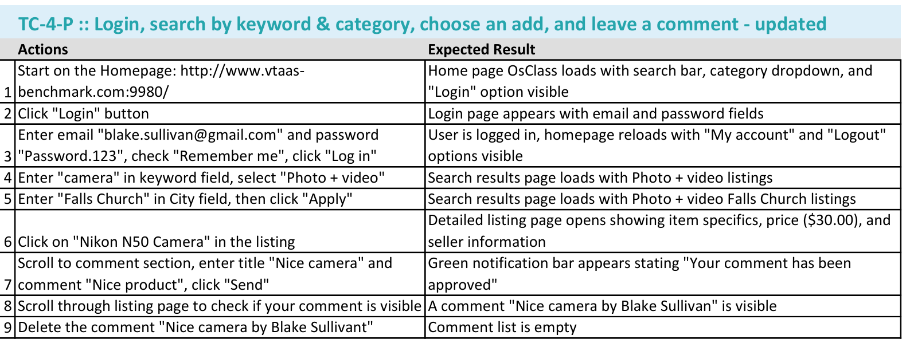
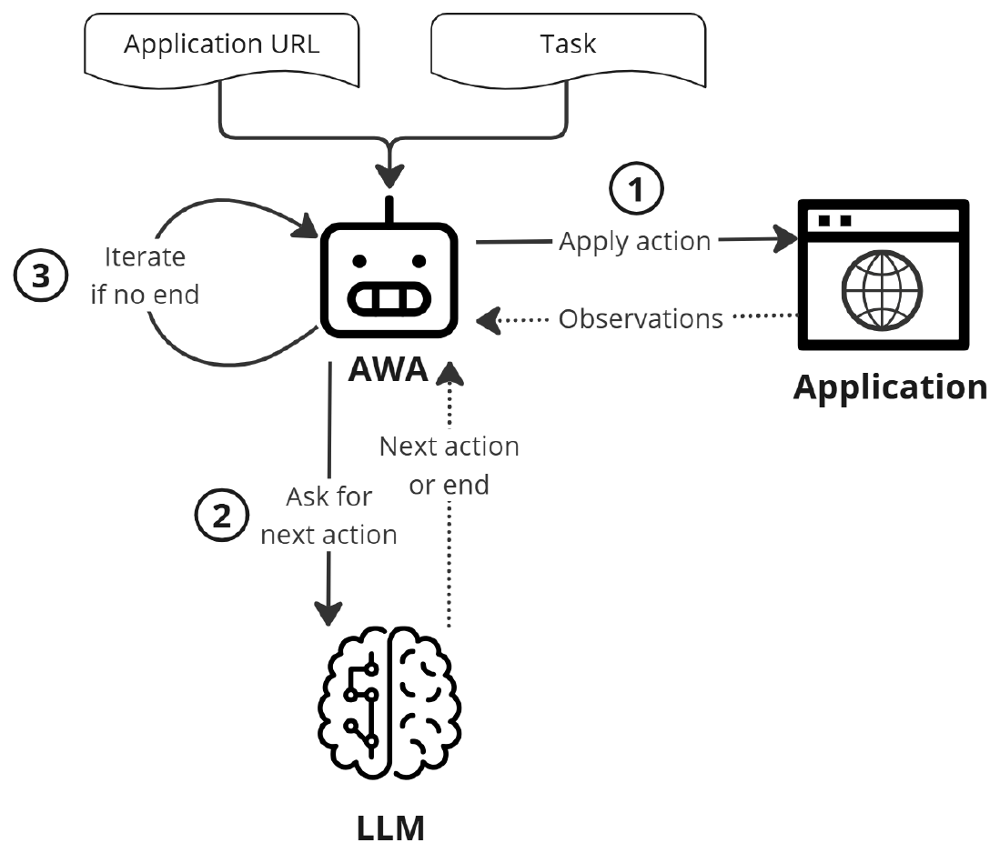
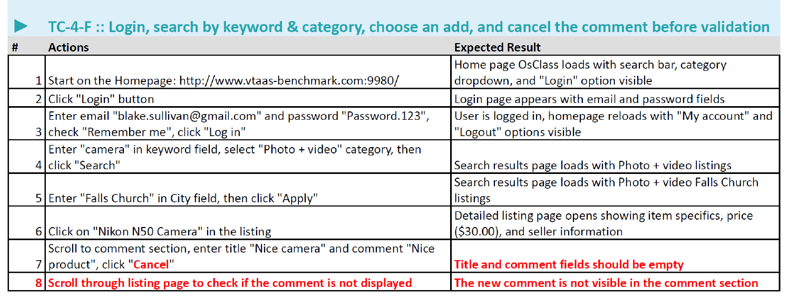
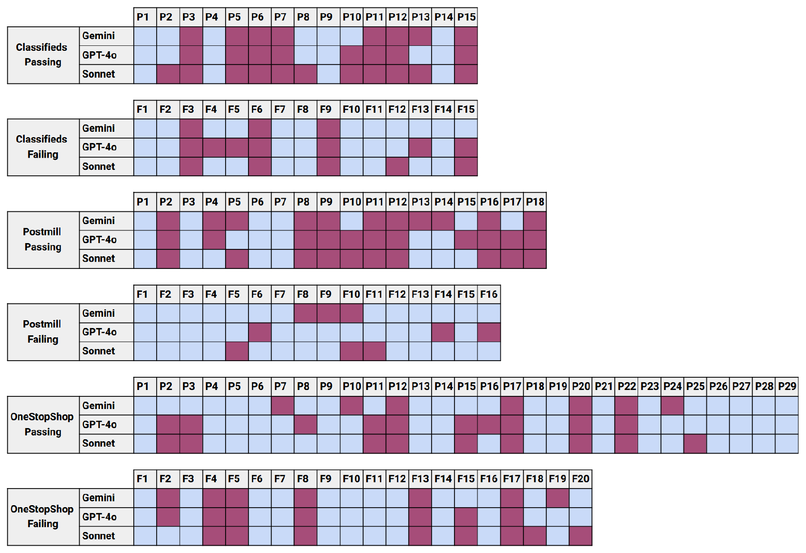
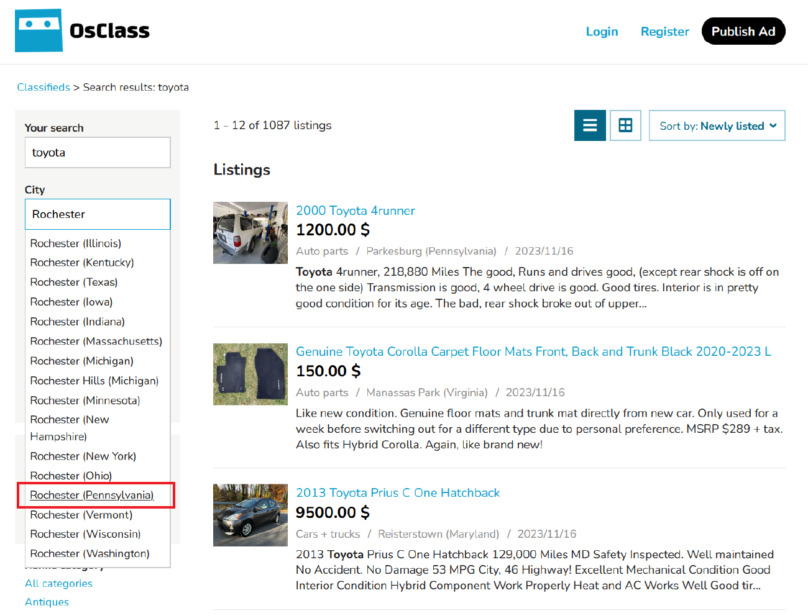
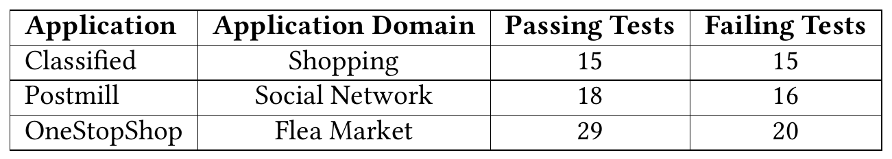
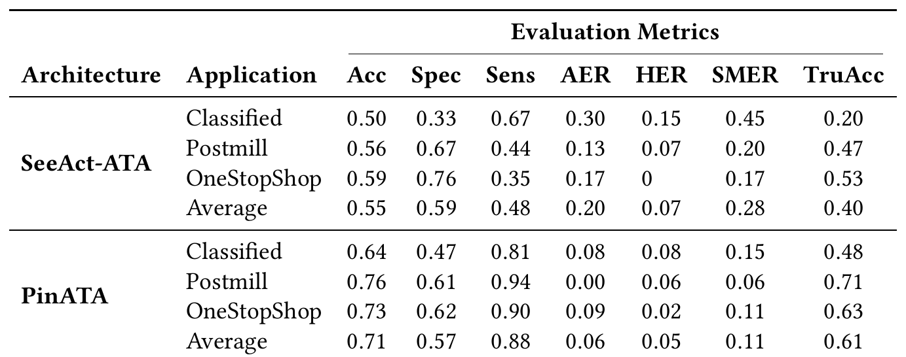
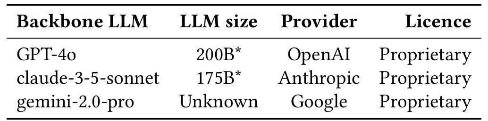
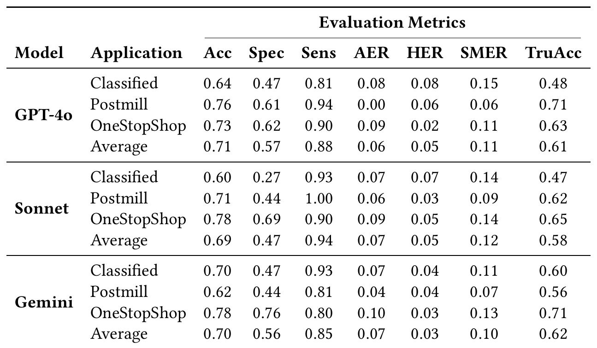

# Are Autonomous Web Agents Good Testers?

## TL;DR

Two open-source Autonomous Test Agents (ATAs) built by adapting web agents to execute natural-language E2E test cases, plus the benchmark needed to score them: three frozen WebArena/VisualWebArena applications, 62 passing test cases written by four ISTQB-certified professional testers, and 51 failing variants derived from them with the expected failure step annotated. The advanced agent, PinATA (orchestrator + actor + assertor), reaches 0.71 accuracy, 0.88 sensitivity, 0.57 specificity and 0.61 "true accuracy" with GPT-4o — roughly 50% better true accuracy than the single-prompt SeeAct-ATA baseline. Backbone choice barely matters (TruAcc 0.61 / 0.58 / 0.62 for GPT-4o / Sonnet / Gemini). The specificity number is the real result: a healthy 62-test suite would draw about 27 false failure alarms per run. ISSTA 2025.

## Background

End-to-end web tests are still executed by hand at scale because automated ones are fragile. A Playwright or Selenium script encodes assumptions about the DOM — `input[name="sPattern"]` is the search bar, `a:has-text("Login")` is the login link — and those assumptions are invalidated by ordinary redesigns. The repair literature is large: fixing broken selectors from DOM structure, from visual features, synthesising robust selectors, improving record/replay. LLMs have been applied to *generating* test code and CSS selectors, which speeds up authoring but leaves the generated code tied to one version of the application, so fragility survives.

Autonomous Web Agents take a different shape: natural-language task plus base URL, then a loop of act → observe (screenshot and/or DOM) → ask the LLM for the next action → repeat or terminate. Manual test instructions look very much like AWA task descriptions, and commercial products (Flowtest.ai, Octomind.dev) already sell the combination without disclosing architecture or effectiveness.

## Problem

Can an AWA be converted into an agent that executes a manual test case and returns a verdict? Two properties separate a test case from a task:

1. **Strict sequence.** An AWA is judged on reaching the goal by any route. An ATA must follow the scenario's steps in the specified order.
2. **Intermediate assertions.** A test case carries per-step expected results; any one failing fails the whole test. AWAs perform no intermediate validation.

The secondary problem is measurement. Mind2Web, WebArena, TheAgentCompany and AgentQuest all score task completion, which does not translate to test execution, so the paper has to build a benchmark before it can answer the first question.

## Method

Following Wang et al.'s four-module decomposition of an AWA — profile, memory, planning, action — the paper states what each module needs for testing: the profile becomes a tester rather than a user; memory must retain executed steps because later steps may reference values obtained earlier; planning must enforce scenario order rather than optimise for the goal; the action module must support assertions, not just interactions.

### SeeAct-ATA (baseline)

SeeAct encodes all four modules in a single prompt, which makes it the cheapest thing to adapt. Two instruction blocks are added:

- `[TEST CASE PROGRESS]` — walk the steps and label each DONE / CURRENT / TODO, then confirm the current step.
- `[TEST STEP ASSERTION CONTROL]` — decompose the current step's expected result into atomic assertions and mark each VERIFIED / NOT VERIFIED.

The profile is rewritten from "imitating humans doing web navigation" to "imitating a manual tester performing a test case," and the task slot takes the test case. Everything else — chain-of-thought instructions, the multiple-choice question that grounds the proposed action to a DOM element, the `ELEMENT / ACTION / VALUE` output format — is stock SeeAct, with Playwright executing the chosen action.

### PinATA (Planned INcentive ATA)

Three specialised components over a shared memory:

- **Orchestrator** — the planning module, running Planning-with-Feedback. It holds a model of the scenario, dispatches the current action to the actor, and reads back whether it succeeded. On failure it requests a retry; if the action is judged infeasible the test is marked failed. It then dispatches the step's assertion to the assertor, retries if needed, and either advances or fails the test.
- **Actor** — grounding and execution. Set-of-Marks annotation plus the LLM's ability to read X/Y coordinates off a screenshot; Playwright drives the browser.
- **Assertor** — Agent-as-a-Judge. It is given the screenshot and asked to evaluate the expected result. It has no action module of its own and no DOM access; verification is passive visual analysis only.

Memory is long-term and shared across all three, holding everything observed; nothing is retrieved from outside the application under test. All three present themselves in their profile as members of a multi-agent system with distinct roles.

## Experiments

### Benchmark

Three applications, shipped as Docker images so the environment is frozen: **Classifieds** (a Craigslist-style marketplace, 65,955 listings), **Postmill** (a Reddit-style social site), **OneStopShop** (e-commerce with search filters, cart, and checkout).

Four professional testers — five-plus years each, ISTQB Foundation Level certified — spent three weeks writing 62 passing test cases in the two-column action/expected-result format, one tester per application except Classifieds which got two. Post-processing made every case self-contained (credentials included), assumed a freshly deployed application, translated everything to English, and had an author manually re-execute each case to validate it. Counting design, translation and manual execution, each passing test represents about an hour of work.

The 51 failing cases were derived by two authors (one a professional tester) from the passing ones, by editing a step to reference a feature the application does not implement — e.g. clicking a Cancel button that is absent, at which point a correct ATA should halt. Each failing case carries an explicitly annotated expected failure step. There are 51 rather than 62 because near-duplicate passing tests (P19/P20/P21 in OneStopShop) share one representative failing variant.

### Metrics

Verdict alignment is treated as binary classification with *failing* as the positive class, giving accuracy, specificity (correctly identifying passing tests, i.e. not raising false alarms) and sensitivity (correctly identifying failing tests).

Because an agent can return the right verdict for the wrong reason — a type III error — true positives are split by where the agent stopped relative to the human: **AFB** (agent fails before), **AFA** (agent fails after), **AFC** (agent fails at the same step). From those:

$$\text{AER} = \frac{\text{AFB}}{\text{TP}} \qquad \text{HER} = \frac{\text{AFA}}{\text{TP}} \qquad \text{SMER} = \text{AER} + \text{HER} \qquad \text{TruAcc} = \frac{\text{AFC} + \text{TN}}{\text{TP} + \text{TN} + \text{FP} + \text{FN}}$$

AER counts agent limitations masquerading as bug detection; HER counts hallucinated assertion validations that let the agent sail past the planted defect. The authors state a preference for sensitivity over specificity — a missed failure is worse than a false alarm that a human can dismiss — with SMER as a failsafe against high accuracy that is unearned.

### SeeAct-ATA vs PinATA, GPT-4o, temperature 0

Each system under test is reset before every execution. One run per test case.

| Architecture | Application | Acc | Spec | Sens | AER | HER | SMER | TruAcc |
|---|---|---|---|---|---|---|---|---|
| SeeAct-ATA | Classified | 0.50 | 0.33 | 0.67 | 0.30 | 0.15 | 0.45 | 0.20 |
| SeeAct-ATA | Postmill | 0.56 | 0.67 | 0.44 | 0.13 | 0.07 | 0.20 | 0.47 |
| SeeAct-ATA | OneStopShop | 0.59 | 0.76 | 0.35 | 0.17 | 0 | 0.17 | 0.53 |
| SeeAct-ATA | **Average** | 0.55 | 0.59 | 0.48 | 0.20 | 0.07 | 0.28 | 0.40 |
| PinATA | Classified | 0.64 | 0.47 | 0.81 | 0.08 | 0.08 | 0.15 | 0.48 |
| PinATA | Postmill | 0.76 | 0.61 | 0.94 | 0.00 | 0.06 | 0.06 | 0.71 |
| PinATA | OneStopShop | 0.73 | 0.62 | 0.90 | 0.09 | 0.02 | 0.11 | 0.63 |
| PinATA | **Average** | 0.71 | 0.57 | 0.88 | 0.06 | 0.05 | 0.11 | **0.61** |

TruAcc improves 52% (0.40 → 0.61), SMER drops 61% (0.28 → 0.11), sensitivity rises 83% (0.48 → 0.88). Specificity is the exception: it does not improve, and is in fact marginally worse than the baseline (0.59 → 0.57).

### Backbone comparison

GPT-4o, claude-3-5-sonnet and gemini-2.0-pro under PinATA produce TruAcc 0.61 / 0.58 / 0.62 and SMER 0.11 / 0.12 / 0.10. The one real difference is a sensitivity/specificity trade: Sonnet detects nearly every planted failure (0.94, and 1.00 on Postmill) but raises the most false alarms (specificity 0.47 against 0.57 and 0.56).

Figure 4 lays out all 339 executions cell by cell. 26 test cases are misaligned with the human verdict under *every* backbone, and those form the qualitative study.

### Limitation taxonomy (26 persistent failures, open card sorting)

| Category | Count | Nature |
|---|---|---|
| Action Capacity | 6 | Framework cannot do it at all — second browser tab (Classified P11/P12), print options (P20), browser settings (P7) |
| Action Versatility | 6 | Interaction too complex for the available primitives — autocomplete needing letter-by-letter typing (P3), dropdown sub-category navigation (OneStopShop F5) |
| User-Interface Observability | 5 | Agent cannot see it — popups are not standard HTML so they never reach the HTML-derived screenshot (Postmill P8/P9); Set-of-Marks imprecision on small elements (Classified P6) |
| Assertion Verifiability | 4 | Verification is wrong — grid layout wrongly validated (Classified F9); cannot scroll far enough to check (Postmill P11) |
| Test Case Conformity | 5 | Agent deviates from the scenario — unnecessary navigation breaking the workflow (OneStopShop F4); anticipating a later step's popup validation and confusing the orchestrator (P17) |

The first three are inherited AWA problems; the last two are specific to testing.

## Critical Analysis

**Strengths:**

- The benchmark fills a genuine gap and is built the expensive way. Tests written by four certified professionals over three weeks rather than by the authors, ~1 hour of human effort per passing case, manual re-execution to validate each one, and frozen Docker applications so the whole thing replays. The failing variants carry an annotated expected failure step, and that single design decision is what makes step-level scoring possible at all.
- SMER and the AFB/AFA/AFC decomposition are the paper's best contribution. Most agent papers would have reported accuracy and stopped; refusing to count a matching verdict as success when the agent halted at the wrong step is exactly the right instinct, and the SeeAct-ATA numbers show why it matters — 45% of its Classified true positives are step-mismatched.
- Separating the failure taxonomy into AWA-inherited and ATA-specific categories is the useful cut. It tells the reader which nine of the 26 failures will not be fixed by better web agents.
- Specificity is reported prominently even though it is the number that damages the pitch, and the conclusion states it plainly ("specificity not exceeding 57%").

**Weaknesses:**

- **The abstract mislabels the headline number.** It advertises "up to a promising 94% specificity." 0.94 is Sonnet's *sensitivity* in Table 4; Sonnet's specificity is 0.47, and no configuration anywhere in the paper exceeds 0.57. The conclusion gets it right. The abstract swaps the paper's weakest metric for its strongest.
- **The TruAcc column cannot be reconstructed from the paper's own definitions.** Since TP = AFB + AFA + AFC and SMER = (AFB + AFA)/TP, it follows that AFC = TP(1 − SMER) and therefore TruAcc = Acc − TP·SMER/N. Every one of the 12 rows in Tables 2 and 4 reports a TruAcc *below* what that identity yields, by 0.02 to 0.15. SeeAct-ATA on Classified: specificity 0.33 × 15 passing → TN = 5, sensitivity 0.67 × 15 failing → TP = 10, which reproduces the reported accuracy of 15/30 = 0.50 exactly; SMER 0.45 then gives AFC = 5.5 and TruAcc = 10.5/30 = 0.35, against 0.20 reported. PinATA/GPT-4o on OneStopShop: TN = 18, TP = 18, accuracy 36/49 = 0.73 ✓, SMER 0.11 → AFC = 16 → TruAcc = 34/49 = 0.69, against 0.63 reported. The bias is one-directional across all 12 rows, so this is a systematic discrepancy between the stated formula and the computed column, not rounding — and TruAcc is the column both headline claims are drawn from.
- **One row is arithmetically unattainable.** PinATA/GPT-4o on Classified reports Acc 0.64 and Sens 0.81 over 15 passing and 15 failing tests. Sensitivity on 15 failing tests can only be 11/15 = 0.73, 12/15 = 0.80 or 13/15 = 0.87; accuracy on 30 tests can only be 19/30 = 0.63 or 20/30 = 0.67. Neither reported value is representable. Every other row in both tables reconstructs to the exact integer counts, including the Sonnet and Gemini rows for the same application, so the split is not in doubt. The row appears identically in Table 2 and Table 4 and feeds both headline averages.
- **The motivating claim is never tested.** The entire argument for ATAs is resilience to application change — scripts break when the DOM moves. The benchmark is three Docker images pinned to one version, and not a single test is run against a modified build. Fragility is never measured, maintenance cost is never measured, and there is no Playwright baseline to compare against on either axis. The paper demonstrates that an ATA can execute tests; it does not touch the reason one would want it to.
- **The bug distribution is a single narrow kind.** All 51 failing cases were made by pointing a passing test at a feature that does not exist — an absent Cancel button, a missing element. That is the most visually obvious defect class there is. Wrong computed values, wrong sort order, stale state, incorrect totals, broken calculations — the regressions that actually escape to production — are unrepresented. 0.94 sensitivity is 0.94 sensitivity on missing-element bugs, and the paper's own Assertion Verifiability category (the grid-layout case) hints that subtler assertions are where the assertor breaks down.
- **A 43% false-alarm rate is the real finding and the paper does not sit with it.** Specificity 0.57 means that across 62 healthy tests PinATA raises roughly 27 spurious failures per run. The stated defence — sensitivity is prioritised because "false positives can still be manually reviewed" — reinstates precisely the manual labour the ATA was meant to eliminate. Triaging 27 alerts every run is more expensive than repairing a handful of broken selectors, which inverts the paper's own motivation. The sensitivity-over-specificity preference is defensible for exploratory bug hunting; it is not defensible for a regression suite on every commit, which is the use case being pitched.
- **Those false alarms are mostly the harness failing, not the application.** By the paper's own taxonomy, 17 of the 26 persistent disagreements are Action Capacity, Action Versatility and UI Observability — the agent cannot open a tab, cannot type into an autocomplete incrementally, cannot see a popup. Each becomes a "test failed" verdict about an application that is working correctly. Specificity is therefore largely a measurement of the tooling, and the obvious experiment — close the tooling gaps and re-run — is left undone, so we never learn how much of the 43% is intrinsic.
- **The 50% improvement is unattributable.** SeeAct-ATA and PinATA differ along at least four axes simultaneously: one prompt vs. three agents, textual-choice grounding vs. Set-of-Marks plus coordinates, no retry vs. an orchestrator retry loop, and a dedicated assertor vs. inline assertion checking. With no ablation, the result is "the elaborate design beats the minimal one" and nothing more. Which change bought the 0.21 TruAcc is unknown, and that is the question a practitioner building an ATA actually needs answered.
- **PinATA's grounding choice contradicts the evidence the paper itself cites.** Section 6.2.1 reports SeeAct's finding that textual choices are the most efficient grounding method, yet PinATA switches to Set-of-Marks plus coordinate reading — and SoM imprecision on small elements then shows up as a named cause in the error taxonomy. The switch is asserted, never justified or measured.
- **Single run per test case, no variance, and 0.03 differences are discussed as if meaningful.** The paper acknowledges that temperature 0 does not guarantee determinism, then reports a "6% performance variation between the best and worst-performing models" over one pass of 113 tests. With Classified contributing only 30 cases, a single flipped verdict moves that application's accuracy by 0.033 — larger than most of the inter-model gaps being interpreted.
- **The Average rows are unweighted across applications.** OneStopShop is 43% of the suite and Classified 27%, but each contributes a third of every average. The effect on accuracy is small (0.71 unweighted vs. 0.715 weighted for PinATA/GPT-4o) and on specificity slightly larger (0.57 vs. 0.58), but the row reads as the benchmark-level result and is not one.
- **No cost, latency or token accounting at all.** For a system proposed as a replacement for CI test suites, there is no wall-clock per test, no token count, no dollar figure. A three-agent design taking a screenshot and one or more LLM calls per step, with retries, is most vulnerable exactly here — against a Playwright script that runs the same nine steps in seconds for free.
- Smaller inconsistencies: Table 1's domain labels are swapped relative to Section 4.2 — Classifieds, described there as a Craigslist/Facebook-Marketplace clone, is labelled "Shopping," while OneStopShop, described as a shopping site, is labelled "Flea Market." Section 4.1 credits the three applications to WebArena and Section 4.2 to Visual Web Arena. Section 5.3 calls its 26 misaligned test cases "26 executions out of 113" when they are 26 test cases across 3 backbones. The fifth taxonomy category is "Scenario Conformity" in the introducing paragraph and "Test Case Conformity" in its own heading. Footnote 5 still reads "Non-Disclosed for double blind review" while Section 8 supplies the Zenodo package.

## Implementation Notes

- Both agents drive the browser through Playwright; SeeAct-ATA grounds actions via SeeAct's multiple-choice-over-DOM-elements prompt, PinATA via Set-of-Marks annotation plus LLM-read X/Y coordinates.
- PinATA's assertor sees only a screenshot — no DOM, no ability to act. The paper's own remedy is to give it an action module and DOM access; as shipped, any assertion requiring a scroll or a hover cannot be checked.
- Screenshots are generated from the HTML structure rather than captured from the live browser, which is why non-HTML popups vanish from the agent's view entirely (Postmill P8/P9). This is an implementation detail with outsized consequences.
- The orchestrator's retry-until-infeasible loop is the mechanism that converts agent incapacity into a failure verdict; there is no separate "could not execute" outcome distinct from "test failed," which is the structural cause of the specificity ceiling.
- Memory is long-term and shared across orchestrator/actor/assertor, with no external retrieval — everything comes from observing the application under test.
- Applications come from the WebArena/VisualWebArena Docker images with populated databases; every execution starts from a reset instance. Backbones: GPT-4o, claude-3-5-sonnet, gemini-2.0-pro, all at temperature 0.
- Benchmark, execution results, manual verification and code are on Zenodo; application containers come from the WebArena GitHub repository.
- Venue: ISSTA 2025 (preprint). Work supported by Smartesting.

## Captured Figures and Tables

**Figures:**

*Figure 1. A passing E2E test case (TC-4-P) for the Classifieds application, in the two-column action/expected-result format the professional testers used. Nine steps: log in, search by keyword and category, filter by city, open a listing, comment, verify the comment, delete it.*

*Figure 2. The generic AWA loop the ATAs are built on. Application URL and task go in; the agent applies an action and receives observations from the application, asks the LLM for the next action, and iterates until the LLM signals the end.*

*Figure 3. The failing variant (TC-4-F) derived from Figure 1, changes in bold red. Step 7 clicks a "Cancel" button that the application does not implement; a correct ATA should halt there. All 51 failing cases were constructed this way — by pointing a step at a missing feature.*

*Figure 4. All 113 test cases × 3 backbones under PinATA, split by application and by passing/failing. Light blue = verdict aligned with the human tester at the same step; purple = diverged. The 26 columns purple across all three rows are the basis of the limitation taxonomy. Note how much denser the purple is on the passing halves — the false-alarm problem, visually.*

*Figure 5. The Classifieds autocomplete that defeats the agent in test P3. "Rochester" must be typed incrementally to surface the "Rochester (Pennsylvania)" suggestion; PinATA types the whole string at once and the test cannot proceed. Representative of the Action Versatility category.*

**Tables:**

*Table 1. Distribution of the 113 test cases across the three applications. Note that the domain labels are swapped relative to Section 4.2's descriptions — Classifieds is the marketplace and OneStopShop is the shopping site.*

*Table 2. SeeAct-ATA vs PinATA on GPT-4o. PinATA wins on true accuracy (0.61 vs 0.40), SMER (0.11 vs 0.28) and sensitivity (0.88 vs 0.48) — but not on specificity (0.57 vs 0.59). The PinATA/Classified row (Acc 0.64, Sens 0.81) is not representable with 15 passing and 15 failing tests.*

*Table 3. The three proprietary backbones evaluated. Parameter counts are the authors' guesses, flagged as such by the asterisk footnote.*

*Table 4. PinATA across GPT-4o, Sonnet and Gemini. True accuracy is flat (0.61 / 0.58 / 0.62); the only real difference is Sonnet trading specificity (0.47) for sensitivity (0.94, and 1.00 on Postmill).*
