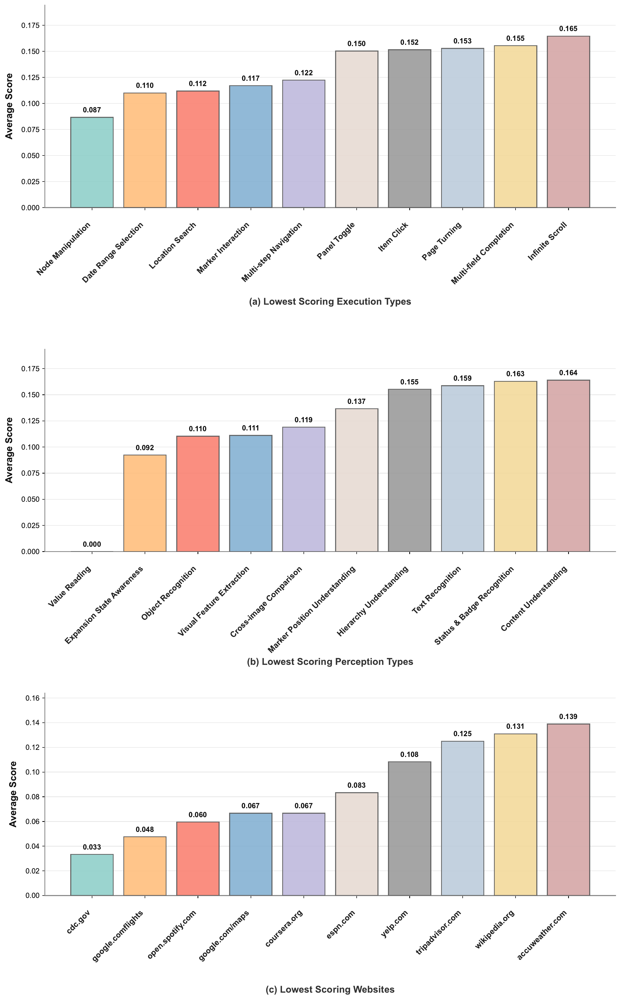
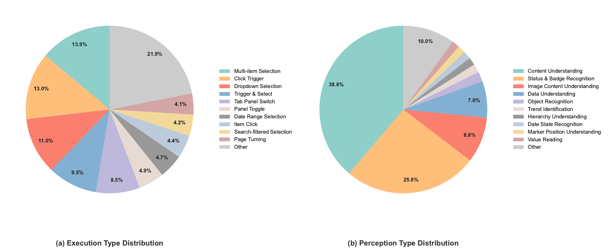
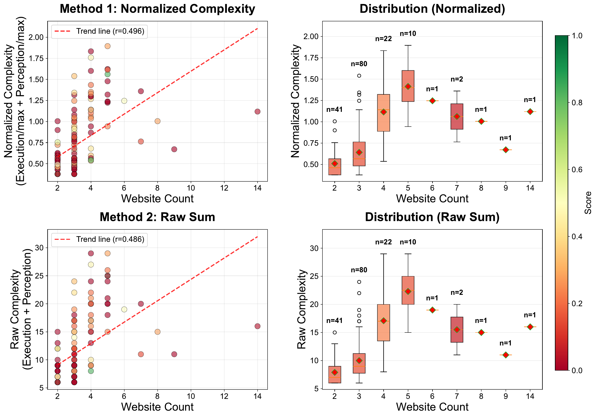

# CAP: A Scalable Benchmark for Evaluating Cross-Site Browser Agents with Complex Actions and Perception

## TL;DR

CAP argues current web-agent benchmarks miss the two things that make real browsing hard — non-trivial UI execution (sliders, map drags, nested menus) and visual perception of rendered content — compounded across multi-site workflows. It builds 420 tasks over 108 real sites and 24 domains via a decomposition-and-recomposition pipeline (site cards → affinity-guided sampling → task proposal → instantiation, ~7 complex actions and ~4 perception challenges per task) and scores agents with a verifiable agent-as-a-judge rubric tree. Even the best of eight SOTA systems reaches only 8.0% success, and perception lags execution everywhere.

Source: [arXiv:2608.08392](https://arxiv.org/abs/2608.08392), [PDF](https://arxiv.org/pdf/2608.08392.pdf). Published as a COLM 2026 conference paper.

## Background

Web-agent evaluation has been climbing a ladder: DOM sandboxes → multimodal rendered pages → live open-web environments → long-horizon multi-step tasks (WebVoyager, GAIA, AssistantBench, Mind2Web 2). But the comparison table in this paper shows a gap no prior benchmark fills jointly: cross-site workflows plus complex execution plus challenging perception, with diagnosis of where agents break rather than a single end-to-end score. Rule-based graders are precise but don't scale; LLM-as-a-judge scales but can't verify multi-step claims against live web state (false positives); agent-as-a-judge (Mind2Web 2) actively verifies yet still scores the final output holistically.

## Problem

A realistic request — "choose a laptop" spanning BestBuy filters, Amazon/Target stock comparison, review parsing, YouTube video reviews — demands cross-site information flow where each hop involves complex UI operations and visual reading. Existing benchmarks either stay single-site with click-and-type simplicity, or cover cross-site tasks while scoring only final answers. The paper asks: how do we scalably construct such tasks and evaluate agents so failures localize to specific execution or perception steps?

## Method

Construction has four phases. (1) Site-card annotation: 24 functional clusters, 139 candidate high-traffic sites narrowed to 108 (login-walled and bot-blocked excluded), each decomposed by a Browser-Use exploration agent into functions $F$, execution items $A$ (58 of 64 taxonomy action types instantiated), and perception items $P$ (50 of 56 types), grounded in an Ant-Design-derived component taxonomy. (2) Cluster sampling: an LLM affinity matrix picks coherent 3–6 cluster subsets anchored on the least-used cluster for coverage. (3) Task proposal: 600 LLM proposals over sampled clusters as intent/output/flow-DAG triples, human-filtered to 512 (Cohen's κ = 0.81) requiring real-world intent and dynamically-obtained dependencies. (4) Instantiation: abstract flows bound to concrete entities with covered points $E = E_{act} \cup E_{perc}$, goal-phrased descriptions (never UI-operation hints), and manual review for rationality, complexity, executability, evaluability, and safety — 420 final tasks (192 public, 228 held out against contamination).

Evaluation is a verifiable agent-as-a-judge framework: an LLM code generator (constrained by an API whitelist and reference template, with self-debug/self-reflection) synthesizes a per-task script that materializes a hierarchical rubric tree — action, perception, and other leaves, each critical (gating: any failure zeros the parent) or non-critical (averaged). A judge agent extracts claims and URL-verifies them against fetched pages. Four metrics: Partial Completion, Success Rate (perfect tree), Complex-A, Complex-P.

## Experiments

On 198 CAP tasks, five commercial agents plus Browser-Use with three backbones all score low: best Success Rate is Manus at 8.0%, and even the human baseline (12 CS grad students, 1-hour limit) reaches only 10.0% success / 35.0% partial — the strict conjunctive criterion makes Partial Completion the informative metric, where Comet (Gemini 3.1 Pro) leads at 48.0% with 67.0 Complex-A / 58.0 Complex-P but 104k output tokens. The consistent finding: every system drops from Complex-A to Complex-P (humans are balanced at 35/34), so visual reasoning over rendered content — value reading scores near zero, expansion-state awareness 0.092 — is the dominant failure mode, not UI manipulation. Task difficulty tracks the kind of perception step (one chart-value read derails a workflow), not step count; hardest sites are cdc.gov and google.com/flights (specialized visualizations, filter-gated content), easiest accuweather and wikipedia (near-static text).

## Critical Analysis

The design's strength is making difficulty compositional and checkable: because covered points are annotated at construction time, the rubric tree is free, and shortcut strategies (answer guessing, direct URLs) fail verification by construction. The public/private split plus evaluation-date reporting is the right response to live-web drift.

Three reservations. First, the 8.0% headline and 10.0% human ceiling both reflect the all-leaves-perfect criterion as much as agent incompetence; Partial Completion is the honest metric and the paper says so, but casual readers will misread. Second, construction leans heavily on LLM agents (site cards 92.3% accurate, task phrasing artifacts) with human auditing that the authors admit won't scale to tens of thousands of tasks — the "scalable" claim holds for adding sites, less clearly for unbounded task growth. Third, the judge inherits LLM unreliability exactly where pages shift between agent run and verification; Appendix I validates it, but live-web evaluation always carries this residual noise.

For this archive, CAP sits next to AssistantBench, GAIA, and the agent-as-a-judge line (Mind2Web 2, RuverBench, WebArbiter) — it is the first to demand execution and perception diagnosis inside cross-site workflows rather than after them.

## Implementation Notes

To reuse the pattern: define covered points at task-authoring time (typed action/perception with descriptions), generate one evaluation script per task under a strict primitive whitelist, and structure rubrics as gate-then-average trees — critical prerequisites gate, the rest averages. If you run agents against the live web, pin evaluation close to execution time, archive URLs, and always report the evaluation date alongside scores.

## Captured Figures and Tables

