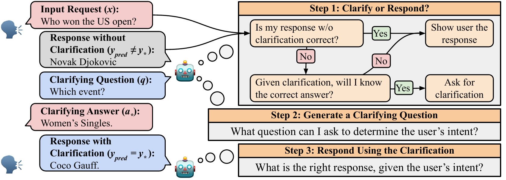
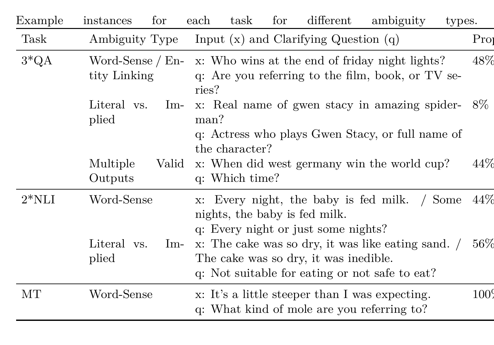
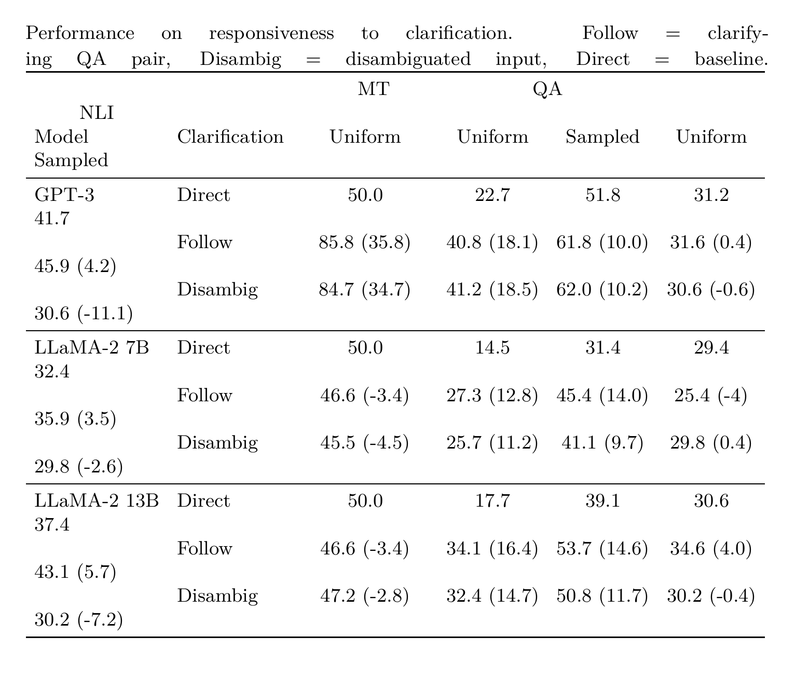
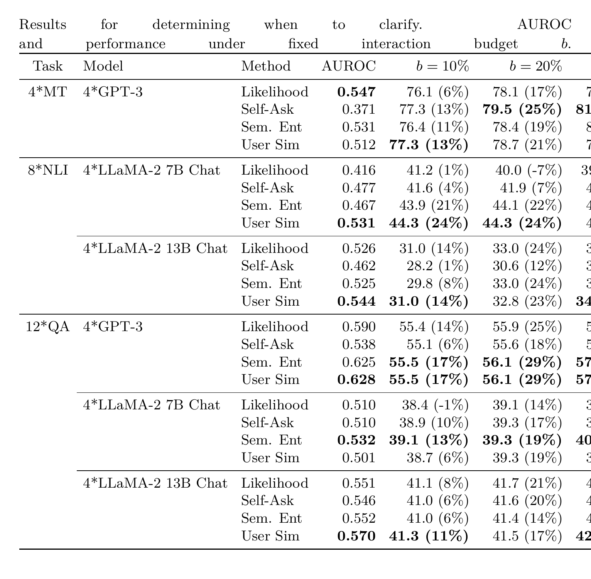

# Clarify When Necessary: Resolving Ambiguity Through Interaction with LMs

**Authors:** Michael J.Q. Zhang, Eunsol Choi

**Published:** 2023-11-16

**Tags:** ambiguity-resolution, clarifying-questions, interactive-nlp, uncertainty-estimation, question-answering, machine-translation, nli

## TL;DR

A task-agnostic framework decomposes ambiguity resolution into three subtasks: (1) determining when clarification is needed, (2) generating clarifying questions, and (3) responding with clarified information. The key contribution is INTENT-SIM, a novel uncertainty estimation method that simulates user intents by sampling clarifying responses and clustering semantically equivalent ones via NLI. When allowed to clarify on only 10% of examples, the system doubles the performance gains of random selection. Evaluated across QA, MT, and NLI, the framework consistently improves with clarifying interactions while avoiding unnecessary clarification.

## Background

Ambiguity is inherent in natural language — speakers routinely omit details relying on context, but sometimes intent remains unclear even with context. Human assistants naturally resolve this by asking clarifying questions, yet existing LLM assistants rarely do so. The paper addresses this gap by formalizing a framework for resolving ambiguity through interaction, applicable across multiple NLP tasks.

Prior work on uncertainty estimation focuses on identifying incorrect predictions, but distinguishing epistemic uncertainty (lack of knowledge) from aleatoric uncertainty (ambiguity) is critical for deciding whether clarification would actually help. A model uncertain because it lacks knowledge won't benefit from clarification; one uncertain because the input is ambiguous will.

## Problem

How can an LLM assistant determine when to ask clarifying questions (rather than guessing), what to ask, and how to use the clarified information — across diverse NLP tasks without task-specific methods?

## Method

The framework decomposes ambiguity resolution into three sequential subtasks:

**Task 1: When to clarify.** Systems produce a scalar uncertainty estimate $u(x)$ for each input, correlating with how much performance would improve after clarification. This requires disentangling aleatoric uncertainty (ambiguity) from epistemic uncertainty (knowledge gaps).

**Task 2: What to ask.** Given the decision to clarify, systems generate a clarifying question and receive a response. The paper uses an oracle setting with GPT-3.5 few-shot prompting to generate questions and answers from different intents, establishing a stable test bed.

**Task 3: Respond with clarification.** Systems use the input and the clarifying QA pair to produce the correct output.

**INTENT-SIM** is the key method for Task 1:
1. Greedily generate a clarifying question $q$ from the input $x$
2. Sample $S$ simulated user responses $a_1, \ldots, a_S$ at temperature $T$
3. Cluster semantically equivalent responses using bidirectional entailment from a DeBERTa-large NLI model
4. Compute entropy over the distribution of equivalence classes as the uncertainty estimate

The intuition: if the simulated user responses cluster into many distinct intents (high entropy), the input is ambiguous and clarification is valuable. If they converge to a single intent (low entropy), the model can respond directly.

**Baselines:** Likelihood (model confidence), Self-Ask (chain-of-thought decomposition), Semantic Entropy (entropy over output space rather than user intents).

## Experiments

*Figure 1: Three-stage framework for resolving ambiguity with clarification questions.*

**Datasets:** AmbigQA (QA), DiscourseMT (MT), AmbiEnt (NLI) — all provide ambiguous inputs with multiple interpretations.

*Table 1: Example instances for each task showing ambiguity types and proportions.*

**Responsiveness to clarification (Task 3):**

*Table 2: Performance with clarifying QA pairs (Follow) vs. disambiguated inputs (Disambig) vs. baseline (Direct). Gains in parentheses.*

- GPT-3 gains substantially from clarification: MT +35.8pp, QA +18.1pp
- Clarifying QA pairs outperform disambiguated inputs for QA and NLI — disambiguations use minimal token edits that sound unnatural, while clarifying interactions resemble pretraining distribution
- LLaMA-2-Chat variants show inconsistent improvement, highlighting the need for explicit training on clarifying interactions

**When to clarify (Task 1):**

*Table 4: AUROC and performance under fixed interaction budgets. INTENT-SIM (User Sim) consistently outperforms baselines.*

Key findings:
- **INTENT-SIM vs. baselines:** Likelihood and Self-Ask show mixed results — sometimes worse than random. Semantic Entropy and INTENT-SIM consistently outperform all baselines under all budgets.
- **AUROC vs. budget performance gap:** AUROC doesn't always correlate with budget performance because 10 samples produce coarse entropy estimates; many examples yield identical distributions.
- **At 10% budget:** INTENT-SIM doubles the performance gain over random selection in 4 out of 6 LLM-task settings.
- **Robustness:** INTENT-SIM works across QA, MT, and NLI without task-specific tuning.

## Critical Analysis

**Strengths:**
- Clean decomposition of ambiguity resolution into three testable subtasks
- INTENT-SIM is task-agnostic — works across QA, MT, and NLI without modification
- Novel insight: separating aleatoric from epistemic uncertainty for clarification decisions
- Finding that clarifying QA pairs outperform minimal-edit disambiguations is practically important for assistant design
- Evaluation under fixed interaction budgets is realistic and actionable

**Weaknesses:**
- Only 10 samples for entropy estimation creates coarse granularity — many examples produce identical distributions
- Oracle setting for clarifying question generation (Task 2) limits practical applicability
- Limited to GPT-3 and LLaMA-2 (7B/13B) — results may differ with modern instruction-tuned models
- Binary AUROC metric doesn't capture the degree of ambiguity well
- No end-to-end evaluation of the full pipeline (all three subtasks together)
- No user study — evaluation relies on existing dataset annotations rather than real interaction

**Open questions:**
- How does INTENT-SIM perform with modern instruction-tuned models (GPT-4, Claude, Llama-3)?
- Can the clarifying question generation be learned rather than prompted?
- Would a continuous ambiguity score (rather than binary AUROC) better capture the task?
- How does the number of samples $S$ affect the entropy estimate quality?

## Implementation Notes

- Framework: task-agnostic, applicable to any NLP task with ambiguous inputs
- INTENT-SIM: requires only the base LLM + a pretrained NLI model (DeBERTa-large on MNLI)
- Sampling: 10 user responses at $T=0.5$ for entropy estimation
- Oracle clarifying questions: GPT-3.5 few-shot prompting with 2 hand-written exemplars
- Evaluation metrics: AUROC for uncertainty quality, accuracy under fixed interaction budgets ($b = 10\%, 20\%, 30\%$)
- QA metric: answer recall (not exact match) to handle verbose LLM outputs
- MT metric: contrastive accuracy (likelihood ranking between intended and alternative translations)
