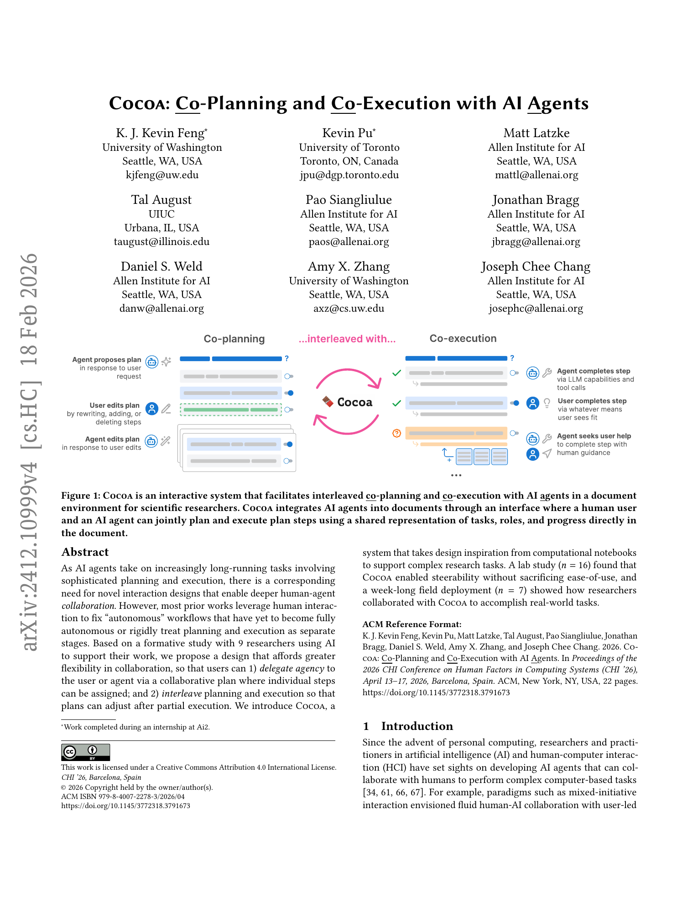
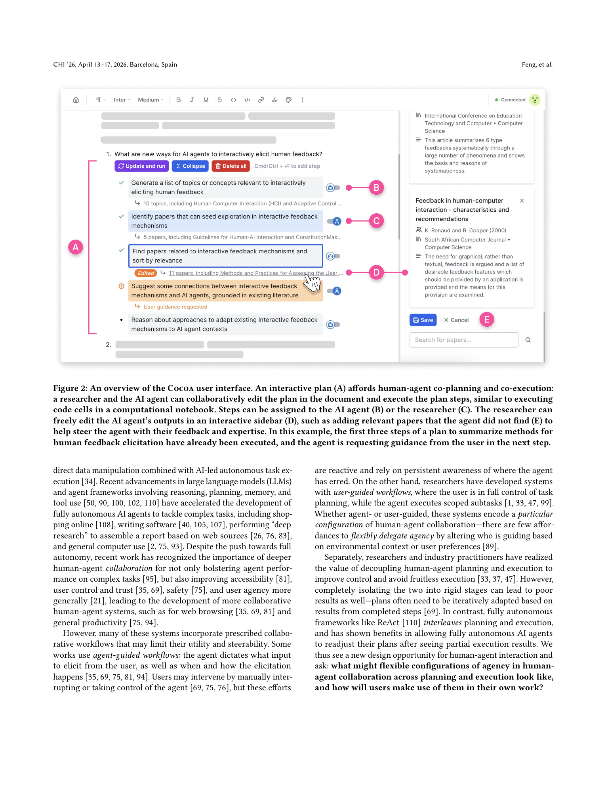
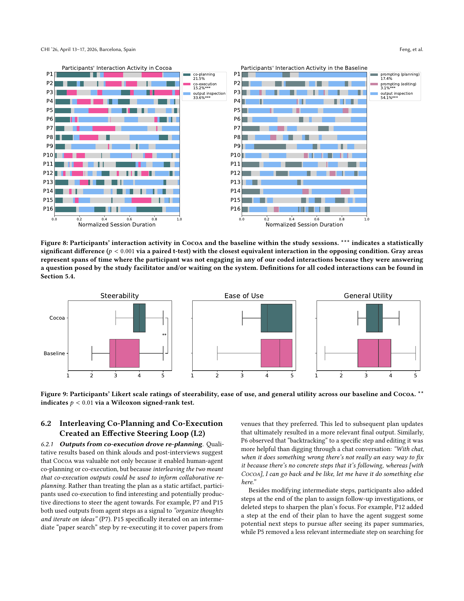
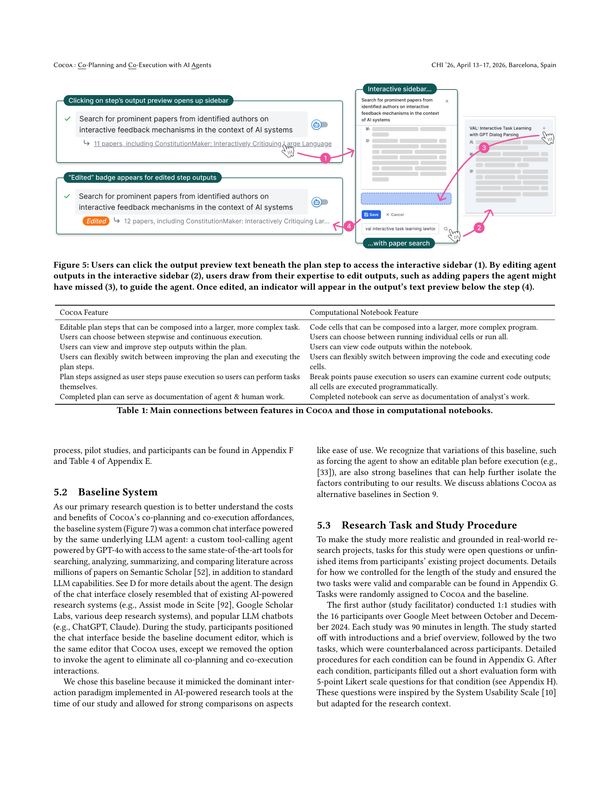
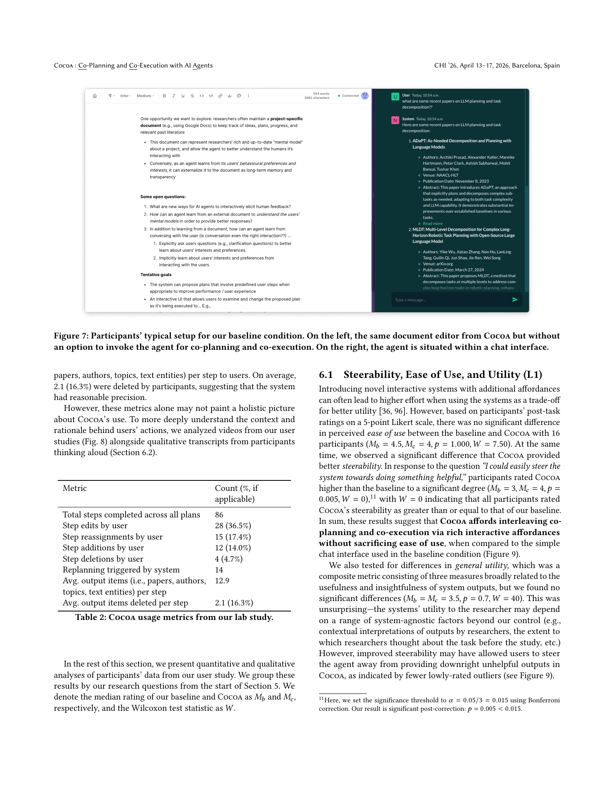
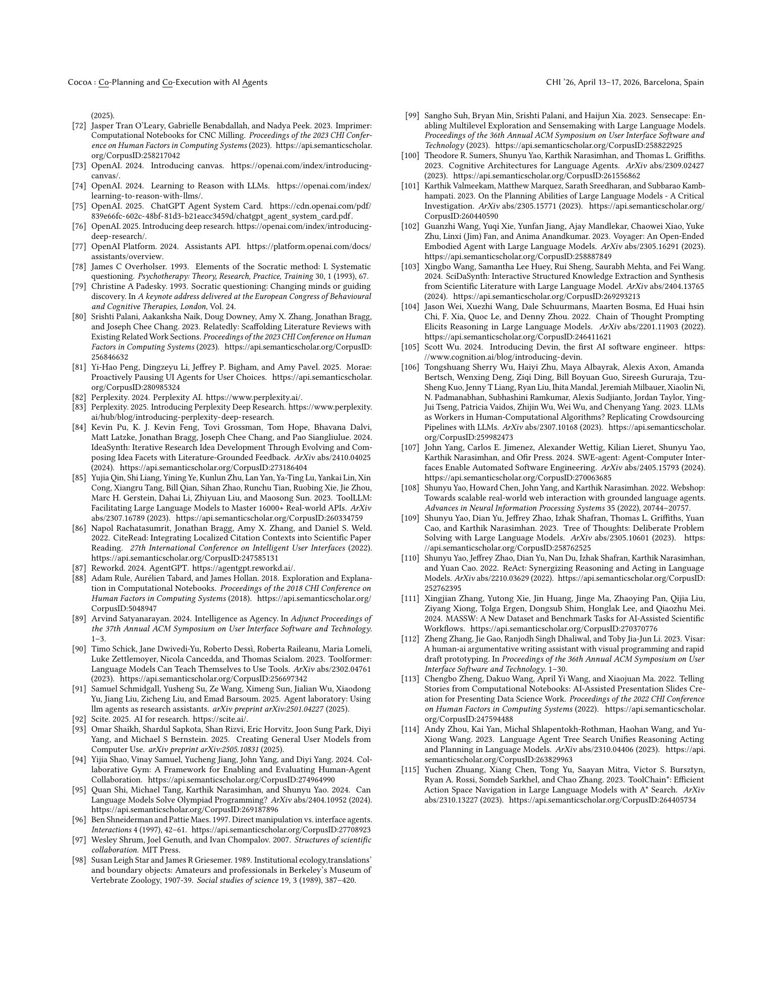

# Cocoa: Co-Planning and Co-Execution with AI Agents

## TL;DR

Cocoa is an HCI system for collaborating with AI agents on long-running research tasks inside a document editor. Instead of treating the agent as either fully autonomous or merely reactive, Cocoa exposes an editable shared plan where each step can be assigned to the user or the agent, executed stepwise or continuously, revised after seeing intermediate outputs, and used as a persistent record of work. A formative study with 9 researchers motivates the design; a lab study with 16 researchers finds that Cocoa improves steerability over a strong chat baseline without reducing ease of use; and a 7-day deployment with 7 researchers shows that users rely on self-assigned steps for higher-level judgment and agent-assigned steps for literature search, synthesis, and execution support.

Source: [arXiv:2412.10999](https://arxiv.org/abs/2412.10999), [PDF](https://arxiv.org/pdf/2412.10999.pdf). The reviewed manuscript is arXiv v4, revised on 2026-02-18, and marked as a CHI 2026 paper.

## Background

Agent systems are moving from single-turn assistance toward long-running workflows: deep research, coding, shopping, data analysis, and general computer use. These workflows require planning, tool use, execution, and recovery from partial results. Fully autonomous agents are attractive, but they often fail in ways that users must detect after the fact. Pure chat interfaces also make it difficult to steer a particular intermediate step without rewriting prompts or rerunning the whole task.

Cocoa addresses this as an interaction-design problem. The paper argues that planning and execution are not cleanly separable stages in real work. Users often learn what they want only after seeing a partial result, and they may want to keep some steps for themselves while delegating others to an agent.

The domain is scientific research, especially literature-augmented work. This is a useful testbed because research tasks are complex, ambiguous, document-heavy, and full of tacit expert judgment. A researcher may want an agent to search papers or summarize methods, while preserving human control over problem framing, novelty claims, and strategic decisions.

## Problem

The paper asks what flexible human-agent collaboration should look like when both planning and execution are shared. Existing systems tend to encode one fixed agency pattern:

1. Agent-guided systems decide when and how to ask for user input.
2. User-guided systems let the user plan while the agent executes scoped subtasks.
3. Chat systems require users to steer through linear prompts and corrections.
4. Autonomous agents interleave planning and execution internally, but often hide or compress the control points users need.

Cocoa reframes the workflow as a shared plan:

\[
P = \{s_1, s_2, \ldots, s_n\},
\]

where each step \(s_i\) has a description, owner, status, output, and dependency on prior steps:

\[
s_i = \{\text{description}, \text{owner} \in \{\text{user}, \text{agent}\}, \text{status}, \text{output}\}.
\]

The interaction challenge is to let users edit \(P\), execute parts of \(P\), update \(P\) after partial execution, and decide which steps require human expertise versus agent effort.

## Method

The paper begins with a formative study of 9 Ph.D. students. Participants brought active or past project documents and discussed how they plan research, where AI could help, and where they wanted to retain control. The study found that project documents are natural hubs for research planning; literature search and understanding play a central role in research workflows; and researchers prefer to keep higher-level reasoning, synthesis, and consequential decisions for themselves.

These findings lead to three design goals:

1. Support human-agent collaboration across both planning and execution.
2. Allow flexible delegation of work between researcher and agent.
3. Integrate into a document environment without cluttering the user's working artifact.

Cocoa implements these goals in a document editor. A user highlights text and invokes the agent, which proposes several plans. Once the user selects a plan, it becomes an editable in-document structure. Users can edit, add, delete, and reorder steps using familiar document interactions. They can also assign each step to the agent or themselves.

Execution follows a computational-notebook metaphor. A plan is like a sequence of cells: each step can be run, paused, inspected, edited, and rerun. Cocoa supports continuous execution through a run-all mode and stepwise execution for tighter control. When a step is assigned to the user, execution pauses so the user can complete it manually before the agent continues.

The system also supports co-execution. Agent outputs open in an interactive sidebar where users can edit or curate structured outputs such as papers, authors, topics, entities, and text. For example, a researcher can remove irrelevant papers from a search step or add known seed papers that the agent missed. These edits then shape downstream execution.

Most importantly, Cocoa interleaves planning and execution. If a user edits a plan step after seeing partial outputs, Cocoa can replan subsequent steps. This makes the plan an evolving artifact rather than a static checklist.

Implementation-wise, Cocoa is a Next.js/TypeScript web app with a Flask backend. The document editor uses Tiptap and Hocuspocus. The backend orchestrates a GPT-4o-powered tool-calling agent with Semantic Scholar tools for paper search and paper-specific summarization.

## Experiments

The evaluation has two main parts after the formative study.

The lab study compares Cocoa against a chat baseline with the same underlying GPT-4o research agent and Semantic Scholar tools. Sixteen Ph.D. and postdoctoral researchers work on literature-augmented tasks drawn from their own project documents. The study uses a within-subjects design: participants use both Cocoa and the chat baseline on comparable tasks, then complete 5-point Likert ratings and interviews.

The interaction logs show that Cocoa changes how users spend their attention. In Cocoa, participants spend less time passively inspecting output than in the baseline: 33.6 percent versus 54.1 percent of the session, a significant difference. They spend more time actively co-executing and editing outputs than in the closest chat-baseline equivalent: 15.2 percent versus 3.1 percent, also significant. Co-planning time is slightly higher in Cocoa, but not significantly different.

Usage metrics show that users accepted many agent-suggested steps but still actively shaped the workflow. Across lab sessions, users completed 86 plan steps, edited 28 steps, reassigned 15 steps, added 12 steps, deleted 4 steps, and triggered system replanning 14 times. On average, each step surfaced 12.9 discrete output items, and users deleted 2.1 of them.

The Likert results are the headline. Cocoa is rated significantly higher for steerability than the chat baseline. Ease of use is not significantly different, which is important because richer interfaces often trade off usability for control. General utility is also not significantly different, suggesting that the system's main demonstrated advantage is not better agent intelligence, but better user control over the same agent.

The deployment study then asks whether these patterns hold outside the lab. Seven participants use Cocoa for 7 days on real in-progress research projects. They report that Cocoa is especially useful for literature synthesis and early-stage planning. Unlike in the lab, participants assign more steps to themselves over time, often reserving high-level strategic decisions, writing, experiments, deep reading, and novelty judgments for human work while delegating search and synthesis to the agent.

## Critical Analysis

Cocoa's strongest contribution is the interaction pattern. It gives users granular control without making them micromanage every agent action. The plan is visible, editable, executable, and persistent; that makes it a shared working object rather than hidden model reasoning.

The computational-notebook analogy is particularly effective. Notebook users already understand the value of running one cell, inspecting output, editing, rerunning, and then continuing. Cocoa adapts that model to agent work: plan steps become "cells," and outputs become inspectable intermediate artifacts.

The study design is also stronger than a simple demo evaluation. The authors use a formative study to ground the design, a controlled lab comparison against a same-agent chat baseline, and a week-long deployment to observe behavior after users have more time to decide what they want to delegate.

The main limitation is domain scope. Cocoa is designed for CS and CS-adjacent researchers doing literature-heavy work. The interface, tools, and examples are deeply tied to papers, authors, Semantic Scholar, and project documents. The pattern may generalize, but the evidence is strongest for research workflows, not arbitrary agent tasks.

The baseline also leaves open some ablation questions. Chat is the dominant interface, so it is a fair practical comparison, but the study does not isolate which Cocoa affordance matters most: editable plans, owner assignment, stepwise execution, sidebar output editing, or automatic replanning. A future study with ablations would make the causal story sharper.

Finally, Cocoa still depends on an underlying agent with limited capabilities. The paper notes that the agent is not multimodal and cannot execute code. In research workflows, figures, slides, notebooks, data files, and code execution often matter. The interaction model is promising, but its practical ceiling depends on richer tools and better transparency about what context the agent used.

## Implementation Notes

Cocoa suggests a useful implementation pattern for agent products: expose the plan as a first-class editable state object. A minimal runtime schema might look like:

\[
\text{PlanStep} = \{\text{id}, \text{description}, \text{owner}, \text{dependencies}, \text{status}, \text{output}, \text{context}\}.
\]

The agent should not only generate the next action; it should maintain this plan state and accept user edits as authoritative updates. When a step changes, downstream steps can be invalidated or regenerated:

\[
P_{i+1:n}' = \operatorname{replan}(P_{1:i}, o_i, c),
\]

where \(o_i\) is the latest step output and \(c\) is document context.

For product teams, the key separation is between agent autonomy and user agency. A useful system should let users choose when to delegate, not force a global setting such as "manual" or "autonomous." Riskier steps, expensive steps, or steps requiring domain judgment can default to user ownership; repetitive or information-gathering steps can default to agent ownership.

For observability, log plan edits, step reassignments, reruns, output edits, deleted output items, and replanning triggers. These are more informative than only logging final task success because they reveal where the user needed to intervene.

The paper also suggests a broader "agent notebook" pattern: break long agent workflows into inspectable executable units, allow direct manipulation of each unit and its output, and preserve the completed plan as documentation of human-agent collaboration.

## Captured Figures and Tables

