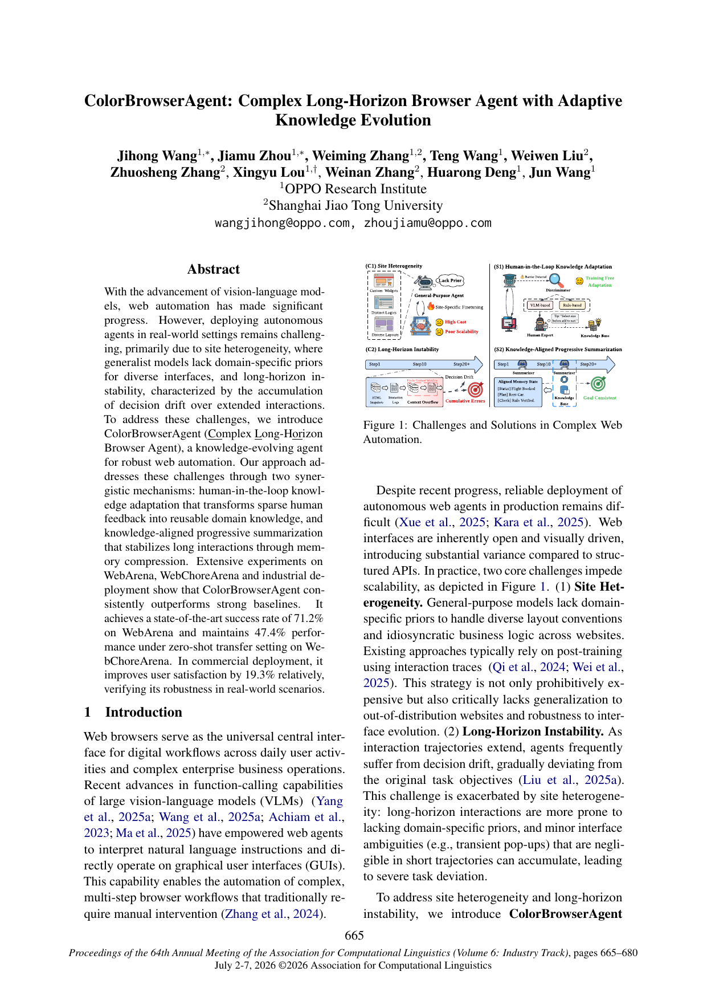
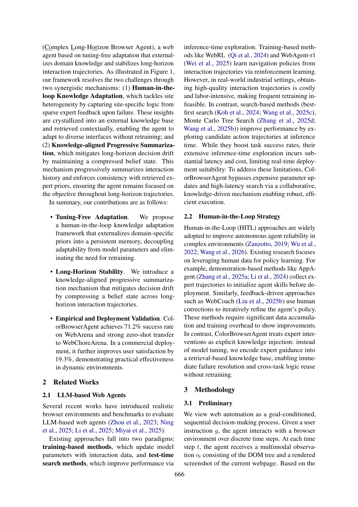
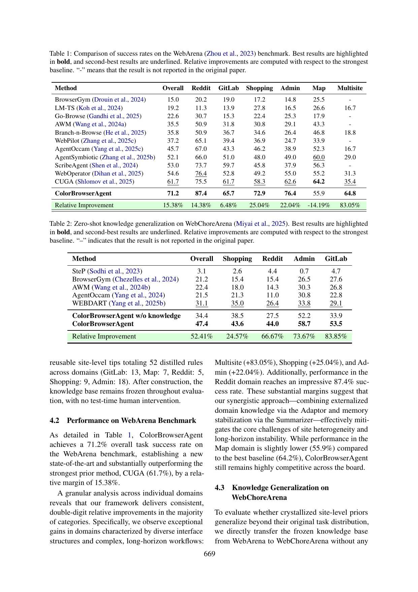

# ColorBrowserAgent: Complex Long-Horizon Browser Agent with Adaptive Knowledge Evolution

## TL;DR

ColorBrowserAgent tackles two production bottlenecks for web agents — site heterogeneity and long-horizon decision drift — without retraining: an offline Adaptor crystallizes sparse human feedback on failures into a frozen Adaptive Knowledge Base (52 site-level rules from <1 person-day), and an online Summarizer maintains an O(1) knowledge-aligned belief state while an Operator executes actions. It reaches 71.2% on WebArena (new SOTA, +15.4% relative over CUGA), transfers zero-shot to WebChoreArena at 47.4%, and lifts user satisfaction 19.3% in a commercial travel-planning deployment.

Source: [ACL Anthology](https://aclanthology.org/2026.acl-industry.46/), [PDF](https://aclanthology.org/2026.acl-industry.46.pdf). ACL 2026 Industry Track, pp. 665–680.

## Background

VLM-based browser agents can operate GUIs directly, but production deployment keeps failing for two reasons. First, site heterogeneity: every site has its own layout conventions and business logic (e.g., "must select a size before add-to-cart"), and generalist models lack these domain priors. The standard fix — post-training on interaction traces (WebRL, WebAgent-R1) — is expensive and does not transfer to unseen or updated sites. Second, long-horizon instability: over 20+ step trajectories the context grows linearly, instruction adherence weakens, and small ambiguities (pop-ups, latent UI states) accumulate into decision drift. Test-time search (best-first, MCTS) helps but adds latency unsuitable for real-time use.

## Problem

Formulated as goal-conditioned sequential decision making: at each step the agent sees DOM + screenshot observation $o_t$ plus history $h_t = (o_0, a_0, \dots, o_t)$ and picks an action (click, type, scroll, stop, …). Success is judged on the terminal state satisfying the goal, not on matching a reference trajectory. The paper asks: can an agent adapt to diverse sites and stay stable over long horizons with no parameter updates and no test-time human help?

## Method

Three components in two loops. The offline knowledge-adaptation loop builds the Adaptive Knowledge Base (AKB): a hybrid detector (rule-based for deterministic failures + VLM evaluator for semantic UI/intent mismatch) triggers on-demand human intervention, experts write site-level tips ("for all product pages…", not query-specific traces), and these are crystallized into the AKB — 52 rules total across GitLab, Map, Reddit, Shopping, Admin. Retrieval at runtime cascades through URL pattern matching, keyword search, and visual-semantic embedding.

The online execution loop runs observation → AKB retrieval → summarization → execution. The Summarizer keeps a structured belief state with hierarchical retention (fine-grained detail only for the active subgoal, completed history collapsed to semantic summaries, bounding memory to near-constant size) plus knowledge-aligned reflection (planned actions are checked against retrieved expert priors, corrective guidance injected on mismatch). The Operator then grounds intent to UI elements from DOM + screenshot, acting on the compressed belief state rather than raw history. Backbone is GPT-5 on BrowserGym/Playwright with Set-of-Marks + accessibility tree observations and an AgentOccam-style action space, max 30 steps.

## Experiments

On WebArena (812 tasks), ColorBrowserAgent reaches 71.2% overall success versus 61.7% for the strongest prior (CUGA), a 15.38% relative gain, with standout margins on Multisite (+83%), Shopping (+25%), and Admin (+22%); it trails only on Map (55.9 vs 64.2). On WebChoreArena with the WebArena-frozen AKB and zero exposure to its tasks, it scores 47.4% versus 31.1% for WEBDART and 34.4% for its own knowledge-free variant — evidence the priors transfer across task distributions, not just backbones.

Ablations on WebArena-Lite (165 tasks, unified GPT-5): full system 72.6%, minus Summarizer 68.8%, minus Adaptor 65.4%, vanilla 61.7%. Externalized knowledge matters more than memory alignment, but both contribute. In a commercial travel-planning deployment (Web Execution Unit in a multi-agent system, with URL-parameter shortcuts, `take_note()`/`calculate()` primitives, and a session watchdog), A/B testing shows +19.3% relative user satisfaction and >95% success in domains with accumulated priors.

## Critical Analysis

The strongest idea is the granularity discipline for the AKB: tips must describe site operational logic, never query-specific flows, which is exactly why frozen WebArena knowledge transfers to harder WebChoreArena tasks. The evaluation protocol is also strict — frozen KB, sequential fully-autonomous runs, no test-time intervention — so the numbers are credible within their setup.

Two caveats matter. First, the Map-domain loss and the cold-start limitation point the same way: where no prior exists (new domains, visualization-heavy widgets like charts and map manipulation), the system degrades to its backbone, and bootstrapping still needs human experts in the loop. Second, everything runs on GPT-5; there is no evidence the Adaptor/Summarizer/Operator decomposition holds with smaller open-weights models, which the authors flag as future work. The comparison framing also deserves care: baselines are cited across different backbones in places, though the ablation under a unified backbone isolates the architectural contribution cleanly.

For this archive, the natural neighbors are WebCoach (cross-session memory guidance) and AgentOccam (whose action space is reused here) — ColorBrowserAgent is the "externalize, don't retrain" counterpoint to WebRL-style post-training approaches.

## Implementation Notes

Reproducing the pattern needs three pieces:

- a failure detector combining cheap deterministic rules with a VLM semantic check, firing only on likely failure to keep expert load sparse (~1 person-day for 812 tasks here);
- a tip template enforcing Scope / Action / Constraint / Goal-Alignment so entries stay site-level and retrievable;
- a summarizer that compresses history hierarchically and cross-checks planned actions against retrieved priors before execution.

The O(1) belief-state trick — full detail for the active subgoal only, semantic collapse for the rest — is directly reusable for any long-horizon agent hitting context limits, independent of the web domain.

## Captured Figures and Tables

