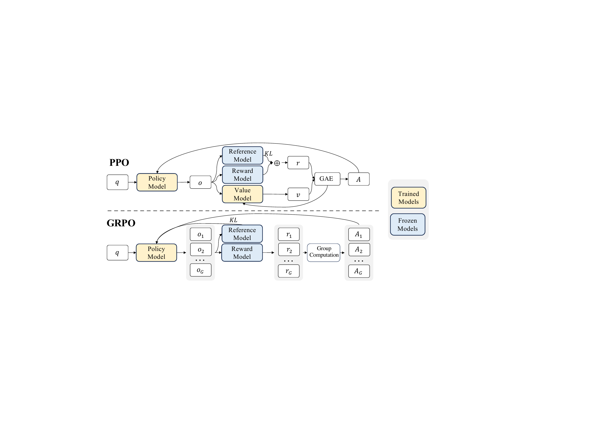
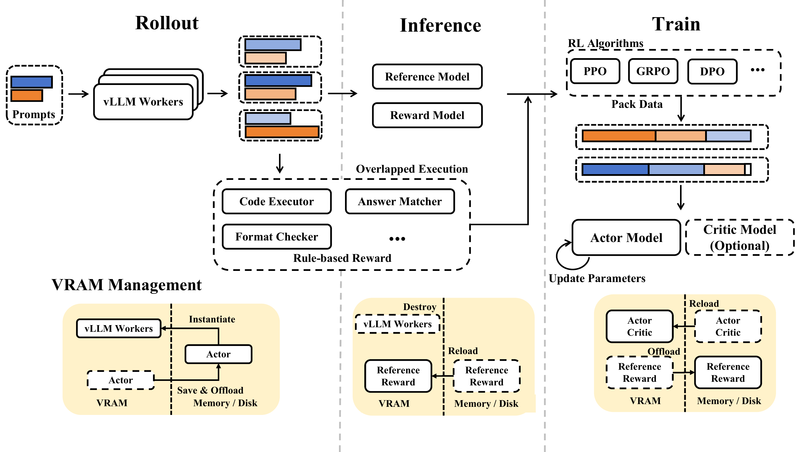

# DeepSeek-R1: Incentivizing Reasoning Capability in LLMs via Reinforcement Learning

## TL;DR

DeepSeek-R1 shows that large-scale reinforcement learning can elicit long-form reasoning without supervised reasoning traces. Starting from DeepSeek-V3-Base, DeepSeek-R1-Zero learns verification, reflection, and strategy switching from rule-verifiable rewards alone; the final DeepSeek-R1 then adds cold-start data, two RL stages, rejection-sampled supervised fine-tuning, and preference alignment to repair readability and general-purpose weaknesses. The resulting 671B-parameter MoE model (37B active) reports 79.8% pass@1 on AIME 2024, 97.3% on MATH-500, 65.9% on LiveCodeBench, and a 2029 Codeforces rating, while distilled 1.5B--70B models transfer much of the reasoning capability to smaller open models.

## Background

Reasoning-oriented LLMs are often trained from human-written or stronger-model-generated chains of thought. Those traces are costly, encode the demonstrator's preferred reasoning style, and can cap exploration at the quality of the demonstrations. Reinforcement learning offers a different route: when a task has a mechanically checkable answer, the model can explore many solution paths and receive an objective signal only from the final outcome.

The paper builds on DeepSeek-V3-Base, a 671B-parameter mixture-of-experts model with 37B activated parameters per token. Its central optimization method is Group Relative Policy Optimization (GRPO), which avoids PPO's separately trained value model by estimating each sampled response's advantage relative to other responses for the same prompt.

## Problem

The paper asks whether reasoning can emerge from outcome-based RL without first imitating curated reasoning traces, and then whether that capability can be converted into a practical assistant. These are related but distinct goals:

1. **Capability discovery:** Can pure RL produce longer, more effective reasoning strategies such as checking, backtracking, and trying alternatives?
2. **Usability and breadth:** Can the resulting model avoid language mixing and poor readability while retaining reasoning strength and improving writing, factual QA, software engineering, helpfulness, and safety?
3. **Accessibility:** Can the learned reasoning behavior be transferred from a very large MoE teacher to substantially smaller dense models?

## Method

### GRPO

For a prompt $q$, GRPO samples a group of $G$ responses $\{o_i\}_{i=1}^{G}$ from the old policy. It standardizes their rewards within the group,

$$
A_i = \frac{r_i - \operatorname{mean}(r_1,\ldots,r_G)}{\operatorname{std}(r_1,\ldots,r_G)},
$$

then applies a PPO-style clipped policy-ratio objective with a KL penalty to a reference policy. The group-relative baseline removes the need for a learned critic/value model, which is especially attractive for long chain-of-thought rollouts where estimating the value of a partial response is difficult.

### DeepSeek-R1-Zero

DeepSeek-R1-Zero applies GRPO directly to DeepSeek-V3-Base with no supervised fine-tuning beforehand. Rewards are deliberately simple:

- **Accuracy rewards** verify final math answers or run generated code against test cases.
- **Format rewards** require reasoning and answers to appear in `<think>...</think>` and `<answer>...</answer>` tags.

For each question, training samples 16 outputs. The maximum rollout length increases from 32,768 to 65,536 tokens after step 8,200; training runs for 10,400 steps. The model's AIME accuracy and average response length both rise during training, accompanied by emergent reflection, verification, and alternative-solution behavior.

### DeepSeek-R1 multi-stage pipeline

Pure RL produces strong reasoning but also poor readability, English/Chinese mixing, and weak general-purpose behavior. The final model therefore uses four broad phases:

1. Collect thousands of human-aligned cold-start reasoning examples and fine-tune the base model.
2. Run a first GRPO stage on reasoning prompts, adding a language-consistency reward to reduce mixed-language chains of thought.
3. Rejection-sample about 600K correct reasoning trajectories and combine them with about 200K non-reasoning examples for another supervised fine-tuning stage.
4. Run a second RL stage over reasoning and general prompts, mixing rule-based, preference, helpfulness, and harmlessness rewards.

The paper also fine-tunes Qwen2.5 and Llama base models on the 800K curated examples to create six distilled models from 1.5B to 70B parameters. These distilled models use SFT only, not an additional RL stage.

## Experiments

### Main model

The final DeepSeek-R1 is evaluated against DeepSeek-V3, Claude-3.5-Sonnet, GPT-4o, o1-mini, and o1-1217. Selected reported results are:

| Benchmark | DeepSeek-V3 | o1-1217 | DeepSeek-R1 |
|---|---:|---:|---:|
| AIME 2024 pass@1 | 39.2 | 79.2 | **79.8** |
| MATH-500 pass@1 | 90.2 | 96.4 | **97.3** |
| GPQA Diamond pass@1 | 59.1 | **75.7** | 71.5 |
| LiveCodeBench pass@1-CoT | 36.2 | 63.4 | **65.9** |
| Codeforces rating | 1134 | **2061** | 2029 |
| SWE-bench Verified resolved | 42.0 | 48.9 | **49.2** |
| MMLU-Pro exact match | 75.9 | -- | **84.0** |

The stage-by-stage ablation is important. R1-Zero is already strong on reasoning (77.9 AIME, 75.8 GPQA) but weak on instruction-following (46.6 IF-Eval) and preferences (24.7 AlpacaEval 2.0). Cold-start tuning initially reduces some reasoning scores, then the reasoning RL stage recovers them. Adding non-reasoning SFT and the final mixed RL stage raises IF-Eval to 83.3, AlpacaEval 2.0 to 87.6, ArenaHard to 92.3, and Aider-Polyglot to 53.3.

### Distillation

Distillation transfers substantial capability even without RL on the student. DeepSeek-R1-Distill-Qwen-7B reaches 55.5% pass@1 on AIME 2024 and 92.8% on MATH-500; the 32B version reaches 72.6% and 94.3%, respectively. This supports the paper's claim that high-quality teacher-generated reasoning trajectories are useful training data, though it does not isolate whether their advantage comes from reasoning style, answer correctness, selection quality, or sheer token volume.

## Critical Analysis

**Strengths**

- The R1-Zero experiment cleanly demonstrates that sophisticated-looking reasoning behaviors can emerge without supervised reasoning traces when outcomes are verifiable.
- GRPO removes the value model and makes the systems story more tractable for extremely long rollouts.
- The paper distinguishes capability elicitation from assistant alignment: R1-Zero is the scientific probe, while R1 is the engineered product pipeline.
- Stage-wise results expose real trade-offs. Cold-start alignment and language consistency improve usability but can temporarily or slightly reduce benchmark performance.
- Open weights across the main and distilled model families made the work unusually actionable for the research community.

**Limitations**

- The strongest causal evidence applies to verifiable math, code, and logic tasks; it does not establish that pure outcome RL works equally well where reward correctness is ambiguous.
- Many implementation details needed for exact reproduction remain unavailable, including the full prompt mixture, reward composition, data filtering thresholds, and complete large-scale infrastructure configuration.
- Reported reasoning traces are behaviors, not evidence of human-like internal cognition. The paper itself cautions that anthropomorphic language may invite unwarranted trust.
- Benchmark contamination and data provenance are difficult to independently audit for a model and training corpus of this scale.
- Distillation uses 800K selected teacher outputs but no student-side RL, so the experiments compare practical recipes rather than fully separating distillation from reinforcement learning.
- The final system is not simply "RL without SFT": that description applies to R1-Zero, whereas DeepSeek-R1 relies on cold-start SFT, rejection sampling, a large supervised dataset, and preference-oriented RL.

## Implementation Notes

- Base model: DeepSeek-V3-Base, 671B total parameters and 37B activated parameters.
- R1-Zero GRPO: learning rate $3\times10^{-6}$, KL coefficient 0.001, rollout temperature 1, 16 samples per question, 32 questions per training step, and batch size 512.
- R1-Zero rollout maximum: 32,768 tokens initially and 65,536 tokens after step 8,200; total 10,400 steps.
- The reference policy is periodically replaced with the latest policy (every 400 steps in the reported setup).
- First R1 RL stage: 16 outputs per question with 32,768-token maximum length and an added language-consistency reward.
- Second SFT corpus: roughly 600K reasoning and 200K non-reasoning examples; mixed-language, overly long, and code-block-heavy reasoning traces are filtered.
- Distillation: 2--3 epochs, 32,768-token context, batch size 64, and model-specific initial learning rates from $10^{-4}$ (Qwen-1.5B) to $2\times10^{-5}$ (Llama-70B).
- The paper reports 147K H800-equivalent GPU hours across R1-Zero training, SFT data creation, and R1 training, excluding base-model pretraining.
- Released checkpoints are available through the DeepSeek-AI organization on Hugging Face.

## Captured Figures and Tables

**Figures:**

*Figure 3. PPO and GRPO architectures. GRPO removes the value model and estimates advantages from rewards within each sampled group.*

*Figure 4. PPO and GRPO performance on the MATH task.*

*Figure 5. The decoupled reinforcement-learning infrastructure used for rollout, inference, reward computation, and policy training.*

**Tables:** No table images were captured because `pdflatex` is unavailable in the current environment; key numerical results are reproduced above from the paper text.
