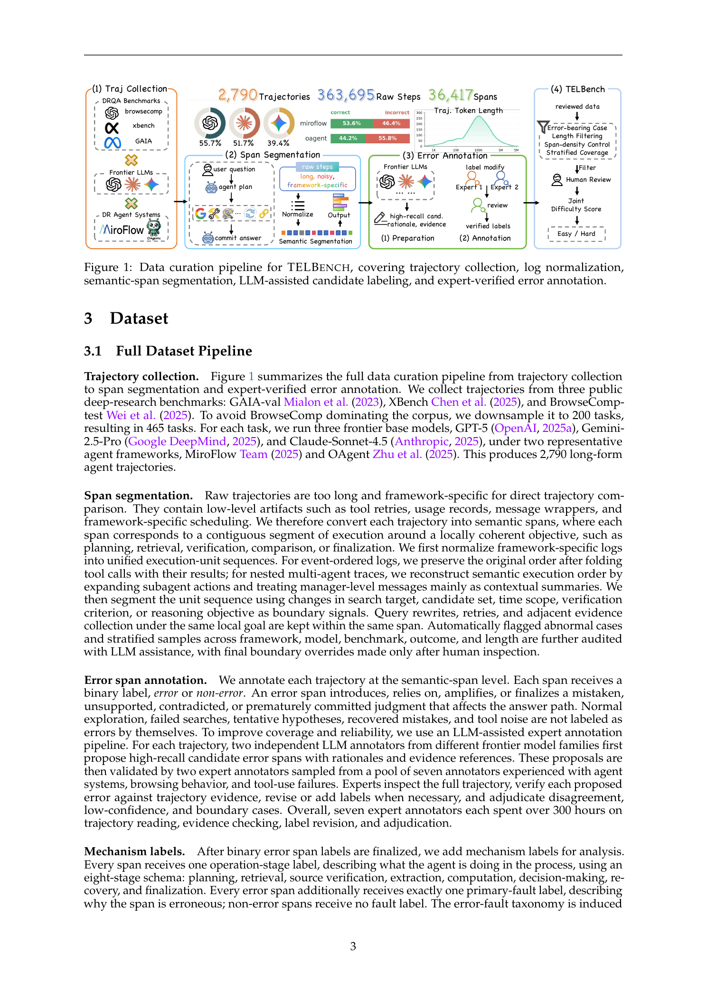
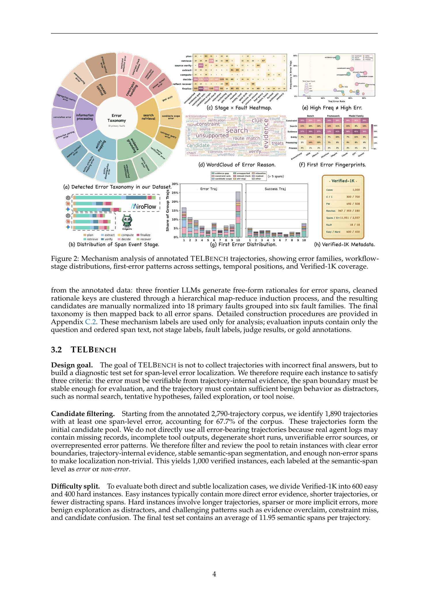
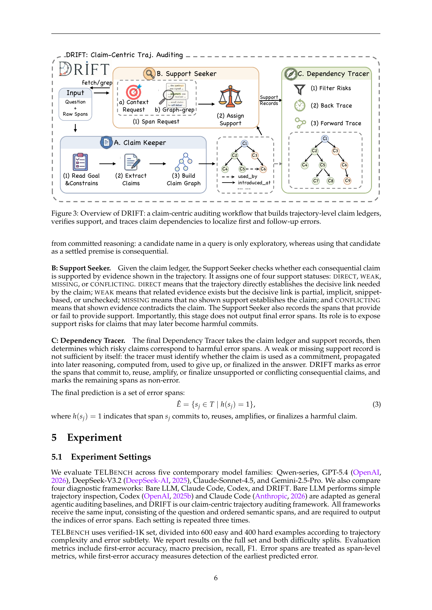
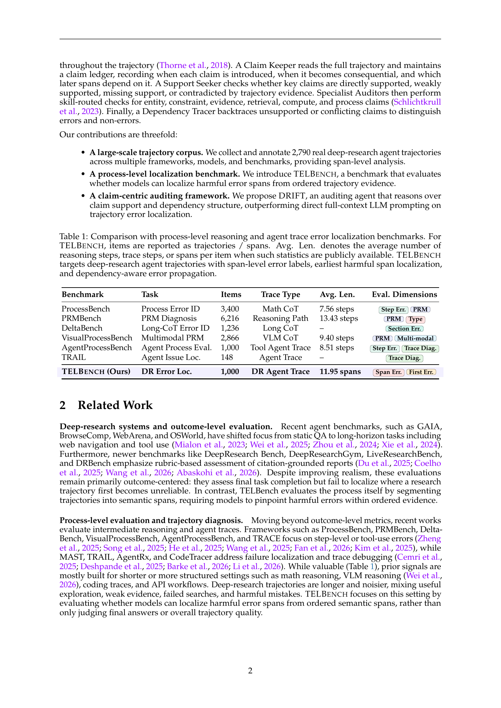
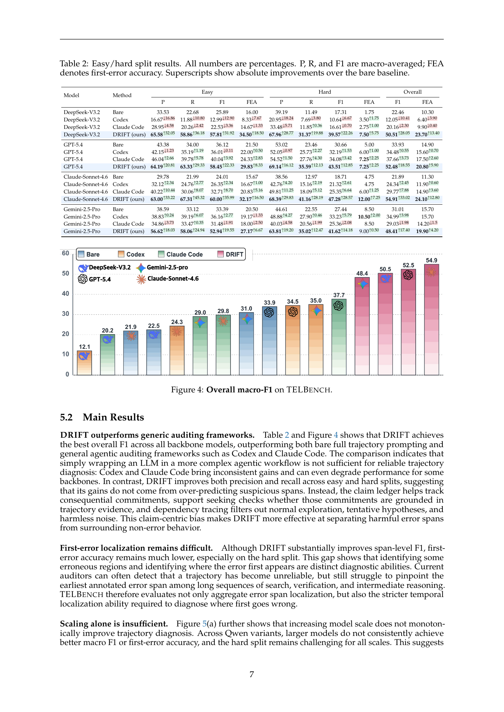
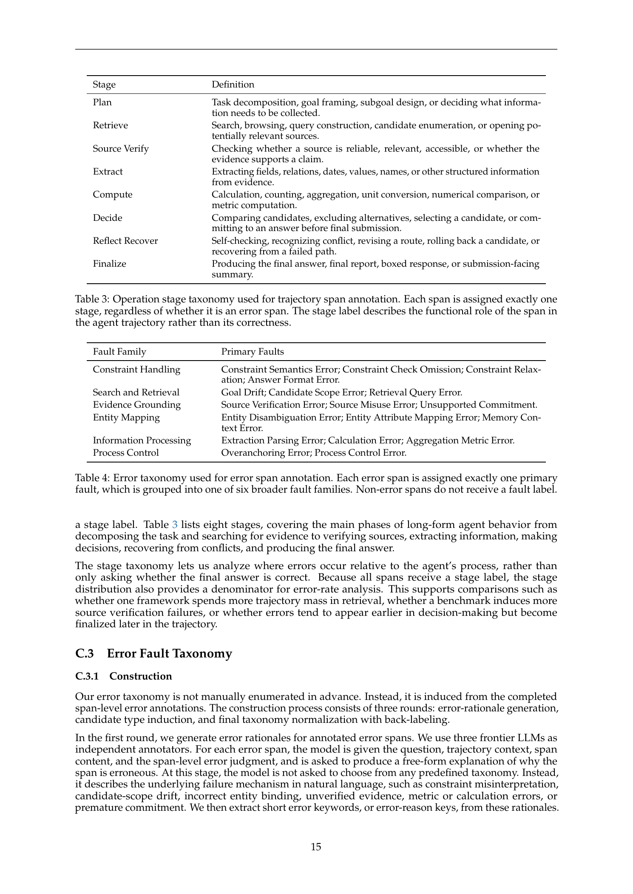

# Where Do Deep-Research Agents Go Wrong? Span-Level Error Localization in Agent Trajectories

## TL;DR

This paper argues that deep-research agents should be evaluated at the process level, not only by final answer correctness. The authors introduce TELBench, a 1,000-instance benchmark for span-level error localization in deep-research trajectories, and DRIFT, a claim-centric auditing workflow that tracks what claims an agent commits to, whether trajectory evidence supports them, and where unsupported claims become consequential. The headline result is that DRIFT improves span-level localization over bare prompting and generic auditing agents, while first-error localization remains hard even for strong models.

Source: [arXiv:2606.02060](https://arxiv.org/abs/2606.02060), [PDF](https://arxiv.org/pdf/2606.02060.pdf), [dataset](https://huggingface.co/datasets/NJU-LINK/TELBench), [code](https://github.com/NJU-LINK/DRIFT)

## Background

Deep-research agents produce long logs: searches, tool calls, source inspections, partial hypotheses, corrections, and final synthesis. A final-answer score can tell whether the run succeeded, but it cannot tell which part of the trajectory made the answer unreliable.

The paper's key observation is that many failures are inherited commitments. An agent may introduce an unsupported entity match, ignore a constraint, over-trust a weak source, or stop searching too early. Later spans then treat that claim as established. A useful diagnostic benchmark must therefore separate harmless exploration from the first harmful commitment and from later spans that propagate it.

## Problem

The task is span-level trajectory error localization. Given a user question and an ordered sequence of semantic spans,

\[
T = (s_1, \ldots, s_n),
\]

the auditor must output the error spans:

\[
\hat{E} = f_\theta(q, T).
\]

The difficult part is the label semantics. Failed searches, tentative guesses, noisy tool output, and abandoned hypotheses are not necessarily errors. A span becomes an error when it introduces, relies on, amplifies, or finalizes a mistaken, unsupported, contradicted, or prematurely committed judgment that affects the answer path.

## Method

The dataset pipeline starts from 2,790 real deep-research trajectories collected across GAIA-val, XBench, and BrowseComp-test. The runs cover two agent frameworks, MiroFlow and OAgent, and three backbone models. Raw logs are normalized into semantic spans, yielding 36,417 spans from 363,695 raw steps.

TELBench is the filtered, verified benchmark subset. It contains 1,000 instances, split into 600 easy and 400 hard cases, with an average of 11.95 spans per trajectory. Error labels are created through LLM-assisted candidate discovery followed by expert review. The important design choice is that each instance contains enough non-error distractors, such as normal search or tentative reasoning, to make localization non-trivial.

DRIFT audits trajectories with three modules:

- Claim Keeper: reads the full ordered trajectory and builds a ledger of decision-relevant claims. A ledger entry records the claim text, where it is introduced, where it first becomes consequential, which later spans reuse it, its type, and its commitment status.
- Support Seeker: checks whether consequential claims are DIRECT, WEAK, MISSING, or CONFLICTING with respect to trajectory evidence.
- Dependency Tracer: converts risky claim records into span labels by asking whether the unsupported or conflicting claim is committed to, reused, amplified, or finalized.

The claim ledger can be sketched as:

\[
L = \{c_k\}_{k=1}^{m}, \quad c_k = (a_k, i_k, b_k, U_k, \tau_k, \sigma_k).
\]

Here \(a_k\) is the claim, \(i_k\) is its introduction span, \(b_k\) is the first consequential span, \(U_k\) is the set of later dependent spans, \(\tau_k\) is claim type, and \(\sigma_k\) is commitment status.

## Experiments

The paper compares DRIFT against bare full-trajectory prompting and generic agentic auditing baselines. The benchmark input is the question plus ordered span texts; the auditor must output error span indices. Metrics include macro precision, recall, F1, and first-error accuracy.

DRIFT is consistently stronger on overall macro-F1. On the reported overall split:

- DeepSeek-V3.2 improves from 22.46 F1 with bare prompting to 50.51 with DRIFT.
- GPT-5.4 improves from 33.93 to 52.48.
- Claude-Sonnet-4.6 improves from 21.89 to 54.91.
- Gemini-2.5-Pro improves from 31.01 to 48.41.

The first-error metric is much tougher. DRIFT improves it, but absolute numbers remain modest, especially on hard cases. This is a useful result: finding some corrupted region in a trajectory and identifying the earliest harmful span are different capabilities.

The ablations support the paper's main hypothesis. Adding the Claim Keeper gives the largest gain, then support checking and dependency tracing add smaller but consistent improvements. The further analysis also shows that larger models do not automatically solve the problem; structured auditing matters.

## Critical Analysis

The strongest contribution is the label framing. TELBench does not treat every failed retrieval or tentative guess as a defect. It asks whether a span causes a harmful commitment in the answer path. That is closer to the kind of debugging signal needed for deployed research agents.

DRIFT is also a good fit for the failure mode. Classifying spans independently loses the dependency structure of research traces. A claim ledger gives the auditor a way to distinguish "the agent explored a bad lead" from "the agent used a bad lead as a settled premise."

The main limitation is that the benchmark depends on semantic-span boundaries and expert judgments. Those boundaries are defensible, but still partly interpretive. A second concern is coverage: the dataset is broad for deep-research QA, but the conclusions may not transfer cleanly to coding agents, GUI agents, spreadsheet agents, or domain-specific research systems without new trace data and annotation rules.

The results also show that the problem is far from solved. Even with DRIFT, hard-split first-error accuracy stays low. For production debugging, this means the benchmark is more useful as a localization stress test than as evidence that automated trajectory auditing is ready to replace human review.

## Implementation Notes

For agent builders, the practical lesson is to log claims, support, and dependencies explicitly. A deep-research system should make it easy to answer:

1. Which claim did the agent commit to?
2. Which span introduced the claim?
3. Which evidence in the trace supports it?
4. Which later spans reused it?
5. Did the final answer depend on it?

That suggests a lightweight runtime structure: keep a claim ledger alongside the trace, attach evidence provenance to claims, and mark support status before final synthesis. The final error decision can then follow the same rule DRIFT uses:

\[
\hat{E} = \{s_j \in T \mid h(s_j) = 1\},
\]

where \(h(s_j)=1\) means span \(s_j\) commits to, reuses, amplifies, or finalizes a harmful claim.

This also affects evaluation. Outcome metrics should be paired with first-error accuracy and span-level F1, because "the final answer is wrong" is too late to explain how the agent failed.

## Captured Figures and Tables

