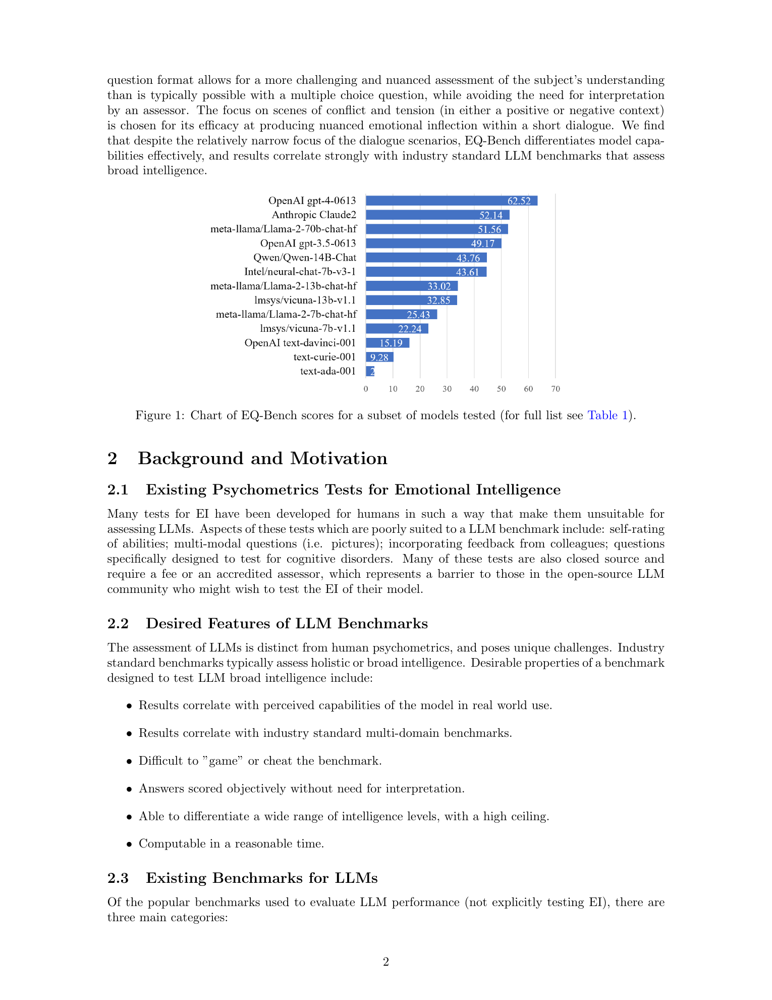
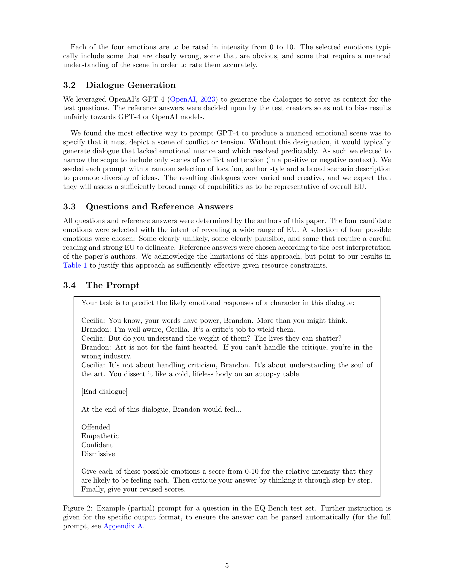
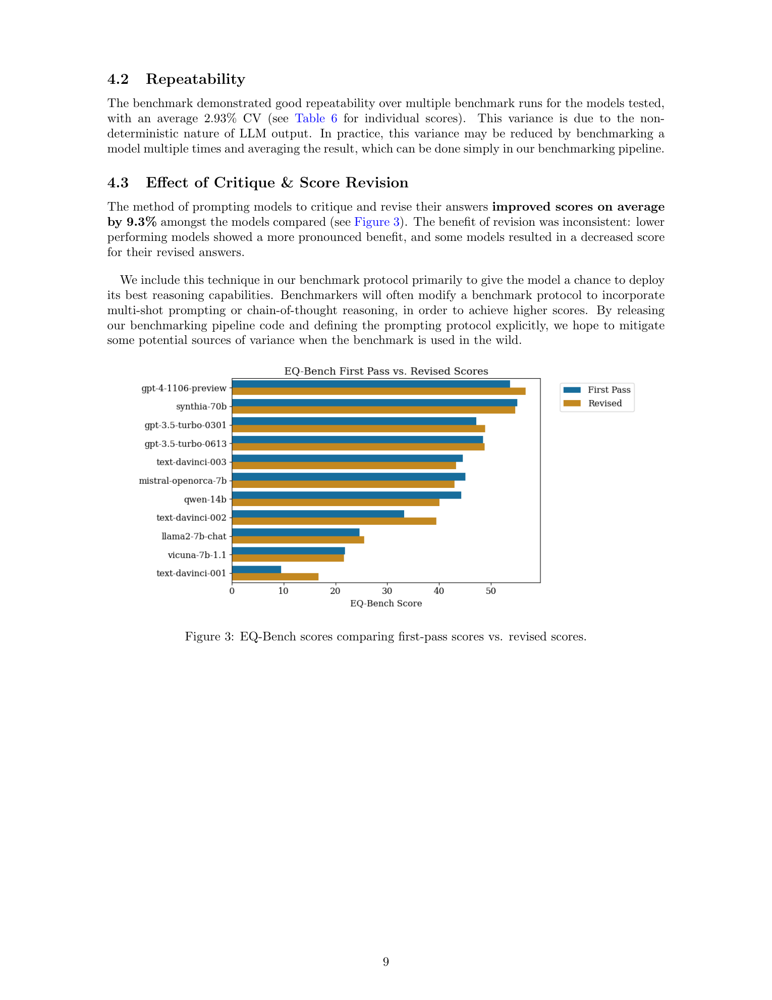
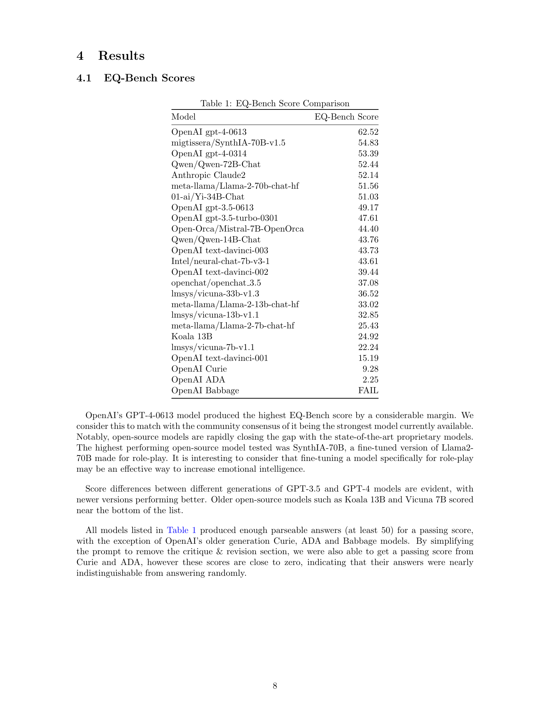
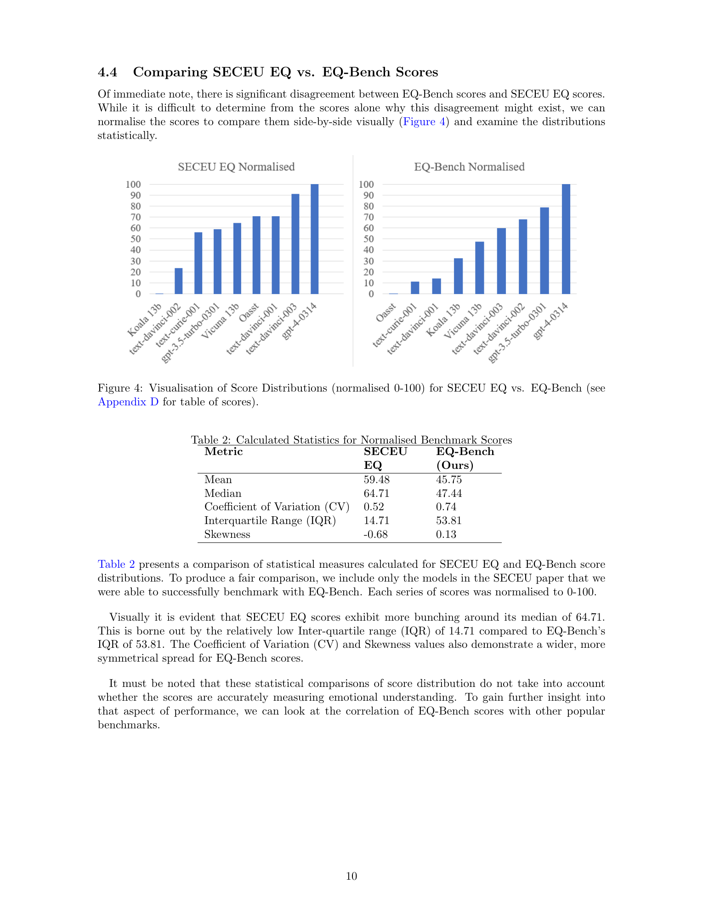
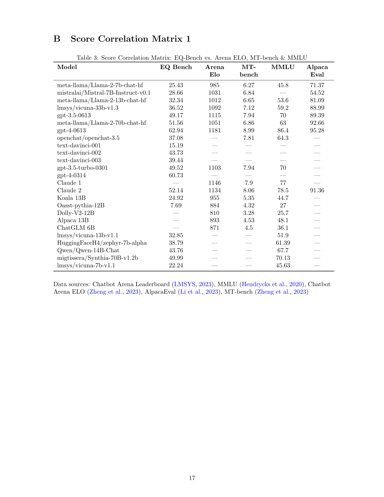

# EQ-Bench: An Emotional Intelligence Benchmark for Large Language Models

## TL;DR

EQ-Bench is a compact benchmark for measuring emotional understanding in LLMs. It asks a model to read short GPT-4-generated conflict or tension dialogues, assign 0-10 intensity scores to four candidate emotions for a character, critique its first answer, and provide revised scores. The paper reports that 60 English-language questions are enough to separate a wide range of models, produce repeatable results, and correlate strongly with broader benchmarks such as MMLU and Chatbot Arena. Its central claim is that dialogue-based emotional understanding behaves like a useful proxy for broad model capability, not merely a niche social-reasoning skill.

Source: [arXiv:2312.06281](https://arxiv.org/abs/2312.06281), [PDF](https://arxiv.org/pdf/2312.06281.pdf). The reviewed manuscript is arXiv v2, revised on 2024-01-03.

## Background

Emotional intelligence is usually discussed as a human psychometric construct, but the paper narrows the target to emotional understanding: interpreting complex emotions and social dynamics from text. That narrowing matters for LLMs because text-only models cannot be assessed on nonverbal perception tasks, workplace feedback instruments, or self-report questionnaires in the same way people can.

The paper positions EQ-Bench against two neighboring benchmark families. The first is broad knowledge and reasoning benchmarks such as MMLU, HellaSwag, ARC, and TruthfulQA. These often require many questions and may be vulnerable to narrow benchmark training. The second is preference or judge-based evaluation, where a human or another model compares outputs. These can capture useful behavior but bring evaluator bias, cost, or dependence on the judge model.

The closest prior emotional-understanding benchmark is SECEU, which asks subjects to rate the relative strength of emotions in short scenarios. EQ-Bench keeps the useful idea of continuous emotion ratings but changes the question format: it uses dialogue scenes, removes the requirement that raw answers sum to 10, selects a more diverse set of candidate emotions, and uses author-defined reference answers rather than crowd averages.

## Problem

The paper tries to solve a practical evaluation problem:

1. Existing emotional-intelligence tests for humans are not directly suitable for LLM benchmarking.
2. Existing LLM benchmarks rarely test emotional understanding explicitly.
3. SECEU-style emotional scoring can compress model differences and may place weak early models too close to much stronger models.
4. LLM benchmark users need objective, automated scoring without relying on a human assessor or an LLM judge.

The core measurement problem is that emotion labels are subjective, but model outputs still need deterministic scoring. EQ-Bench resolves this by asking for relative intensity judgments. For a question with four emotions, the model emits raw scores \(a_i\), and the reference answer contains scores \(r_i\). Both vectors are normalized to sum to 10:

\[
\hat{a}_i = 10\frac{a_i}{\sum_j a_j}, \qquad
\hat{r}_i = 10\frac{r_i}{\sum_j r_j}.
\]

The question score is the distance from the normalized reference:

\[
s(q) = 10 - \sum_{i=1}^{4}|\hat{a}_i - \hat{r}_i|.
\]

The final benchmark score averages parsable question scores and reports the result on a 0-100-style scale:

\[
S = 10 \cdot \frac{1}{|Q'|}\sum_{q \in Q'} s(q),
\]

where \(Q'\) is the set of questions with parsable model answers. This makes random answering approximately score 0, while 100 means perfect reference alignment.

## Method

Each EQ-Bench question presents a short dialogue and asks what one character would feel at the end. The candidate emotions are deliberately mixed: some are clearly unlikely, some are obvious, and some require careful reading of tone, power dynamics, implication, or social context.

The dialogue generation pipeline uses GPT-4 to create emotionally charged scenes. The prompt is seeded with variables such as location, author style, and broad scenario description, and the author found that specifying conflict or tension produced more useful emotional nuance than generic dialogue generation. The reference answers are then selected manually rather than inherited from GPT-4 outputs.

The prompt protocol asks for two passes. First, the model gives emotion scores. Then it critiques its answer step by step. Finally, it gives revised scores in a fixed parseable format. The benchmark reports both first-pass and revised scores, then uses the better of the two run-level scores rather than choosing the better answer per question. That choice avoids giving too much reward to unstable guessing.

Scoring normalizes the four raw intensity values before comparison. This avoids penalizing models for choosing a generally high or low absolute intensity scale, and instead focuses on whether the model understands which emotions are stronger relative to the others. A model can therefore score well only if it ranks and weights the candidate emotions similarly to the reference.

The benchmark contains 60 English-language questions. A model must produce at least 50 parsable answers to pass. The implementation uses zero-shot prompts, temperature 0.01, and a retry mechanism that increases temperature if the answer cannot be parsed. The author also releases the questions and benchmarking pipeline under the MIT license.

## Experiments

The paper evaluates a mix of proprietary and open models, including GPT-4, GPT-3.5, Claude 2, Qwen chat models, Llama 2 chat models, Vicuna, OpenOrca/Mistral, and older OpenAI completion models. In the reported main table, GPT-4-0613 is the strongest model at about 62.5, followed by SynthIA-70B, GPT-4-0314, Qwen-72B-Chat, Claude 2, and Llama-2-70B-chat. Older and smaller models score much lower, with Babbage failing the parseability requirement.

Repeatability is a major result. Across repeated runs, the paper reports an average coefficient of variation of 2.93 percent. For an LLM benchmark with only 60 questions and stochastic generation, that is a useful stability signal, though the author still suggests averaging multiple runs when possible.

The critique-and-revision prompt improves scores by 9.3 percent on average across compared models. The effect is not uniform: lower-performing models tend to benefit more, while some models perform worse after revision. The paper interprets the two-pass protocol as a way to let models use their reasoning ability while keeping benchmark administration standardized.

EQ-Bench also shows a wider score spread than SECEU among the overlapping models. After normalizing both benchmark score series to 0-100, EQ-Bench has a much larger interquartile range and a more symmetric distribution. The paper uses this as evidence that the revised question design differentiates model capability better than the older SECEU setup.

The strongest headline result is correlation with other benchmarks. EQ-Bench correlates with MMLU at \(r=0.97\), Chatbot Arena ELO at \(r=0.94\), HellaSwag at \(r=0.91\), AlpacaEval at \(r=0.91\), MT-Bench at \(r=0.91\), and ARC at \(r=0.85\). Correlations are weaker with TruthfulQA and SECEU. The paper argues that this supports the hypothesis that emotional understanding, measured through these dialogue tasks, overlaps with broader reasoning and model quality.

## Critical Analysis

The strongest part of EQ-Bench is the scoring design. It avoids both multiple-choice brittleness and LLM-judge circularity. Continuous emotion intensities give models room to express nuanced judgments, while the normalized distance metric keeps scoring deterministic and cheap.

The benchmark is also pragmatic. Sixty questions are much cheaper than large multi-domain suites, and the parseable prompt format makes it feasible to run across hosted APIs and local models. The released pipeline and questions make the benchmark more reproducible than many leaderboard-only evaluations.

The main weakness is the reference-answer source. The paper relies on the author's judgments for emotion intensities. That may be better than crowd averaging for preserving an expert-like upper range, but it still creates a single-subject target. Differences in culture, conversational style, personality inference, and valid interpretation can all affect what emotional response seems "correct."

The data-generation source is another limitation. All dialogues are generated by GPT-4. The author intentionally avoids using GPT-4 to set reference answers, but GPT-4 still shapes the benchmark's linguistic style, emotional situations, and implicit social assumptions. Models trained heavily on similar synthetic dialogue patterns may receive an advantage unrelated to general emotional understanding.

The high correlation with MMLU and Chatbot Arena is interesting, but it cuts two ways. It supports EQ-Bench as a compact proxy for broad capability, yet it also raises the question of whether the benchmark is measuring emotional understanding specifically or mostly tracking general language-model strength. A stronger follow-up would include human-subject baselines, expert-created dialogue items, and item-level analyses showing which emotional phenomena are genuinely hard.

Finally, the benchmark can still be gamed if the 60 public questions enter training data. The author acknowledges training-set leakage as a risk. Because the test set is small and public, serious model comparisons should either use leakage checks, private held-out variants, or report EQ-Bench alongside larger and more diverse evaluations.

## Implementation Notes

The scoring pipeline should preserve raw model output, parsed first-pass scores, parsed revised scores, normalization results, per-question scores, parse failures, retry attempts, and the final selected run-level score. Without this trace, it is hard to distinguish emotional-reasoning failures from formatting failures or parser artifacts.

When adapting the benchmark, keep the normalization step. Directly comparing raw 0-10 intensities would introduce avoidable scale bias because models differ in how freely they use extreme values. The benchmark is designed to assess relative emotional weighting:

\[
\operatorname{dist}(a, r) = \sum_i |\hat{a}_i - \hat{r}_i|.
\]

For leaderboard use, run the benchmark with the exact prompt and decoding protocol from the repository, then report parse counts and whether the first-pass or revised score won. A model with a high score but many retries may be less reliable in practice than a model with slightly lower score and clean parseability.

For future benchmark construction, the highest-impact improvements would be private held-out items, expert-authored or human-authored dialogues, multiple independent reference annotators, and item metadata for emotion type, conflict type, ambiguity level, and required theory-of-mind depth. Those additions would make it easier to diagnose whether models fail at subtle emotional distinctions, character perspective tracking, or instruction-following mechanics.

## Captured Figures and Tables

