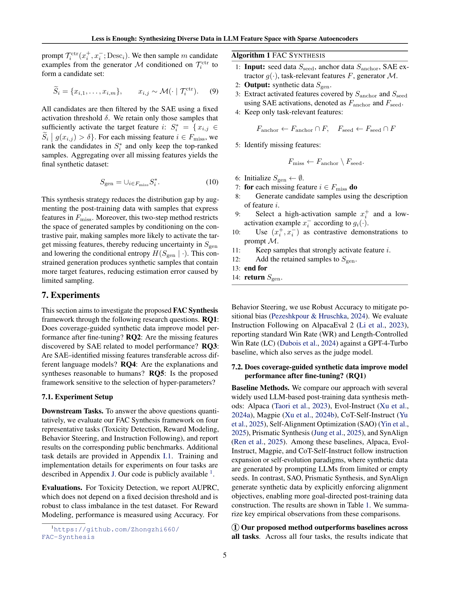
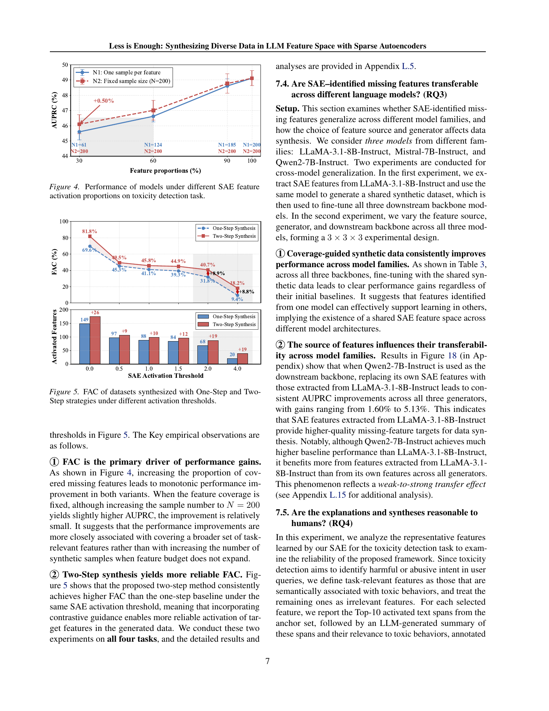
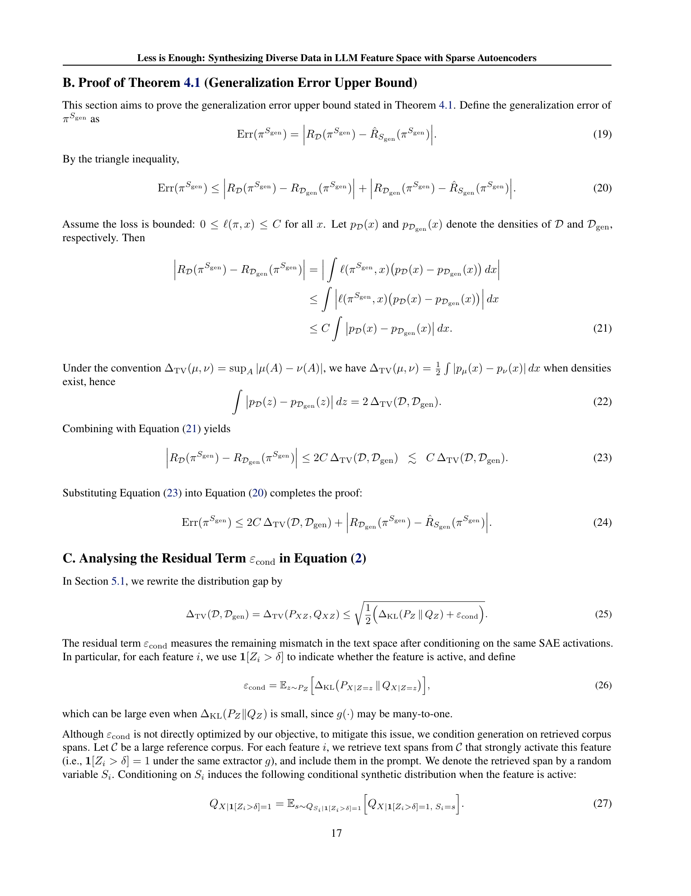
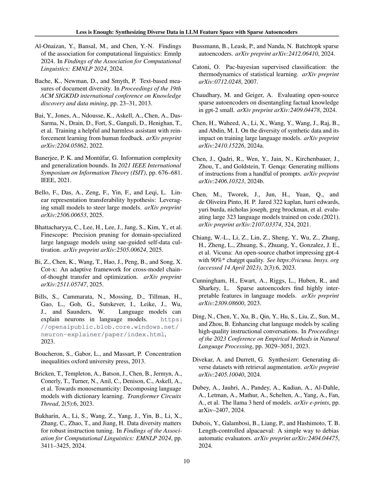
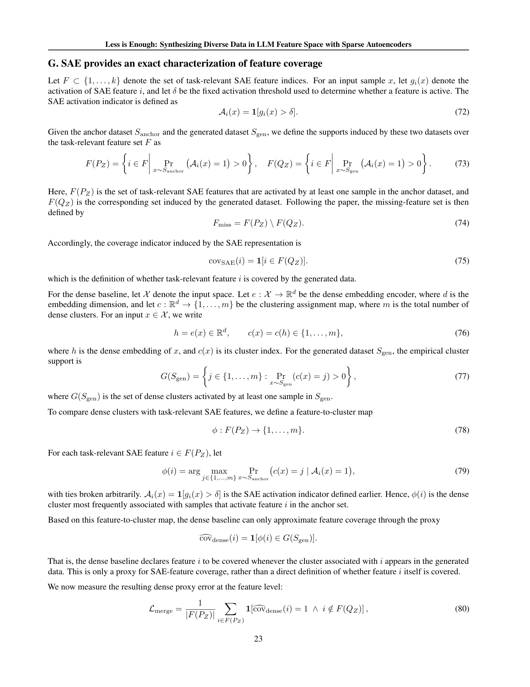

# Less is Enough: Synthesizing Diverse Data in LLM Feature Space with Sparse Autoencoders

## TL;DR

이 논문은 LLM의 내부 특성 공간(feature space)에서 데이터 다양성을 측정하고 합성하는 프레임워크인 FAC Synthesis를 제안한다. 핵심 아이디어는 Sparse Autoencoder(SAE)를 활용해 LLM의 중간 활성화를 해석 가능한 sparse feature로 분해한 뒤, 현재 seed 데이터셋에서 누락된 task-relevant feature를 식별하고 이를 활성화하는 합성 샘플을 생성하는 것이다. 실험 결과, 제안된 Feature Activation Coverage(FAC) 메트릭은 하위 태스크 성능과 강한 양의 상관관계(Pearson r=0.95)를 보였으며, FAC Synthesis는 MAGPIE보다 150배 적은 합성 데이터(2K 샘플)로도 유사한 성능을 달성했다. 또한 SAE feature 공간이 LLaMA, Mistral, Qwen 등 서로 다른 모델 패밀리 간에 공유됨을 발견하여 cross-model knowledge transfer의 가능성을 보여주었다.

Source: [arXiv:2602.10388](https://arxiv.org/abs/2602.10388), [PDF](https://arxiv.org/pdf/2602.10388.pdf)

## Background

LLM의 post-training(instruction tuning, RLHF 등)에서 데이터 다양성(data diversity)은 핵심 요소로 간주되어 왔다. 그러나 기존의 다양성 메트릭은 크게 두 가지 한계가 있다. 첫째, text-level 메트릭(Distinct-n, n-gram entropy, POS tag diversity 등)이나 embedding-level 메트릭(cosine distance, semantic entropy)은 언어적 표면 변이만 측정할 뿐, 다운스트림 태스크 성능을 실제로 결정하는 task-relevant feature를 포착하지 못한다. 둘째, 모델의 gradient 정보를 활용하는 방법은 특정 checkpoint와 학습 설정에 의존적이어서 다른 모델 아키텍처나 스케일로의 전이가 어렵다.

한편, 최근 SAE는 LLM의 내부 활성화를 해석 가능한 sparse feature로 분해하는 도구로 주목받고 있다. SAE는 과완성(overcomplete) 은닉층을 사용해 입력을 재구성하며 L1 정규화로 희소성을 강제한다. 각 feature는 특정한 의미 패턴(예: "불법 행위", "속임수", "인용")에 선택적으로 반응하도록 학습된다. 이 논문은 이러한 SAE feature 공간이 데이터 합성의 새로운 축을 제공할 수 있다고 주장한다.

## Problem

Post-training 데이터 합성의 핵심 질문은 "어떻게 원칙적이고 효율적으로 다양한 데이터를 구성할 것인가"이다. 구체적으로:

1. **비효율적인 다양성 메트릭**: 기존 텍스트 기반 메트릭은 태스크 성능과 관련된 feature 다양성을 제대로 측정하지 못한다.
2. **목적 없는 데이터 생성**: 기존 합성 방법(단순 프롬프팅, 진화적 접근, 자기 부트스트래핑)은 중복과 분포 편향을 유발하며 생성 과정에서 태스크 관련성을 명시적으로 제어하지 않는다.
3. **전이 불가능한 방법론**: gradient 기반 방법은 특정 모델에 고정되어 다른 아키텍처로의 확장이 어렵다.

저자들은 SAE feature 공간을 활용해 위 문제들을 동시에 해결할 수 있는 프레임워크를 제안한다.

## Method

### Feature Activation Coverage (FAC)

저자들은 SAE feature 공간에서 데이터 다양성을 측정하는 메트릭 FAC를 정의한다. SAE 인코더가 입력 \(x\)에 대해 sparse feature activation \(z = \sigma(xW) \in \mathbb{R}^k\)를 생성할 때, \(i\)번째 feature의 활성화 여부는 임계값 \(\delta\)를 기준으로 이진 판단한다:

\[
A_i(x) = \mathbb{1}[g_i(x) > \delta]
\]

전체 task-relevant feature 집합을 \(F \subset \{1, \ldots, k\}\)라고 할 때, 앵커 데이터(태스크 도메인을 대표하는 큰 코퍼스)와 생성 데이터 각각에서 활성화된 feature 부분집합을 \(F(P_Z)\)와 \(F(Q_Z)\)로 정의하면:

\[
\text{FAC} = \frac{|F(Q_Z)|}{|F(P_Z)|}
\]

누락된 feature 집합은 \(F_{\text{miss}} = F(P_Z) \setminus F(Q_Z)\)로 정의된다.

### 일반화 오차 상한

논문은 이론적으로 합성 데이터의 일반화 오차를 두 항목으로 분해한다:

\[
\text{Err}(\pi^{S_{\text{gen}}}) \leq 2C \cdot \Delta_{\text{TV}}(D, D_{\text{gen}}) + \left(R_{D_{\text{gen}}}(\pi^{S_{\text{gen}}}) - \hat{R}_{S_{\text{gen}}}(\pi^{S_{\text{gen}}})\right)
\]

첫째 항은 분포 격차(distribution gap)로, SAE feature 공간에서의 KL 발산으로 상계된다. 둘째 항은 샘플링 오차(sampling error)로, PAC-Bayesian 이론을 통해 합성 데이터셋의 엔트로피 \(H(S_{\text{gen}})\)로 상계된다. 이 이론적 분석은 두 가지 전략을 제안한다: (1) 누락된 feature를 커버하여 분포 격차를 줄이고, (2) 대조 샘플 쌍을 통해 생성 불확실성을 낮춰 샘플링 오차를 줄인다.

### FAC Synthesis 프레임워크

FAC Synthesis는 세 단계로 구성된다:

1. **SAE 학습 및 task-relevant feature 식별**: LLM의 중간 층 활성화에 SAE를 학습시키고, GPT-4o-mini를 사용해 각 feature의 의미를 해석하여 태스크와 관련된 feature 집합 \(F\)를 식별한다.

2. **누락 feature 식별**: 앵커 데이터 \(S_{\text{anchor}}\)에서 커버되는 feature \(F(P_Z)\)와 시드 데이터 \(S_{\text{seed}}\)에서 커버되는 feature \(F(Q_Z)\)를 비교해 \(F_{\text{miss}}\)를 찾는다.

3. **대조 가이드 합성(Two-Step Synthesis)**: 각 누락 feature \(i \in F_{\text{miss}}\)에 대해:
   - **Step 1**: feature \(i\)를 강하게 활성화하는 샘플 \(x_i^+\)와 약하게 활성화하는 샘플 \(x_i^-\)를 각각 생성하여 대조 쌍을 구성한다.
   - **Step 2**: 이 대조 쌍을 few-shot demonstration으로 사용해 생성기 \(M\)을 조건화하여, feature \(i\)를 안정적으로 활성화하는 합성 샘플을 생성하고 SAE 활성화 임계값으로 필터링한다.

\[
S_{\text{gen}} = \bigcup_{i \in F_{\text{miss}}} S_i^*, \quad S_i^* = \{x_{i,j} \in \tilde{S}_i \mid g_i(x_{i,j}) > \delta\}
\]

## Experiments

### 태스크 및 설정

네 가지 대표적인 post-training 태스크에서 평가했다: Toxicity Detection(AUPRC), Reward Modeling(Accuracy), Behavior Steering(SCR), Instruction Following(AlpacaEval 2의 LC/WR). 백본 모델로 LLaMA-3.1-8B-Instruct를 사용했으며, 추가로 Mistral-7B-Instruct와 Qwen2-7B-Instruct로 일반화를 검증했다.

### 주요 결과

1. **모든 태스크에서 SOTA 달성**: Table 1에서 FAC Synthesis는 7개의 베이스라인(Alpaca, Evol-Instruct, Magpie, CoT-Self-Instruct, SAO, Prismatic Synthesis, SynAlign)을 모든 태스크에서 능가했다. 특히 Instruction Following에서 MAGPIE와 유사한 성능을 달성하면서도 150배 적은 데이터(2K vs 300K)를 사용했다.

2. **FAC와 성능의 강한 상관관계**: Figure 3에서 FAC와 AUPRC 간에 Pearson r=0.95의 강한 선형 관계를 확인했다. 반면 기존 text-level 다양성 메트릭은 성능과 약한 상관관계를 보였다.

3. **누락 feature 커버리지의 중요성**: Figure 4에서 누락 feature의 커버 비율을 높일수록 성능이 단조 증가했으며, 샘플 수를 늘리는 것보다 feature 커버리지 자체가 성능 향상의 주된 동인임을 보였다.

4. **Two-Step 합성의 우수성**: Figure 5에서 제안된 대조 쌍 기반의 Two-Step 합성이 One-Step 합성보다 모든 활성화 임계값에서 더 높은 FAC를 달성했다.

5. **모델 패밀리 간 전이 가능성**: Table 3에서 LLaMA에서 추출한 SAE feature로 생성한 합성 데이터가 Mistral과 Qwen에서도 일관된 성능 향상을 가져왔다. 특히 Qwen이 LLaMA의 feature로 더 큰 이득을 보는 weak-to-strong transfer 현상을 관찰했다.

6. **하이퍼파라미터 민감도**: 생성 온도는 중간값(0.8)에서 최적 성능을 보였고, 활성화 임계값 \(\delta\)는 [1.0, 2.0] 범위에서 최적이었다. feature 당 1-2개의 합성 샘플만으로도 대부분의 성능 향상이 달성되었다.

## Critical Analysis

### 장점

1. **원칙적인 이론적 기반**: 일반화 오차 상한을 유도하고, 분포 격차와 샘플링 오차라는 두 가지 축으로 합성 데이터의 효과를 분석한 점은 직관적이다. 특히 SAE feature 공간에서의 KL 발산이 분포 격차의 상계가 된다는 증명은 이 접근법의 정당성을 뒷받침한다.

2. **데이터 효율성**: 2K 합성 샘플만으로 300K가 필요한 MAGPIE와 경쟁하는 성능을 낸 것은 실용적으로 매우 중요하다. 이는 feature-level 합성이 text-level 합성보다 본질적으로 더 효율적일 수 있음을 시사한다.

3. **해석 가능성**: SAE feature는 자연어로 설명 가능하므로(예: "robbery와 관련된 feature"), 어떤 특성을 대상으로 합성했는지 사람이 이해할 수 있다. 이는 합성 데이터의 품질 관리와 디버깅에 유리하다.

4. **Cross-model transfer**: 서로 다른 모델 패밀리 간에 SAE feature 공간이 공유된다는 발견은 흥미롭다. 작은 모델에서 추출한 feature로 큰 모델의 데이터 합성을 가이드할 수 있는 weak-to-strong 시나리오를 열어준다.

### 한계

1. **단일 층 SAE의 한계**: 저자들도 인정하듯이, 단일 층의 SAE feature는 분산된 다층 회로(multi-layer circuits)에 의존하는 복잡한 추론 행동(수학, 코드 생성)에는 불충분하다. 부록의 GSM8K와 LiveCodeBench 결과가 이를 뒷받침한다.

2. **Task-relevant feature 식별의 의존성**: GPT-4o-mini에 의존해 task-relevant feature를 식별하는 과정은 LLM의 해석 능력에 의존적이다. 잘못 분류된 feature는 합성 품질에 부정적 영향을 미칠 수 있다. 저자들이 노이즈 주입 실험(Appendix L.2)을 수행했지만, 실제로 잘못된 feature 식별이 성능에 미치는 영향은 더 체계적으로 분석될 필요가 있다.

3. **태스크 범위의 제한**: 네 가지 태스크(독성 탐지, 보상 모델링, 행동 제어, 명령 수행)는 주로 안전성과 정렬에 초점이 맞춰져 있다. 일반적인 추론, 상식, 코딩 등 더 다양한 태스크에서의 검증이 필요하다.

4. **앵커 데이터의 품질 의존성**: 앵커 데이터 \(S_{\text{anchor}}\)의 크기와 품질이 전체 프레임워크의 성능을 결정한다. 실제로는 태스크 도메인을 대표하는 대규모 코퍼스를 확보하는 것이 어려울 수 있다.

5. **비교적 엄격하지 않은 생성 제어**: 대조 쌍이 feature 발현을 유도하지만, 생성된 샘플이 feature 외의 unwanted 속성(예: 독성)을 포함할 가능성을 완전히 배제하지는 못한다.

## Implementation Notes

1. **SAE 학습 및 임계값 설정**: SAE의 확장 폭(expansion factor, \(k/d\))와 sparsity 계수 \(\lambda\)는 feature의 질에 직접적인 영향을 미친다. 논문은 \(k=32d\), \(\lambda=0.001\)을 사용했다. 활성화 임계값 \(\delta\)는 [1.0, 2.0] 범위가 권장된다. 너무 낮으면 노이즈 feature가 포함되고, 너무 높으면 커버할 feature가 지나치게 제한된다.

2. **Feature 식별 비용**: GPT-4o-mini를 사용한 feature 설명 및 태스크 관련성 분류는 수백에서 수천 개의 feature에 대해 수행되어야 하므로 API 비용이 발생한다. 하지만 이는 일회성 비용이며, 한번 식별된 feature는 재사용 가능하다.

3. **생성기 선택**: 실험 결과, 백본과 동일한 모델 패밀리의 생성기를 사용하는 것이 GPT-4o mini와 같은 외부 모델을 사용하는 것보다 더 효과적이었다(Tabel 4). 생성 온도는 0.8 부근이 최적이다.

4. **Cross-model 적용**: 다른 모델에 SAE feature를 전이할 때는 feature의 의미가 보존되는지 검증이 필요하다. 논문의 결과는 LLaMA의 feature가 특히 전이성이 높음을 시사한다.

5. **데이터 효율성 극대화**: Feature 당 1-2개의 샘플만으로도 성능 향상의 대부분을 달성할 수 있다. 추가 샘플의 한계 효용은 급격히 감소하므로(Figure 7의 DES 감소), 예산 제약이 있을 때는 feature 커버리지를 넓히는 방향으로 리소스를 할당하는 것이 효과적이다.

## Captured Figures and Tables

추가 테이블이 캡처되었으나 본문과 중복될 수 있습니다. 더 자세한 내용은 원본 논문의 Table 1을 참조하세요.
