# Fara-1.5: Scalable Learning Environments for Computer Use Agents

## TL;DR

Fara1.5 is a family of open-weight native computer use agents (4B/9B/27B, built on Qwen3.5) trained purely by SFT on trajectories from FaraGen1.5, a rebuilt synthetic data pipeline. The three changes over the previous generation are: sandboxed full-stack replica websites (FaraEnvs) that unlock authentication-gated and irreversible-action tasks, a single-policy GPT-5.4 solver that replaces a multi-agent orchestrator (67% → 83% on Online-Mind2Web), and a three-way verifier stack that filters on correctness, efficiency, and critical-point adherence. Fara1.5-9B reaches 63.4% on Online-Mind2Web and 86.6% on WebVoyager; Fara1.5-27B reaches 72.3% and 89.3%, beating much larger proprietary systems. Weights are released under MIT.

## Background

Native computer use agents (CUAs) consume rendered screenshots and emit low-level actions (clicks, keystrokes, scrolls) without a DOM or accessibility tree, which avoids the benchmark-to-deployment gap that structured-observation agents hit on visually rich real sites. Training them needs multi-step interaction demonstrations that do not occur naturally on the internet and are too slow and expensive to collect from humans.

The authors' prior work, Fara-7B, addressed this with FaraGen: a pipeline of environments, a Magentic-One/Magentic-UI orchestrator-worker solver, and verifiers, producing verified live-web trajectories at roughly \$1 per task. Fara1.5 keeps this three-stage decomposition and rebuilds each stage.

## Problem

Three specific bottlenecks in the prior pipeline:

1. **Environment restriction.** Live websites cannot host tasks behind login, tasks that mutate persistent state, or tasks whose only success criterion is an irreversible action performed correctly. An agent trained only on the open web never observes what a successful login flow, a confirmed purchase, or a sent message looks like. Live sites also add time-sensitive task decay, bot policies, and legal exposure.
2. **Solver plateau.** The multi-agent orchestration layer had to be re-engineered for each new frontier model, and its behavior did not match the single-policy inference-time setting of the student, creating teacher-student distribution shift.
3. **Verification reliability.** Programmatic verification is infeasible on sites with inaccessible backends, and single-perspective LLM judges hallucinate. Correctness alone also admits meandering trajectories and trajectories that fabricate user information the agent should have asked for.

## Method

### Environments

**Live web.** Seed URLs come from a large public index. Each seed site is explored once to produce a cached content/feature/structure summary, which is fed to a task-proposal LLM together with sampled values along five dimensions (target website, task complexity, phrasing style, user interaction type, task feasibility) plus a user intent and persona. A coverage tracker monitors the empirical distribution along each categorical dimension. Proposed tasks pass a deterministic filter (refusals, bare URLs) and an LLM good/bad judge. Deliberately ambiguous or under-specified tasks are *kept* when judged realistic, since they match the user-instruction distribution the solver must handle.

**Synthetic (FaraEnvs).** Six sandboxed replicas — email, calendar, media streaming, ML experiment management, marketplaces, scheduling — each a React frontend, FastAPI backend, SQLite schema, and persona-driven seed-data script. They are built semi-automatically: human interaction trajectories on the target domain are handed to a coding agent (GitHub Copilot), which drafts the clone and refines it over typically 3–5 rounds of human review until surface behavior matches the recordings.

Because the full stack is controlled, every task carries a ground-truth success criterion expressible as a state predicate over the backend, and the database resets between trajectories so irreversible actions are safe. Tasks are proposed by an LLM with MCP access to both a SQLite server (schema introspection, entity queries) and a Playwright server (live UI browsing), anchored by a small bank of human-written exemplars. Train and test tasks are proposed in separate phases and deduplicated against each other.

The authors argue explicitly that **environment diversity matters more than trajectory volume**, and that shallow environments add little regardless of yield.

### Solver

The multi-agent orchestrator is collapsed into a single GPT-5.4 agent running a multi-turn tool-calling loop over a tool set that mirrors the student's action space. Motivation: match the student's inference-time setting, and inherit frontier-model gains without re-engineering orchestration. On the same Online-Mind2Web tasks this raises end-to-end success from 67% to 83%.

Solver capabilities the student cannot replicate are deliberately disabled — notably complex URL queries that bypass site interaction entirely, since those trajectories skip the UI behavior the student is supposed to learn. Dangerous/irreversible live-web actions (account creation, forum posting) are forbidden.

**User simulator.** Invoked at two callsites: when the solver issues `ask_user` for missing information or ambiguity, and after the solver believes the task is done, where the simulator may accept or issue a follow-up request — the principal source of multi-turn training data. Since the solver runs against real third-party sites, the `ask_user` callsite is guarded by an LLM gate that checks the pending question against forbidden side-effect categories (account registration, real login, real checkout, real messaging, public posting, subscription changes, real-data mutation, identity-tier PII, final booking steps). Only harmless filtering/sorting/preference questions are answered; otherwise the trajectory is halted and dropped. Gate decisions and reasoning traces are persisted for audit.

### Verifiers

A trajectory enters training only if it passes all three.

- **Task correctness.** On live web, the process-reward score from the Universal Verifier (an ensemble LLM judge that generates a task-specific rubric and scores step-by-step), accepted at rubric process score ≥ 0.8. On synthetic environments, state-mutating tasks are scored by taking a row-level `sqldiff` between the seed and post-trajectory databases and asking an LLM judge whether the observed diff matches the intended mutation *and nothing else*; read-only tasks are scored against a precomputed reference answer. The authors note the state-mutating judge has lower label noise than the Universal Verifier, and prefer the synthetic formulation whenever a task can be expressed that way.
- **Task efficiency.** A dedicated LLM judge identifies looped action sequences and individual unnecessary actions and assigns a 1–5 integer rating; accepted at ≥ 4. The rationale is that imitating redundant clicks yields a student that is correct but slow, with real cost and latency consequences.
- **Critical-point adherence.** Each task is classified by an LLM judge (from the prompt plus screenshots of visited pages) along three binary dimensions — permission granted for the irreversible action, task fully specified, required PII provided — giving 8 critical-point types (Table 1). The classification is injected into the scoring rubric and a compliance check verifies the expected pause-and-ask behavior. Trajectories that cross a critical point without prior approval are rejected.

Note the behavioral change from Fara-7B, which was trained to *never* pass a critical point. Fara1.5 is trained to complete those steps after explicitly obtaining user approval.

### Data mix

The pipeline has accumulated roughly 1.57M trajectory steps by May 2026. The final training mix (~2M effective samples): web trajectories 1.17M (60.0%), synthetic environments 249K (12.8%), form filling and user interactions 243K (12.5%), grounding 170K (8.8%), VQA 96K (4.9%), GUI drag 16K (0.8%), instruction following + safety 2.4K (0.1%). The three FaraGen1.5-sourced categories are 85.3% of the mix.

Auxiliary data is filtered rather than used raw: grounding data from Jedi, GroundCUA, and Click100k is filtered by GPT-5.2 on uniqueness, relevance, clarity, and coordinate accuracy. Safety data is grounding-style refusals (instructions paired with unrelated screenshots) plus LLM-generated variants of WebTailBench-Refusals seed tasks, so the model learns to refuse based on the nature of the request rather than memorized phrasings.

### Model and training

Each model is a single native VLM policy in an observe-think-act loop (Figure 5). Observation is the rendered screenshot plus a Current URL prefix trimmed to 100 characters with query parameters stripped — the only structured browser metadata in the input. Output is a thought followed by one atomic action. The action space (Table 2) covers pointer/keyboard actions, browser navigation, and three meta-actions: `pause_and_memorize_fact` (store an intermediate fact for cross-page reasoning), `ask_user_question` (yield control at a critical point), and `terminate`.

Training is SFT from Qwen3.5 at 4B/9B/27B with the data mix and schedule held fixed across scales. Each trajectory step is a training sample conditioned on the full history of observations, thoughts, and actions; loss is applied to thought and action tokens, but only for the three most recent steps, whose screenshots are the only ones retained in context (Figure 6). Older thoughts and actions are preserved; older screenshots are dropped. Coordinates are emitted as ordinary vocabulary tokens.

Both training and inference run in Qwen3.5's "instruct" mode rather than thinking mode: enabling thinking at inference added substantial input tokens with minimal gain, which the authors attribute to FaraGen1.5's short thought traces being better than Qwen3.5's self-generated ones.

## Experiments

### Setup

Agentic evaluation on WebVoyager, Online-Mind2Web, and the authors' WebTailBench v1.5; all Fara models averaged over three runs, with time-sensitive tasks refreshed. Browser sessions are hosted on Browserbase, with a second pass re-running site-blocked tasks without it. Each benchmark uses its official judge (GPT-4o for WebVoyager, WebJudge/o4-mini for Online-Mind2Web, a GPT-5.2 + o4-mini rubric judge at threshold 0.8 for WebTailBench).

**WebTailBench v1.5** modifies the original verifier so that stopping at a customer-details page counts as success when completion would require fabricating PII, and refreshes 270 tasks for stale dates and ambiguous wording. It reports process success (correct intermediate steps) and outcome success (final state correct).

**Critical-point handling at eval time**: no real user exists, so the harness intercepts every `ask_user_question` and injects a canned reply telling the model to continue without hallucinating or crossing a critical point. Baselines not trained to ask the user have the tool removed entirely.

### Main results (Table 3)

| Model | Size | WebVoyager | Online-Mind2Web | WTB Process | WTB Outcome |
|---|---|---|---|---|---|
| o3 SoM | — | 79.3 | 55.4 | 69.5 | 35.0 |
| GPT-5 SoM | — | **90.6** | 57.7 | 69.2 | 45.1 |
| Gemini 2.5 Computer Use | — | — | 57.3 | — | — |
| OpenAI Operator | — | 87.0 | 58.3 | — | — |
| Yutori Navigator (n1) | — | — | 64.7 | — | — |
| Fara-7B | 7B | 73.5 | 34.1 | 48.8 | 24.1 |
| MolmoWeb | 8B | 78.2 | 35.3 | — | — |
| Holo2 | 8B | 80.2 | — | — | — |
| GUI-Owl-1.5 | 8B | 78.1 | 48.6 | — | — |
| **Fara1.5-4B** | 4B | 80.8 | 57.3 | 60.3 | 27.4 |
| **Fara1.5-9B** | 9B | 86.6 | 63.4 | 64.5 | 32.3 |
| **Fara1.5-27B** | 27B | 89.3 | **72.3** | 72.9 | 40.2 |
| FaraGen1.5 solver (GPT-5.4) | — | *93.4* | *83.4* | *79.6* | *57.4* |

Against Fara-7B, the 9B model gains +29.3 on Online-Mind2Web, +18.1 on ScreenSpot-Pro, +13.1 on WebVoyager, +8.9 on OSWorld-G Refined, and +8.2 on WebTailBench outcome success. Against the 7–9B open-weight class it leads on both live-web benchmarks (+14.8 over GUI-Owl-1.5 on Online-Mind2Web). The 27B model beats OpenAI Operator (87.0), Gemini 2.5 CU (57.3), and Yutori n1 (64.7), though it remains behind GPT-5 SoM on WebVoyager (89.3 vs 90.6). The GPT-5.4 solver row is the approximate ceiling for this distillation.

95% confidence intervals (Appendix Table 7) are ±1.8–2.3 on WebVoyager, ±3.8–4.3 on Online-Mind2Web, and ±2.8–3.0 on WebTailBench outcome — smaller than the gaps between sizes.

### Scaling and trajectory length

Holding data and recipe fixed, both metrics improve monotonically: 4B → 27B gives +8.5 on WebVoyager (80.8 → 89.3) and +15.0 on Online-Mind2Web (57.3 → 72.3). Larger models take fewer steps on average, and success declines with trajectory length across all sizes, more sharply on the harder benchmarks. The appendix sharpens this: conditioned on success, step distributions are nearly identical across sizes, so smaller models are not inherently less step-efficient — they simply fail more often into long trajectories.

### Synthetic environments (Tables 4 and 5)

On held-out FaraEnvs tasks, Fara-7B (open-internet training only) averages 18.8, confirming that generalizing to gated domains is hard. Fara1.5-9B reaches 71.8, close to the GPT-5.4 solver's 79.4 — the tasks are learnable and distillation works.

For synthetic-to-real transfer, four extra replicas were built after WebVoyager domains (Allrecipes, Apple, HuggingFace, GitHub), FaraGen1.5 generated trajectories inside them, a Qwen3.5-9B was fine-tuned on that data, and evaluation ran on the *live* sites. Combined success rises from 73.4 (control) to 83.4, despite layout variation, ads, latency, and dynamic content.

### Grounding and safety (Table 6)

ScreenSpot-v2 92.3/94.0/94.4, ScreenSpot-Pro 59.9/66.2/66.8 with a two-step zoom (55.3/58.0/58.6 without), OSWorld-G Refined 68.0/69.7/71.3 across 4B/9B/27B. On WebTailBench-Refusals (111 tasks) the entire family refuses 100%. On an internal red-team suite covering direct harmful prompts and prompt injections, Fara1.5 is reported to improve over Fara-7B and remain robust, and the critical-point stopping rate shows no regression against Fara-7B.

## Critical Analysis

**Strengths:**

- The synthetic-environment argument is made properly rather than asserted: Table 4 shows the tasks are learnable, and Table 5 shows behavior learned in a replica transfers to the live site. That second experiment is the one that matters and is often skipped.
- Decomposing verification into correctness, efficiency, and critical-point adherence is a genuine contribution — the failure modes are distinct, and the efficiency verifier in particular targets a training-data pathology (imitating meandering successes) that most pipelines ignore.
- Constraining the teacher to the student's action space, and explicitly disabling shortcuts like complex URL queries, is a sharp piece of distillation design that directly addresses teacher-student distribution shift.
- Honest presentation of the ceiling: reporting the GPT-5.4 solver at 93.4/83.4 in the same table makes the remaining distillation gap visible instead of hiding it.
- Safety engineering is concrete rather than gestural — the `ask_user` gate with persisted decisions, the sandboxed database reset, and the refusal-data construction are all specified well enough to reimplement.

**Weaknesses:**

- **The headline benchmarks do not test the paper's own centerpiece.** Multi-turn user interaction and critical-point deferral are the main behavioral advance over Fara-7B, but at eval time every `ask_user_question` is intercepted and answered with a fixed canned reply. The user-experience claims rest instead on "internal user studies" for which no methodology, sample size, or numbers are reported.
- **No verifier ablation.** The three-verifier stack is the core methodological claim, yet there is no experiment training a model on trajectories filtered by fewer verifiers. The efficiency and critical-point filters are motivated persuasively but never shown to be worth their yield cost.
- **SFT only.** Given that the pipeline already produces reliable execution-based rewards on synthetic environments, the absence of any RL stage is a conspicuous gap — those verifiers are precisely what an RL loop would need, and the 10–20 point gap to the solver is left on the table.
- **The transfer control is under-specified.** The Table 5 baseline is trained on "a small amount" of unrelated FaraGen1.5 data with no stated quantity, so the 73.4 → 83.4 gain conflates domain-matched data with simply more data.
- **Possible benchmark-domain overlap.** Four synthetic replicas were built after WebVoyager domains, and the paper does not state whether that synth-replica data is excluded from the released models' training mix. If it is not, WebVoyager scores are partly measuring training on replicas of the evaluation domains.
- **Self-authored benchmark with a self-modified verifier.** WebTailBench v1.5 changes the scoring rule (stopping at a critical point now counts as success) in a direction that favors the behavior Fara1.5 was trained for. The change is well-argued — rewarding PII fabrication is clearly wrong — but only three external baselines are scored on it.
- **Unquantified safety results.** Only the WebTailBench-Refusals 100% figure is a number; the red-team suite and critical-point regression checks are reported qualitatively.
- **Live-web comparison drift.** Six of the baselines are leaderboard numbers retrieved up to May 14, 2026 rather than re-run, on benchmarks the authors themselves describe as non-stationary and time-refreshed. The cross-model gaps carry an unquantified amount of drift.

## Implementation Notes

- Three screenshots in context was the best accuracy/token tradeoff; all older thoughts and actions are kept but their screenshots are dropped.
- The URL is trimmed to 100 characters with query parameters stripped — cheap in tokens, disambiguates visually similar pages, anchors cross-page reasoning.
- Training: AdamW (β₁ = 0.9, β₂ = 0.95, ε = 1e-7), peak LR 5e-6, cosine decay with 0.10 warmup ratio, 2 epochs, bfloat16, batch size 128. Fara1.5-9B on 32 B200 GPUs (4 nodes) for ~4 days; Fara1.5-27B on 64 B200 GPUs (8 nodes) for ~5 days.
- Auxiliary tasks transfer better when phrased as intents: "task: increase the quantity by one" → "thought: I need to click on the plus icon" → action, rather than training directly on "task: click on plus".
- Rubric acceptance threshold is 0.8 for the Universal Verifier process score; efficiency acceptance is ≥ 4 on a 1–5 scale.
- ScreenSpot-Pro gains ~4–8 points from the two-step zoom (predict a coarse region, crop, re-predict on the crop) at high resolution.
- Code: https://github.com/microsoft/fara · Weights (MIT): https://aka.ms/fara1.5-hf

## Captured Figures and Tables

**Figures:**

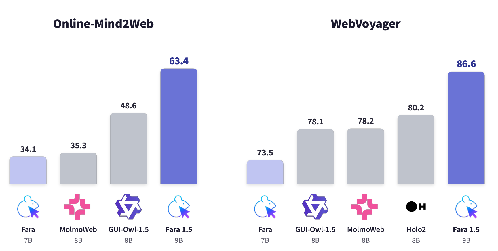
*Figure 1. Task success rate on Online-Mind2Web and WebVoyager for similarly sized CUA models. Fara1.5-9B reaches 63.4% and 86.6% respectively, setting a new state of the art for the 8–9B class on both.*

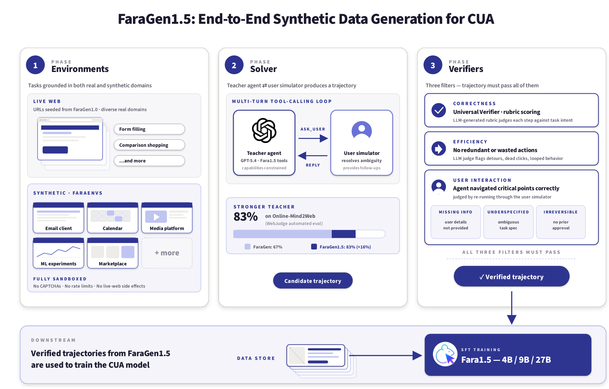
*Figure 2. The FaraGen1.5 pipeline: environments (live web + six sandboxed FaraEnvs), a GPT-5.4 solver cooperating with a user simulator, and three independent verifiers that a trajectory must all pass before entering SFT.*

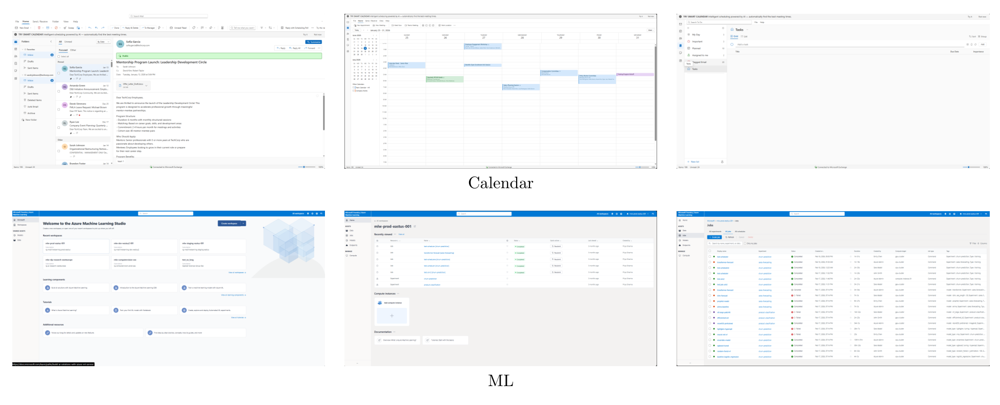
*Figure 3. Sample FaraEnvs for the Calendar and ML Management environments, populated with realistic generated data.*

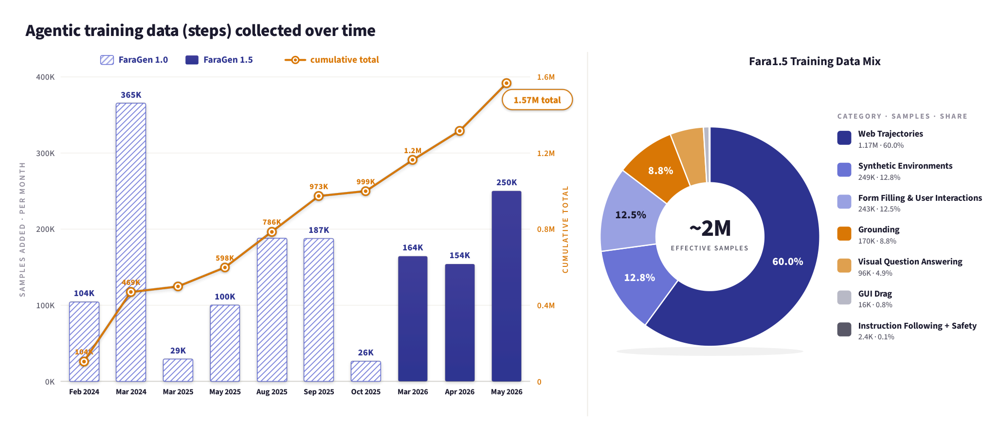
*Figure 4. (Left) Trajectory steps collected per month by FaraGen and FaraGen1.5, reaching 1.57M cumulative by May 2026. (Right) Final training mix: 60.0% web trajectories, 12.8% synthetic environments, 12.5% form filling and user interactions, 8.8% grounding, 4.9% VQA, 0.8% GUI drag, 0.1% instruction following and safety.*

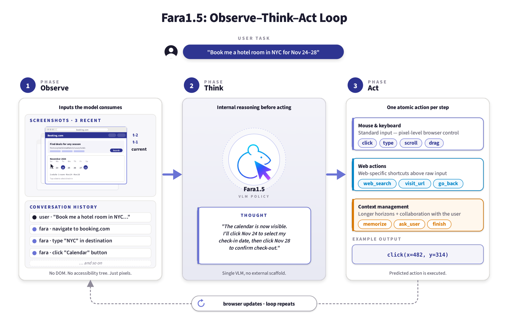
*Figure 5. One step of the observe-think-act loop. The model sees up to three recent screenshots plus conversation history — no DOM, no accessibility tree — reasons internally, and emits one atomic action.*

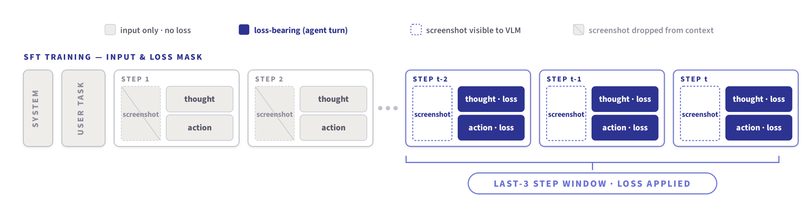
*Figure 6. SFT input and loss mask. The model conditions on full conversation history but consumes screenshots only from the three most recent steps; cross-entropy loss applies to the thought and action tokens of those steps.*

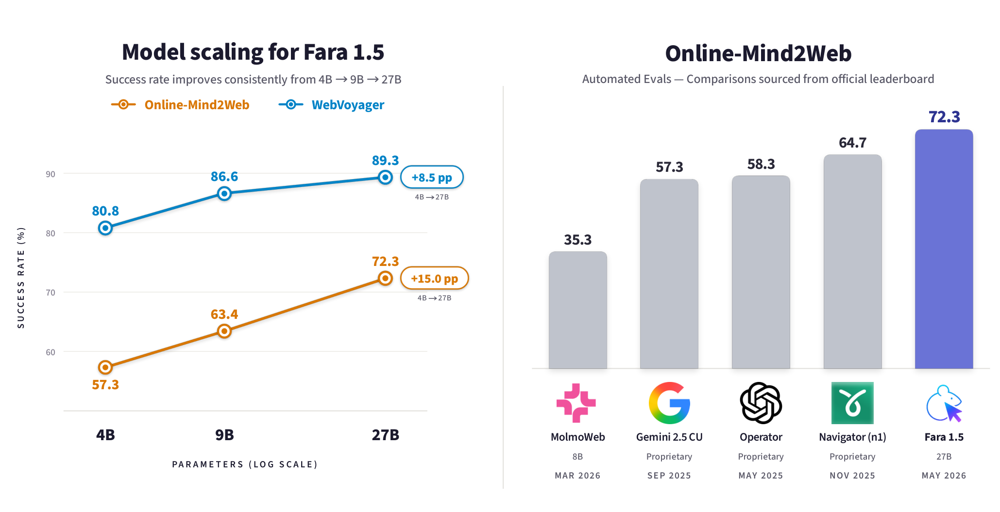
*Figure 7. (Left) Success rate versus model size, improving monotonically from 4B to 27B (+8.5 on WebVoyager, +15.0 on Online-Mind2Web). (Right) Fara1.5-27B against larger proprietary CUAs on Online-Mind2Web.*

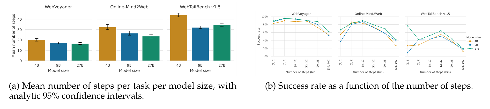
*Figure 8. (a) Mean steps per task by model size with 95% confidence intervals. (b) Success rate as a function of trajectory length — success declines consistently as trajectories get longer, most sharply on the harder benchmarks.*

**Tables:**

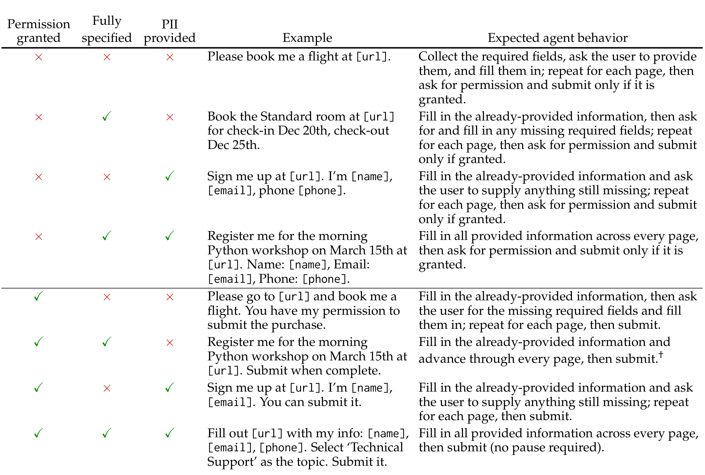
*Table 1. The eight critical-point types, one per combination of permission granted, task fully specified, and PII provided, with the expected agent behavior for each.*

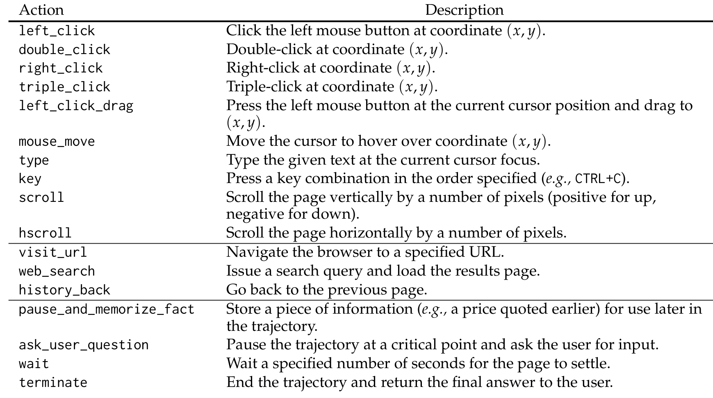
*Table 2. The Fara1.5 action space: pointer and keyboard actions, browser navigation, and the three meta-actions (memorize fact, ask user, terminate).*

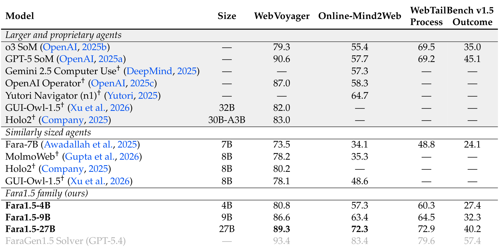
*Table 3. Task success rate (%) on WebVoyager, Online-Mind2Web, and WebTailBench v1.5. The GPT-5.4 solver row is an upper-bound reference for the SFT distillation; † marks numbers taken from official releases or leaderboards.*

*Table 4. Held-out task success on the six FaraEnvs. Fara-7B, trained only on open-internet data, averages 18.8; Fara1.5-9B reaches 71.8 against the solver's 79.4.*

*Table 5. Synthetic-to-real transfer on four WebVoyager domains. Training on trajectories from sandboxed replicas lifts combined live-site success from 73.4 to 83.4.*

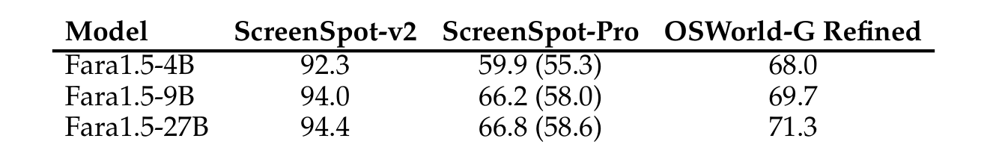
*Table 6. Grounding accuracy on ScreenSpot-v2, ScreenSpot-Pro (without zoom in parentheses), and OSWorld-G Refined.*
