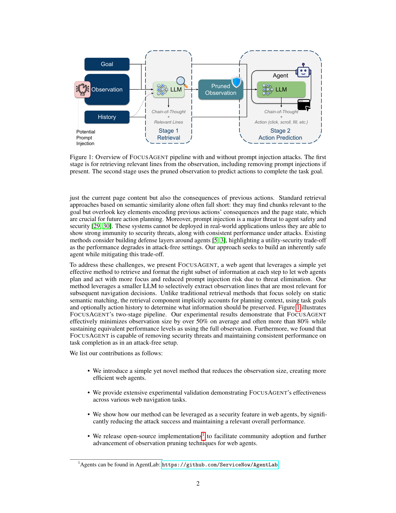
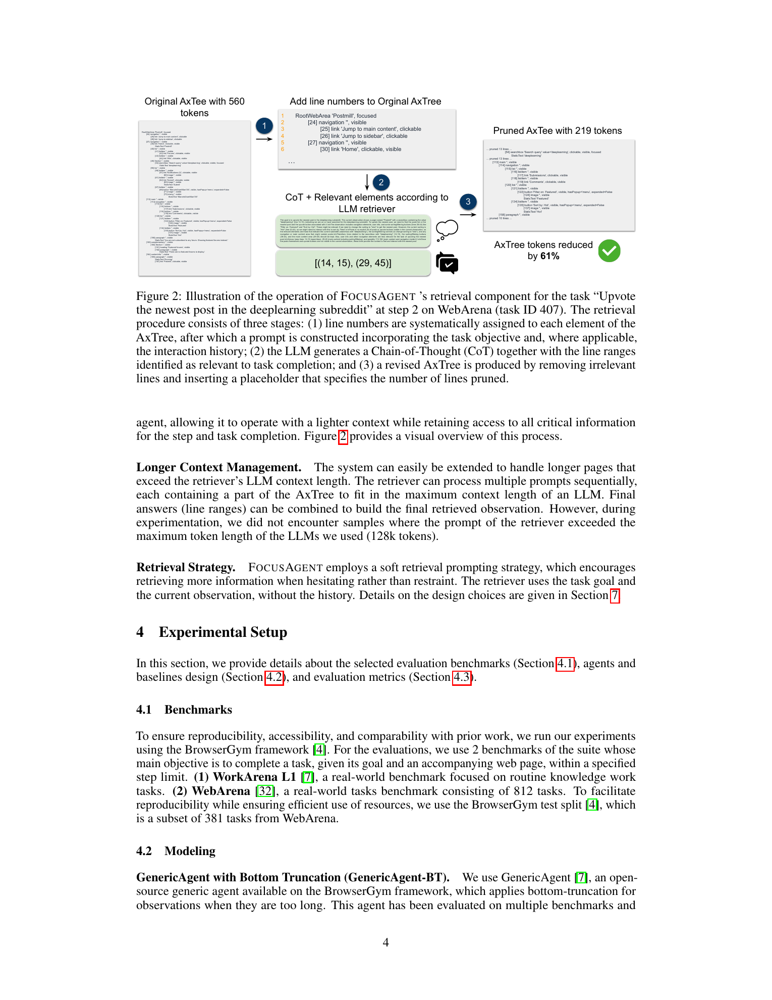
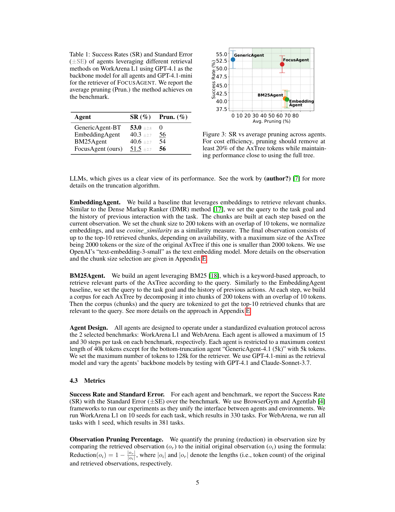
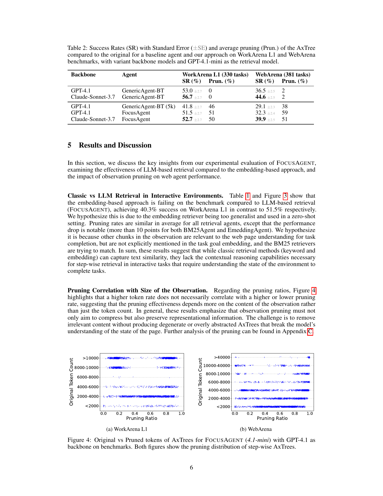
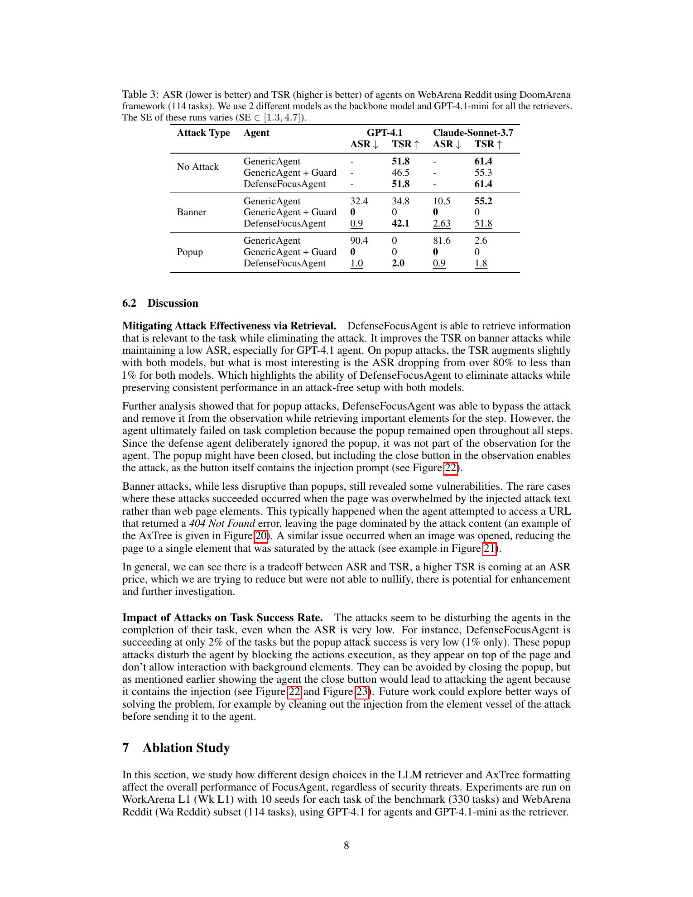

# FocusAgent: Simple Yet Effective Ways of Trimming the Large Context of Web Agents

## TL;DR

FocusAgent is a two-stage web-agent wrapper that uses a lightweight LLM retriever to trim accessibility-tree observations before the main agent acts. The retriever receives the task goal and numbered AxTree lines, returns relevant line ranges, and the system builds a pruned observation for the action-prediction model. On WorkArena L1 and WebArena, FocusAgent keeps success rates near full-context agents while pruning about half the observation tokens, and its DefenseFocusAgent variant sharply reduces prompt-injection attack success on WebArena Reddit.

Source: [arXiv:2510.03204](https://arxiv.org/abs/2510.03204), [PDF](https://arxiv.org/pdf/2510.03204.pdf), [code](https://github.com/ServiceNow/AgentLab)

## Background

Web agents often use accessibility trees because they are much smaller than raw DOMs and expose interactive roles, names, and states. Even so, real web applications can produce AxTrees with tens of thousands of tokens. Passing all of that text to an LLM raises latency and cost, and it also gives malicious page content more room to inject instructions into the agent's observation.

Simple truncation is cheap but brittle: the useful element may be near the bottom of the observation. Classic retrieval methods such as BM25 or embeddings are also imperfect because web-agent observations are not static documents. The relevant content depends on the current goal, current page state, and what the agent needs to do next.

## Problem

The paper targets observation overload for browser agents. At each step, an agent sees a task goal \(g\), an observation \(o_i\), and possibly previous actions. The system needs a smaller observation \(o_r\) that preserves task-relevant state:

\[
o_r = \text{Retrieve}(g, o_i), \quad |o_r| \ll |o_i|.
\]

The reduction metric is:

\[
\text{Reduction}(o_i) = 1 - \frac{|o_r|}{|o_i|}.
\]

The hard part is not just compression. The pruned observation must still contain enough page structure for the downstream agent to choose correct actions, and it should remove prompt-injection text when possible.

## Method

FocusAgent inserts a retrieval stage before action prediction.

First, the current AxTree is line-numbered. A lightweight LLM retriever receives the task goal and the numbered observation. The authors also test using action history, but the main setting uses the current task and current observation without history. The retriever outputs line ranges that appear useful for task completion.

Second, post-processing reconstructs a pruned AxTree. Irrelevant lines are removed and replaced with placeholders that record how many lines were pruned. This keeps the result closer to a coherent tree than a bag of retrieved chunks.

Third, the main web agent receives the pruned observation and predicts the next browser action, such as click, scroll, fill, or task completion.

The core pipeline can be summarized as:

\[
(g, o_i) \rightarrow \text{LLM retriever} \rightarrow o_r \rightarrow \text{agent LLM} \rightarrow a_t.
\]

For long contexts, the authors note that the retriever could process AxTree chunks sequentially and merge line ranges, although their experiments did not exceed the 128k-token context of the retriever models used.

The security variant, DefenseFocusAgent, adds an attack-warning instruction to the retrieval prompt. The intent is to remove malicious content from the observation before the main agent sees it, instead of using a guard that simply stops the workflow.

## Experiments

The evaluation uses BrowserGym and AgentLab on two benchmarks:

- WorkArena L1: 330 tasks from 10 seeds per task, with a 15-step limit.
- WebArena: 381 BrowserGym test-split tasks, with a 30-step limit.

The main agent backbones are GPT-4.1 and Claude Sonnet 3.7. The retriever is GPT-4.1-mini. Baselines include GenericAgent with bottom truncation, EmbeddingAgent using `text-embedding-3-small`, and BM25Agent.

On WorkArena L1 with GPT-4.1 as the backbone, FocusAgent reaches 51.5% success with 56% average pruning. GenericAgent-BT reaches 53.0% with no pruning, while EmbeddingAgent and BM25Agent reach 40.3% and 40.6% with similar pruning. This supports the paper's claim that task-conditioned LLM retrieval works better than generic text similarity for interactive web observations.

Across WorkArena L1 and WebArena, the full comparison is:

- GPT-4.1 GenericAgent-BT: 53.0% WorkArena L1, 36.5% WebArena.
- GPT-4.1 FocusAgent: 51.5% WorkArena L1 with 51% pruning, 32.3% WebArena with 59% pruning.
- Claude Sonnet 3.7 GenericAgent-BT: 56.7% WorkArena L1, 44.6% WebArena.
- Claude Sonnet 3.7 FocusAgent: 52.7% WorkArena L1 with 50% pruning, 39.9% WebArena with 51% pruning.

The security experiments use DoomArena attacks on WebArena Reddit with 114 tasks. Under banner attacks, DefenseFocusAgent reduces attack success to 0.9% for GPT-4.1 and 2.63% for Claude Sonnet 3.7, while maintaining task success rates of 42.1% and 51.8%. Under popup attacks, attack success drops from 90.4% to 1.0% for GPT-4.1 and from 81.6% to 0.9% for Claude Sonnet 3.7, but task success remains very low because the popup still blocks page interaction.

The ablations show that soft retrieval prompting works best. Aggressive retrieval prunes more, but it hurts WebArena performance. Adding history to the retriever also hurts in their setup, likely because the smaller retriever is distracted by the agent's previous chain-of-thought.

## Critical Analysis

The main strength is the simplicity of the interface. FocusAgent does not require retraining the main agent, changing browser actions, or building a custom DOM parser. It treats observation pruning as a modular preprocessing step, which makes it easy to compare against truncation, BM25, and embeddings.

The second strength is the security framing. Prompt injection is partly an observation-selection problem: if the malicious text is never passed to the action model, it cannot directly steer the action model. DefenseFocusAgent's popup results also clarify the boundary of this idea. Removing malicious text is not enough when the malicious UI element still physically blocks the task.

The main limitation is the extra model call. A small retriever can save downstream context cost, but it adds its own latency, cost, and failure mode. The paper discusses cost efficiency, but production usefulness will depend on the ratio between retriever cost and saved action-model context.

A second limitation is prompt sensitivity. The ablations show that soft, neutral, aggressive, and history-augmented prompts produce meaningfully different outcomes. That makes FocusAgent practical, but not fully automatic: the retriever prompt and output format become part of the agent's reliability surface.

Finally, the method depends on the accessibility tree being a faithful operational view. If the AxTree omits visually important cues, modal state, canvas content, or hidden-but-relevant controls, FocusAgent can only prune what it sees.

## Implementation Notes

For builders, FocusAgent suggests a clean wrapper pattern:

1. Number every AxTree line before retrieval.
2. Ask a cheap model for relevant line ranges, not rewritten page summaries.
3. Reconstruct a pruned AxTree with explicit placeholders for removed spans.
4. Feed the pruned tree to the normal agent loop.
5. Track both task success and pruning percentage.

The range-output design is important. It keeps the retriever from hallucinating page content and lets the runtime deterministically map selected lines back to the original observation.

For security-sensitive agents, retrieval should be evaluated with both task success and attack success:

\[
(\text{TSR}, \text{ASR}) =
(\text{task success rate}, \text{attack success rate}).
\]

A useful defense should move ASR down without collapsing TSR. FocusAgent does that for banner attacks, but popup attacks show that observation sanitization needs to be paired with UI-level recovery policies such as close-popup actions or safe modal handling.

## Captured Figures and Tables

