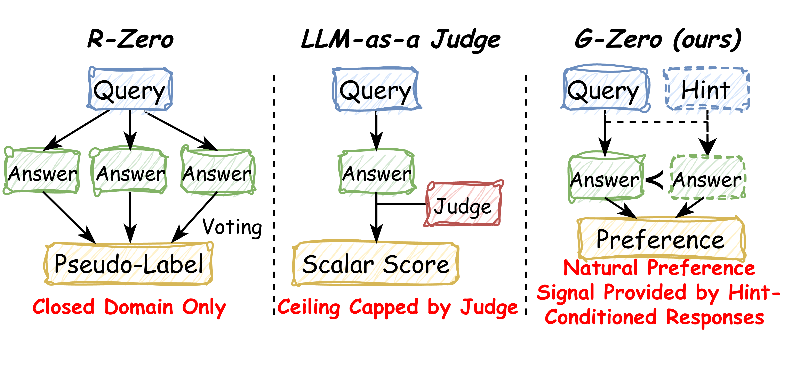
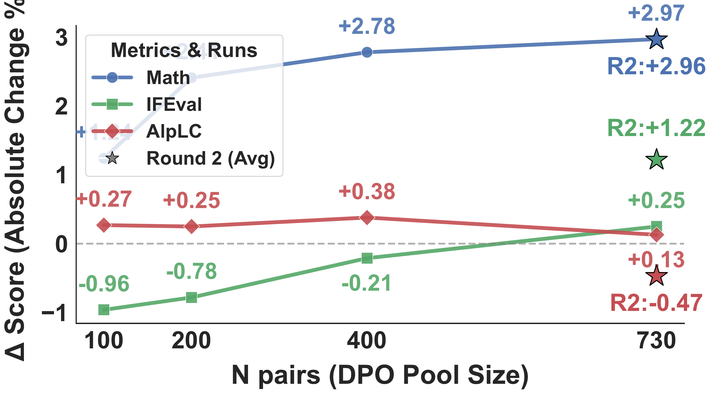
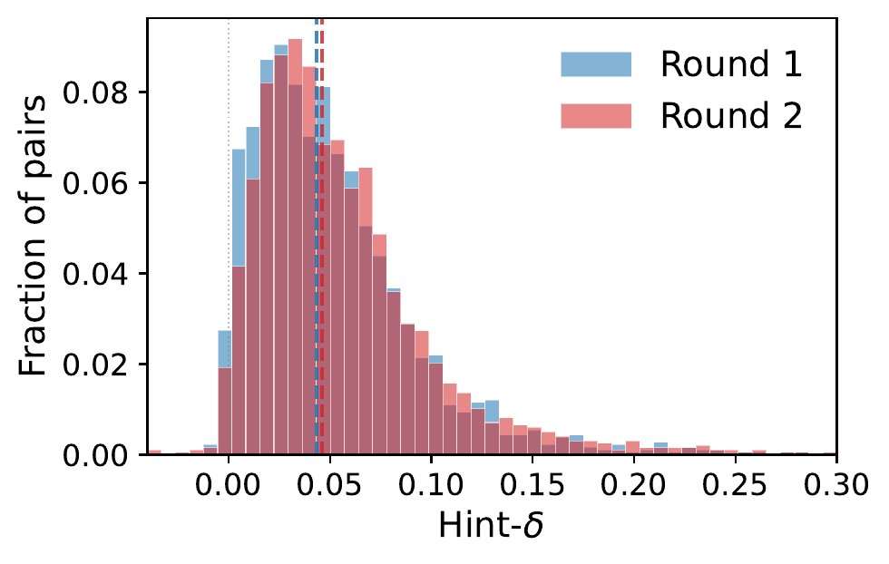
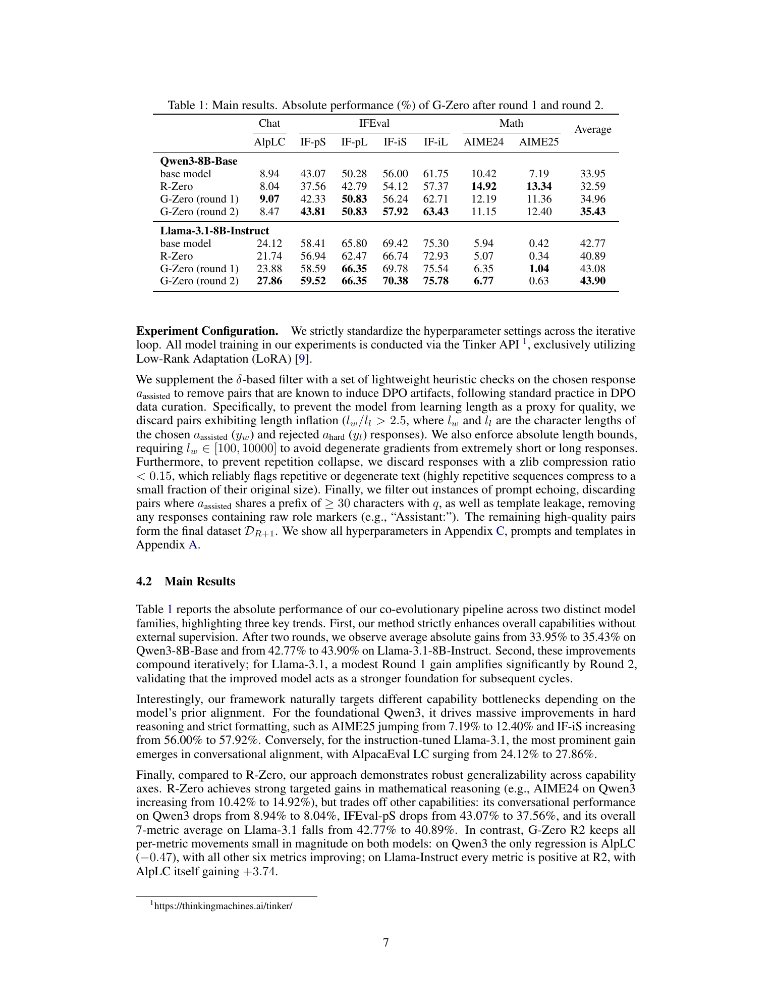
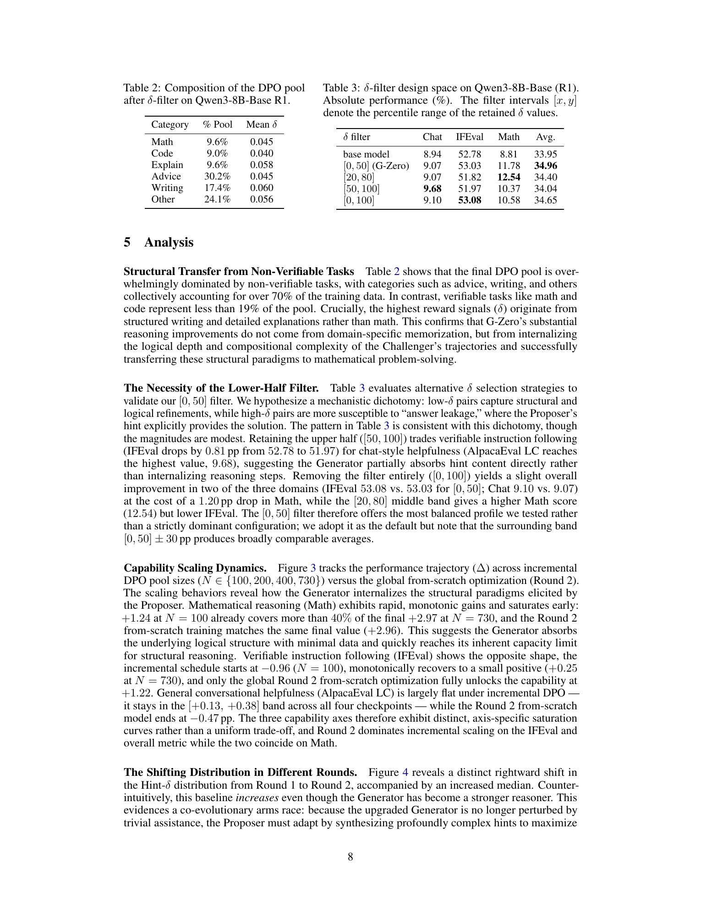
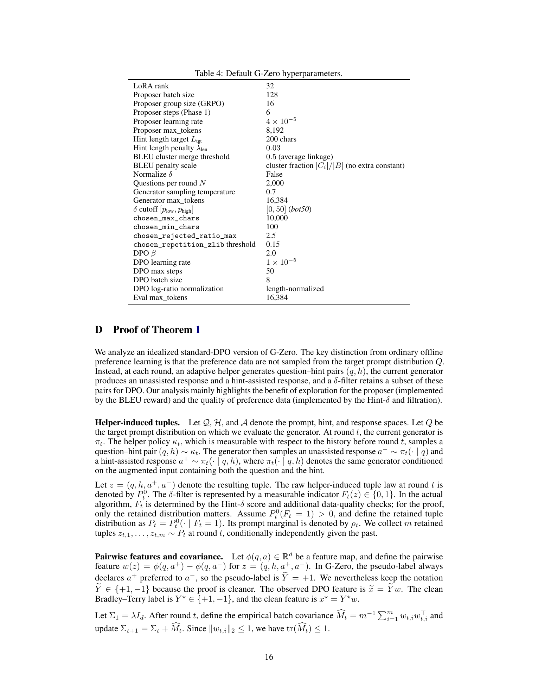

# G-Zero: Self-Play for Open-Ended Generation from Zero Data

## TL;DR
G-Zero extends the R-Zero co-evolution paradigm to open-ended, unverifiable domains. Instead of external verifiers or LLM judges, it uses Hint-$\delta$, an intrinsic reward measuring how much a hint shifts the Generator's own predictive distribution. The Proposer (GRPO) generates challenging query-hint pairs; the Generator (DPO) internalizes these improvements.

## Background
Self-evolving LLMs excel in verifiable domains (math, code) where programmatic oracles provide ground truth. For open-ended tasks (instruction-following, dialogue, creative writing), existing methods rely on LLM-as-a-judge, which introduces two critical problems: (1) the model's ceiling is bottlenecked by the judge's capability, and (2) the model learns to exploit the judge's stylistic vulnerabilities (reward hacking). The prior R-Zero framework still requires majority-vote verifiability, limiting it to closed-domain tasks.

## Problem
**How can LLMs self-evolve in open-ended, unverifiable domains without external verifiers or proxy judges, while avoiding capability bottlenecks and reward hacking?**

## Method
G-Zero introduces **Hint-$\delta$**, an intrinsic reward that measures the per-token mean log-likelihood shift the Generator's hint-conditioned response produces on its own unassisted distribution:

$$\delta(q, h, a_{\text{hard}}) = \frac{1}{T} \sum_{t=1}^T \left[ \log \pi_G(a_t \mid q, a_{<t}) - \log \pi_G(a_t \mid q, h, a_{<t}) \right]$$

Two models co-evolve iteratively:

1. **Proposer** ($\pi_P$) — trained via GRPO to maximize Hint-$\delta$ (plus length/BLEU penalties), generating challenging query-hint pairs that target the Generator's blind spots.

2. **Generator** ($\pi_G$) — trained via length-normalized DPO on a curated preference dataset ($\delta$ lower half retained), favoring hint-assisted responses over unassisted baselines.

A theoretical best-iterate suboptimality guarantee is proven for an idealized DPO variant under sufficient coverage and low pseudo-label noise.

## Experiments
- **Models**: Qwen3-8B-Base, Llama-3.1-8B-Instruct
- **Benchmarks**: AlpacaEval 2.0 (LC), IFEval (4 metrics), AIME 2024/2025
- **Key results**:
  - Qwen3-8B-Base: 33.95% → 35.43% avg (+1.48), AIME25: 7.19 → 12.40
  - Llama-3.1-8B-Instruct: 42.77% → 43.90% avg (+1.13), AlpacaLC: 24.12 → 27.86
  - R-Zero comparison: R-Zero trades off capabilities (chat drops from 8.94→8.04, IFEval-pS 43.07→37.56), while G-Zero improves 6/7 metrics on Qwen3

## Critical Analysis
**Strengths:**
- **Verifier-free**: Truly eliminates the need for external judges or oracles — the first zero-data framework for open-ended domains
- **Clean theoretical grounding**: Best-iterate guarantee connecting coverage (Proposer exploration) and label noise ($\delta$ filtering) to final suboptimality
- **Empirically robust**: Gains on both open-ended (AlpacaEval, IFEval) and verifiable (AIME) without sacrificing other capabilities
- **Structural transfer**: Reasoning improvements come from internalizing logical depth, not domain-specific memorization ($>70\%$ of DPO pool is non-verifiable tasks)

**Weaknesses:**
- **Computational cost**: Two models, GRPO rollouts + DPO, plus Hint-$\delta$ computation requiring dual forward passes per sample
- **Delicate filtering**: The lower-half $\delta$ filter is crucial but the mechanism analysis (Tables 3) shows modest margins — the optimal strategy may be task-dependent
- **Modest absolute gains**: +1.48 avg on Qwen3 and +1.13 on Llama — improvements are real but not dramatic
- **LoRA-only training**: All experiments use LoRA (via Tinker API), leaving open questions about full fine-tuning scaling

## Implementation Notes
- LoRA-based training via Thinking Machines Tinker API
- GRPO without KL penalty for Proposer (following Liu et al. 2025)
- Length-normalized DPO to counter length bias
- Multi-stage filtering: $\delta$ lower-half, length ratio ($l_w/l_l < 2.5$), zlib ratio ($>0.15$), prompt echo removal, template leakage filter
- Code: https://github.com/Chengsong-Huang/G-Zero

## Captured Figures and Tables

