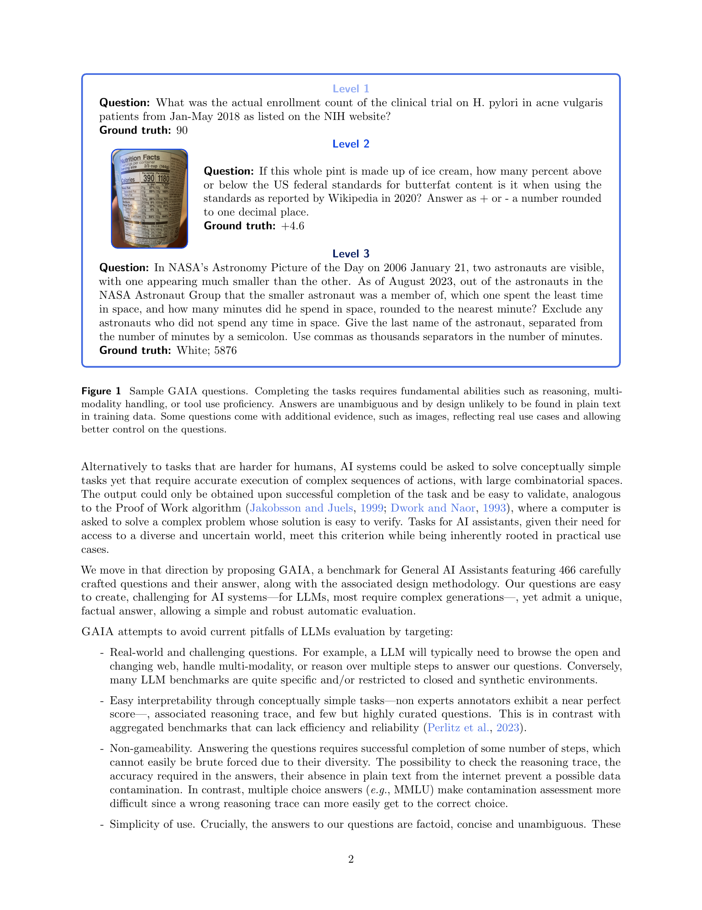
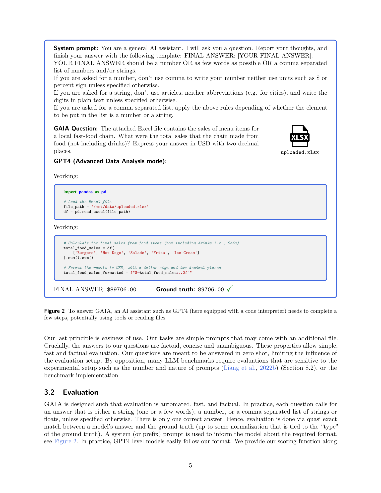
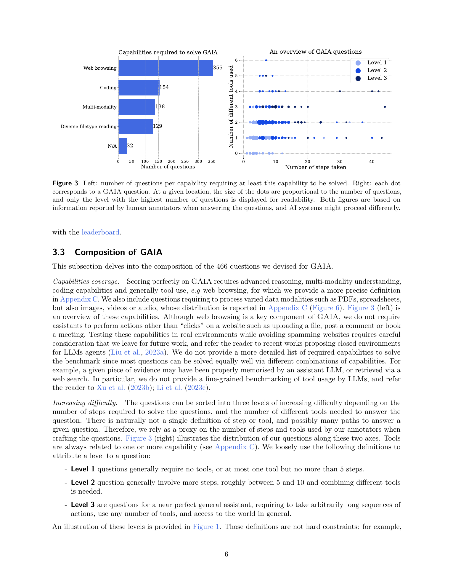
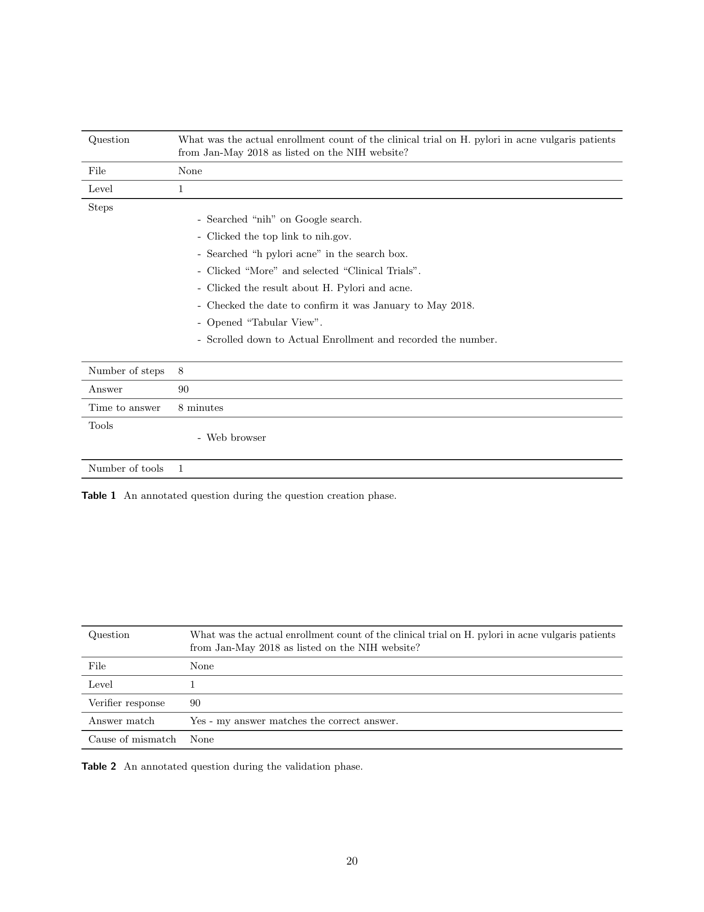
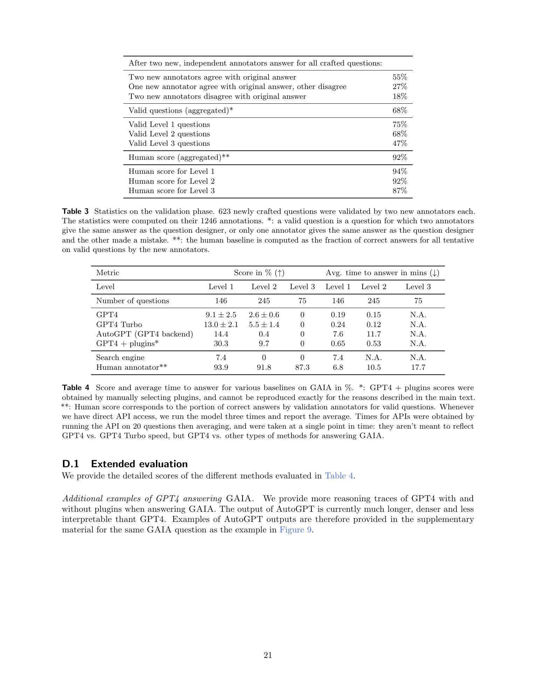

# GAIA: a benchmark for General AI Assistants

## TL;DR

GAIA is a benchmark for general AI assistants built around real-world, factoid questions that are easy for humans to understand but hard for current tool-using AI systems. The benchmark contains 466 human-designed questions spanning web browsing, coding, multimodal understanding, and diverse file reading. Its headline result is a large capability gap: human annotators score about 92 percent overall, while GPT-4 with manually selected plugins scores about 15 percent overall, with 0 percent on the hardest level. GAIA is valuable because it tests end-to-end assistant robustness, not just isolated knowledge, API calling, or multiple-choice reasoning.

Source: [arXiv:2311.12983](https://arxiv.org/abs/2311.12983), [PDF](https://arxiv.org/pdf/2311.12983.pdf). The reviewed manuscript is arXiv v1, submitted on 2023-11-21.

## Background

Many LLM benchmarks follow the same pattern: ask difficult exam-style questions, score multiple-choice or short text answers, and compare model accuracy against human experts. That pattern has become less informative as frontier models approach or exceed reported human baselines on benchmarks such as MMLU, GSM8K, and professional-domain exams.

GAIA takes the opposite route. Instead of asking questions that are intellectually difficult for humans, it asks questions that are conceptually simple but operationally demanding. A typical GAIA task may require searching the web, inspecting a spreadsheet, reading a PDF, doing a calculation, checking an image, or combining facts from several sources. A human can usually solve the task with ordinary tools, but an AI assistant must coordinate reasoning, tool use, evidence retrieval, and precise answer formatting.

This framing makes GAIA closer to an assistant benchmark than a language-understanding benchmark. The target is not whether a model knows a fact in its parameters, but whether a system can execute the chain of actions needed to obtain a concise, verifiable answer.

## Problem

The paper targets several weaknesses in existing LLM evaluation:

1. Static knowledge benchmarks saturate quickly and may suffer from contamination.
2. Open-ended generation benchmarks require expensive or biased human/model judgments.
3. Tool-use benchmarks often live in closed environments with prescribed APIs.
4. General assistants need to solve practical tasks over the messy real world, not just answer isolated text questions.

GAIA's benchmark objective can be written as exact-answer task success. For question \(q_i\), optional attached evidence \(e_i\), system output \(\hat{y}_i\), and gold answer \(y_i\), scoring is:

\[
\mathrm{score}(S) =
\frac{1}{N}\sum_{i=1}^{N}
\mathbf{1}\left[\operatorname{norm}(\hat{y}_i) = \operatorname{norm}(y_i)\right].
\]

The normalization handles answer type details such as strings, numbers, and comma-separated lists, but the answer itself is intentionally short and unambiguous. This makes evaluation automatic and factual, while still requiring substantial planning and tool execution to reach the answer.

## Method

GAIA consists of 466 questions designed and annotated by humans. The questions are text prompts, sometimes with an attached file such as a spreadsheet, image, audio file, PDF, CSV, PowerPoint, or archive. Each question has a single concise answer and metadata describing the tools, steps, and time used by annotators.

The benchmark has three difficulty levels. Level 1 questions generally require no tools or at most one tool and a short action sequence. Level 2 questions require more steps and often combine different tools. Level 3 questions are intended for near-perfect general assistants and may require long action chains, multiple tools, and broader access to the world.

The capability mix is broad. Based on annotator traces, the paper reports 355 questions requiring web browsing, 154 requiring coding, 138 requiring multimodality, 129 requiring diverse filetype reading, and 32 that can be solved without an external tool. These categories are not mutually exclusive because a single task may require, for example, web browsing plus image understanding.

Question creation is deliberately human-heavy. A question creator supplies the answer and metadata, then two independent annotators answer the question to validate that it is unambiguous. If the annotators disagree, the question is corrected or removed. The paper reports that 68 percent of newly crafted questions were valid after this process, and estimates roughly two hours of annotator time per final question including validation and repair.

Evaluation uses a simple zero-shot prompt asking the assistant to report thoughts and end with `FINAL ANSWER: ...`. The final answer should be a number, a short string, or a comma-separated list. This keeps the benchmark easy to run while still allowing the assistant to use tools, browse, inspect files, or execute code before answering.

## Experiments

The paper compares GPT-4, GPT-4 Turbo, AutoGPT with a GPT-4 backend, GPT-4 with manually selected plugins, a human-search baseline, and human annotators. The plugin result is explicitly an oracle-style estimate because the authors manually choose plugins for each task and the plugin ecosystem was unstable at the time.

The human baseline is high across all levels: 93.9 percent on Level 1, 91.8 percent on Level 2, and 87.3 percent on Level 3. Average human answer time rises with difficulty, from 6.8 minutes to 10.5 minutes to 17.7 minutes.

Current AI assistants are far behind. GPT-4 scores 9.1 percent on Level 1, 2.6 percent on Level 2, and 0 percent on Level 3. GPT-4 Turbo improves to 13.0 percent, 5.5 percent, and 0 percent. AutoGPT reaches 14.4 percent on Level 1 but only 0.4 percent on Level 2 and 0 percent on Level 3. GPT-4 with manually selected plugins is strongest among the AI systems, scoring 30.3 percent on Level 1, 9.7 percent on Level 2, and 0 percent on Level 3.

Weighted over the dataset distribution of 146 Level 1, 245 Level 2, and 75 Level 3 questions, GPT-4 with plugins is roughly the 15 percent result highlighted in the abstract, while humans are roughly 92 percent. This large gap is the central empirical claim: models that look strong on many exam-style benchmarks still fail when they must autonomously gather evidence and execute multi-step real-world workflows.

The search-engine baseline is also informative. A human typing the question into a search engine scores 7.4 percent on Level 1 and 0 percent on Levels 2 and 3. This supports the authors' claim that GAIA answers are not usually available as plain text snippets; the tasks require synthesis or transformation, not just retrieval.

## Critical Analysis

GAIA's strongest design choice is the combination of real-world task solving and exact, concise answers. It avoids the subjectivity of open-ended generation evaluation while still testing a system-level behavior that simple question answering benchmarks miss.

The benchmark also makes a useful philosophical point: a task can be easy for humans and still be a strong test of AI generality. Many practical assistant failures happen not because the task is mathematically deep, but because the system loses track of evidence, chooses the wrong tool, misreads a file, fails to browse, or outputs an answer in the wrong format.

The main limitation is time sensitivity. GAIA depends heavily on web-accessible evidence, and web pages can change, disappear, block automated access, or become easier to find as benchmark discussion spreads. The authors mitigate this by choosing stable sources and validating questions carefully, but the benchmark still needs ongoing maintenance.

The results are also difficult to reproduce exactly for tool-augmented closed systems. The reported GPT-4 plugins score used manually selected plugins, and those plugins could change or disappear. This makes the result useful as a snapshot of potential tool-augmented performance, but not as a stable benchmark number.

Another limitation is that GAIA only scores the final answer. It does not evaluate whether the assistant used trustworthy sources, followed a safe process, or reached the answer for the right reason. For leaderboard scoring that is a practical tradeoff; for product evaluation, the trace matters.

Finally, GAIA is linguistically and culturally narrow. The questions are in standard English and often rely on English-language web content. Solving GAIA would be a strong assistant milestone, but not proof of global assistant usefulness across languages, cultures, local institutions, or non-English web ecosystems.

## Implementation Notes

For agent builders, GAIA suggests logging the full execution trace, even though the official score uses only the final answer. Useful trace fields include search queries, visited URLs, files opened, tool calls, code execution, intermediate extracted facts, final normalization, and whether the model explicitly cited evidence.

A practical GAIA runner should separate three layers:

1. Task execution: tools, browsing, code, file inspection, and multimodal processing.
2. Answer extraction: force a stable final answer format such as `FINAL ANSWER: ...`.
3. Scoring: normalize and compare against the gold answer by type.

The benchmark's strictness means that partial progress gets no credit:

\[
\mathbf{1}[\hat{y} = y] =
\begin{cases}
1 & \text{if the normalized final answer matches exactly}, \\
0 & \text{otherwise.}
\end{cases}
\]

That is appropriate for leaderboards, but internal development should add diagnostics. Track failures by source: planning error, search failure, inaccessible webpage, file parsing failure, multimodal error, calculation error, answer-format error, and stale evidence. Otherwise a single aggregate accuracy hides the engineering work needed to improve the assistant.

For future benchmark maintenance, the important operational task is versioning. GAIA-like tasks should store source URLs, access dates, archived snapshots where legally appropriate, file hashes for attachments, answer-normalization rules, and validation notes. Without that, exact-answer real-world benchmarks decay quickly.

## Captured Figures and Tables

