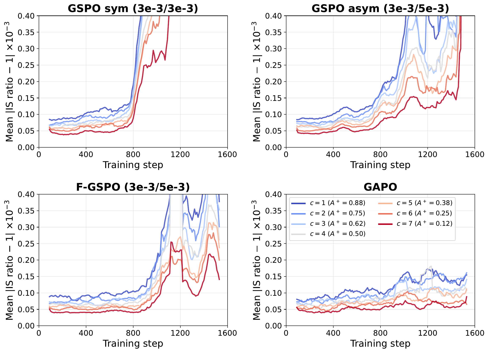
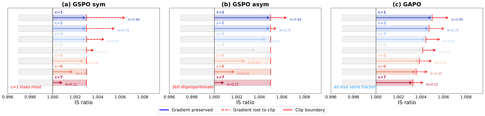
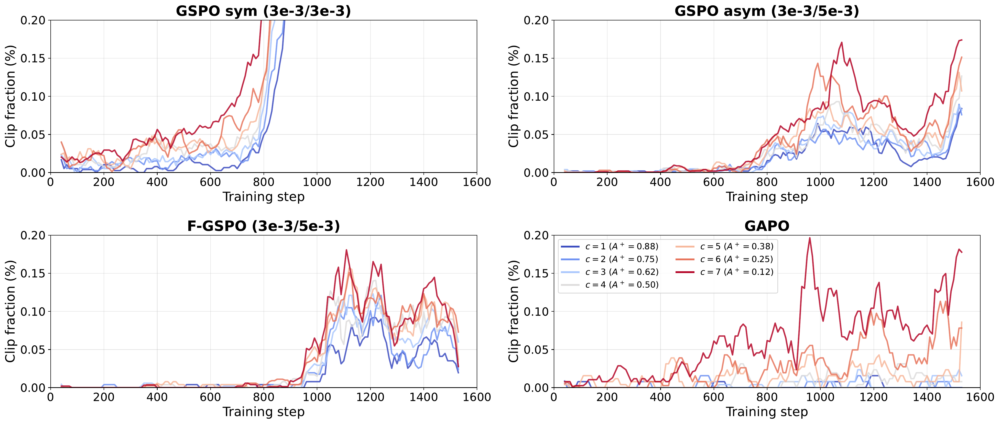
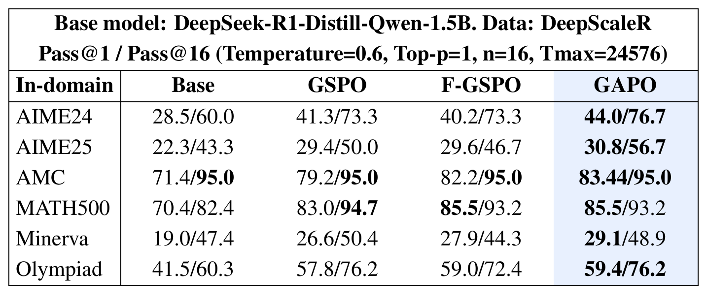
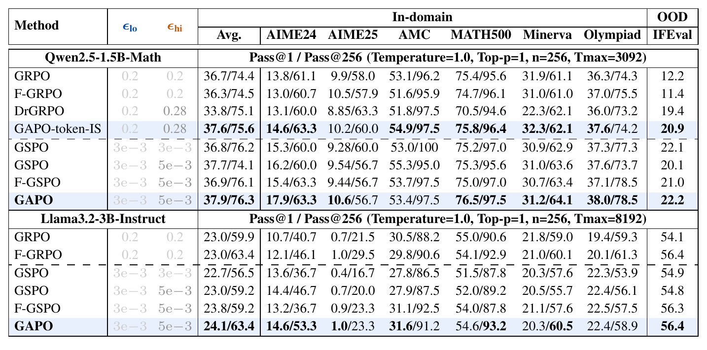

# Group Adaptive Clipping Policy Optimization

## TL;DR

GAPO is a one-line change to PPO/GSPO-style RLVR: instead of a single fixed upper clip \(\epsilon_{hi}\) for every rollout, the upper clip is scaled by the rollout's advantage, which in binary-reward group-relative training reduces to a closed-form schedule indexed by the number of correct rollouts \(c\) in the group. The motivation is a reverse-KL trust-region argument showing that the optimal importance-sampling ratio grows with advantage, so scarce correct rollouts on hard prompts deserve more update headroom than abundant correct rollouts on easy ones. Across Qwen2.5-Math-1.5B, Llama-3.2-3B-Instruct, and DeepSeek-R1-Distill-Qwen-1.5B, GAPO improves pass@1 without sacrificing pass@k, with the largest gains on AIME24/25, and it keeps the IS-ratio-to-advantage correlation high through late training where fixed clipping collapses it.

Source: [arXiv:2609.00444](https://arxiv.org/abs/2609.00444), [PDF](https://arxiv.org/pdf/2609.00444.pdf), [Code](https://github.com/Sheng-J/GAPO)

## Background

Reinforcement learning with verifiable rewards (RLVR) post-trains a language model with PPO-style clipped surrogate objectives on tasks that have an automatic 0/1 verifier, typically math and code. Group-relative methods such as GRPO, DAPO, and GSPO sample \(k\) rollouts per prompt and compute each rollout's advantage relative to the group mean. With binary rewards and no std normalisation, a correct rollout in a group with \(c\) correct answers gets

\[
A_i = r_i - \bar r = 1 - \frac{c}{k} = \frac{k-c}{k}.
\]

So the advantage spectrum is discrete and tied directly to prompt difficulty: a lone correct rollout (\(c=1\)) gets \((k-1)/k\), while a correct rollout on an easy prompt (\(c=k-1\)) gets \(1/k\).

PPO's clipping approximates a trust region by zeroing the gradient once the importance-sampling (IS) ratio \(\rho_i = \pi_\theta(y_i|x)/\pi_{\theta_{old}}(y_i|x)\) leaves \([1-\epsilon_{lo}, 1+\epsilon_{hi}]\). DAPO's "clip-higher" widens \(\epsilon_{hi}\) uniformly to help exploration; GSPO replaces the token-level ratio with a sequence-level geometric mean and uses tiny clip widths on the order of \(10^{-3}\). In every one of these methods the boundary is the same for every rollout regardless of its advantage.

## Problem

The paper's empirical observation (Figure 1 and Figure 3) is that before clipping activates, the IS ratio grows roughly in proportion to advantage: rollouts from low-\(c\) groups drift away from \(\pi_{\theta_{old}}\) faster than rollouts from high-\(c\) groups. Once clipping starts firing, a uniform boundary truncates both at comparable token fractions. The result is a mismatch in learning signal: the rare correct rollouts on hard prompts, which are exactly the ones that push the model to solve new problems, are the first to hit the clip and are suppressed disproportionately, while redundant correct rollouts on easy prompts keep their full headroom.

Widening \(\epsilon_{hi}\) uniformly, as DAPO does, does not fix this because the problem is not the absolute width but the *relative* width across different levels of group success. Advantage-shaping methods such as F-GRPO change the objective itself and can drift away from pass@1, which is the deployment metric. The paper wants an exploration mechanism that leaves the surrogate untouched.

## Method

### Per-prompt reverse-KL trust region

Following Chen et al. (2018), the paper considers the constrained problem at a single prompt \(x\):

\[
\max_\theta \; \hat{\mathbb{E}}_i[\rho_i A_i]
\quad \text{s.t.} \quad
\hat{\mathbb{E}}_i\big[D_{KL}(\pi_\theta(\cdot|x)\,\|\,\pi_{\theta_{old}}(\cdot|x))\big] \le \delta .
\]

The reverse direction is used instead of the forward KL in the Schulman et al. (2015) bound; by symmetry of total variation and Pinsker's inequality, either direction gives the same monotonic-improvement guarantee. The Lagrangian

\[
\mathcal{L}_x = \sum_y \pi_\theta(y|x) A(x,y) - \lambda D_{KL}(\pi_\theta(\cdot|x)\,\|\,\pi_{\theta_{old}}(\cdot|x))
\]

has the stationary point \(\pi_\theta^*(y|x) \propto \pi_{\theta_{old}}(y|x)\exp(A(x,y)/\lambda)\), so the trust-region-optimal IS ratio for rollout \(i\) is

\[
\rho_i^* = \frac{\pi_\theta^*(y_i|x)}{\pi_{\theta_{old}}(y_i|x)} \propto \exp(A_i/\lambda).
\]

Pushing \(\rho_i\) past \(\rho_i^*\) either violates the trust region or over-allocates probability to \(y_i\) at the expense of other responses. This is the justification for clipping *at* \(\rho_i^*\):

\[
\epsilon_{hi}(i) \ge \rho_i^* - 1 = \exp(A_i/\lambda) - 1 .
\]

Because GSPO clip widths are around \(10^{-3}\), \(\lambda \sim A_{max}/10^{-3} \gg A_{max}\), so the linearisation \(\exp(A_i/\lambda) \approx 1 + A_i/\lambda\) is essentially exact at the sequence-IS level and gives \(\epsilon_{hi}(i) \approx A_i/\lambda = (k-c_i)/(k\lambda)\). At the token-IS scale (\(\epsilon_{hi}^{max}=0.28\)) the linearisation is conservative, preserves the ordering in \(c\), and keeps the relative error bounded at 2–13%.

### The GAPO clip schedule

Normalising so that the clip interpolates between \(\epsilon_{lo}\) (for \(c=k\)) and \(\epsilon_{hi}^{max}\) (for \(c=1\)) yields the adaptive upper clip:

\[
\epsilon_{hi}(c) = \epsilon_{lo} + (\epsilon_{hi}^{max} - \epsilon_{lo}) \cdot \frac{k-c}{k-1}.
\]

Incorrect rollouts always use \(\epsilon_{lo}\), since the upper clip is irrelevant for negative advantage, and \(\epsilon_{lo}\) is held fixed. The full objective on top of GSPO's sequence-level ratio \(s_i(\theta) = \big(\pi_\theta(y_i|x)/\pi_{\theta_{old}}(y_i|x)\big)^{1/|y_i|}\) is

\[
\mathcal{L}_{GAPO} = \mathbb{E}\Big[\max\big(-A_i\, s_i(\theta),\; -A_i\, \mathrm{clip}(s_i(\theta),\, 1-\epsilon_{lo},\, 1+\epsilon_{hi}(c_i))\big)\Big].
\]

Nothing else changes: same surrogate, same advantage, no reward shaping, no new hyperparameters beyond the clip range already present. The paper deliberately reuses existing \((\epsilon_{lo}, \epsilon_{hi}^{max})\) pairs tuned for fixed clipping.

## Experiments

**Setup.** Three base models: Qwen2.5-Math-1.5B (math-pretrained), Llama-3.2-3B-Instruct (general instruction-tuned), and DeepSeek-R1-Distill-Qwen-1.5B (reasoning-distilled). Math runs use DeepScaleR (39,202 prompts); code runs follow the DeepCoder recipe with 24,269 prompts. Group size \(k=8\), rollout batch 256 prompts, mini-batch 64, learning rate \(10^{-6}\), no KL or entropy terms, no advantage std-normalisation (following Dr.GRPO). Sequence-IS clip ranges are (3e-3, 5e-3) for the Qwen/Llama runs and (7e-5, 3e-4) for the distilled model; token-IS uses (0.2, 0.28). Training used 8×H200 with verl. Main tables are single-seed; a 3-seed significance study is in the appendix.

**Baselines.** GRPO, Dr.GRPO, GSPO with symmetric (3e-3/3e-3) and asymmetric (3e-3/5e-3) clipping, and the focal advantage-shaping variants F-GRPO / F-GSPO which reweight \(\tilde A_i = (1-c/k)^\gamma A_i\). The symmetric GSPO baseline is included specifically to show the gain is not from clipping tighter on average but from the relative difference in clip width across \(c\).

**Training dynamics (Qwen2.5-Math-1.5B).** Under fixed clipping, per-\(c\) token clip fractions are comparable across \(c\); under GAPO, high-\(c\) rollouts are clipped more and low-\(c\) rollouts less (Figure 3). The windowed Pearson correlation between per-\(c\) IS deviation and advantage stays above 0.8 for GAPO in late training, while all fixed-clip baselines degrade toward negative correlation once clipping starts firing around step 600 (Figure 5). Validation pass@256 on AIME24 collapses after step ~1000 for symmetric GSPO and degrades for the other baselines, while GAPO holds it (Figure 4). A checkpoint intervention (switching GSPO-asym to GAPO at step 600) reproduces the same divergence, ruling out pre-clipping factors as the cause.

**Benchmarks.** On Qwen2.5-Math-1.5B, GAPO reaches the best average pass@1/pass@256 (37.9/76.3) and the best AIME24 pass@1 (17.9 vs 16.2 for asymmetric GSPO and 15.4 for F-GSPO). The token-IS variant beats GRPO, F-GRPO, and Dr.GRPO on average and on IFEval (20.9 vs 11.4–19.4). On Llama-3.2-3B-Instruct GAPO again leads on average (24.1/63.4) and on AIME24 pass@1 (14.6 vs 10.7–14.4). On DeepSeek-R1-Distill-Qwen-1.5B with 24k-token rollouts, GAPO leads or ties pass@1 on all six math benchmarks, with +2.7/+3.4 on AIME24 and +1.4/+6.7 on AIME25 over GSPO. On code, GAPO on top of the reproduced DeepCoder-1.5B recipe improves LiveCodeBench v5 from 22.4 to 24.8 and HumanEval+ from 68.2 to 71.7.

**Significance and ablations.** Over three seeds, GAPO's pass@1 gains are significant (Welch's t-test) on at least three of six benchmarks against every baseline; the AIME24 gain over asymmetric GSPO is +1.72 at p<0.001. The one consistent regression is AMC pass@1 against asymmetric GSPO. Sequence-IS GAPO beats token-IS GAPO (AIME24 17.9 vs 14.6). Increasing \(k\) from 4 to 8 widens the gap over GSPO; beyond 8 there is no further gain on this data. Sweeping \(\epsilon_{hi}^{max}\) over {3e-3, 5e-3, 5.25e-3, 7e-3}, GAPO beats uniform GSPO at every setting (+9% to +18% relative on AIME24 pass@1). Per-problem analysis shows the gain concentrates on medium-difficulty AIME24 problems: GAPO retains 10.9 problems with >5% solve rate in late training versus 6.7–8.6 for baselines.

## Critical Analysis

The idea is clean and the derivation is honest about its own scope. The per-prompt trust-region argument yields a target ratio proportional to advantage, and rather than optimising toward that target the method simply clips at it. Because binary rewards collapse the advantage spectrum to \(k\) discrete levels, the resulting schedule is a lookup on \(c\), which is why this can be a plug-in with zero new hyperparameters. The choice to include symmetric GSPO as a baseline is a good control: it shows the gain is about the shape of the clip across \(c\), not its average width.

The strongest evidence is the training-dynamics story rather than the headline numbers. The clip-fraction plots, the IS–advantage correlation, the pass@256 collapse in baselines, and the step-600 checkpoint intervention together make a coherent mechanistic case that uniform clipping is what erodes diversity late in training. That is more convincing than most RLVR papers, which usually stop at final benchmark tables.

The weaker points are mostly about magnitude and scope. The main-table gains are often within a point or two of pass@1 on 1.5B–3B models, single-seed, and the appendix confirms that several benchmark-level differences are not significant. AMC regresses. All models are small, and the paper does not test whether the effect persists at scales where RLVR is usually applied in production or with larger \(k\). The distilled-model clip range (7e-5, 3e-4) is very narrow, and the paper does not discuss how sensitive the schedule is when the base \(\epsilon\) is already far from the token-IS regime.

The theory is also a heuristic dressed in a derivation. The optimal ratio comes from a single-prompt constraint with a per-prompt multiplier, but the actual batch constraint shares \(\lambda\) across prompts, which the authors acknowledge in the limitations. The linear interpolation in equation 11 is chosen for convenience and its endpoints are borrowed from fixed-clipping tuning; there is no argument that linear in \(c\) is the right functional form beyond "monotone and bounded". The method also only adapts \(\epsilon_{hi}\), so incorrect rollouts on hard prompts, which have small \(|A_i| = c/k\), are still governed by a fixed lower clip.

Finally, the comparison to CISPO and DAPO's clip-higher is stated in prose but not measured against a tuned clip-higher on the same base. Given that DAPO's ratio widening is the most common practical alternative, a direct sweep would have made the "uniform widening cannot fix this" claim stronger.

## Implementation Notes

- GAPO is a change to the clip bounds only. In a GSPO/GRPO loss, replace the scalar `clip_ratio_high` with a per-rollout tensor computed from the group's correct count \(c\): \(\epsilon_{hi}(c) = \epsilon_{lo} + (\epsilon_{hi}^{max} - \epsilon_{lo})\,(k-c)/(k-1)\). For rollouts with \(A_i \le 0\), use \(\epsilon_{lo}\) for both sides as before.
- Do not std-normalise advantages within the group. GAPO relies on \(A_i = (k-c)/k\) being an unbiased, difficulty-ordered signal; std normalisation upweights near-unanimous groups and works against the schedule.
- Keep the sequence-level ratio if you can. The adaptive clip is derived at the rollout level and the sequence-IS variant clearly outperforms token-IS in the ablation. If you must use token-IS (e.g. following the DeepCoder recipe), the paper's range is (0.2, 0.28).
- Reuse existing clip ranges. The paper does not retune \(\epsilon_{lo}\) or \(\epsilon_{hi}^{max}\); a slight relaxation of \(\epsilon_{hi}^{max}\) (5e-3 → 5.25e-3) gave a small extra gain, consistent with the method saving trust-region budget on easy prompts.
- Group size matters. \(k\) sets the resolution of the schedule; \(k=8\) was clearly better than 4, and 16 was more stable but not more accurate on DeepScaleR.
- Useful diagnostics for verifying the mechanism in your own run: per-\(c\) token clip fraction, mean \(|\rho_i - 1|\) binned by \(c\), and a windowed correlation between per-\(c\) IS deviation and advantage. In the paper, fixed clipping shows the correlation collapsing at the same step the clip fraction rises.
- Reference implementation: [github.com/Sheng-J/GAPO](https://github.com/Sheng-J/GAPO), built on verl.

## Captured Figures and Tables

