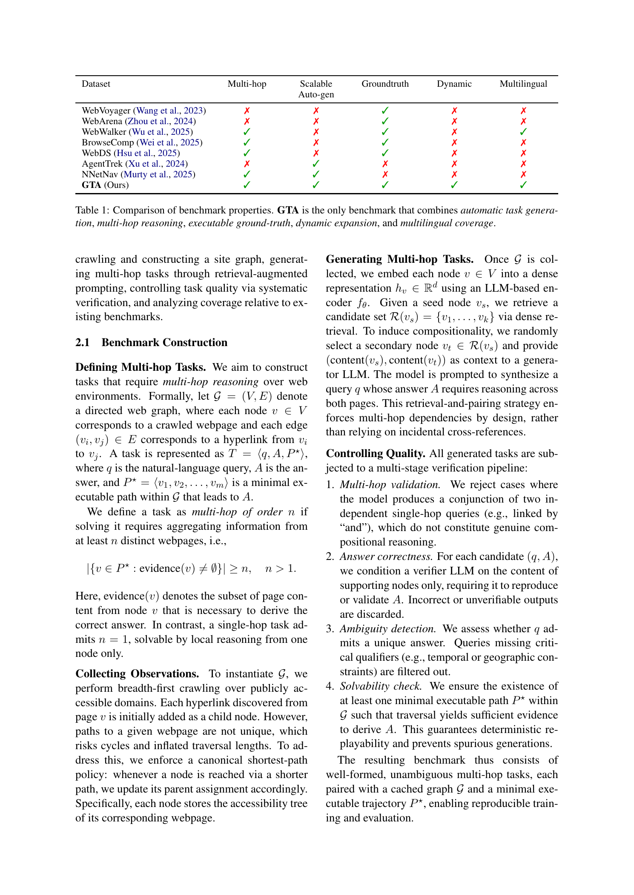
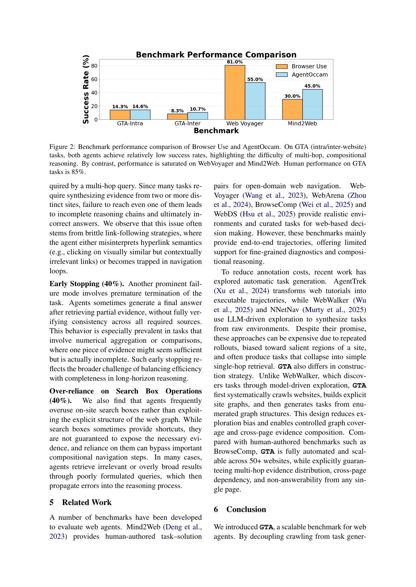
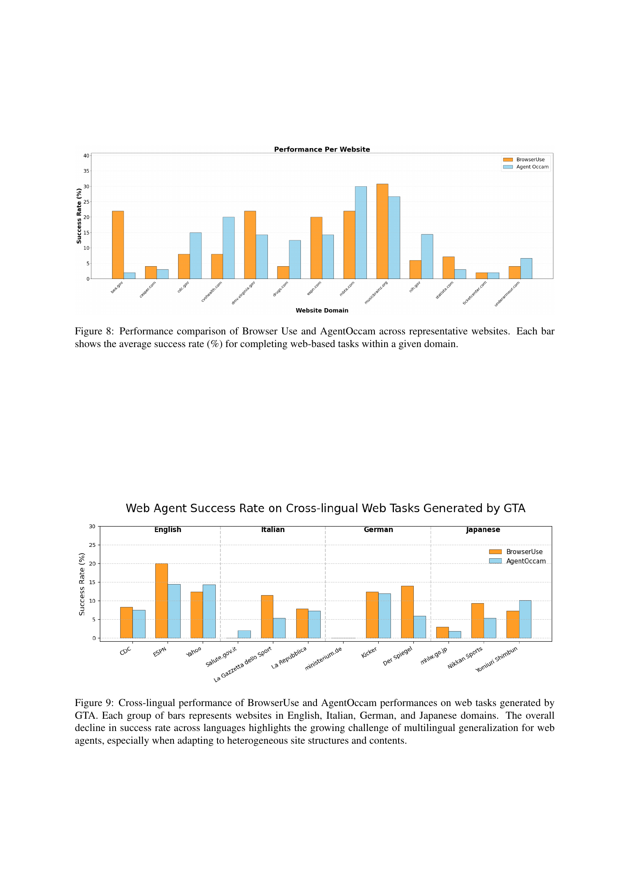
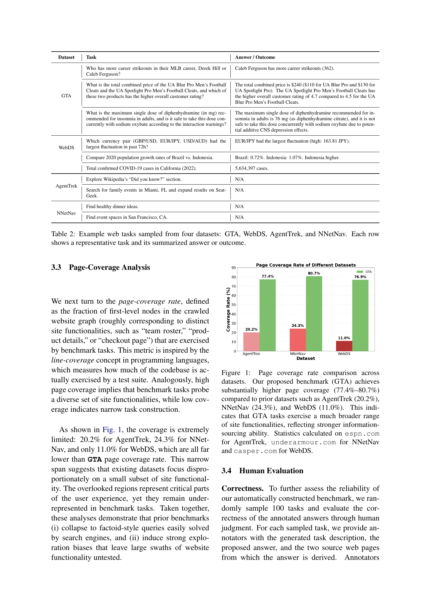
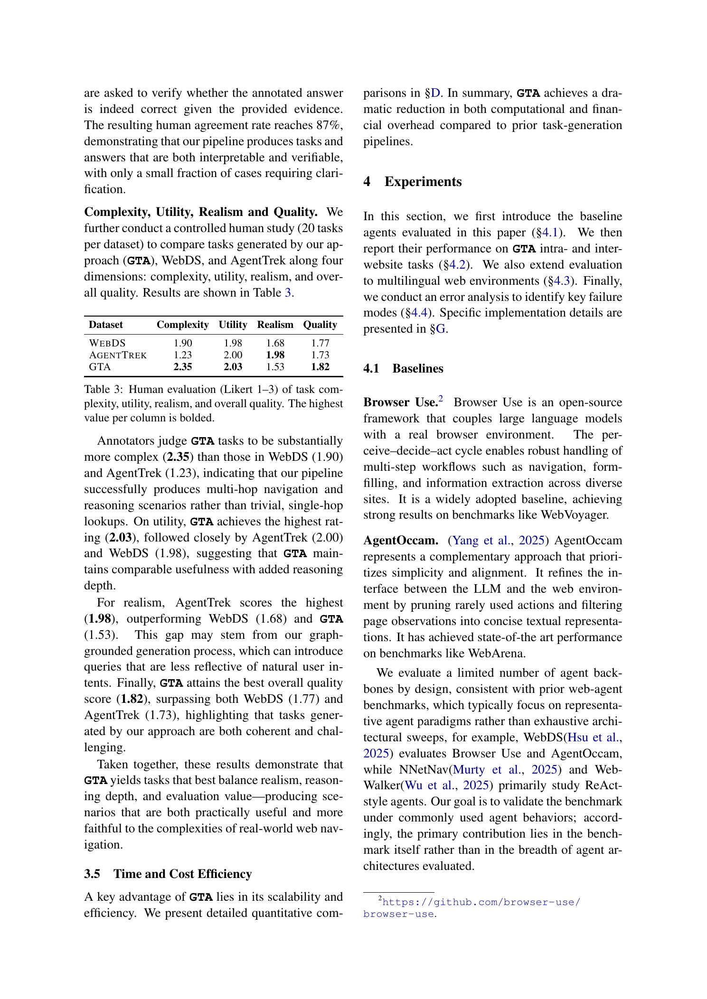

# GTA: Generating Long-Horizon Tasks for Web Agents at Scale

## TL;DR

GTA is a scalable benchmark-generation framework for web agents. Instead of manually writing tasks or letting an agent wander through sites, it crawls public websites into a graph, retrieves related page pairs, prompts an LLM to generate multi-hop questions, filters them with quality checks, and stores executable gold paths for replay. The paper instantiates this on 50+ websites, generating 5,000 intra-website tasks and 600 cross-website tasks. Current agents remain weak on these tasks: Browser Use and AgentOccam are around 14-15% on GTA-Intra and 8-11% on GTA-Inter, while human performance is reported as 85%.

Source: [arXiv:2605.29218](https://arxiv.org/abs/2605.29218), [PDF](https://arxiv.org/pdf/2605.29218.pdf), [code](https://github.com/tenghaohuang/GTA). The reviewed manuscript is arXiv v1, submitted on 2026-05-28 and listed as published at the 64th Annual Meeting of the Association for Computational Linguistics.

## Background

Web-agent evaluation has a data bottleneck. Benchmarks such as WebVoyager, WebArena, Mind2Web, WebDS, AgentTrek, and NNetNav provide useful tasks, but many are static, manually constructed, shallow, or missing process-level supervision. That matters because web navigation is not just answer generation. The agent must choose intermediate pages, interact with UI elements, gather evidence, and decide when enough information has been collected.

Recent automatic task-generation methods reduce manual annotation, but they often rely on LLM-driven exploration. That exploration can be expensive and biased toward obvious paths, such as product pages or search results, while under-sampling less salient site functionality. GTA's premise is that the website graph itself should drive generation. If the graph is crawled first, task generation can sample from broader site structure and produce questions that require evidence from multiple pages.

The paper positions GTA as a dynamic benchmark ecosystem rather than a fixed dataset. Users can rerun the pipeline against live web content, build fresh task sets, and evaluate whether agents generalize beyond memorized static tasks.

## Problem

The paper formalizes a website as a directed graph:

\[
G = (V, E),
\]

where each node \(v \in V\) is a crawled webpage and each edge \((v_i, v_j) \in E\) is a hyperlink. A generated web-agent task is:

\[
T = \langle q, A, P^\star \rangle,
\]

where \(q\) is the natural-language query, \(A\) is the answer, and \(P^\star = \langle v_1, v_2, \ldots, v_m \rangle\) is a minimal executable path through the graph.

A task is multi-hop of order \(n\) when the answer requires evidence from at least \(n\) distinct pages:

\[
\left|\{v \in P^\star : \mathrm{evidence}(v) \ne \emptyset\}\right| \ge n,\quad n > 1.
\]

This definition is useful because it separates a real multi-page task from a concatenation of two independent single-page questions. GTA tries to generate tasks whose answer cannot be recovered from one search snippet or one local page.

## Method

GTA has four main stages.

First, it crawls public websites breadth-first and builds a site graph. Each page is represented with its content and accessibility tree. When multiple paths reach the same page, GTA keeps a shortest-path parent assignment to avoid inflated trajectories and cycles.

Second, it embeds graph nodes and retrieves candidate related pages. Given a seed page \(v_s\), the system retrieves a set \(R(v_s)\) of semantically related nodes, samples a secondary node \(v_t\), and gives the two page contents to a generator LLM. The prompt asks for a natural task whose answer requires both sources. This decouples task generation from repeated agent rollouts.

Third, it runs quality control. The verifier rejects cases that are merely two unrelated questions joined together, checks whether the answer is supported by the evidence pages, filters ambiguous prompts, and confirms that a minimal executable path exists. The result is a task with an answer and a replayable gold trajectory.

Fourth, it supports both intra-website and inter-website tasks. Intra-website tasks stay within one domain, while inter-website tasks require integrating complementary evidence from different sites, such as healthcare or finance sources. The benchmark also includes multilingual settings across English, Italian, German, Japanese, and Chinese-related web resources.

The pipeline is meant to be amortized. Crawling and indexing are the expensive stages, but once a graph exists, many tasks can be generated from it without rerunning web-agent exploration.

## Experiments

The benchmark instance covers over 50 public websites across healthcare, finance, e-commerce, entertainment, government, science, and public resources. The paper reports 5,000 intra-website tasks and 600 cross-website tasks in healthcare and finance.

The authors compare GTA against a simple Google Search API baseline for information-retrieval-style tasks. That baseline reaches 95% correctness on filtered AgentTrek tasks and 100% on filtered NNetNav tasks, but only 14% on GTA. This is the core evidence that GTA tasks are less likely to collapse into single-hop search.

The page-coverage analysis also favors GTA. On representative sites, prior datasets cover only 11.0% to 24.3% of first-level site functionality, while GTA covers roughly 77.4% to 80.7%. This supports the claim that graph-grounded generation explores broader parts of the site.

Human evaluation is mixed but informative. On 100 sampled GTA tasks, human answer verification reaches 87% agreement. In a 20-task-per-dataset comparison, GTA receives the highest complexity score at 2.35 on a 1-3 Likert scale, versus 1.90 for WebDS and 1.23 for AgentTrek. GTA also has the highest utility and overall quality scores, but lower realism than AgentTrek, suggesting that graph-grounded generation can produce useful but somewhat less natural user intents.

For agent evaluation, the paper tests Browser Use and AgentOccam. On GTA-Intra, Browser Use reaches 14.3% and AgentOccam 14.6%. On GTA-Inter, Browser Use reaches 8.3% and AgentOccam 10.7%. By contrast, the same figure reports much higher scores on WebVoyager and Mind2Web. The paper reports 85% human performance on GTA tasks, leaving a large human-agent gap.

The error analysis finds three major failure modes: failure to reach all required webpages in 90% of sampled failed tasks, early stopping in 40%, and over-reliance on search boxes in 40%. These categories are useful because they point to process failures, not just final-answer errors.

## Critical Analysis

The strongest idea in GTA is to separate crawling from task generation. LLM-driven exploration is costly and biased by the policy used to explore. A crawled graph gives the generator a broader substrate and makes it easier to force cross-page evidence composition. For benchmark design, that is a practical improvement.

The executable path \(P^\star\) is also important. A benchmark with only start-goal annotations can tell whether the final answer is right, but it cannot easily diagnose where navigation broke. GTA's gold paths make step-level replay and attribution more plausible, especially for training or debugging agents that need process supervision.

The main weakness is verifier dependence. GTA uses LLM-based checks for answer correctness, ambiguity, and multi-hop validity. The 87% human agreement rate is encouraging, but it also implies residual noise. For high-stakes domains such as medicine and finance, even a small percentage of wrong or underspecified generated tasks can distort evaluation.

The realism result deserves attention. GTA scores highest on complexity and overall quality, but AgentTrek scores higher on realism. That tradeoff is not surprising: graph-pair prompting can create tasks that are structurally useful for evaluation but less representative of what users would naturally ask. A production-grade benchmark may need an intent model or human calibration layer to avoid over-optimizing for compositionality alone.

The benchmark scope is also narrower than "web agency" in general. GTA focuses on multi-hop information seeking and explicitly leaves out many action-heavy workflows such as checkout, account settings, authenticated systems, and transactional tasks. That is a reasonable scope choice, but it means GTA complements WebArena-like environments rather than replacing them.

## Implementation Notes

GTA suggests a useful architecture for teams building private web-agent evals:

\[
\text{crawl} \rightarrow \text{graph} \rightarrow \text{retrieval pairs} \rightarrow \text{task generation} \rightarrow \text{verification} \rightarrow \text{replay}.
\]

The important implementation detail is to store both semantic evidence and executable navigation. A practical task object should include:

\[
\{\text{query}, \text{answer}, \text{evidence pages}, \text{gold path}, \text{verifier}, \text{crawl snapshot}\}.
\]

The crawl snapshot matters because live websites drift. Without it, a task may become unsolvable for reasons unrelated to agent quality. GTA's dynamic framing is valuable, but versioned snapshots are still necessary for reproducible comparisons.

The failure taxonomy is directly actionable. If an agent misses required pages, improve planning, link selection, and coverage tracking. If it stops early, add explicit evidence completeness checks. If it overuses site search, constrain search-box behavior or teach the policy when graph navigation is required.

For generated tasks in sensitive domains, LLM verification should be treated as a filter, not proof. Multi-model agreement, deterministic page-level validators, and spot human review would make the benchmark more reliable.

## Captured Figures and Tables

