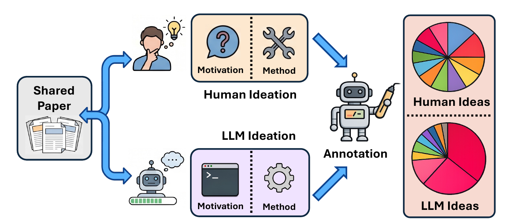
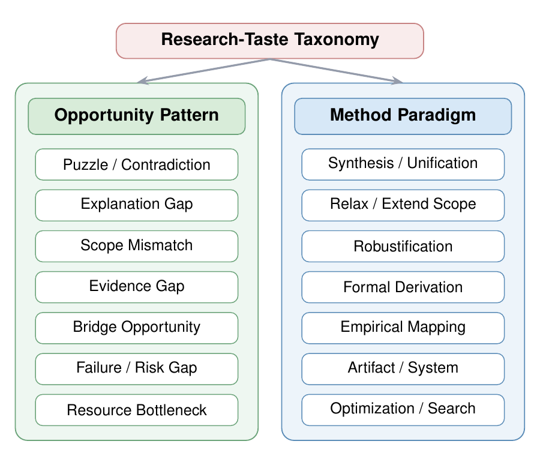
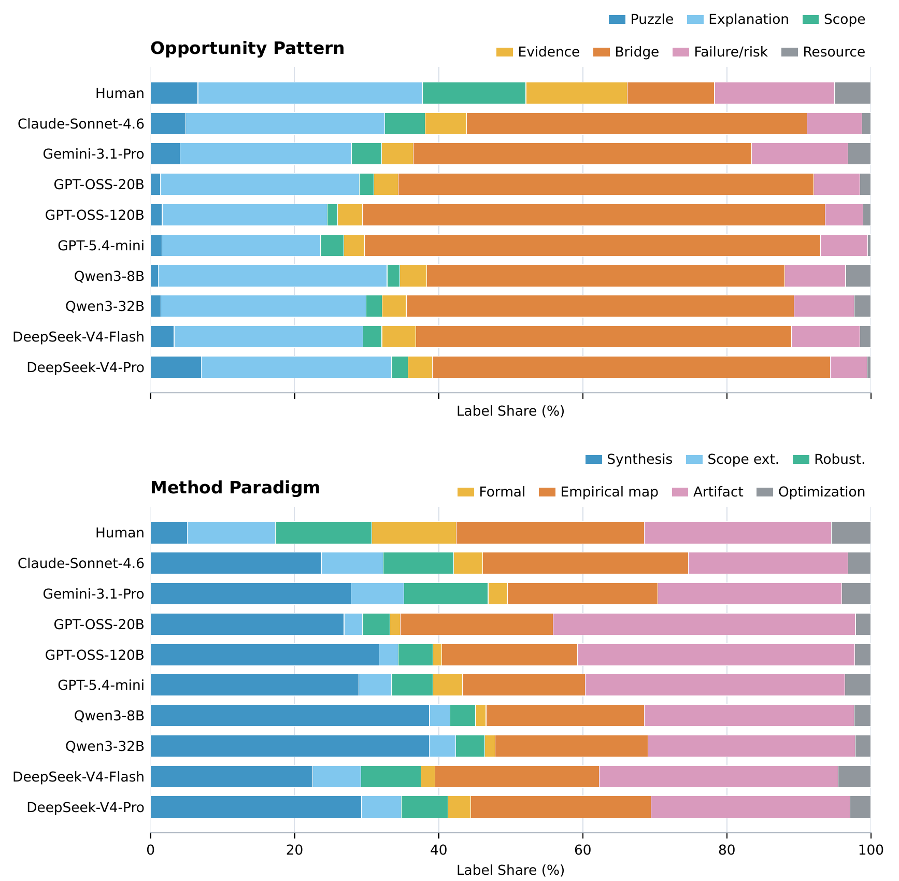
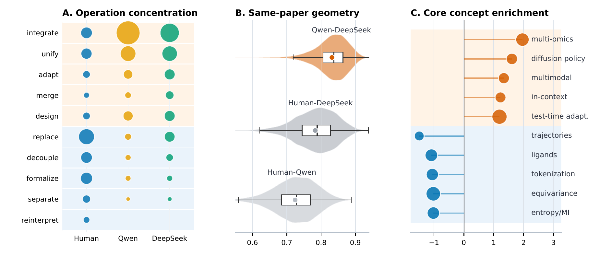
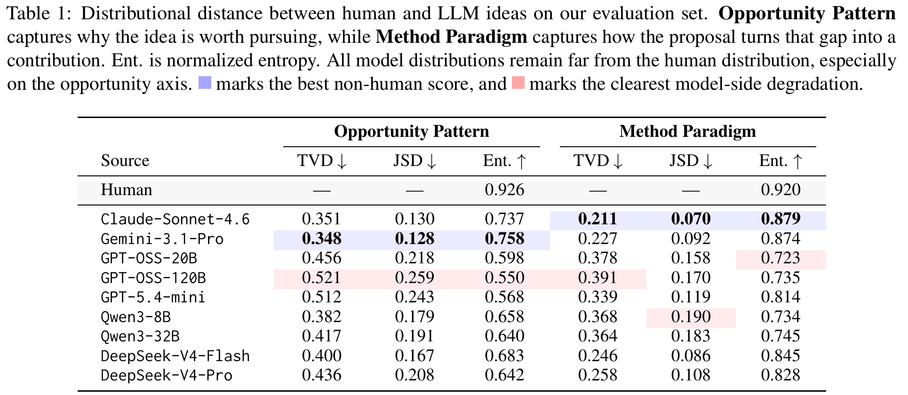
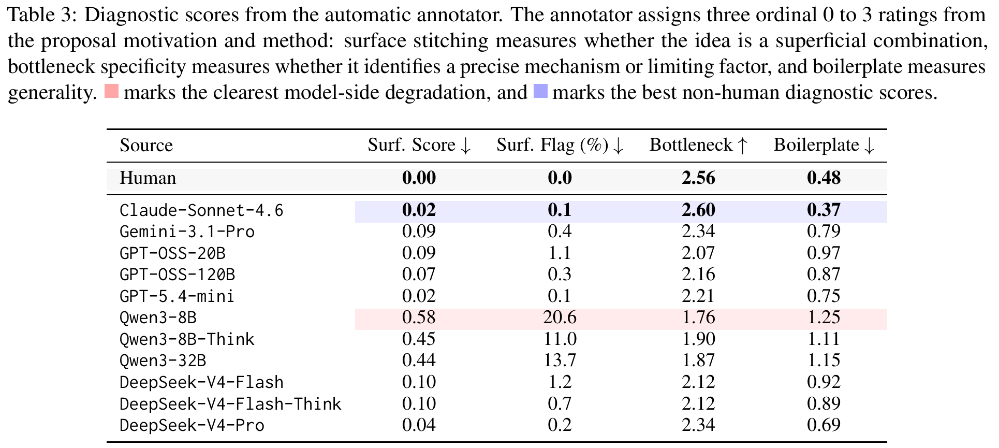
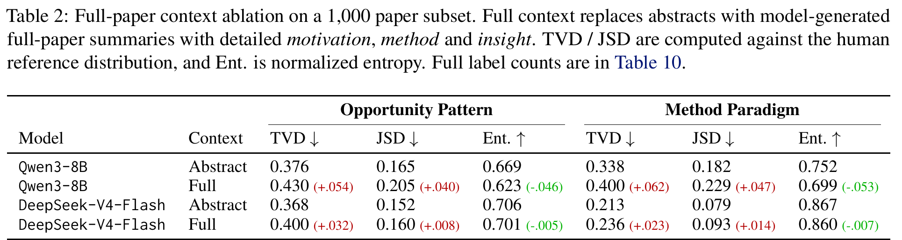
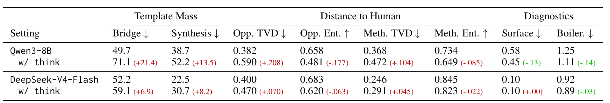
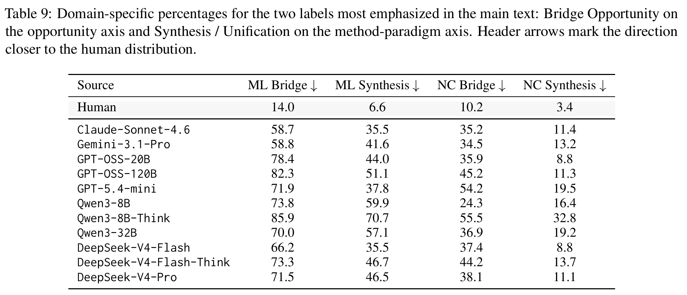

# Measuring the Gap Between Human and LLM Research Ideas

## TL;DR

A distributional evaluation of LLM ideation instead of a per-idea one. 11,683 published papers (5,994 from ICLR/ICML/NeurIPS 2023–2026, 5,689 from Nature Communications 2023–2025) are each reduced to a motivation/method pair, and the prior works that plausibly produced them are reverse-engineered from the related-work section. Nine LLMs get the same 5–7 titles and abstracts and are asked for a new idea. Both sides are labeled on a two-axis "research taste" taxonomy — seven opportunity patterns, seven method paradigms — by GPT-5.4-mini. The result: 12.1% of human ideas are labeled Bridge Opportunity against 47.1–64.2% for the LLMs, and 5.1% use Synthesis/Unification against 22.5–38.7%. Human normalized entropy is above 0.92 on both axes; no model exceeds 0.758 on the opportunity axis. Thinking mode makes it worse, richer context makes it worse, and within all three model families the larger model is farther from the human distribution. Every number in the paper that can be reconstructed from its own appendix reconstructs exactly.

## Background

Most evaluation of LLM ideation scores ideas one at a time. Si et al. (2025a) ran the canonical version — 100+ NLP researchers judging LLM and human ideas on novelty and feasibility — and found LLM ideas rated as novel or more so. Follow-up work built iterative refinement, retrieval grounding, knowledge-graph conditioning, and multi-agent critique pipelines, and benchmarks emerged to score novelty, feasibility, and impact. All of it asks: is this idea good?

A separate literature asks whether LLM output *distributions* match human ones. Detection work found statistical artifacts in token rank and likelihood geometry; MAUVE-style metrics measured corpus-level divergence; social-simulation work found LLMs reproduce aggregate human patterns while distorting the tails. This paper is the transplant of the second question onto the first domain: not "is this idea good" but "when the same source generates many ideas under comparable constraints, what kinds does it produce?"

The distinction matters because the failure mode it targets is invisible to per-idea scoring. A source can produce ideas that are individually novel, feasible, and coherent while producing the *same kind* of idea every time.

## Problem

Comparing human and LLM ideation is confounded by everything: topic choice, background knowledge, paper-writing templates. An open-ended "write an idea about topic X" comparison measures mostly which topics each side picks.

The paper's fix is a constrained task. Each instance is a set of related prior works $X_i = \{(t_{i1}, a_{i1}), \dots, (t_{ik}, a_{ik})\}$ — titles and abstracts only. The target is $y_i = (m_i, s_i)$, a motivation and a method. The human $y_i$ is the idea realized in the paper those priors preceded; the LLM $y_i$ is generated from the same priors. Both sides are anchored to the same local context, so the comparison is meant to isolate *how each source frames a gap and constructs a contribution* rather than what it chose to work on.

## Method

### Corpus construction

The human idea is extracted from the published paper by an LLM pipeline: a prompt asks for the innovation, the departure from prior work, and the key insight, then rewrites the result into proposal-style motivation and method. Prior works are then reverse-engineered by a second prompt (Figure 5) that first identifies the paper's core idea, then selects 5–7 predecessors passing three filters — a counterfactual check ("would the authors still have produced this idea without reading it?"), a specificity check, and a proximity check. Foundational works, generic tooling, and baseline-only citations are excluded. Rows with missing model outputs or labels are dropped, leaving 11,683 matched papers averaging 6.21 priors each.

### Research-taste taxonomy

Two axes, seven labels each (Figure 2). The opportunity axis answers *why* a study is needed: Puzzle/Contradiction, Explanation Gap, Scope Mismatch, Evidence Gap, Bridge Opportunity, Failure/Risk Gap, Resource Bottleneck. The method axis answers *how* the gap becomes a contribution: Synthesis/Unification, Relax/Extend Scope, Robustification, Formal Derivation, Empirical Mapping, Artifact/System, Optimization/Search.

The construction is the part worth copying. The authors started from external proposal-writing guidance — DARPA's Heilmeier Catechism, NIH application instructions, the NSF PAPPG project description requirements, AHRQ's research-gap framework — extracted 11 opportunity and 9 method elements, then refined on a held-out set of 150 papers by merging near-duplicates, splitting labels that conflated motivation with method, and dropping anything tied to a specific domain or technical substrate. Table 6 records which source produced which label.

### Annotation

GPT-5.4-mini receives the taxonomy, the prior-work titles, and the proposal's motivation and method — not the source. It returns primary and secondary labels per axis, confidence scores, and three ordinal 0–3 diagnostics: **surface stitching** (is this a superficial A+B combination), **bottleneck specificity** (does it name a precise mechanism or limiting factor), and **boilerplate** (generic phrasing). Only primary labels feed the distributional comparison.

Validation: two authors audited the same 150 held-out items, judging whether the opportunity label, method label, and diagnostic profile were acceptable under the codebook. Cohen's $\kappa$ against each author, averaged over the two pairs, is 0.84 / 0.81 / 0.93.

### Metrics

Empirical label distributions $\hat P$, $\hat Q$ over label set $A$ ($|A| = 7$):

$$\text{TVD}(\hat P, \hat Q) = \frac{1}{2}\sum_{c \in A} |\hat P(c) - \hat Q(c)| \qquad \text{JSD}(\hat P, \hat Q) = \tfrac{1}{2}\text{KL}(\hat P \| M) + \tfrac{1}{2}\text{KL}(\hat Q \| M)$$

with $M = (\hat P + \hat Q)/2$, and

$$H_{\text{norm}}(\hat P) = -\frac{1}{\log_2 |A|}\sum_{c \in A} \hat P(c) \log_2 \hat P(c).$$

## Experiments

### Main distributional gap

Nine models: Claude-Sonnet-4.6, Gemini-3.1-Pro, GPT-OSS-20B, GPT-OSS-120B, GPT-5.4-mini, Qwen3-8B, Qwen3-32B, DeepSeek-V4-Flash, DeepSeek-V4-Pro. One generation per input.

| Source | Opp. TVD ↓ | Opp. JSD ↓ | Opp. Ent. ↑ | Meth. TVD ↓ | Meth. JSD ↓ | Meth. Ent. ↑ |
|---|---|---|---|---|---|---|
| **Human** | — | — | **0.926** | — | — | **0.920** |
| Claude-Sonnet-4.6 | 0.351 | 0.130 | 0.737 | **0.211** | **0.070** | **0.879** |
| Gemini-3.1-Pro | **0.348** | **0.128** | **0.758** | 0.227 | 0.092 | 0.874 |
| GPT-OSS-20B | 0.456 | 0.218 | 0.598 | 0.378 | 0.158 | 0.723 |
| GPT-OSS-120B | 0.521 | 0.259 | 0.550 | 0.391 | 0.170 | 0.735 |
| GPT-5.4-mini | 0.512 | 0.243 | 0.568 | 0.339 | 0.119 | 0.814 |
| Qwen3-8B | 0.382 | 0.179 | 0.658 | 0.368 | 0.190 | 0.734 |
| Qwen3-32B | 0.417 | 0.191 | 0.640 | 0.364 | 0.183 | 0.745 |
| DeepSeek-V4-Flash | 0.400 | 0.167 | 0.683 | 0.246 | 0.086 | 0.845 |
| DeepSeek-V4-Pro | 0.436 | 0.208 | 0.642 | 0.258 | 0.108 | 0.828 |

Bridge Opportunity: 12.1% human, 47.1–64.2% model. Synthesis/Unification: 5.1% human, 22.5–38.7% model.

### Ablations

**Full-paper context.** On a 1,000-paper subset (500 per domain), replacing abstracts with model-generated full-paper summaries moves Qwen3-8B and DeepSeek-V4-Flash *farther* from the human distribution on both axes. Qwen's opportunity TVD goes 0.376 → 0.430, entropy 0.669 → 0.623; bridge labels rise from 456 to 551 of 1,000.

**Prompt wording.** A "relaxed" generation prompt (Figure 8) moves Qwen's bridge count from 5,807 to 5,247 and synthesis from 4,523 to 3,938, while DeepSeek's bridge count *rises* from 6,094 to 6,368. Bridge remains the largest opportunity category throughout.

**Thinking mode.** Tested on Qwen3-8B and DeepSeek-V4-Flash. Qwen: bridge 49.7% → 71.1%, synthesis 38.7% → 52.2%, opportunity entropy 0.658 → 0.481, TVD 0.382 → 0.590. DeepSeek moves the same direction, smaller. Notably, the *diagnostics* improve while the distributions worsen — Qwen's surface stitching falls 0.58 → 0.45 and boilerplate 1.25 → 1.11.

### Diagnostics

| Source | Surf. Score ↓ | Surf. Flag (%) ↓ | Bottleneck ↑ | Boilerplate ↓ |
|---|---|---|---|---|
| **Human** | 0.00 | 0.0 | 2.56 | 0.48 |
| Claude-Sonnet-4.6 | 0.02 | 0.1 | **2.60** | **0.37** |
| Gemini-3.1-Pro | 0.09 | 0.4 | 2.34 | 0.79 |
| GPT-5.4-mini | 0.02 | 0.1 | 2.21 | 0.75 |
| Qwen3-8B | 0.58 | 20.6 | 1.76 | 1.25 |
| DeepSeek-V4-Pro | 0.04 | 0.2 | 2.34 | 0.69 |

### Mechanism analyses

**Archetype clustering.** Proposals are rewritten into one-sentence archetypes by GPT-5.4-mini, clustered with TF-IDF + MiniBatchKMeans ($k=30$), and the main verb normalized into an operation family. *integrate* appears 7,994 times in model outputs (34.2%) against 275 in human ideas (2.35%) — log-odds 3.07. *unify*, *design*, *merge*, *adapt* follow. The human-heavy side is different in kind: *replace* is 9.13% of human operations against 0.92% for models, *decouple* 2.33% against 0.21%. Those two clusters are 83.3% and 85.4% human, and score higher on bottleneck specificity (2.61, 2.70) than model-heavy clusters.

**Representation geometry.** With Qwen3-Embedding-4B (2,560-d), same-paper cosine similarity between Qwen3-8B and DeepSeek-V4-Flash ideas is 0.8316, against 0.7242 human–Qwen and 0.7829 human–DeepSeek. Two different model families agree with each other more than either agrees with the human who actually wrote the paper.

## Critical Analysis

**Strengths:**

- **The arithmetic holds, and the paper made it checkable.** Tables 10 and 11 publish full label counts rather than only derived metrics, so the whole pipeline can be audited. Recomputing $H_{\text{norm}}$ from Table 11's counts gives 0.6576 / 0.7340 for Qwen3-8B's two axes against 0.658 / 0.734 reported, and 0.6832 / 0.8452 for DeepSeek-V4-Flash against 0.683 / 0.845. All eight entropies in Table 2 reconstruct from Table 10's counts to within 0.001. Weighting Table 9's per-domain percentages by the corpus sizes reproduces the main-text claims exactly: human bridge 12.15% (stated 12.1), human synthesis 5.04% (5.1), model bridge range 47.0–64.2 (47.1–64.2), model synthesis range 22.50–38.72 (22.5–38.7). The archetype log-odds check out too (integrate 3.073 vs 3.07, unify 1.529 vs 1.52). This is rare enough to be worth saying plainly.
- **The taxonomy is derived, not invented.** Grounding the label set in DARPA/NIH/NSF/AHRQ proposal guidance and documenting the merge/split/rename passes on held-out data is a much stronger provenance story than the usual "we defined seven categories."
- **The scale is real.** 11,683 matched instances across two very different literatures, nine models, plus reasoning, context, and prompt ablations. The domain split (ML conferences vs Nature Communications) is a genuine external-validity check, not a token one.
- **The human-heavy operation finding is not derivable from the labels.** *replace* at 9.13% vs 0.92% and *decouple* at 2.33% vs 0.21% describe something the taxonomy does not encode — that human papers tend to intervene narrowly on a named component — and the embedding result (model–model 0.8316 > either human–model pair) is independent of the annotator entirely.
- **The limitations section is honest** about STEM-centricity, the artificiality of the reconstructed context, and the compression of nuanced ideas into discrete labels.

**Weaknesses:**

- **The opportunity-axis result is one number wearing three hats.** TVD, JSD, and normalized entropy are presented as three distributional measures. On the opportunity axis they are all driven by a single bin. For all nine models, the reported TVD equals the Bridge-bin excess over human to within 0.001–0.006: Claude 0.3511 excess vs 0.351 reported, Gemini 0.3482 vs 0.348, GPT-OSS-120B 0.5208 vs 0.521, Qwen3-8B 0.3755 vs 0.382. Since TVD is the sum of positive deviations, this means *every other one of the seven categories is at or below the human share for every model* — the entire opportunity-axis divergence is the Bridge share, and JSD and entropy are monotone functions of the same fact. The paper reports three columns and gets one measurement.
- **The human side is a survivor, not an ideation sample.** The "human idea" is the idea that got executed, written up, submitted, revised through peer review, and published at ICLR/ICML/NeurIPS or Nature Communications. The LLM idea is a single zero-shot draft. Human researchers presumably also generate bridge-shaped ideas in large numbers; those ideas do not become papers. This selection filter sits between the two corpora and is never acknowledged as one — the Limitations section raises the *context* asymmetry (tacit expertise, failed attempts, collaborators) but not the *outcome* asymmetry, which is the larger of the two. A comparison against human ideas that were proposed and abandoned, or against submitted-and-rejected papers, would separate "LLMs think differently" from "publication selects against synthesis."
- **Both sides are LLM text, produced by opposite operations.** The human motivation/method is an LLM *summary of a completed paper*, prompted to surface "the innovation, departure from prior work, and key insight." The LLM motivation/method is an LLM *generation from seven abstracts*. A summarizer given a finished paper can name the specific mechanism the paper actually intervened on; a generator given abstracts has no such mechanism to name. That asymmetry alone predicts the direction of every diagnostic result — higher bottleneck specificity and lower boilerplate on the human side — and plausibly predicts the label results as well, since a concrete named intervention reads as *replace* or *decouple* while a proposal sketched from abstracts reads as *integrate*. No control isolates this: no human-written motivation/method baseline, no check that extraction preserves label-relevant content, no round-trip test where an LLM idea is passed through the extraction prompt.
- **The annotator can almost certainly identify the source, and that was never tested.** Human surface stitching is exactly 0.00 with a 0.0% flag rate across 11,683 items, while every single model configuration is nonzero. Not one human idea in eleven thousand tripped a superficial-combination flag. Either the extraction pipeline is a perfect filter or the annotator recognizes extracted-from-paper prose and scores it accordingly. The obvious test — can GPT-5.4-mini classify source from the text alone? — costs almost nothing and is absent, as is any blinding or style-normalization step. If the annotator can tell, all four diagnostic columns and both label axes are contaminated in the direction of the paper's thesis.
- **The two axes are not independent, by instruction.** The annotation prompt (Figure 7) tells the annotator to "use Synthesis / Unification only when bridging or reconciling separate lines of work is central." So "the same pattern appears on the method axis" is the annotator doing what it was told, not a second, corroborating observation. The paper presents the method-axis result as confirmation of the opportunity-axis result throughout.
- **The diagnostics are presented as supporting evidence and they point the other way.** Section 4.3 concludes that the diagnostics show "the research-taste gap is not only a low-level quality issue." Across the nine models the two families of measurement are uncorrelated: $r(\text{opp. TVD}, \text{boilerplate}) = +0.11$, and $r(\text{opp. TVD}, \text{surface stitching}) = -0.27$, the wrong sign. Within model families they move in opposite directions with perfect consistency. GPT-OSS 20B→120B, Qwen3 8B→32B, and DeepSeek Flash→Pro each worsen opportunity TVD (0.456→0.521, 0.382→0.417, 0.400→0.436) and opportunity entropy (0.598→0.550, 0.658→0.640, 0.683→0.642) while improving *all three* diagnostics in *all three* pairs. Thinking mode does the same thing: Qwen's distributions collapse while its surface-stitching and boilerplate scores improve. The honest reading is that scale and reasoning make ideas more specific and less generic while pushing them harder into the bridge template — which is a much more interesting finding than the one the paper reports, and it goes unremarked.
- **Claude beats the human baseline on every diagnostic the paper measures.** Bottleneck specificity 2.60 vs 2.56, boilerplate 0.37 vs 0.48, surface stitching 0.02 vs 0.00. The paper gives this one sentence ("Claude-Sonnet-4.6 is an exception on these diagnostic dimensions") and continues. If the frontier model's ideas are at least as specific and less generic than ideas extracted from published papers, then what remains is a difference in *kind*, not quality — and the paper's framing ("narrower," "template-bound," "less human-like") smuggles in a quality judgment the data does not support for the strongest models.
- **There is no human-versus-human floor.** Tables 7 and 8 show that human taste is not one distribution: ML human opportunity entropy is 0.952 and NC is 0.822, bridge is 14.0% vs 10.2%, synthesis 6.6% vs 3.4%. Two human subpopulations differ substantially, but the TVD between them is never computed. Without it, the reader cannot judge whether Claude's method-axis TVD of 0.211 is a large gap or within the range separating two groups of human researchers. This baseline was available at zero additional cost.
- **The prompt asks for the thing that is then measured, and the ablation barely moves.** The generation prompt (Figure 6) says "Analyze these papers, identify research gaps and opportunities" and "the motivation should synthesize the research gap ... why the listed works leave room for the proposed idea." Given seven related abstracts and that instruction, "these literatures should be connected" is a compliant response. The prompt ablation changes exactly two words — *synthesizing*→*generating* in the system line and *synthesize*→*describe* in the output spec — while leaving "identify research gaps and opportunities" and "why the listed works leave room" verbatim in both conditions. Even that two-word edit moves Qwen's bridge count by 560 and synthesis by 585, about 5% of the corpus each, and moves DeepSeek's bridge count in the *opposite* direction (+274). Section E.3's conclusion that the tendency "remains stable across prompt variants" rests on one variant that did not vary the operative instruction, and on deltas large enough to suggest a real edit would move much more.
- **Decoding settings differ across the models being compared, and the headline metric is entropy.** Appendix C: local open-weight runs use temperature 0.6, top-p 0.95, top-k 20, max 2,048 new tokens; "the GPT API run uses temperature 1.0 and a JSON-schema output constraint." Claude's and Gemini's settings are never stated. Temperature is a direct control on output diversity, and diversity is what the paper measures. GPT-OSS-120B's chart-topping 0.521 TVD and Claude's near-best 0.351 are not comparable measurements until the sampling configuration is held fixed. The 2,048-token cap on local models only compounds it.
- **One sample per input, no variance, no intervals anywhere.** Each model generates one idea per context. With 11,683 instances the label *proportions* are tight, but nothing separates a model's ideation tendency from a single draw of its sampling distribution, and no confidence intervals are attached to any TVD, JSD, entropy, or diagnostic score. The 0.003 gap between Claude (0.351) and Gemini (0.348) is discussed as a ranking.
- **The annotator is one of the systems it grades, and the validation protocol is weaker than the reported $\kappa$ suggests.** GPT-5.4-mini annotates all ideas and appears in Table 1 as an evaluated generator. Appendix C describes the audit as authors judging "whether the primary Opportunity Pattern, primary Method Paradigm, and diagnostic-score profile were *acceptable* under the codebook" — a binary accept/reject on the model's proposed label, not independent 7-way labeling. $\kappa$ computed on a high-base-rate binary acceptability call is not a 7-way label reliability figure, and 0.84/0.81/0.93 should be read accordingly. Compounding this: the 150 validation items are the same held-out set used to *calibrate* the taxonomy, and agreement between the two authors themselves is never reported. (To the paper's credit, GPT-5.4-mini's own generations rank near the bottom on the NC corpus at 0.441 opportunity TVD, which is evidence against straightforward self-preference.)
- **"Does extended reasoning help?" is answered from two non-frontier models.** Only Qwen3-8B and DeepSeek-V4-Flash get thinking mode. "This adverse effect persists across both weaker and stronger models we tested" describes a 8B model and a flash-tier model; no frontier reasoning configuration is tested at all.
- **The normative target is asserted, never defended.** The conclusion prescribes that ideation systems should "diversify how it identifies problems" and shift away from synthesis templates — i.e. that matching the human label distribution is the goal. Nothing in the paper links distributional divergence to any outcome: not execution success, not review scores, not citations, not expert preference. Si et al. (2025b), the ideation-execution gap study that could supply exactly this link, is cited once in the introduction and never used. If bridge-shaped ideas are in fact the right response to being handed six adjacent papers, then closing this gap would make ideation systems worse, and the paper offers no way to tell.
- **The $B$ statistic is ad hoc and adds nothing.** $B = p^\top c + H - (s_{(1)} - s_{(2)})$ sums a cosine similarity, a normalized entropy, and a similarity gap on three different scales with no weighting or justification. Subtracting out the entropy term — already reported separately — leaves 0.7447 for humans, 0.6851 for Qwen, and 0.7492 for DeepSeek-V4-Flash, so DeepSeek is *above* the human value on everything $B$ contributes beyond $H$. The composite's apparent human advantage over DeepSeek is entirely the entropy term. (Separately, $s_i = p^\top w_i$ is called a cosine similarity without stating that embeddings are unit-normalized.)
- **Smaller inconsistencies:** Figure 3's caption states "Thinking-mode outputs are shown for Qwen3-8B and DeepSeek-V4-Flash," but the figure has ten rows — Human plus the nine main models — and no thinking-mode rows at all. Section 3.2 says prior works are reverse-engineered "4 to 8" at a time while the prompt in Figure 5 twice specifies 5–7. Section 4.2 and Figure 3's caption both refer to "fragmentation or bridge opportunities" as though *fragmentation* were a label; the taxonomy has only Bridge Opportunity. Table 2 colors entropy *decreases* green while Table 4 colors the same directional change red, though both are moves away from the human reference.

## Implementation Notes

- Generation: one idea per input, JSON with exactly two string fields (`motivation`, `method`). Local open-weight runs at temperature 0.6, top-p 0.95, top-k 20, 2,048 max new tokens; GPT API runs at temperature 1.0 with a JSON-schema constraint. Claude/Gemini decoding unspecified.
- Annotation: GPT-5.4-mini, chosen for cost/quality balance. Returns primary + secondary labels per axis, per-axis confidence, and the three diagnostics. Only primary labels are used distributionally; secondary labels and confidence scores are collected but never analyzed in the paper.
- The annotator prompt explicitly instructs disjoint axes ("never copy a method-paradigm label into the opportunity axis") and constrains Synthesis/Unification to cases where bridging is central — which couples the two axes it claims to separate.
- Archetype clustering: TF-IDF (lowercase, English stop words, 1–2 grams, `min_df=2`, `max_df=0.85`, sublinear TF) + MiniBatchKMeans ($k=30$, batch 512, seed 13). Concept extraction uses 1–3 grams with custom stop words; concept clustering runs MiniBatchKMeans over Qwen3 embeddings. Linear probes use 5-fold stratified CV with balanced logistic regression, `C=1.0`, liblinear. No hyperparameter search for the reported distributional metrics.
- Embeddings: Qwen3-Embedding-4B, 2,560-d, max length 512, batch 12, bfloat16, last-token pooling.
- Concept enrichment keeps clusters with ≥30 occurrences and ranks by model-vs-human log-odds, since the pool holds one human and two model sources and raw majority would be misleading.
- Artifacts: code at `ziyuuc/TasteGap`, data at `IdeaLand/IdeaSeed`. Corpus is public scholarly text only; no human-subject data, no paid annotators. NSF award No. 2541654.
- Preprint, arXiv 2607.01233v1 (1 July 2026), cs.CL. No venue stated.

## Captured Figures and Tables

**Figures:**

*Figure 1. The pipeline. A shared set of prior works feeds both a human (who wrote the actual paper) and an LLM; each idea is split into motivation and method, annotated, and compared as distributions. Note what the diagram elides: the human path runs through publication, and the human "idea" is recovered by summarizing the finished paper.*

*Figure 2. The two-axis taxonomy — seven opportunity patterns (why a study is needed) and seven method paradigms (how the gap becomes a contribution), derived from DARPA, NIH, NSF and AHRQ proposal guidance and refined on 150 held-out papers.*

*Figure 3. Full label distributions. The orange Bridge band on the opportunity axis is the entire result: for all nine models the reported opportunity TVD equals the Bridge excess over human to within 0.006, meaning every other category sits at or below the human share. The caption in the paper claims thinking-mode rows are shown; they are not.*

*Figure 4. Mechanism analyses. (A) Model archetypes concentrate on integrate/unify while human ideas retain replace, decouple, formalize — the one result not derivable from the taxonomy labels. (B) Qwen and DeepSeek ideas from the same paper are closer to each other (0.8316) than either is to the human idea (0.7242 / 0.7829). (C) Concept enrichment by model-vs-human log-odds.*

**Tables:**

*Table 1. Main distributional distances. Human entropy above 0.92 on both axes; no model above 0.758 on the opportunity axis. Every reconstructable value here matches the appendix counts exactly.*

*Table 3. Diagnostic scores. Claude-Sonnet-4.6 matches or beats the human baseline on all four columns (bottleneck 2.60 vs 2.56, boilerplate 0.37 vs 0.48) while remaining distributionally shifted. Human surface stitching is exactly 0.00 with a 0.0% flag rate across 11,683 items — no blinding check was run on the annotator.*

*Table 2. Full-paper context ablation. Richer context moves both models farther from the human distribution on every metric. Note that entropy decreases are colored green here and red in Table 4, for the same directional change.*

*Table 4. Reasoning ablation. Thinking mode worsens every distributional column and improves every diagnostic column — the anti-correlation the paper treats as corroboration. Tested only on Qwen3-8B and DeepSeek-V4-Flash.*

*Table 9. Domain-specific Bridge and Synthesis percentages. The human reference is not one distribution — ML 14.0/6.6 vs NC 10.2/3.4 — and on the NC corpus Qwen3-8B's opportunity TVD (0.250) ties Claude's, while GPT-5.4-mini is the worst non-thinking model at 0.441. Weighting these columns by corpus size reproduces every main-text percentage.*
