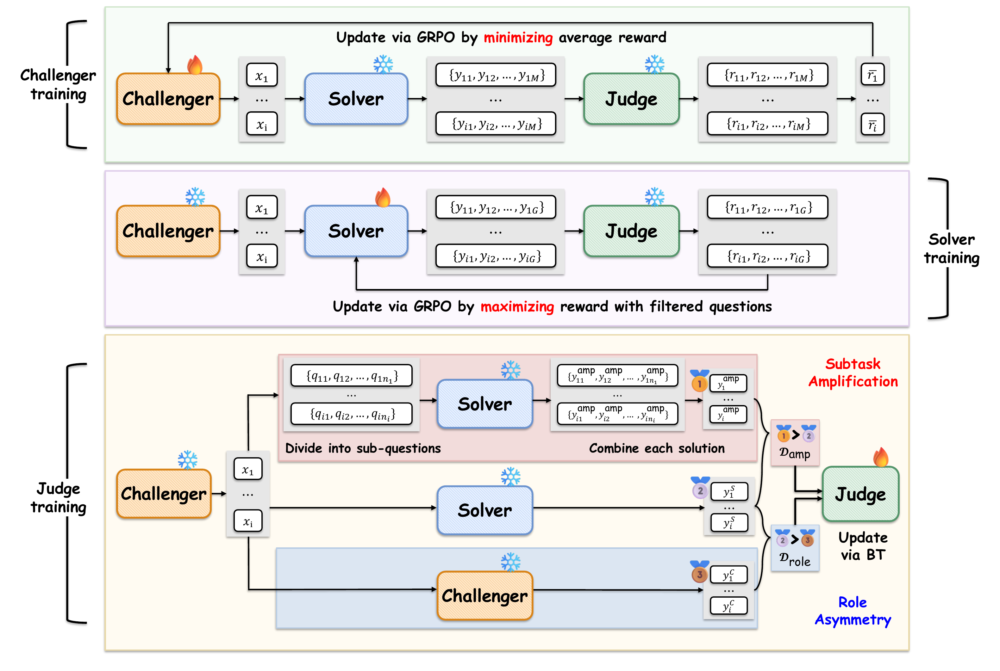
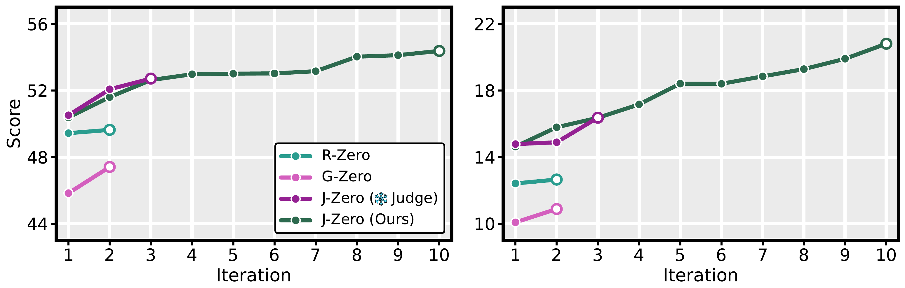
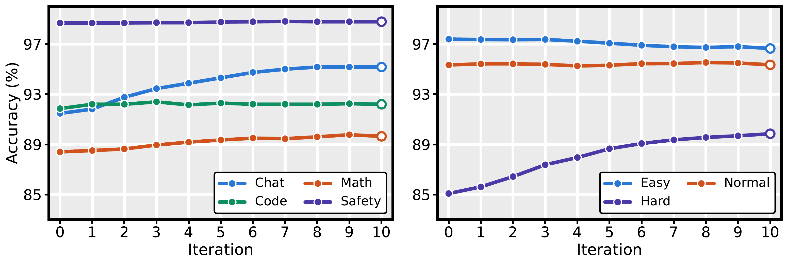

# J-Zero: Unified Challenger--Solver--Judge Co-Evolution from Zero Data

## TL;DR

J-Zero is a zero-data self-evolution framework that trains not only a task-generating Challenger and answer-producing Solver, but also the Judge that supplies their reward. It derives Judge-training preferences from two structural asymmetries rather than from the Judge's own scores: Solver answers should beat Challenger answers, and decomposed-and-recombined answers should beat one-shot answers. Across Qwen3-4B-Base and Qwen3-8B-Base, J-Zero improves both verifiable and open-ended tasks, outperforming zero-data baselines by an average of 4.2 and 8.0 points respectively, while continuing to improve through ten iterations instead of peaking after two.

## Background

Self-evolving language models try to remove externally curated tasks and labels from post-training. A Challenger generates tasks near the model's capability frontier, and a Solver learns to answer them. This loop is relatively straightforward in domains such as mathematics and code, where final answers can be checked automatically or compared through majority voting.

Open-ended tasks are harder because response quality has no objective verifier. A learned reward model can act as a Judge, but keeping it frozen creates an evaluation ceiling: once the Solver reaches the boundary of distinctions the Judge can reliably make, its scores stop providing useful gradients. Training the Judge from its own preferred responses is circular and risks amplifying its existing biases.

## Problem

The paper asks how all three components of a zero-data learning loop can improve together:

1. The Challenger must continually discover difficult but valid and diverse tasks.
2. The Solver must learn from tasks near its current capability frontier.
3. The Judge must improve without human labels, external seed data, or preference labels derived from its own scores.

The third requirement is the main contribution. Without a stronger evaluator, self-evolution on unverifiable tasks is bounded by the initial reward model.

## Method

### Challenger--Solver game

At each iteration, the Challenger $C_{\theta_c}$ generates tasks $x_i$, the Solver $S_{\theta_s}$ samples responses $y_{i,j}$, and Judge $J_\phi$ assigns normalized rewards $r^S_{i,j}\in[0,1]$. The two policies play an asymmetric adversarial game:

$$
\min_{\theta_c} \mathcal{L}_C(\theta_c;\theta_s,\phi),
\qquad
\max_{\theta_s} \mathcal{R}_S(\theta_s;\theta_c,\phi).
$$

The Challenger receives higher reward when the Solver scores poorly. Its composite reward also penalizes near-duplicate tasks using BLEU-based clusters and rejects outputs that do not contain a well-formed `<question>` block. Challenger and Solver are alternately updated with GRPO while the Judge remains frozen.

After Challenger training, J-Zero samples a larger task pool and selects the top-$K$ tasks by the standard deviation of Judge scores across Solver responses:

$$
s_i=\operatorname{std}\left(\{r^S_{i,j}\}_{j=1}^{M}\right).
$$

High dispersion identifies tasks near the Solver's frontier: some sampled answers succeed and others fail, leaving substantial room for policy improvement.

### Judge co-adaptation

J-Zero builds preference pairs whose ordering follows from how the responses were produced, not from the current Judge.

**Role asymmetry.** For a held-out Challenger task $x$, the Solver's response is labeled preferred to an answer generated by the Challenger itself:

$$
(y^+_{\mathrm{role}},y^-_{\mathrm{role}})=(y^S,y^C).
$$

The Solver is explicitly optimized to answer well; the Challenger is optimized to expose weaknesses and receives no answer-quality training signal. These pairs are reliable early in training and provide examples at or below the Solver's current level.

**Subtask amplification.** The Challenger decomposes a difficult task into easier subtasks, the Solver answers each one, and the Challenger recombines the partial solutions. The composed response is labeled preferred to a direct one-shot Solver response:

$$
(y^+_{\mathrm{amp}},y^-_{\mathrm{amp}})=(y^{\mathrm{amp}},y^S).
$$

These pairs become reliable once the Solver can solve subtasks consistently and expose the Judge to answers above the Solver's one-shot frontier.

The Judge is updated on the union $\mathcal{D}_{\mathrm{role}}\cup\mathcal{D}_{\mathrm{amp}}$ using Bradley--Terry loss:

$$
\mathcal{L}_J(\phi)=-\mathbb{E}_{(x,y^+,y^-)}
\log \sigma\!\left(J_\phi(x,y^+)-J_\phi(x,y^-)\right).
$$

Each self-evolution iteration therefore contains Challenger training, Solver training, and Judge training in sequence.

## Experiments

### Setup

- Policy initializations: Qwen3-4B-Base and Qwen3-8B-Base
- Judge: Skywork-Reward-V2-Llama-3.1-8B
- Baselines: untrained base model, R-Zero, and G-Zero
- Verifiable evaluation: seven mathematical benchmarks, MMLU-Pro, SuperGPQA, BBH, and IFEval
- Unverifiable evaluation: AlpacaEval 2.0, Arena-Hard-v2.0, and EQ-Bench Creative Writing v3
- Training framework: `verl`; each iteration uses 5 Challenger, 15 Solver, and 8 Judge steps

### Main results

| Model scale | Method | Verifiable overall | Unverifiable overall |
|---|---|---:|---:|
| Qwen3-4B | Base | 44.91 | 9.58 |
| Qwen3-4B | R-Zero | 49.64 | 12.66 |
| Qwen3-4B | G-Zero | 47.41 | 10.89 |
| Qwen3-4B | **J-Zero** | **54.38** | **20.81** |
| Qwen3-8B | Base | 50.67 | 13.23 |
| Qwen3-8B | R-Zero | 54.99 | 15.54 |
| Qwen3-8B | G-Zero | 53.07 | 15.31 |
| Qwen3-8B | **J-Zero** | **58.55** | **23.41** |

Against the base models, J-Zero gains 9.47 and 7.88 points in the verifiable aggregate and 11.23 and 10.18 points in the unverifiable aggregate. The largest open-ended gain is on AlpacaEval 2.0: 6.22 to 28.56 at 4B and 12.93 to 33.53 at 8B. At 8B, MATH500 rises from 72.20 to 83.40, BBH from 66.21 to 78.38, and AIME24 from 10.52 to 19.58.

### Preference reliability and ablations

An external evaluator judges role-asymmetry labels correct more than 60% of the time at every iteration; their win rate starts at 87.9% and declines toward 66% as tasks become harder. Subtask amplification starts poorly at 21.1% in iteration 1, exceeds 50% from iteration 4, and later reaches roughly 70--80%. The two signals are therefore complementary over time.

On Qwen3-4B, the full method scores 37.59 averaged across the verifiable and unverifiable aggregates. Freezing the Judge reduces this to 34.54; removing amplification gives 35.95, and removing role asymmetry gives 36.62. J-Zero improves monotonically through iteration 10, while R-Zero and G-Zero peak around iteration 2 and then decline. The co-adapted Judge also improves on the external RM-Bench from 92.61 to 93.95.

## Critical Analysis

**Strengths**

- The paper identifies evaluator capacity, rather than task generation alone, as a bottleneck in open-ended self-evolution.
- Preference labels come from process structure rather than the Judge's own ranking, avoiding the most direct form of self-confirmation.
- Role asymmetry and amplification cover different phases of learning; the reliability analysis makes this temporal complementarity visible.
- Comparisons span two model scales, verifiable and unverifiable domains, frozen-Judge ablations, and an external reward-model benchmark.
- Ten-iteration learning curves directly support the claim that Judge adaptation delays saturation.

**Limitations**

- “Zero data” means no task or preference dataset, not no pretrained supervision: the method starts from Qwen base models and a separately pretrained 8B reward model.
- The assumed preference order is statistical, not guaranteed. Amplification labels are wrong more often than right during the first three iterations, so early use can inject noise.
- The external validation of preference reliability uses another proprietary LLM judge, which adds a separate source of bias and temporal reproducibility risk.
- Experiments stop at 4B/8B policies and an 8B Judge; scaling behavior for larger or already post-trained reasoning models is unknown.
- Benchmark selection uses the checkpoint before either aggregate begins to decline, which relies on evaluation feedback and may overstate a deployment setting without held-out model-selection data.
- The Judge is a classifier-based discriminative reward model. A single generative model instantiating all three roles remains untested.

## Implementation Notes

- Hardware: four NVIDIA B200 and four NVIDIA H200 GPUs.
- Training batch sizes: Challenger 16, Solver 128, Judge 64; Solver and Challenger mini-batches are 16.
- Steps per iteration: 5 Challenger, 15 Solver, 8 Judge.
- Learning rates: $10^{-6}$ for Challenger and Solver, $5\times10^{-7}$ for Judge, all with constant schedules and zero weight decay.
- GRPO KL coefficient: 0.01; clip range $(0.20,0.28)$.
- Rollouts: 4 per Challenger prompt and 5 per Solver prompt, temperature 1.0 and top-$p$ 0.99.
- Maximum lengths: Challenger 1,024 prompt + 4,096 response tokens; Solver 4,096 + 4,096; Judge 8,192 tokens.
- Judge batches use equal proportions of role-asymmetry and subtask-amplification pairs.
- The authors provide project, GitHub, and Hugging Face links in the paper, but exact reproduction still depends on the released prompts and training stack.

## Captured Figures and Tables

**Figures:**

*Figure 1. J-Zero jointly updates the Challenger, Solver, and Judge through adversarial policy learning plus role-asymmetry and subtask-amplification preferences.*

*Figure 3. Iterative performance on verifiable and unverifiable benchmarks. J-Zero continues improving through iteration 10 while the baselines peak early.*

*Figure 4. RM-Bench performance of the co-adapted Judge across domains and comparison difficulty levels.*

**Tables:** No table images were captured because `pdflatex` is unavailable in the current environment; the main results and ablations are reproduced above from the paper text.
