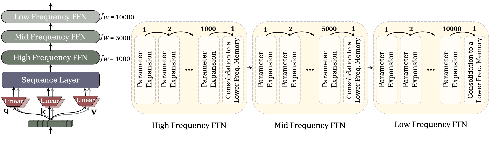
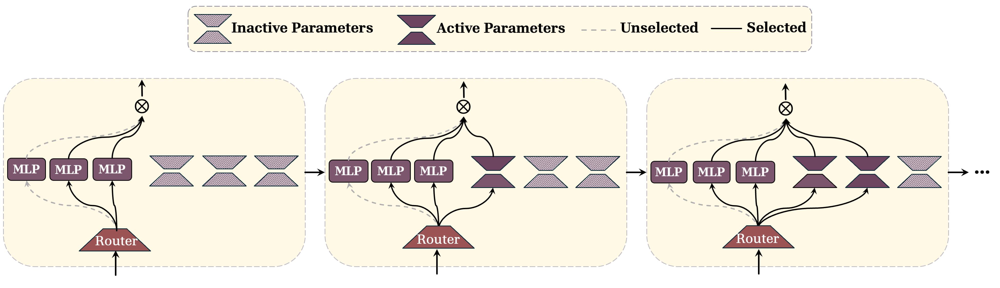
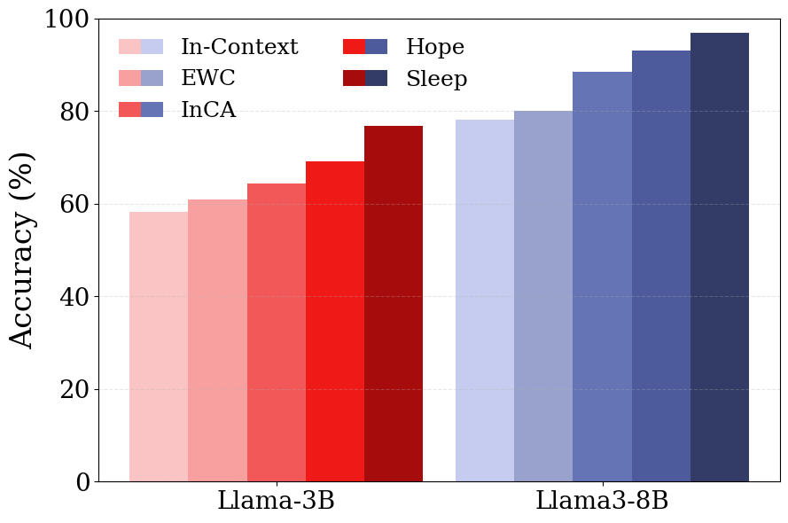
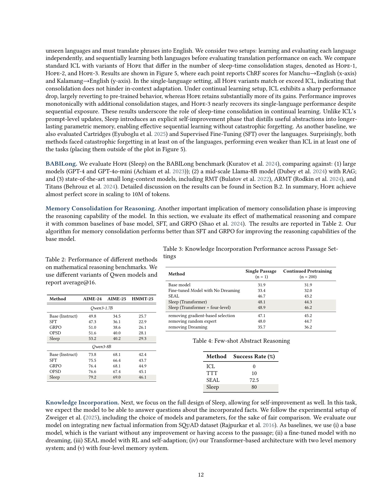

# Language Models Need Sleep: Learning to Self-Modify and Consolidate Memories

**Authors:** Ali Behrouz, Farnoosh Hashemi, Adel Javanmard, Vahab Mirrokni
**Published:** 2026-06-02 | **arXiv:** [2606.03979](https://arxiv.org/abs/2606.03979)

---

## TL;DR

The paper introduces a "Sleep" paradigm for LLMs inspired by human memory consolidation, consisting of two phases: (1) **Knowledge Seeding** — an upward distillation that transfers knowledge from higher-frequency (fragile, short-term) memory modules into lower-frequency (stable, long-term) parameters via periodic parameter expansion, and (2) **Dreaming** — a self-improvement phase where the model generates a synthetic data curriculum using RL and MoE-based novelty injection. Experiments across continual learning, long-context understanding, knowledge incorporation, and few-shot reasoning show consistent gains over baselines.

## Background

The paper builds on the **Nested Learning (NL)** framework (Behrouz et al., 2025) and the **Continuum Memory System (CMS)**, which models Transformer MLP layers as a chain of blocks updated at different frequencies — higher-frequency blocks act as short-term memory (fragile, quickly overwritten), while lower-frequency blocks serve as long-term memory (stable but slow to update). The prior NL work addressed *online consolidation* (knowledge transfer during active processing), but did not tackle *offline consolidation* — the periodic "sleep" phase where the model consolidates and abstracts knowledge without new input.

The neuroscience analogy is well-developed: the paper draws on the complementary learning systems theory (hippocampus ↔ neocortex dialogue during NREM sleep) and REM-sleep dreaming as a mechanism for novel connection formation and memory integration.

## Problem

LLMs are static after deployment — they can learn in-context but cannot transfer that knowledge to durable parameters, and standard fine-tuning suffers from catastrophic forgetting. The core challenge is: **how can a model periodically consolidate short-term in-context knowledge into stable long-term parameters while maintaining plasticity for future learning?**

## Method

The Sleep paradigm has two stages, triggered periodically when update boundaries align:

### Stage 1: Memory Consolidation (Knowledge Seeding)

1. **Parameter Expansion:** Before consolidation, a new low-rank expert (LoRA-style `{A, B}` matrices) is added to the target lower-frequency MLP block, expanding its capacity without overwriting existing knowledge.

2. **Compute–Consolidate–Update Protocol:**
   - **Compute:** The sender block (higher-frequency) computes a prospective base-weight update from accumulated gradients but does *not* apply it yet.
   - **Consolidate:** A teacher-student distillation is performed where:
     - *Teacher* = the model before update (with original parameters in both blocks)
     - *Student* = the model with the prospective updated parameters in the sender and newly activated low-rank experts in the receiver
   - **Update:** After distillation, the sender's accumulated experts are reset (synaptic pruning), and the new expert in the receiver is activated.

3. **Generalized Knowledge Distillation with Imitation Learning:** The distillation objective combines:
   - On-policy distillation (GKD-style): student generates sequences, teacher provides token-level feedback
   - Learning to Imitate (LTI): RL-based reward combining semantic similarity and Levenshtein distance, teaching the student to mimic the teacher's *sampling behavior* — not just its knowledge

   $$\mathcal{L}_{KS}(\theta, \theta^{exp}) = \mathbb{E}_{x \sim \mathcal{D}} \left[ (1-\alpha)\mathbb{E}_{y \sim LM_{\theta^{exp}}} [r(y)] - \alpha \mathbb{E}_{y \sim LM_{\theta^{exp}}} \mathcal{D}(LM_\theta \| LM_{\theta^{exp}})(y|x) \right]$$

### Stage 2: Dreaming (Self-Improvement)

Inspired by REM sleep, this phase generates synthetic training data:

1. **Dream Generation:** The model generates candidates using context, with MoE routers additionally sampling *random experts* to inject novel cross-domain knowledge combinations.

2. **Importance Filtering:** Gradient-based selection scores each dream by $\nabla_\theta \mathcal{L}_{SFT}(\text{Dream}^{(i)}, \theta)$; top-$k$ dreams are selected along with $b$ random samples for diversity.

3. **Self-Reward via SEAL-style ReSTEM:** Each selected dream is fine-tuned via LoRA on an isolated model copy; the dream is rewarded if it improves performance. ReSTEM (RL from self-generated data) optimizes the final objective.

The two-stage design is critical: consolidation *first* stabilizes knowledge in expanded parameters, so subsequent dreaming is less likely to cause catastrophic forgetting of prior capabilities.

## Experiments

### Memory Consolidation Effects

- **Class-Incremental Learning** (CLINC, Banking, DBpedia): Hope (with consolidation) consistently outperforms ICL, EWC, InCA, and the base Hope architecture (without distillation). On CLINC, Hope achieves ~95% vs. ICL's ~88% after sequential learning of classes.

- **In-Context Learning under Long Contexts** (MK-NIAH, LongHealth, QASPER): Hope outperforms DuoAttention and Cartridges. More consolidation stages (Hope-3 > Hope-2 > Hope-1) consistently improve performance, supporting the view that sleep enables better abstraction.

- **Continual Language Learning** (Manchu + Kalamang translation): Under sequential learning, ICL collapses to pre-trained performance, while Hope-3 nearly recovers single-language quality. SFT and Cartridges suffer catastrophic forgetting in at least one language.

- **BABILong**: Hope maintains near-perfect performance scaling to 10M tokens, significantly outperforming GPT-4, RAG-augmented Llama-8B, RMT, ARMT, and Titans.

### Full Sleep (Consolidation + Dreaming)

- **Knowledge Incorporation** (SQuAD): Sleep (4-level CMS) achieves 48.9% (single passage) and 46.2% (CPT, n=200), outperforming SEAL (46.7% / 43.2%) and fine-tuned baselines.

- **Few-Shot ARC**: Sleep achieves 80% success rate vs. SEAL's 72.5%, TTT's 10%, and ICL's 0%.

### Mathematical Reasoning

- **Qwen3-8B**: Sleep achieves 79.2 / 69.0 / 46.1 on AIME-24/AIME-25/HMMT-25, outperforming GRPO (76.4/68.1/44.9) and SFT (75.5/66.4/43.7).
- **Qwen3-1.7B**: Sleep achieves 53.2/40.2/29.3 vs. base instruct 49.8/34.5/25.7.

### Ablations

All components contribute positively: imitation learning (+2.4 AIME-24), semantic reward (+0.3), parameter expansion (+1.0). Removing dreaming drops SQuAD accuracy from 48.1 to 35.7, demonstrating its critical role in knowledge incorporation.

## Critical Analysis

### Strengths

- **Strong neuroscience grounding:** The NREM/REM analogy is more than superficial — the two-stage design (consolidation then dreaming) maps meaningfully to complementary learning systems theory.
- **Elegant formulation of "upward distillation":** The key insight that the student can be *larger* than the teacher (and that this is desirable for capacity growth) inverts standard distillation assumptions in a principled way.
- **Robust to catastrophic forgetting:** The separation of consolidation and self-improvement directly addresses the failure modes of iterative OPSD that Kim et al. (2026) and He et al. (2026) identified.
- **Comprehensive evaluation:** Covering continual learning, long-context, knowledge incorporation, few-shot, and mathematical reasoning provides strong evidence of generality.

### Weaknesses

- **Computational cost:** While the paper notes SFT is 4x faster per step, and Sleep requires 3.6–4.8x wall-clock to match SFT performance on reasoning, the actual per-sleep-cycle overhead of parameter expansion, multi-level distillation, and dreaming is not well-characterized for large models.
- **Fixed architecture assumption:** The CMS architecture with specific frequency schedules is tightly coupled to the Sleep paradigm. It's unclear how Sleep would work with standard Transformers (the paper uses "Transformer" variants but always with CMS modifications).
- **Limited scale:** Experiments are limited to 1B–8B parameter models. The parameter expansion mechanism (adding low-rank experts to MLP blocks) may face different dynamics at 70B+ scale.
- **Dreaming reward design is heuristic:** The binary improvement reward ($r \in \{0, 1\}$) for dreams is coarse; it's unclear whether more granular rewards would improve the curriculum.
- **MoE random expert selection for novelty:** The idea that randomly selecting irrelevant experts during dreaming produces useful cross-domain knowledge transfer is intriguing but under-explained — when does this help vs. when does it inject noise?

### Open Questions

1. **How to choose the frequency schedule?** The paper uses fixed schedules (e.g., 1k→5k→10k) but doesn't discuss adaptive frequency selection.
2. **Can Sleep scale to production models?** The parameter expansion mechanism assumes access to model internals in a way that may be impractical for proprietary API-only models.
3. **Interaction with RLHF/DPO:** How does Sleep interact with preference-based alignment? The dreaming phase could potentially conflict with safety constraints.

## Implementation Notes

- The "masked parameters" approach (initially including expanded parameters but masking them in forward/backward passes before activation) is a practical engineering choice that avoids runtime tensor reshaping.
- The paper uses LoRA (rank 64, alpha 128) for both consolidation distillation and dreaming fine-tuning, with learning rate 5e-6 and effective batch size 32.
- 5 MLP blocks with dimension 64 serve as additional parameters, keeping total active parameter count equal to the base model.
- The `compute–consolidate–update` protocol requires careful bookkeeping of parameter states (teacher vs. student vs. prospective), which adds implementation complexity.

## Captured Figures and Tables

*Figure 7 (Appendix). Multi-frequency memory hierarchy. Updates enter the High-Frequency FFN via repeated Parameter Expansion; when the window expires, knowledge is Consolidated to the Mid- and then Low-Frequency FFNs (1k→5k→10k).*

*Figure 8 (Appendix). Memory consolidation by routed expert updates. Across Sleep cycles, a router selects and updates a small set of experts, leaving others inactive, expanding capacity while limiting interference.*

*Figure 3. Class-incremental learning for text classification on CLINC, Banking, and DBpedia. The Hope architecture consistently outperforms other continual learning approaches.*

*Qwen3-8B mathematical reasoning performance (average@16) on AIME-24, AIME-25, HMMT-25. Sleep outperforms GRPO and SFT.*

*Knowledge Incorporation Performance on SQuAD across single-passage (n=1) and continued pretraining (n=200) settings. Sleep with four-level CMS achieves best results.*

*Few-shot Abstract Reasoning (ARC) success rates. Sleep achieves 80%, surpassing SEAL (72.5%) and TTT (10%).*
