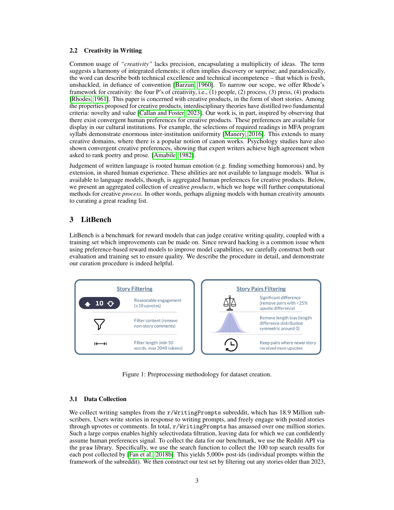
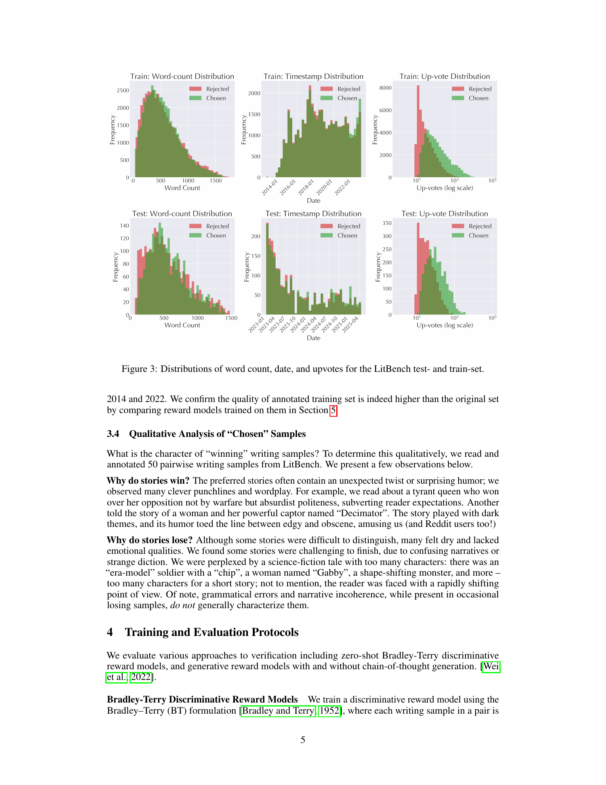
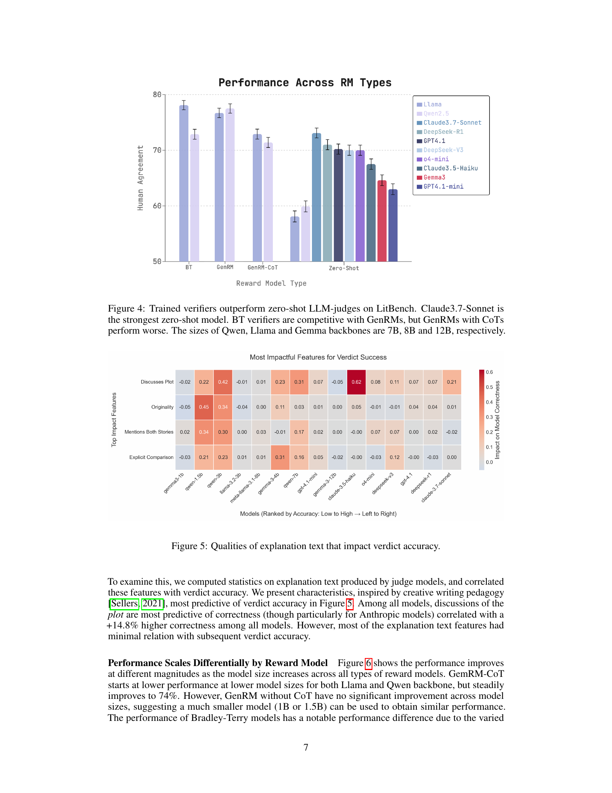
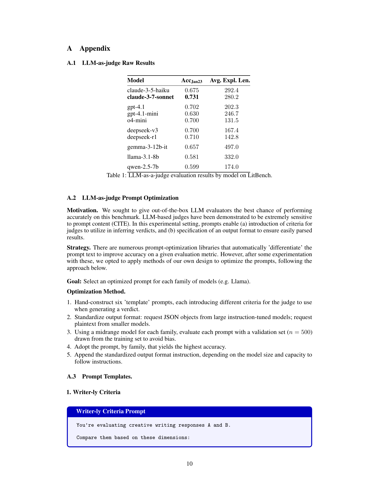

# LitBench: A Benchmark and Dataset for Reliable Evaluation of Creative Writing

## TL;DR

LitBench turns Reddit r/WritingPrompts preferences into a benchmark for judging creative writing: 2,480 held-out human-labeled story comparisons plus a 43,827-pair training corpus. The paper shows that strong zero-shot LLM judges are useful but limited: Claude-3.7-Sonnet reaches about 73% agreement with human preferences, while LitBench-trained Bradley-Terry and generative reward models reach about 78%. The main contribution is not a new model architecture, but a careful data construction recipe for open-ended writing evaluation, with length-bias mitigation, timestamp controls, and human validation on newly generated stories.

Source: [arXiv:2507.00769](https://arxiv.org/abs/2507.00769), [PDF](https://arxiv.org/pdf/2507.00769.pdf)

## Background

Math and code generation have relatively clear verification targets: a proof step is valid, a unit test passes, or a final answer matches a known solution. Creative writing does not have that kind of oracle. Two stories can answer the same prompt in very different ways and still both be good.

In practice, teams often use LLM-as-a-judge prompts to evaluate open-ended writing. That is convenient, but it leaves a reliability question: do general-purpose LLM judges actually match human creative-writing preferences, or are they mostly responding to superficial style, length, and explanation artifacts?

LitBench addresses this by constructing a pairwise preference benchmark from r/WritingPrompts, where many users respond to the same prompt and the community supplies noisy but scalable preference signals through upvotes.

## Problem

The target task is pairwise verification. Given a prompt \(x\), two stories \(y_A\) and \(y_B\), and a human-preference-derived label, a verifier must choose the preferred story:

\[
v(x, y_A, y_B) \in \{A, B\}.
\]

The hard part is not only training this verifier. It is building labels that are not dominated by confounders. Raw upvotes encode story quality, but they also reflect exposure time, community dynamics, length preference, and demographic taste. A benchmark for creative-writing verification therefore needs to control obvious artifacts while preserving enough human preference signal to be useful.

## Method

LitBench starts from r/WritingPrompts stories. The held-out test set uses stories after January 2, 2023 to reduce overlap with older training data. The training set comes from a pre-2023 WritingPrompts preference dataset.

The data pipeline applies several filters:

1. Remove stories with fewer than 10 upvotes.
2. Remove stories longer than 2,048 tokens or shorter than 50 words.
3. Form pairs only when the upvote gap is at least 25%.
4. Keep pairs where the higher-upvote story was posted later, reducing exposure-time bias.
5. Balance length differences by pruning pair buckets until chosen-shorter and chosen-longer examples are roughly symmetric.

The final benchmark contains 2,480 pairwise comparisons across 3,543 stories, with an average story length of about 550 words. The training set contains 50,309 unique stories and 43,827 preference pairs.

The paper evaluates three verifier families:

Bradley-Terry reward models score each story independently and train the preferred story to have a higher reward:

\[
L_{\mathrm{BT}} = -\log \sigma(r_\theta(y^+) - r_\theta(y^-)).
\]

Generative reward models frame the judgment as supervised generation of an answer token such as `A` or `B`. A second GenRM variant adds chain-of-thought rationales distilled from GPT-4.1 before the final verdict.

Zero-shot LLM judges receive both stories and produce an explanation plus a verdict. To reduce position bias, the paper evaluates both story orderings and averages the result.

## Experiments

The main result is that LitBench-trained reward models outperform off-the-shelf judges. The best zero-shot model, Claude-3.7-Sonnet, reaches 73.1% agreement with LitBench labels. GPT-4.1, o4-mini, DeepSeek-V3, and DeepSeek-R1 cluster around roughly 70%, while smaller open-source judges are much weaker.

Fine-tuned reward models do better. The strongest Bradley-Terry reward model, based on an 8B Llama backbone, reaches about 78% agreement. A generative reward model reaches a similar level, but adding chain-of-thought hurts, dropping GenRM-CoT performance to roughly 72%. In this setting, explicit reasoning text appears to add noise rather than improve judgment.

The dataset ablations support the curation choices. A lightly filtered 395k-pair set and an unfiltered 1.03M-pair set provide many more examples, but produce weaker verifiers. Without the timestamp-pairing control, performance saturates near 65%; without length balancing, performance rises to about 70% but becomes length-biased.

The paper also tests whether the reward model generalizes to new LLM-generated stories. The authors generate stories from 40 LitBench prompts using GPT-4.1 and GPT-4o, rank them with the Llama-8B Bradley-Terry model, and ask 46 U.S./U.K. crowdworkers to compare the reward-model-selected best and worst stories. Humans choose the reward-model-preferred story 57% of the time versus 41% for the rejected story, suggesting useful but far from complete alignment.

## Critical Analysis

The strongest part of the paper is the data construction. The authors do not treat raw upvotes as clean labels. They explicitly address exposure time, minimum engagement, story length, and held-out date ranges, then verify the choices with ablations. For a subjective domain, that is more valuable than another prompting recipe.

The result is also practically relevant: small trained reward models beat much larger general-purpose LLM judges. If a team has domain preference data, targeted reward modeling can be cheaper and more accurate than repeatedly calling proprietary judges.

The most important limitation is the preference source. Reddit upvotes are not literary ground truth. They reflect the taste and incentives of a specific online community, with demographic skew and platform-specific norms. LitBench is best understood as a benchmark for one measurable preference distribution, not as a universal definition of creative quality.

The human validation is encouraging but modest. A 57% preference rate on newly generated stories is useful signal, but the large disagreement rate means the reward model should not be treated as an autonomous arbiter of writing quality. It is a filter or ranking aid, not a replacement for editorial judgment.

The chain-of-thought result is a useful warning. In domains where taste, tone, surprise, and narrative coherence interact, asking a model to verbalize reasons may not improve the final preference decision. Reasoning traces can be useful for debugging, but they should be validated rather than assumed to help.

## Implementation Notes

For evaluation pipelines, LitBench suggests separating three concerns: data curation, verifier training, and verifier validation. The biggest implementation mistake would be to optimize directly against raw popularity labels without controlling length and exposure artifacts.

A practical creative-writing verifier should log at least:

- story length and length difference,
- prompt/source bucket,
- story order shown to the judge,
- judge verdict consistency under permutation,
- whether the model's explanation mentions both stories, plot, originality, and concrete comparison points.

If using an LLM judge, evaluate both orderings and reject or down-weight inconsistent cases. If training a reward model, keep a held-out human-labeled set that is temporally separated from the training data, and test on newly generated model outputs rather than only human-written Reddit stories.

The paper's BT setup is straightforward to reproduce: encode each prompt-story pair, score each candidate, and optimize the reward gap. The harder engineering work is building a dataset that makes the reward gap meaningful.

## Captured Figures and Tables

