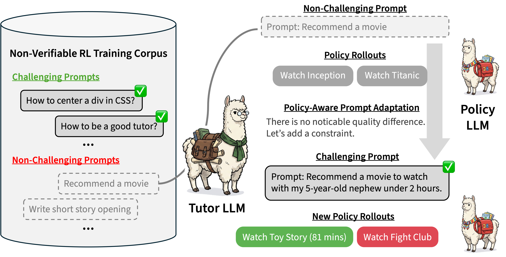
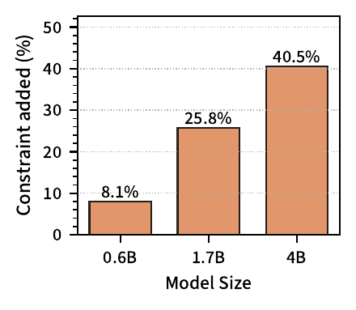
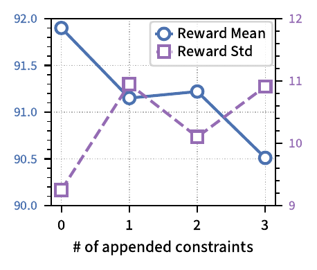
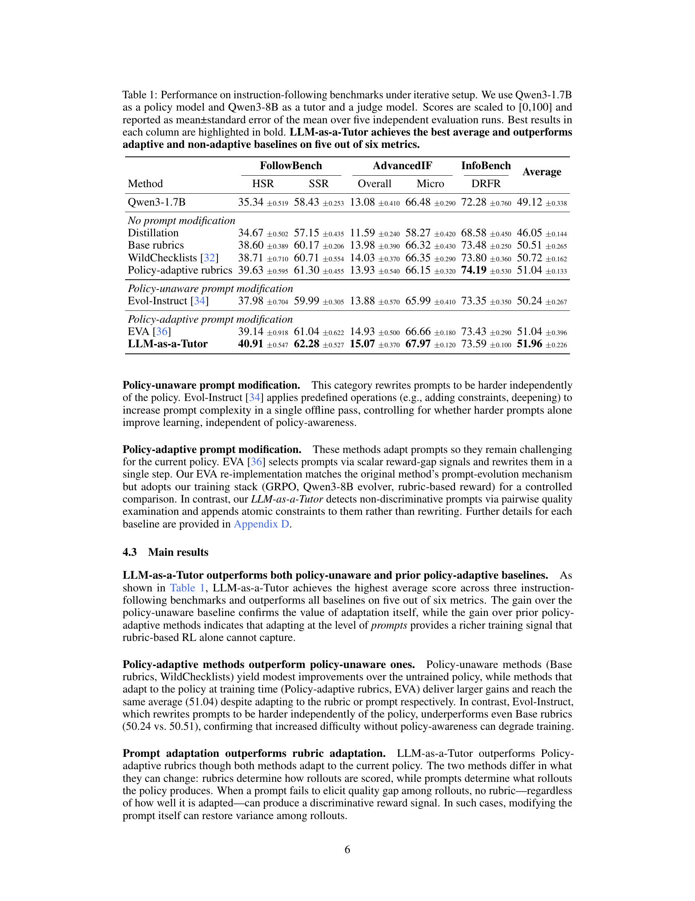
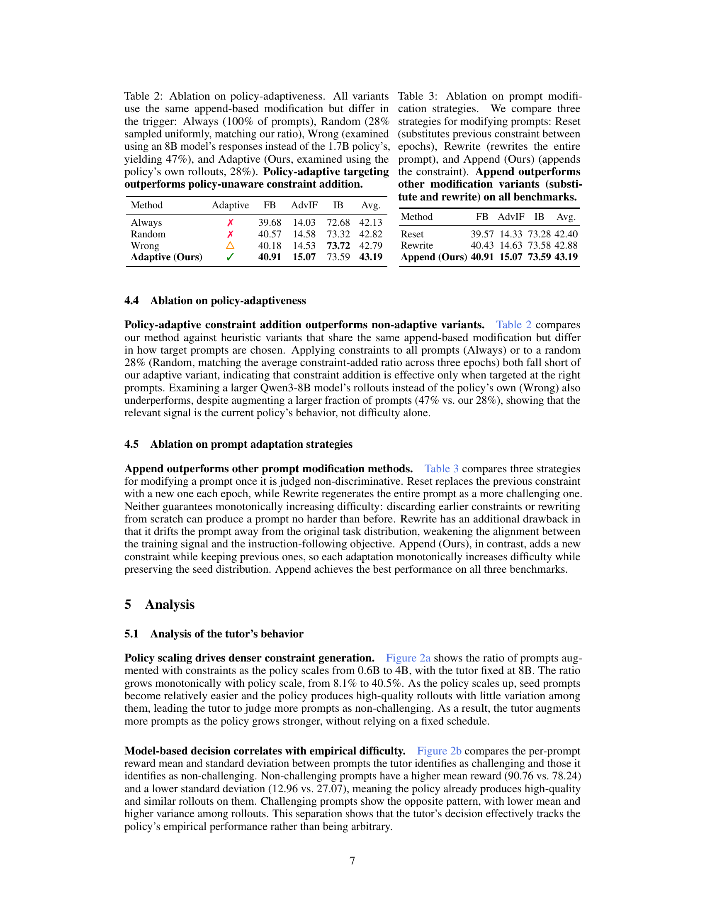
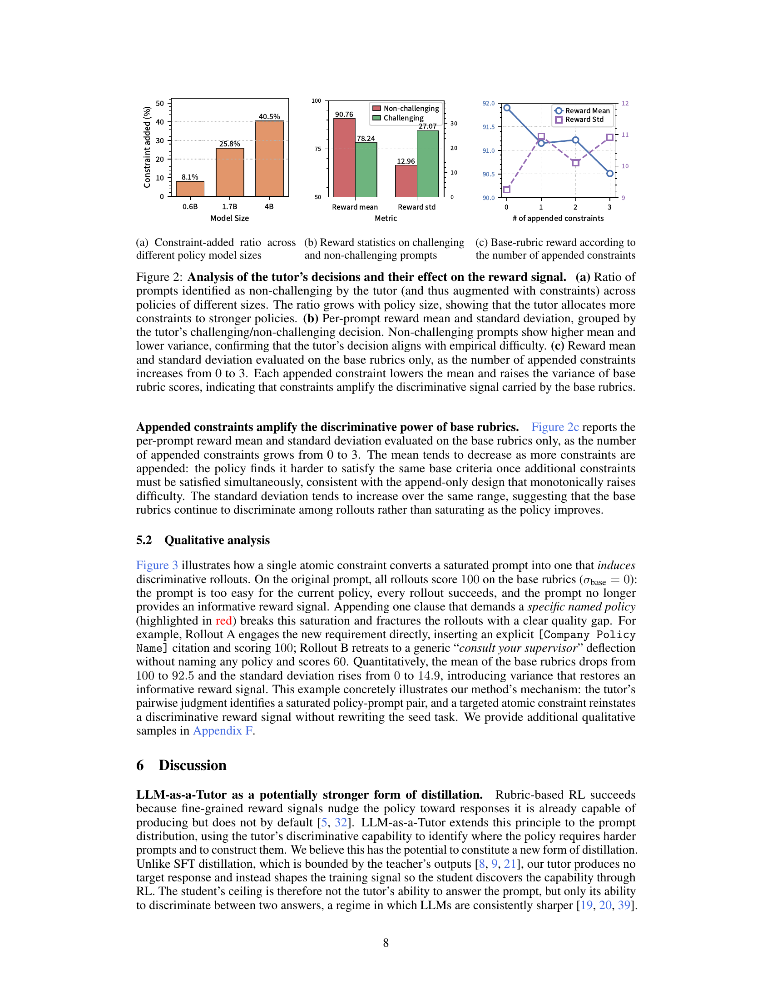

# LLM-as-a-Tutor: Policy-Aware Prompt Adaptation for Non-Verifiable RL

## TL;DR

LLM-as-a-Tutor extends the LLM's role from *judge* to *tutor* in non-verifiable RL. The tutor detects when training prompts are too easy for the current policy (eliciting no quality variance among rollouts) and appends atomic constraints to restore discriminability. This append-only design monotonically raises difficulty in step with the policy's capability, outperforming both policy-unaware baselines and prior policy-adaptive methods.

Source: [arXiv:2607.04412](https://arxiv.org/abs/2607.04412), [PDF](https://arxiv.org/pdf/2607.04412.pdf)

## Background

RL for non-verifiable instruction-following (e.g., writing quality, formatting compliance) relies on LLM judges as reward models. The standard approach uses prompt-specific rubrics: for each prompt $x$, a rubric $R(x) = \{(r_k, w_k)\}$ defines criteria $r_k$ with weights $w_k$, and the judge scores each rollout against these criteria. The reward is a weighted sum:

$$s(x, y) = \sum_{k=1}^K w_k \cdot \mathcal{J}(y \mid x, r_k)$$

where $\mathcal{J}$ is the LLM judge. Policy optimization uses GRPO with group-relative advantage normalization. Recent methods (WildChecklists, DR Tulu) adapt rubrics to the evolving policy, but the **training prompts themselves remain static** — drawn from fixed corpora like WildChat.

## Problem

When a prompt is too easy for the current policy, every rollout scores equally well, producing near-zero variance and a useless reward signal. This prompt-policy **misalignment** worsens as the policy improves under RL. Prior methods cannot fix this because they only adapt *rubrics* (how rollouts are scored) while leaving *prompts* (what the policy produces) unchanged. When all rollouts are uniformly good, no rubric can discriminate among them.

## Method

The framework uses a single model $\mathcal{T}$ (Qwen3-8B-Thinking) in two roles:

1. **Examiner (pairwise discriminativeness judgment)**: At each training iteration, the tutor samples two rollouts $y^{(1)}, y^{(2)} \sim \pi_\theta(\cdot \mid x)$ from the current policy and makes a binary judgment: are they *indistinguishable in quality*? If yes, the prompt is declared non-discriminative.

2. **Generator (constraint-based prompt adaptation)**: For non-discriminative prompts, the tutor generates an **atomic constraint** $c$ (a single, targeted requirement) along with matching rubric criteria $R_c$. The constraint is *appended* to form:

$$\tilde{x} = x \oplus c, \qquad \tilde{R}(x) = R(x) \cup R_c$$

Discriminative prompts pass through unchanged. The **append-only** design guarantees monotonic difficulty: any response satisfying $\tilde{x}$ must also satisfy $x$.

The tutor is invoked at the start of each training epoch, so constraints accumulate across iterations. As the policy improves, previously saturated prompts get new constraints, creating a self-calibrating curriculum.

### Key design choices

- **Pairwise judgment** over pointwise scoring: LLMs are sharper in comparisons.
- **Append** over rewrite: rewriting discards earlier constraints and drifts from the original distribution.
- **Atomic constraints**: each constraint targets a single underspecified dimension, avoiding compound requirements.

## Experiments

**Setup**: Policy = Qwen3-1.7B-Thinking, Tutor/Judge = Qwen3-8B-Thinking. Trained on 4K WildChat prompts for 3 epochs. Evaluated on FollowBench, AdvancedIF, and InfoBench.

### Main results

LLM-as-a-Tutor achieves the highest average score across all three benchmarks, outperforming all baselines on 5 of 6 metrics:

- **No prompt modification** baselines (Base rubrics, WildChecklists, Policy-adaptive rubrics): modest gains.
- **Policy-unaware modification** (Evol-Instruct): underperforms even Base rubrics, confirming that harder prompts without policy-awareness can hurt.
- **Policy-adaptive baselines** (EVA, Policy-adaptive rubrics): reach similar average (51.04), confirming the value of adaptation.
- **LLM-as-a-Tutor**: surpasses all, with prompt adaptation beating rubric adaptation alone.

### Ablations

- **Policy-adaptive targeting**: applying constraints to all prompts (Always) or random 28% (Random) underperforms adaptive selection. Using a larger model's rollouts (Wrong, 47% ratio) also underperforms, confirming the need for the *current policy's* signal.
- **Append vs. Reset vs. Rewrite**: Append outperforms both alternatives. Reset discards difficulty escalation; Rewrite drifts from the seed distribution.
- **Scaling**: gains persist as the policy scales up (0.6B to 4B) and improve as the generator scales up.

### Analysis

- Prompts judged non-challenging have higher mean reward (90.76 vs. 78.24) and lower std (12.96 vs. 27.07), validating the tutor's binary judgment.
- Appended constraints amplify base rubric discriminative power: mean reward drops and std increases as constraints accumulate.
- Policy scaling drives denser constraint generation (8.1% at 0.6B to 40.5% at 4B).

## Critical Analysis

**Strengths**:
- Identifies and addresses a genuine limitation: prompt saturation in non-verifiable RL.
- Simple, elegant solution: append-only atomic constraints with pairwise judgment.
- Clean ablation isolating the effect of each design choice.
- Consistent gains across diverse benchmarks and model scales.

**Limitations**:
- Only tested with Qwen3 models; generalizability to other model families is unknown.
- Single tutor/judge model (8B) — the tutor's discriminativeness judgment quality is not separately evaluated.
- 4K prompt training set is relatively small; open question how well this scales to larger, more diverse corpora.
- The append-only design could produce very long prompts after many iterations, potentially exceeding context windows or diluting the original task.

## Implementation Notes

- If implementing, the pairwise judgment prompt is critical — it must reliably detect quality indistinguishability without being overly sensitive.
- The constraint generator should produce *atomic* constraints (single dimension) — compound constraints mix signals and reduce interpretability.
- The adaptation interval (epoch-level in this work) is a hyperparameter; shorter intervals may be better for rapidly improving policies.
- For production: pair this with rubric-based reward (not scalar reward) to maximize the benefit of prompt adaptation.

## Captured Figures and Tables

