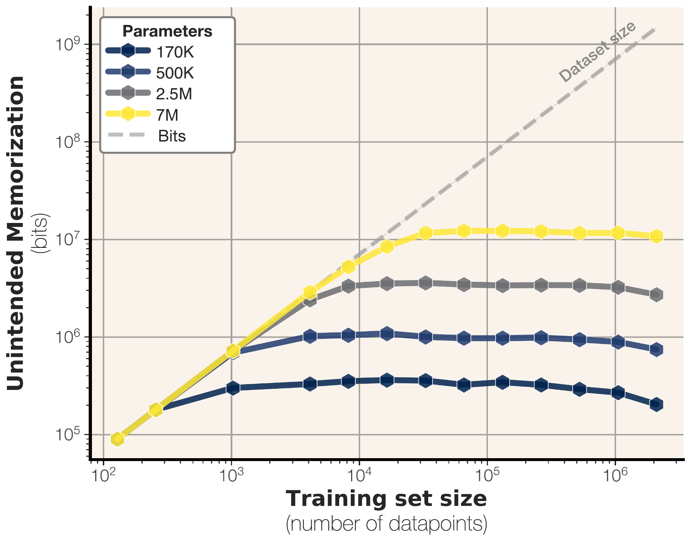
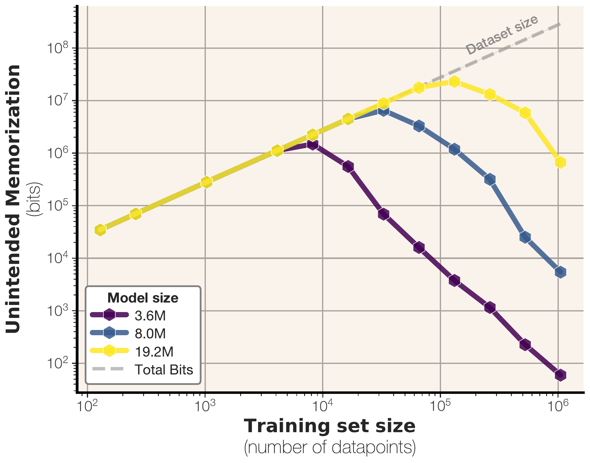
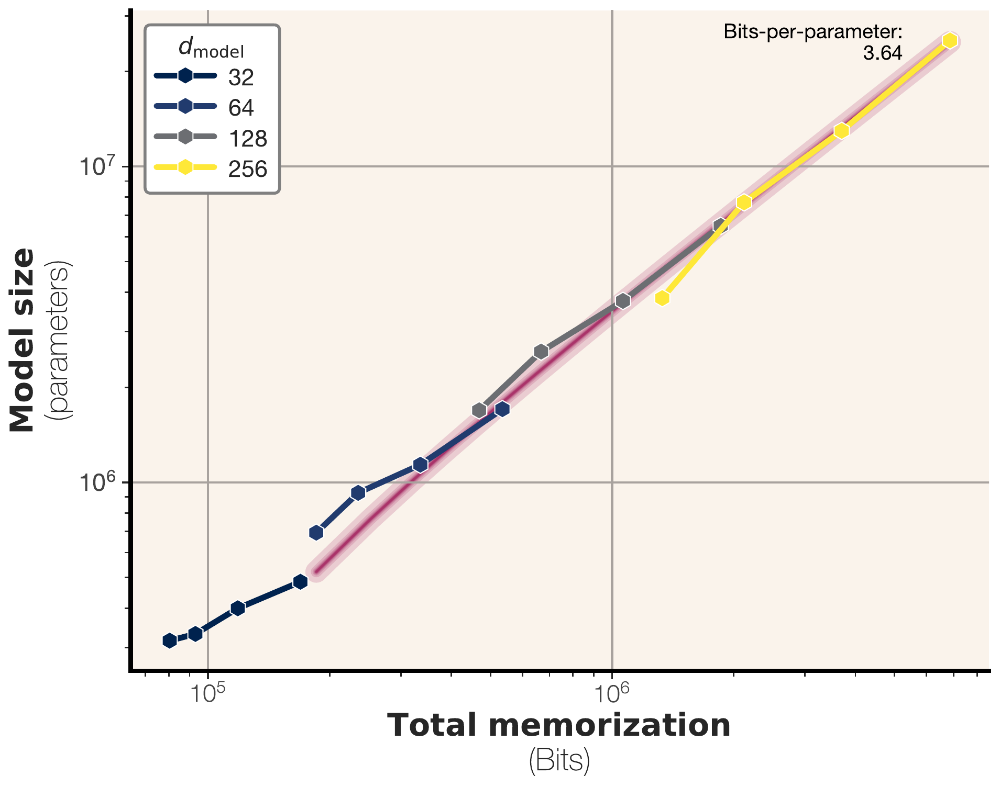
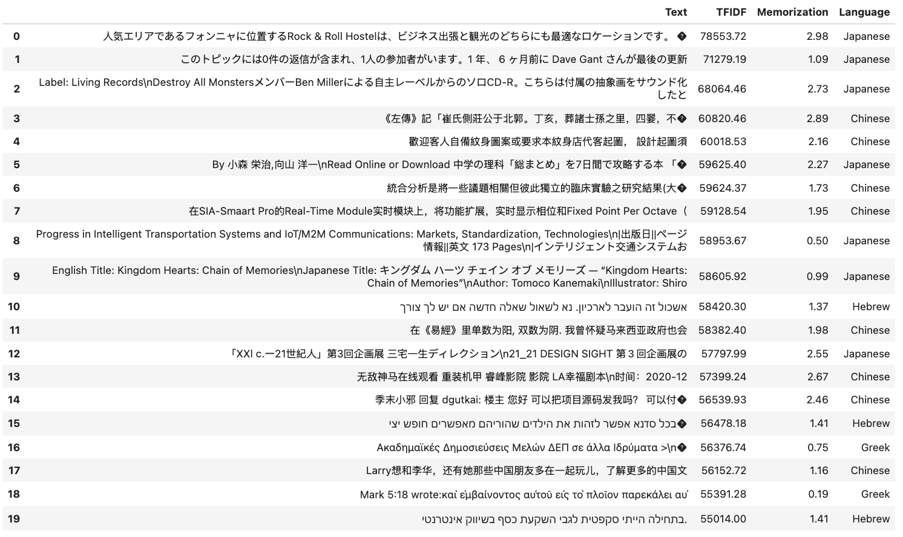
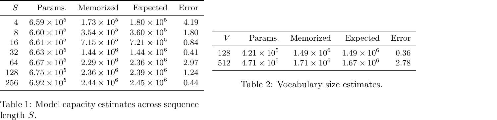
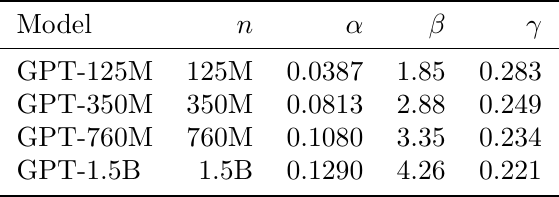

# How much do language models memorize?

## TL;DR

This paper proposes a formal information-theoretic decomposition of memorization into *unintended memorization* (sample-level dataset information) and *generalization* (population-level pattern learning), then uses this framework to estimate the storage capacity of GPT-style transformers at approximately **3.6 bits per parameter**. Training hundreds of models from 500K to 1.5B parameters on synthetic bitstrings and real text, the authors show that models memorize until capacity saturates, at which point *grokking* begins and generalization takes over — and that double descent occurs exactly when data size exceeds model capacity. They also derive scaling laws linking capacity, data size, and membership inference success.

Source: [arXiv:2505.24832](https://arxiv.org/abs/2505.24832), [PDF](https://arxiv.org/pdf/2505.24832.pdf).

## Background

Understanding whether LLMs memorize or generalize is critical for privacy (membership inference, extraction attacks), interpretability (what does the model "know"?), and training methodology (when does double descent happen?). Prior work defines memorization primarily through **extraction** — can you prompt the model to reproduce training text? — but this is neither necessary nor sufficient: a model can generalize to produce unseen text, and a model can memorize patterns without reproducing them verbatim. Alternative definitions based on differential privacy or influence functions measure properties of the *training algorithm*, not the *trained model itself*.

## Problem

The paper formalizes the core challenge: given a trained model $\hat{\theta}$ and a dataset $x$, how much information does $\hat{\theta}$ contain about $x$ *beyond* what it knows about the general data distribution? The authors decompose total memorization into:

- **Unintended memorization** ($\text{mem}_U$): information about a specific dataset that goes beyond the true data-generating process.
- **Generalization** ($\text{mem}_I$): information about the true data-generation process itself.

The goal is to define these quantities at the *sample level*, for a *single trained model* (not a distribution of training runs), and independent of the training algorithm.

## Method

The authors use Kolmogorov complexity as a bridge. For a model $\hat{\theta}$ and a reference model $\theta$ (a larger oracle trained on the full distribution), unintended memorization of a datapoint $x$ is:

\[
\text{mem}^K_U(x, \theta, \hat{\theta}) = H^K(x \mid \theta) - H^K(x \mid (\theta, \hat{\theta}))
\]

where $H^K(\cdot)$ is Kolmogorov complexity. In practice, this is approximated via compression rates from model likelihoods: $-\log p(x \mid \hat{\theta})$ gives the codelength of $x$ under $\hat{\theta}$.

**Capacity** is defined as the maximum total memorization over all datasets for a given model architecture and training algorithm.

To measure capacity empirically, the authors:

1. **Synthetic setting**: Train GPT-2 style transformers on uniformly random bitstrings (no generalization possible). Total memorization equals unintended memorization, providing a clean capacity measurement.
2. **Text setting**: Repeat on FineWeb text data with careful deduplication. Compare against a reference oracle model to separate generalization.
3. **Scaling laws**: Fit power-law relationships between model size, data size, and membership inference F1.

Models range from ~100K to ~20M parameters for synthetic experiments, plus up to 1.5B parameters for scaling-law validation.

## Experiments

**Capacity estimate**: Across 20+ architecture configurations, GPT-style transformers store **3.5–3.6 bits per parameter** in bfloat16, rising to ~3.83 in fp32 — far less than the 2× increase in bit precision would suggest, meaning most extra bits from higher precision are unused for storage.

**Memorization then generalization**: On text data, models memorize completely when dataset size is small. As data grows, unintended memorization saturates at the capacity limit, then *decreases* as generalization takes over — the model shifts from storing individual samples to learning reusable patterns.

**Double descent**: The paper shows that double descent begins exactly when dataset capacity (in bits) exceeds model capacity. This is a mechanistic explanation: once the model can no longer memorize all datapoints individually, it is forced to share information between them, producing generalization and a drop in test loss.

**Membership inference scaling**: F1 follows a clean scaling law: bigger models memorize more individual samples (making MI easier), but larger datasets dilute per-sample memorization (making MI harder). The authors predict that most modern LLMs trained on trillions of tokens are past the point where reliable membership inference on average data points is possible.

**Extraction**: For large datasets, successful extraction rates converge to the test-set extraction rate — meaning extraction success is mostly attributable to generalization, not memorization.

## Critical Analysis

This is one of the cleanest formal treatments of LLM memorization I have seen. The key contribution is *not* the numerical capacity estimate (3.6 bpp) but the framework itself: it gives researchers a principled way to answer "how much does this particular model know about this particular datapoint?" without running counterfactual training.

The synthetic experiments are methodologically sound — training on random bitstrings eliminates generalization by construction, making the capacity measurement rigorous. The transition from synthetic to real text is handled well through the oracle reference model trick.

The double-descent connection is particularly satisfying. Prior work observed the phenomenon empirically; this paper gives a capacity-based explanation.

**Limitations**:

- The capacity estimate is a *lower bound* (gradient descent doesn't guarantee optimal storage), and the paper acknowledges this. Actual capacity may be higher.
- The reference model choice matters for text experiments. The oracle model is larger and trained on more data, but the decomposition depends on this choice.
- All experiments are at relatively small scale (up to 20M params for the core capacity measurements, 1.5B for scaling-law validation). Extrapolation to 100B+ models is plausible but unvalidated.
- The membership inference scaling law uses loss-based MI, which is the simplest possible attack. More sophisticated attacks (likelihood ratio, reference-based) may behave differently.

## Implementation Notes

For practitioners, the most actionable findings are:

1. **Privacy auditing**: Membership inference on average data points is increasingly futile at modern training scales. Focus on outlier/canary samples instead.
2. **Data curation**: The capacity-based framing suggests that deduplication is essential for accurate memorization measurement — duplicates artificially inflate memorization statistics.
3. **Model selection for data efficiency**: A model's capacity (in bits) is approximately 3.6 × parameter count. If your total training data exceeds ~10× the model's capacity in bits, the model is likely generalizing rather than memorizing individual samples.
4. **Double descent prediction**: The dataset-to-capacity ratio predicts where double descent occurs — a useful diagnostic for training runs.

## Captured Figures and Tables

