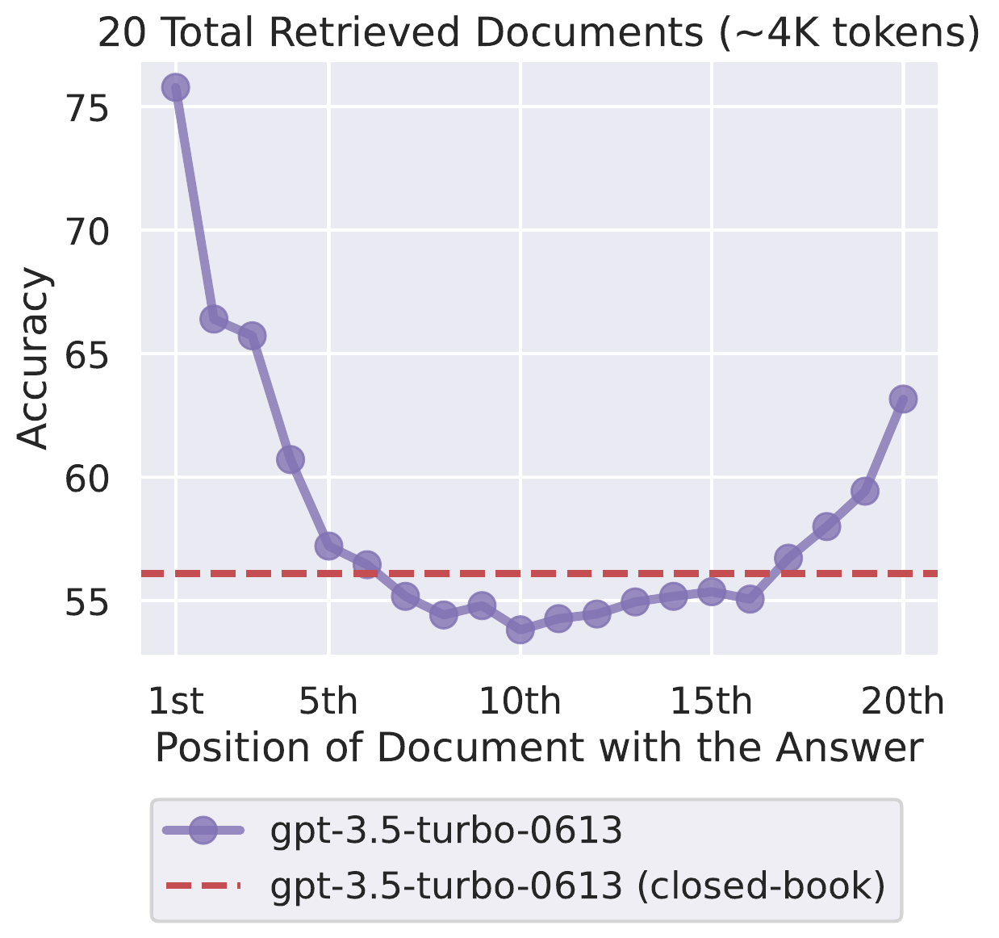
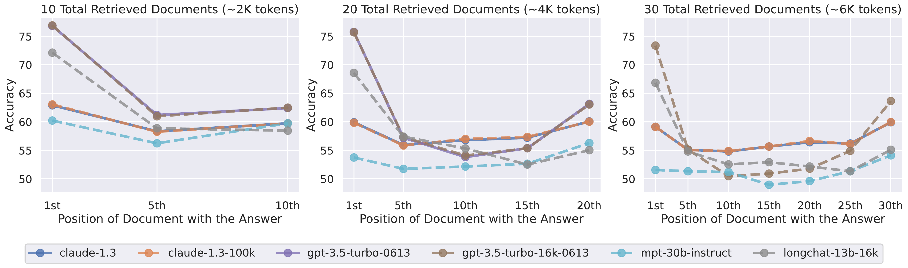
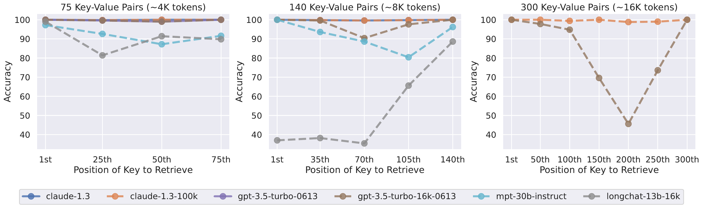
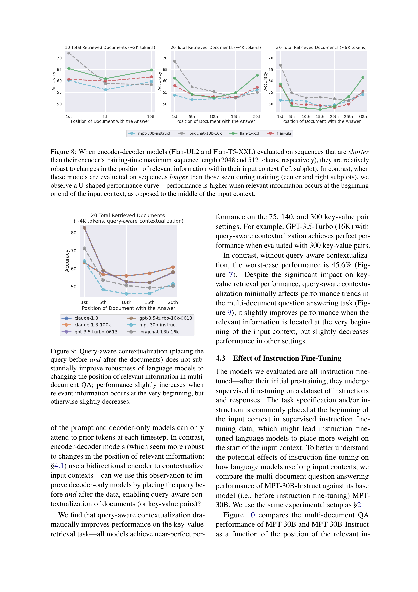
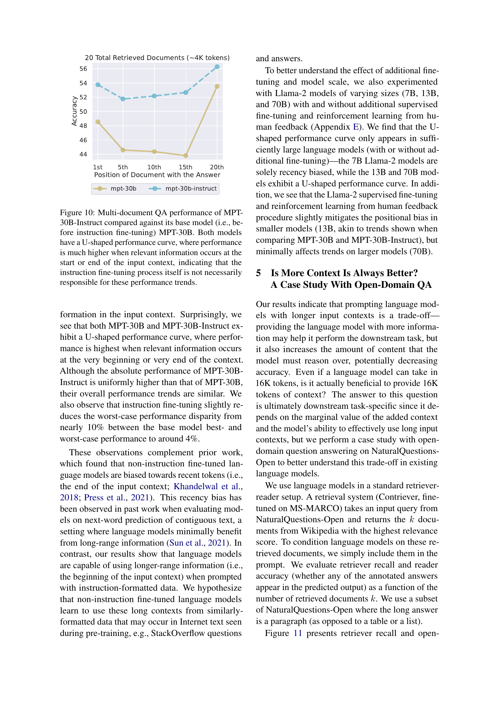
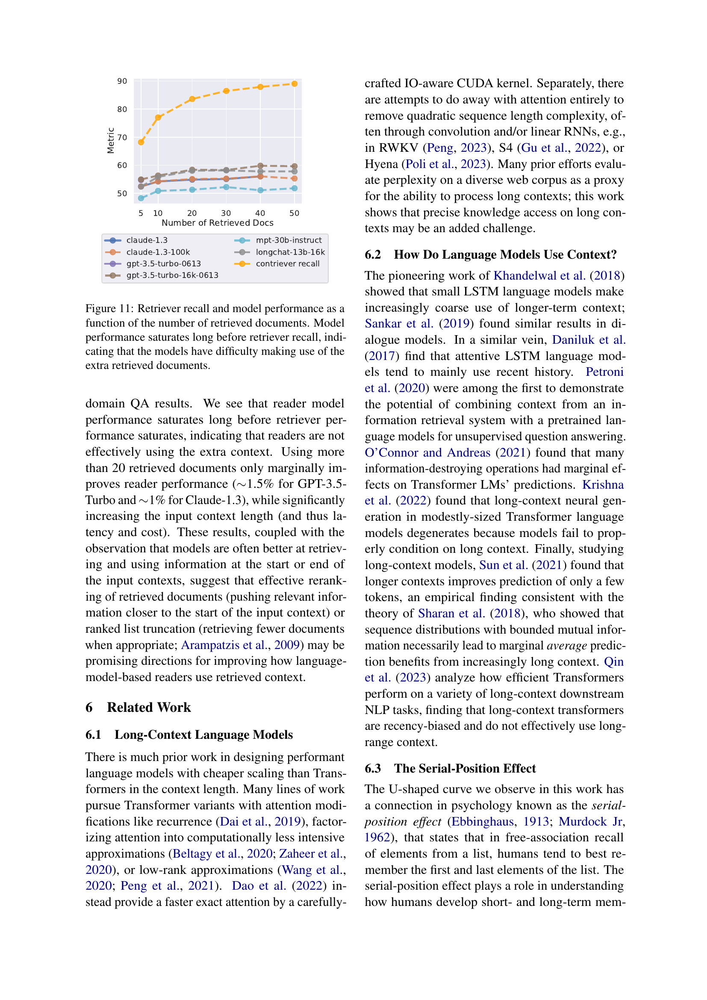

# Lost in the Middle: How Language Models Use Long Contexts

## TL;DR

Language models exhibit a U-shaped performance curve when relevant information is placed at different positions in long input contexts: they perform best when relevant information is at the very beginning (primacy bias) or end (recency bias), and degrade significantly when it is in the middle. This holds across multi-document QA and key-value retrieval tasks, and even for models specifically designed for long contexts. The paper introduced the now-standard "lost in the middle" evaluation protocol.

Source: [arXiv:2307.03172](https://arxiv.org/abs/2307.03172), [PDF](https://arxiv.org/pdf/2307.03172.pdf). Published in TACL 2023. Code: [github.com/nelson-liu/lost-in-the-middle](https://github.com/nelson-liu/lost-in-the-middle)

## Background

As LLMs grew to support longer context windows (4K, 8K, 16K+ tokens), a natural question emerged: do models actually use all that context effectively? Prior work evaluated models on tasks requiring long-context understanding (e.g., summarization, QA over long documents), but few studies systematically controlled for where relevant information appears within the context. The position of relevant information was treated as a nuisance variable rather than an independent variable.

## Problem

How robustly do language models use information at different positions within their input context? Specifically, if the answer to a question appears at the beginning, middle, or end of a long input, does model performance change? The paper studies two tasks:

1. **Multi-document question answering**: Given N documents (only one of which contains the answer), can the model identify and use the correct document?
2. **Key-value retrieval**: Given a list of key-value pairs, can the model look up the value for a specified key?

## Method

**Multi-document QA**: Uses the Natural Questions dataset. For each question, the authors retrieve 10, 20, or 30 documents (one relevant, the rest distractors) using a Contriever-MSMARCO retriever. The key manipulation is the **position** of the relevant document within the input context (position 1 = first document, position N = last). Models are evaluated by exact-match accuracy of the generated answer.

**Key-value retrieval**: A synthetic task where each key-value pair is a 128-bit UUID. The input context contains 75, 140, or 300 pairs. Models must output the value matching a query key. This tests pure lookup ability without the confounding factor of language understanding.

**Models tested**: GPT-3.5-Turbo (4K and 16K variants), GPT-4 (8K), MPT-30B-Instruct, LongChat-13B (16K), Claude-1.3 (100K), FLAN-UL2, FLAN-T5, and Llama-2 variants.

## Experiments

### Multi-Document QA

The signature finding is a clear U-shaped performance curve (Figure 1). For example, on 20-document QA:

- **Best performance**: When the relevant document is at position 1 (first), GPT-3.5-Turbo achieves ~68% accuracy.
- **Worst performance**: When the relevant document is near the middle (position 10), accuracy drops to ~42% — worse than the closed-book setting (56.1%), meaning the model would have been better off with no documents at all.
- **Recency effect**: Performance partially recovers for the last position.

This pattern holds across model scales, context window sizes, and numbers of documents. Even GPT-4 and Claude-1.3, which have much larger context windows, show the same U-shaped degradation.

### Key-Value Retrieval

The same U-shaped pattern appears in the synthetic task. Models are best at retrieving key-value pairs at the beginning or end of the list and degrade in the middle. Notable exceptions: Claude-1.3 achieves near-perfect performance regardless of position, and query-aware contextualization (placing the query before and after the documents) makes all models perfect on this task.

### Encoder-Decoder vs. Decoder-Only

Encoder-decoder models (FLAN-UL2, FLAN-T5) are relatively robust to position changes when the input is shorter than their encoder's training-time maximum length. But when inputs exceed that length (requiring truncation), they exhibit the same U-shaped pattern as decoder-only models.

### Instruction Fine-Tuning

Comparing MPT-30B-Instruct with base MPT-30B shows that instruction fine-tuning somewhat reduces the magnitude of the position effect, but does not eliminate it.

### Open-Domain QA Case Study

In a realistic retrieval-augmented generation setup, reader model performance saturates at around 10-20 retrieved documents. Adding more documents (up to 50) barely improves accuracy despite significantly increasing input length, because the model cannot effectively use the extra context.

## Critical Analysis

**Strengths**:
- Simple, controlled, and highly reproducible experimental design.
- The U-shaped performance finding is robust across models, tasks, and context lengths.
- Practical implications for RAG systems: rerank retrieved documents to push relevant ones to the beginning.
- Established a standard evaluation protocol now widely adopted by subsequent long-context work.

**Limitations**:
- Only tests two tasks (QA and key-value retrieval); other uses of long context (e.g., summarization, in-context learning) may show different patterns.
- All input documents are in English text; positional effects may differ for code, structured data, or multilingual inputs.
- The paper predates many modern long-context models (Gemini, Llama-3, Claude-3/4) — subsequent work has shown both improvements and persistent issues.
- Does not investigate root causes (e.g., attention dilution, position encoding, training data distribution).

## Implementation Notes

- **For RAG systems**: Always place the most relevant retrieved documents at the beginning of the context. Consider reranking or truncating to the top K (10-20) documents rather than adding many.
- **For prompt engineering**: Put the most critical instructions or information at the very beginning or end of the prompt.
- **For evaluation**: Any claim that a model "uses long contexts" should include position-controlled evaluation showing minimal difference between best- and worst-case performance.
- The query-aware contextualization trick (placing the query both before and after the documents) eliminates the position effect for synthetic key-value retrieval, but minimally helps for real QA.

## Captured Figures and Tables

