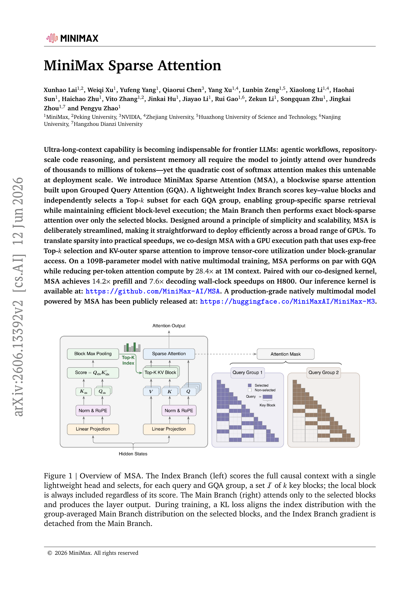
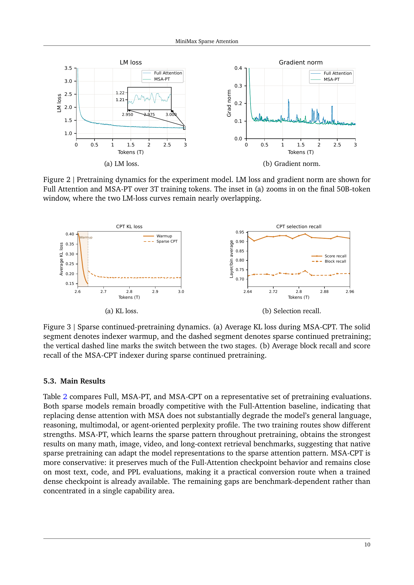
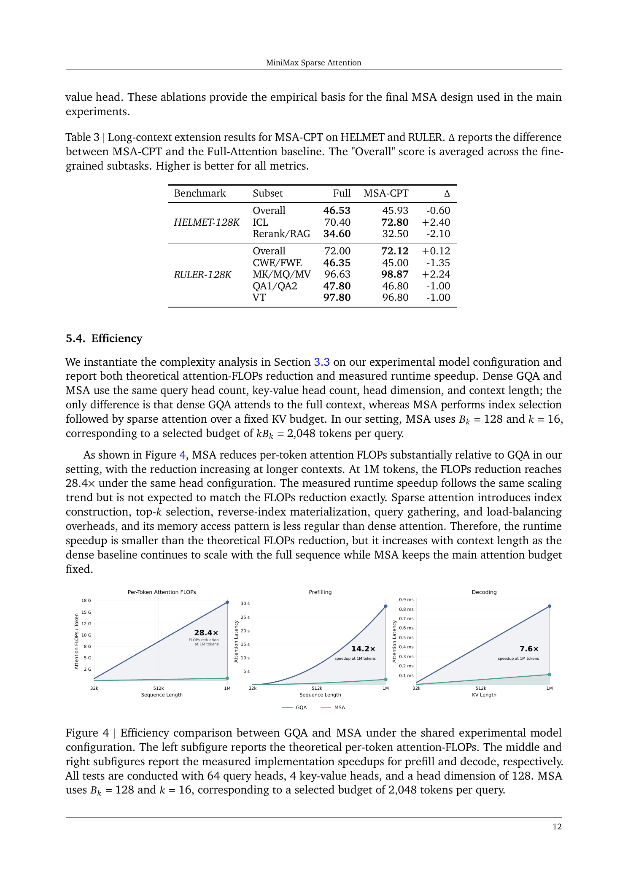
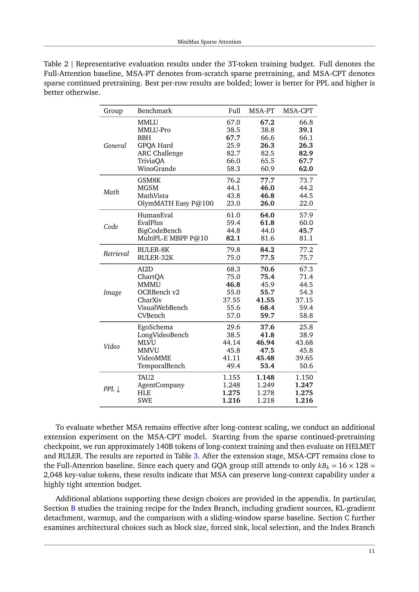

# MiniMax Sparse Attention

## TL;DR

MiniMax Sparse Attention (MSA) is a GQA-native block-sparse attention design for million-token LLM contexts. It adds a lightweight Index Branch that scores key-value blocks per GQA group, selects a small Top-k block set, and lets the Main Branch run exact softmax attention only over those selected blocks. On a 109B-parameter native multimodal MoE model, the paper reports quality close to a full-attention GQA baseline while reducing per-token attention FLOPs by 28.4x at 1M context and achieving 14.2x prefill and 7.6x decode speedups on H800 with a co-designed sparse kernel.

Source: [arXiv:2606.13392](https://arxiv.org/abs/2606.13392), [PDF](https://arxiv.org/pdf/2606.13392.pdf), [code](https://github.com/MiniMax-AI/MSA), [model](https://huggingface.co/MiniMaxAI/MiniMax-M3)

## Background

Long-context models are increasingly used for agentic workflows, repository-scale code reasoning, persistent memory, multimodal documents, and long tool traces. The bottleneck is that ordinary causal softmax attention scales quadratically with sequence length. Grouped Query Attention reduces KV-head count, but dense GQA still attends over the full prefix for every query, so the long-context cost remains dominated by attention.

One response is to replace attention with linear or recurrent alternatives. Another is to keep softmax attention but reduce the support, either with fixed patterns such as sliding windows or with adaptive retrieval of important tokens. MSA takes the second route. It keeps exact softmax attention on the selected tokens, but learns a cheap selector that chooses which key-value blocks each GQA group should see.

## Problem

The core problem is to make ultra-long context practical without retraining model users into a weaker architecture. The paper wants a sparse attention layer that:

- preserves the GQA structure used by many frontier LLMs,
- can be trained from scratch or converted from a dense GQA checkpoint,
- selects content-dependent context instead of only a fixed local window,
- maps to efficient GPU kernels rather than only saving theoretical FLOPs.

For dense causal GQA, the attention cost grows as:

\[
F_{\mathrm{GQA}}(N) = 2 H_q d_h N^2.
\]

MSA aims to replace the full prefix with a fixed selected budget \(kB_k\), while paying only a lightweight index cost:

\[
F_{\mathrm{MSA}}(N) = H_{kv} d_{\mathrm{idx}} N^2 + 4 H_q d_h N kB_k.
\]

The benefit grows when \(kB_k \ll N\) and the index dimension is small relative to the main attention heads.

## Method

MSA splits attention into an Index Branch and a Main Branch. The Index Branch adds two projections to a standard GQA layer:

\[
Q^{\mathrm{idx}} = XW_q^{\mathrm{idx}}, \qquad K^{\mathrm{idx}} = XW_k^{\mathrm{idx}}.
\]

It has one index query head per GQA group and a single shared index key head. For a query token \(i\) and group \(r\), it scores visible tokens, max-pools those scores into key-value blocks, and selects the Top-k blocks:

\[
I_i^{(r)} = \mathrm{TopK}_b(M_{i,b}^{\mathrm{idx},(r)}, k).
\]

The local block containing the current token is always included. The Main Branch then applies ordinary scaled dot-product softmax attention only over the causally visible tokens inside the selected blocks:

\[
O_i^{(h)} =
\mathrm{softmax}\left(
\frac{Q_i^{(h)} K^{(r)}[I_i^{(r)}]^\top}{\sqrt{d_h}}
\right)V^{(r)}[I_i^{(r)}].
\]

The non-differentiable Top-k decision is trained with a KL alignment loss. On the selected support, the Index Branch distribution is matched to a group-averaged Main Branch attention distribution. The paper also uses stop-gradient at the index input so the auxiliary KL objective updates only the index projections rather than reshaping the backbone.

Training uses a warmup phase in which the Main Branch still runs full attention while the Index Branch learns against full attention. After warmup, sparse routing is enabled. The same recipe supports both native sparse pretraining (MSA-PT) and sparse continued pretraining from a full-attention checkpoint (MSA-CPT).

The kernel design is a substantial part of the contribution. The authors use exp-free Top-k selection over raw scores, because softmax preserves ordering, and a KV-outer sparse attention schedule that gathers the queries selecting each KV block. This improves tensor-core utilization under block-sparse access and avoids the poor arithmetic intensity of naive query-outer sparse attention. Hot KV tiles are split into chunks, and partial outputs are combined in a second phase without atomics.

## Experiments

The main experiments use a 109B-parameter MoE model with 6B activated parameters per token, 41 layers, 64 query heads, 4 KV heads, head dimension 128, and native multimodal training. MSA uses block size \(B_k = 128\) and \(k = 16\), so each query and GQA group attends to at most 2,048 selected KV tokens.

Two training routes are evaluated:

- MSA-PT: sparse model trained from scratch for a 3T-token budget after a 40B-token indexer warmup.
- MSA-CPT: full-attention checkpoint trained for 2.6T tokens, converted to MSA, then continued for 400B tokens with a 40B-token warmup.

The results show that both sparse variants remain close to the full-attention baseline across general reasoning, math, code, retrieval, image, video, and agent-oriented perplexity benchmarks. MSA-PT is often strongest on math, multimodal, and retrieval tasks, while MSA-CPT is a practical conversion route that preserves much of the dense checkpoint behavior.

For long-context extension, MSA-CPT is further trained on about 140B long-context tokens. At 128K context, it reports HELMET overall 45.93 versus 46.53 for full attention, and RULER overall 72.12 versus 72.00. This is notable because the selected budget remains only 2,048 KV tokens per query.

Efficiency is the headline result. At 1M context, MSA reports a 28.4x per-token attention-FLOPs reduction relative to dense GQA. The deployed kernel reaches 14.2x prefill speedup and 7.6x decoding speedup on H800. Runtime gains are smaller than FLOP gains because sparse routing adds index construction, Top-k selection, reverse-index materialization, query gathering, and load balancing overhead.

## Critical Analysis

The strongest aspect of the paper is that it treats sparsity as a full stack problem. The model design, training objective, conversion path, and GPU execution path are co-designed. This matters because many sparse-attention ideas look good on FLOP counts but fail to become wall-clock improvements once irregular memory access and under-filled matrix multiplies are included.

The GQA-group framing is also practical. Rather than choosing one global sparse support for all heads or a fully per-head token-level support that is difficult to execute efficiently, MSA shares block selections within each GQA group. That gives some head diversity while keeping KV access block-regular.

The experimental scale is unusually useful: 109B parameters, multimodal data, 3T tokens, conversion from dense checkpoints, and million-token efficiency measurements. The long-context extension results suggest that a fixed 2,048-token selected budget can preserve a surprising amount of retrieval capability.

There are still caveats. First, the evidence is mostly from one architecture family and hardware stack. The kernel claims are credible, but the exact speedups may depend heavily on H800 characteristics, GQA ratio, block size, context length distribution, and batching regime.

Second, the selected budget is fixed in the main setup. A fixed \(kB_k\) budget is easy to optimize, but real workloads may need adaptive budgets: short prompts do not need much sparsity, while adversarial retrieval or dense code reasoning might benefit from temporarily expanding the selected support.

Third, the paper reports close average quality, but sparse failure modes may be uneven. A model can match aggregate benchmark scores while still missing rare dependencies that dense attention would keep. This is especially important for agent memory, legal/medical retrieval, and codebase-wide reasoning, where the cost of missing one relevant span can be high.

Finally, the conversion story is promising but not free. MSA-CPT still uses 400B continuation tokens in the reported setup. That is practical for a frontier lab, but expensive for many teams that only want to sparsify an already-trained model.

## Implementation Notes

For practitioners, the main lesson is to keep the sparse selector aligned with the execution unit. MSA selects contiguous KV blocks, not arbitrary individual tokens, because block granularity is what the kernel can exploit.

The training recipe also points to a safe pattern for learned routing. A non-differentiable selector needs a direct supervision signal, but that signal should not accidentally become a second objective on the backbone. MSA's stop-gradient rule makes the KL loss local to the Index Branch:

\[
Q^{\mathrm{idx}} = \mathrm{stopgrad}(X)W_q^{\mathrm{idx}}, \qquad
K^{\mathrm{idx}} = \mathrm{stopgrad}(X)W_k^{\mathrm{idx}}.
\]

The warmup phase is another important engineering detail. Starting sparse selection from random index projections can starve the Main Branch of useful tokens. Running full attention while the indexer learns gives the sparse path a better initialization before it controls routing.

For deployment, the kernel design implies that model-level sparsity should be planned together with serving constraints. Block size, Top-k, GQA ratio, query batching, reverse-index construction, and combine-kernel overhead all affect whether sparse attention is actually faster.

## Captured Figures and Tables

