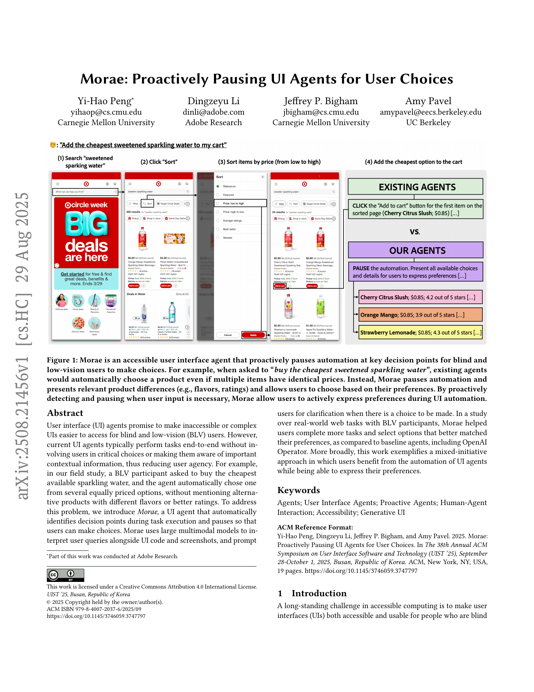
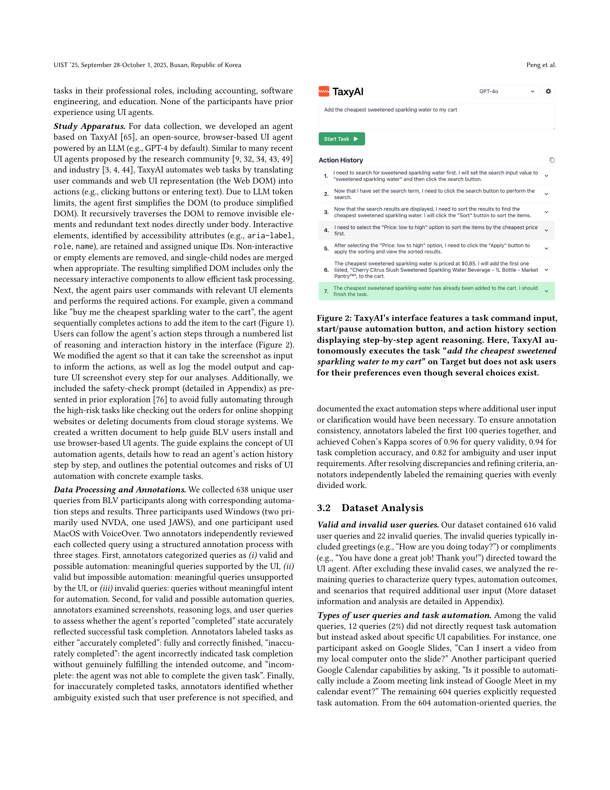
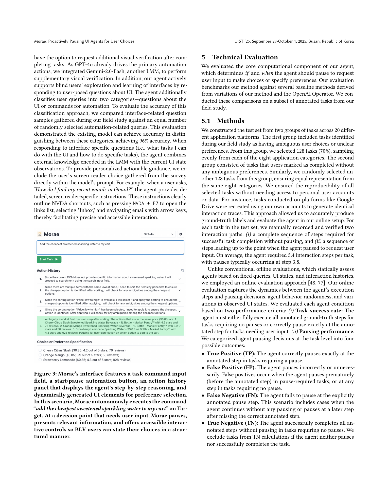
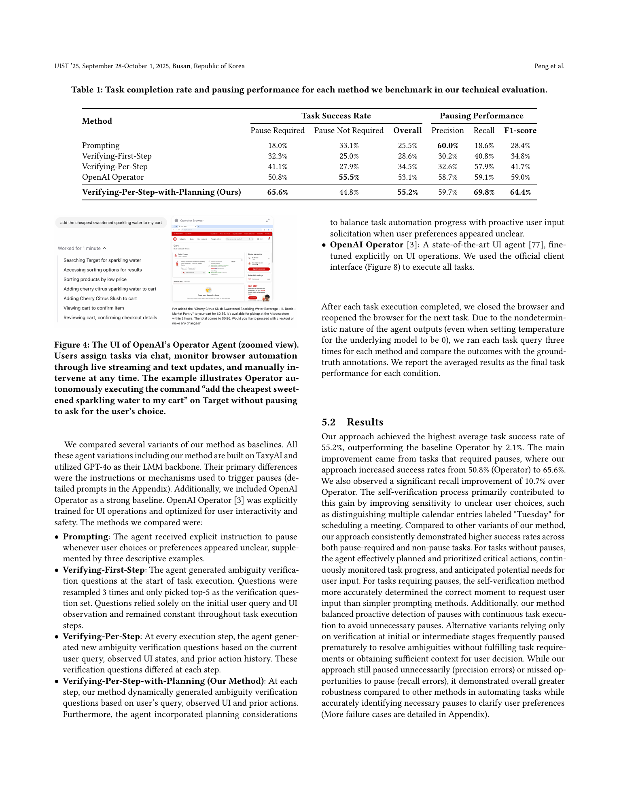
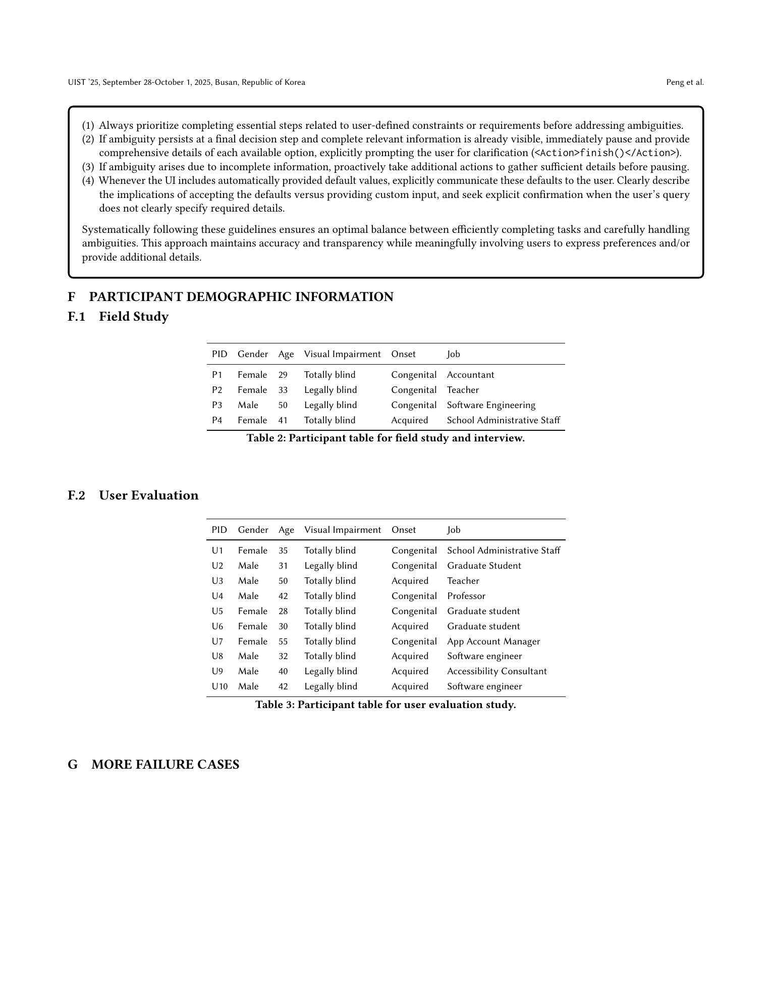

# Morae: Proactively Pausing UI Agents for User Choices

## TL;DR

Morae is a mixed-initiative UI agent for blind and low-vision (BLV) users. Instead of treating automation as a fully end-to-end process, it detects moments where the user's preference is unclear, pauses, presents the relevant alternatives through accessible generated controls, and then continues after the user chooses. In a 256-task technical evaluation, Morae's dynamic ambiguity verification reached 55.2% overall task success and improved pause-required task success to 65.6%, compared with 53.1% overall and 50.8% pause-required success for OpenAI Operator. In a 10-participant BLV user study, participants preferred Morae, made more preference-aligned decisions, and completed more tasks than with TaxyAI or Operator.

Source: [arXiv:2508.21456](https://arxiv.org/abs/2508.21456), [PDF](https://arxiv.org/pdf/2508.21456.pdf)

## Background

Modern UI agents can execute browser tasks from natural language: search for a product, fill in a form, schedule a calendar event, or edit a document. For sighted users, the surrounding screen often provides enough context to notice when an agent silently chooses among alternatives. For BLV users, that assumption breaks. A screen reader linearizes the interface, and an autonomous agent may move through pages faster than the user can inspect each decision point.

The paper starts from this accessibility gap. In a one-week field study, four BLV participants used a browser UI agent on real web tasks. The authors collected 638 unique queries and analyzed 576 feasible automation requests. The agent reported "completed" on 484 tasks, but only 189 were actually completed correctly. Among the inaccurate completions, 107 were underspecified requests and 75 involved multiple valid options matching the user's command. In follow-up interviews, participants often did not realize that alternatives existed; in 95% of the ambiguous situations discussed, users had been unaware that the agent had skipped a meaningful choice.

That finding reframes UI automation. The problem is not only whether an agent can complete a task, but whether the agent preserves the user's agency when the task contains choices.

## Problem

The core problem is to decide when a UI agent should keep acting autonomously and when it should stop to ask the user. A naive "ask whenever anything is ambiguous" policy can be annoying and premature, because the agent may not yet have gathered enough UI state to present a useful choice. A naive "finish the task whenever possible" policy can hide meaningful alternatives, especially for BLV users who cannot visually monitor the page.

Morae targets three failure modes:

- Selection ambiguity: multiple visible options satisfy the command, such as equally priced products with different flavors or ratings.
- Specification ambiguity: the command leaves required fields or defaults unspecified, such as date, time, ticket type, or layout style.
- Outcome opacity: the agent reports progress or completion, but the BLV user cannot independently verify what changed.

The system therefore needs a pause policy that is both context-sensitive and progress-aware: it should execute critical actions needed to reveal the relevant options, then pause at the point where user input is actually useful.

## Method

Morae extends TaxyAI as a Chrome-extension UI agent. At each interaction step, it observes a reduced DOM tree plus a screenshot, sends the user command, UI state, and prior action history to an LMM, and chooses the next action. The reported implementation uses GPT-4o for core automation and Gemini-2.0-flash for supplementary visual verification.

The main technical mechanism is Dynamic Verification of Ambiguous Choices. At step \(i\), Morae considers the user command \(Q\), current UI observation \(V(i)\), and action history \(H(i)\). It separates planned actions into critical and non-critical actions:

\[
P(i) = P_c(i) \cup P_n(i), \qquad P_c(i) \cap P_n(i) = \emptyset.
\]

Critical actions are those needed to satisfy user constraints or reveal information that makes ambiguity verification meaningful. For example, if the user asks for the cheapest item, sorting by price is critical before asking which item to choose.

Morae then generates and answers ambiguity-verification questions at each important step. The agent sets an ambiguity indicator:

\[
A(i) =
\begin{cases}
1, & \text{if any verification question returns yes} \\
0, & \text{otherwise}
\end{cases}
\]

It also checks whether the UI details already observed are sufficient for an informed user decision:

\[
I(i) =
\begin{cases}
1, & \text{if recorded details enable informed choice} \\
0, & \text{otherwise.}
\end{cases}
\]

The decision policy is:

\[
D(i) =
\begin{cases}
\text{execute critical actions}, & \text{if the task is incomplete} \\
\text{pause for clarification}, & \text{if } A(i)=1 \text{ and } I(i)=1 \\
\text{gather more UI details}, & \text{if } A(i)=1 \text{ and } I(i)=0 \\
\text{continue planned actions}, & \text{if } A(i)=0.
\end{cases}
\]

When Morae pauses, it does not only emit a chat question. It generates accessible UI controls such as radio buttons, text fields, or structured option lists, with labels and headings suitable for screen reader navigation. The agent also provides in-situ audio feedback for actions like clicking, typing, prompting, and completion. Users can ask what tasks are available in the current UI or how to complete a task manually with a screen reader; the paper reports 96% accuracy for classifying UI-question queries versus automation commands in their evaluation sample.

## Experiments

The technical evaluation focuses on pause detection and task execution. The authors built a 256-task online evaluation set from field-study tasks across 20 application platforms and 8 UI categories. Half the tasks required a pause for user input, and half did not. Each method was run three times per task because UI-agent behavior remained nondeterministic even with temperature set to zero.

The compared methods were:

- Prompting: direct instructions to pause when choices or preferences are unclear.
- Verifying-First-Step: ambiguity questions generated only at the beginning.
- Verifying-Per-Step: ambiguity questions regenerated at every step.
- OpenAI Operator: the official Operator agent interface.
- Verifying-Per-Step-with-Planning: Morae's proposed method.

Morae achieved the best overall task success rate at 55.2%. Its advantage was largest on pause-required tasks, where it reached 65.6% success versus 50.8% for Operator. For pausing performance, Morae reported 59.7% precision, 69.8% recall, and 64.4% F1, outperforming Operator's 58.7% precision, 59.1% recall, and 59.0% F1.

The user evaluation recruited 10 BLV participants for two-hour remote sessions. Participants used Morae, TaxyAI, and Operator on nine tasks across Target, Google Calendar, and Google Docs. Morae took longer on average, 129.40 seconds versus 86.60 for Operator and 55.70 for TaxyAI, because it paused for user decisions. That extra time corresponded to more user involvement: participants made more preference-aligned choices with Morae, 4.03 on average, compared with 2.98 for Operator and 1.92 for TaxyAI. Decision entropy was also higher with Morae, 1.58 versus 0.86 for Operator and 0.22 for TaxyAI, suggesting that users were not being funneled into the same default choices.

Participants completed more tasks with Morae, 5.50 on average, than with Operator, 3.90, or TaxyAI, 2.60. They also rated Morae higher for usefulness, confidence in independent use, choice awareness, control over choices, awareness of actions, and awareness of results.

## Critical Analysis

The paper's strongest contribution is its framing: UI agents should not simply optimize for autonomous completion. For BLV users in particular, silent automation can remove opportunities to express preferences. Morae operationalizes this concern with a concrete pause policy, generated choice UI, and feedback loop.

The field study is also valuable because it grounds the design in real interaction traces rather than synthetic web-agent tasks alone. The split between inaccurate completions caused by outright execution failure and inaccurate completions caused by hidden ambiguity is important. A benchmark that only asks "did the final state match the task?" can miss cases where the agent completed a plausible task but not the user's preferred task.

The technical evaluation is pragmatic. Running agents online across recreated tasks captures timing, UI state variation, and action-history effects that offline pause classifiers would hide. The results show that planning-aware verification helps: simply asking the model to pause, or verifying ambiguity only at the start, is not enough.

There are several caveats. First, absolute task success is still modest: 55.2% overall success means Morae remains far from dependable automation. The paper treats this honestly, but it matters for deployment. A user-facing system would need strong recovery tools, transparent failure states, and easy handoff to manual screen-reader workflows.

Second, the user studies are necessarily small. Four BLV participants in the formative field study and ten in the evaluation are meaningful for HCI accessibility research, but not enough to characterize the full range of BLV preferences, assistive-technology setups, web literacy, and tolerance for interruptions.

Third, Morae currently uses a binary pause policy. Participants explicitly wanted customizable intervention levels and confidence cues. This suggests that the next step is not only improving pause accuracy, but personalizing pause thresholds by user, site, task risk, and the cost of a wrong choice.

Finally, the paper focuses on web UIs and relatively simple browser actions. Extending the approach to desktop, mobile, creative tools, and richer actions such as drag-and-drop will require stronger UI parsing, native accessibility API integration, and more robust action verification.

## Implementation Notes

For builders of UI agents, Morae points to a useful control pattern: do not ask the model only "what is the next action?" Ask it to separately reason about critical progress, possible ambiguity, sufficiency of evidence, and whether user input is currently useful.

The distinction between \(A(i)\) and \(I(i)\) is especially practical. If ambiguity exists but the agent has not gathered enough information, asking the user too early produces vague prompts. A better agent should first reveal the relevant options, collect details such as price, rating, date, or default value, and then pause with a concrete comparison.

Generated UI is also better than chat for multi-field decisions. For accessibility, the generated controls need semantic labels, stable focus order, proper headings, and compatibility with screen readers. Morae's design suggests that "agent asks a question" should often mean "agent constructs an accessible decision surface."

For evaluation, task success should include correct pausing, not only final state completion. A good benchmark for mixed-initiative agents should mark the expected pause step, distinguish false positives from false negatives, and record whether the user had enough information to decide.

## Captured Figures and Tables

