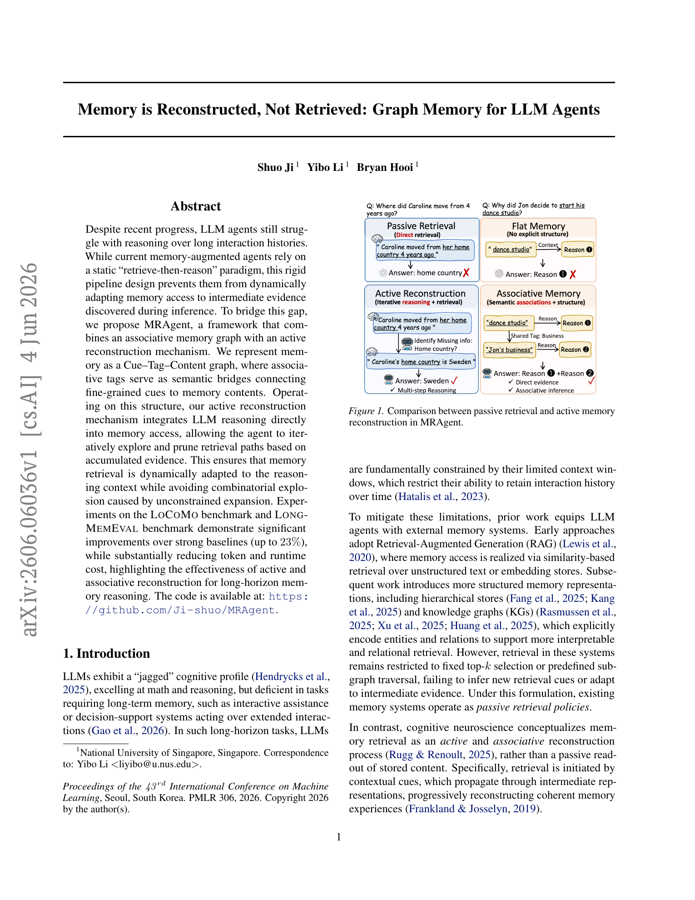
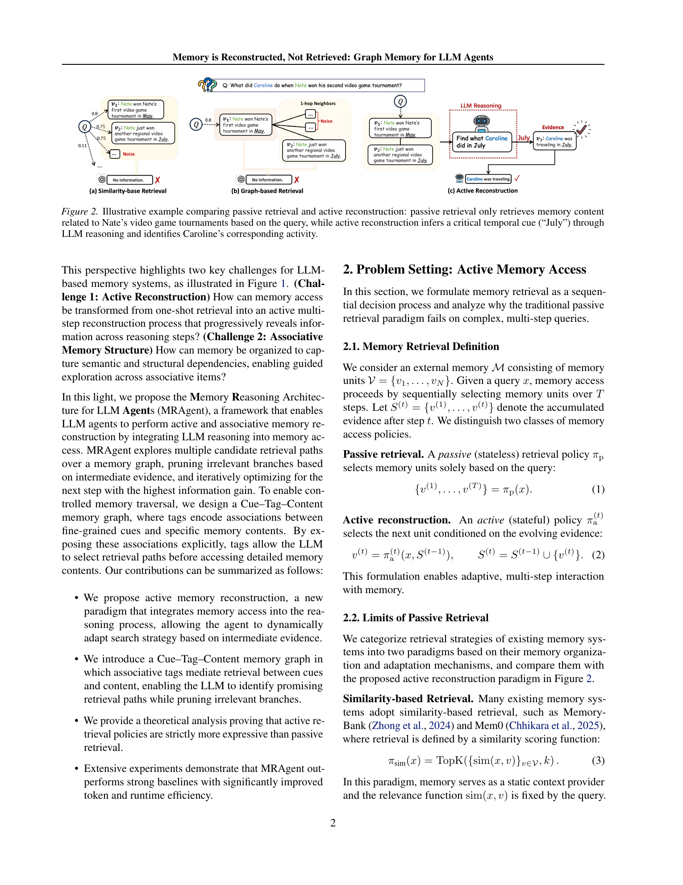
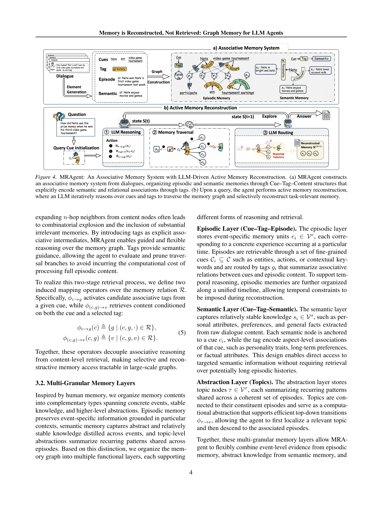
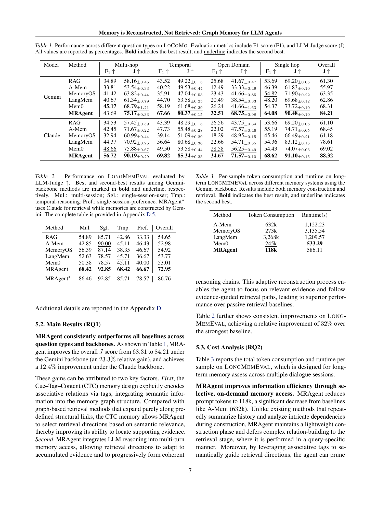
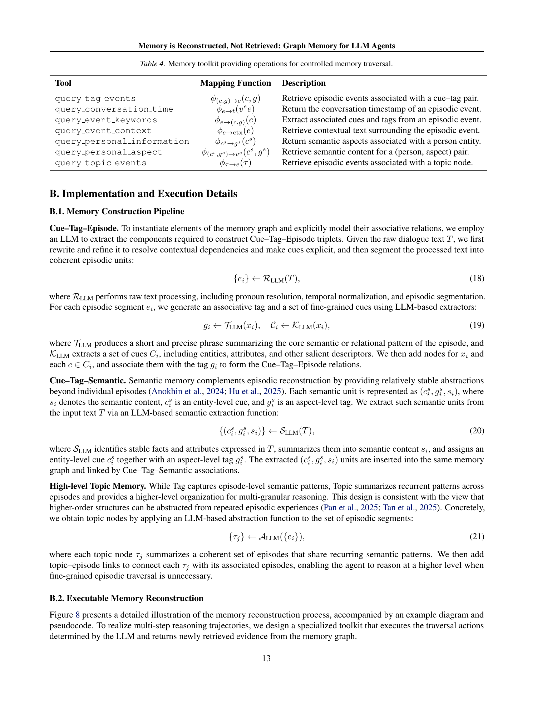

# Memory is Reconstructed, Not Retrieved: Graph Memory for LLM Agents

## TL;DR

This paper argues that long-term memory for LLM agents should not be treated as a static top-\(k\) retrieval problem. It introduces MRAgent, which stores dialogue memory as a Cue-Tag-Content graph and lets an LLM actively reconstruct relevant memory through multi-step traversal, pruning, and evidence accumulation. On LoCoMo and LongMemEval, MRAgent improves answer quality over RAG, A-Mem, MemoryOS, LangMem, and Mem0 while using far fewer prompt tokens than most baselines. The main idea is strong: move memory access into the reasoning loop. The main tradeoff is latency and complexity, because deeper reconstruction requires multiple LLM-controlled traversal steps.

Source: [arXiv:2606.06036](https://arxiv.org/abs/2606.06036), [PDF](https://arxiv.org/pdf/2606.06036.pdf), [code](https://github.com/Ji-shuo/MRAgent)

## Background

Many memory-augmented agents still follow a retrieve-then-reason pattern. They embed past interactions, retrieve a fixed set of chunks or graph neighbors, paste those into context, and ask the LLM to answer. That works for direct lookups, but it struggles when the answer depends on intermediate discoveries.

The paper motivates a different analogy from human memory: recall is often reconstructive. A cue triggers related associations, which expose more cues, which then guide the next step of recall. For agent memory, this means the retrieval strategy should adapt as evidence accumulates rather than being fixed by the original user query.

This is especially relevant for long-running assistants. A user question can require linking old episodes, stable semantic facts, temporal constraints, and topic-level patterns across many sessions. Flat vector retrieval may surface locally similar memories but miss the bridge needed to connect them.

## Problem

The paper formalizes memory access as selecting memory units from an external memory \(M = \{v_1, \ldots, v_N\}\). A passive retriever commits to all selected units as a function of the query:

\[
\{v^{(1)}, \ldots, v^{(T)}\} = \pi_p(x).
\]

An active retriever conditions each step on the evidence gathered so far:

\[
v^{(t)} = \pi_a^{(t)}(x, S^{(t-1)}), \quad
S^{(t)} = S^{(t-1)} \cup \{v^{(t)}\}.
\]

That distinction is the core problem. Passive similarity search can retrieve memories that match surface terms, and graph retrieval can expand fixed neighborhoods, but neither can infer a new cue from intermediate evidence and redirect the search. MRAgent asks whether memory retrieval can become a controlled, stateful reasoning process.

## Method

MRAgent has two main parts: an associative memory graph and an active reconstruction loop.

The memory graph is organized around Cue-Tag-Content relations. Cues are fine-grained entities, attributes, actions, or other keywords. Content nodes store memory items. Tags are relation-like intermediates that summarize how a cue connects to a memory item. The paper defines mapping operators such as:

\[
\phi_{c \rightarrow g}(c) = \{g \mid (c,g,\cdot) \in R\},
\quad
\phi_{(c,g) \rightarrow v}(c,g) = \{v \mid (c,g,v) \in R\}.
\]

This separates association selection from content retrieval. Instead of immediately loading long memories, the agent can inspect tags, choose promising directions, and then retrieve content only when the direction looks useful.

The graph has multiple layers:

- Episodic memory stores concrete events grounded in time.
- Semantic memory stores stable facts, attributes, and preferences.
- Topic nodes summarize recurring patterns across related episodes.

At query time, MRAgent extracts initial cues, initializes an active set, and repeats three steps. First, the LLM selects traversal actions based on the query, accumulated evidence, and active nodes. Second, the memory system executes those actions, such as cue-to-tag, tag-to-content, content-to-cue, or topic-to-event traversal. Third, the LLM routes the new candidates, keeps useful evidence, prunes irrelevant branches, and decides whether to continue or answer.

The paper also gives a theoretical argument: for retrieval budgets \(T \ge 2\), active retrieval has strictly greater expressive power than passive retrieval because it can choose later retrievals based on information revealed by earlier ones.

## Experiments

The paper evaluates on LoCoMo and LongMemEval. LoCoMo tests long conversational memory across single-hop, multi-hop, temporal, and open-domain questions. LongMemEval tests long-term assistant memory across timestamped sessions, with roughly 115K tokens of chat history per example in the LongMemEval-S setting.

Baselines include RAG, A-Mem, MemoryOS, LangMem, and Mem0. The authors test Gemini-2.5-Flash and Claude-Sonnet-4.5 backbones, use GPT-4o-mini as the LLM judge, and report F1, judge score, evidence recall, token consumption, and runtime.

On LoCoMo, MRAgent achieves the best overall judge scores for both backbones. With Gemini, it improves overall judge score from the strongest baseline Mem0's 68.31 to 84.21. With Claude, it improves from LangMem's 78.61 to 88.32. Gains are especially large on temporal and open-domain questions, where adaptive traversal and semantic associations are likely to matter.

On LongMemEval, MRAgent reaches 72.95 overall judge score, compared with 54.92 for MemoryOS, the strongest non-MRAgent number in the compact table. A variant using Claude for retrieval reaches 86.76 while keeping Gemini-built memories.

The cost table is also important. On LongMemEval with Gemini, MRAgent uses 118k tokens per sample, compared with 632k for A-Mem, 273k for MemoryOS, 3,268k for LangMem, and 245k for Mem0. Runtime is 586.11 seconds, slower than Mem0's 533.29 seconds but much faster than MemoryOS and LangMem in the reported setup.

Ablations support the design. Richer memory structure improves retrieval even without reasoning, and adding multi-step reasoning improves every memory structure. The multi-turn analysis shows that increasing the number of reasoning turns helps more than increasing parallel retrieval breadth, especially for multi-hop queries.

## Critical Analysis

The strongest contribution is the retrieval formulation. The paper makes a clean distinction between memory representation and memory access policy. Prior graph-memory systems may store relations, but if retrieval still follows fixed top-\(k\) or fixed neighborhood expansion, the agent cannot use intermediate evidence to decide where to go next.

The Cue-Tag-Content design is also practical. Tags provide an intermediate surface for routing, so the LLM does not have to inspect every full memory item before deciding whether a path is relevant. That is a useful engineering pattern for large personal-memory stores where content-level expansion is expensive.

The main limitation is cost and operational complexity. MRAgent saves prompt tokens, but active reconstruction still requires repeated LLM decisions, tool calls, state updates, and stopping judgments. For latency-sensitive assistants, the system would need caching, cheaper routing models, or policies that choose when active reconstruction is worth the extra steps.

A second limitation is memory maintenance. The paper intentionally keeps construction relatively simple and defers complex relation reasoning to retrieval. That means the graph can grow monotonically and may need consolidation, forgetting, conflict handling, and privacy controls in long-lived deployments.

Finally, evaluation depends on LLM judging and benchmark-style memory QA. The results are strong, but production memory systems also need robustness to ambiguous user references, stale facts, contradictory memories, user edits, and safety constraints around sensitive personal information.

## Implementation Notes

The paper suggests a concrete architecture for agent memory:

1. Store raw episodes, stable semantic facts, and topic abstractions separately.
2. Use cues and tags as lightweight routing nodes before loading full memory content.
3. Expose graph traversal as typed tools rather than hiding retrieval behind one vector-search call.
4. Keep an explicit reconstruction state \(S^{(t)} = (Z^{(t)}, H^{(t)})\), where \(Z\) is the active candidate set and \(H\) is accumulated evidence.
5. Stop retrieval when the evidence is sufficient, not when a fixed top-\(k\) budget has been exhausted.

A production version could implement a two-tier policy. Simple factual questions use cheap passive retrieval. Questions with temporal language, multiple entities, contradictions, or missing intermediate evidence trigger active reconstruction.

The useful interface is not just `retrieve(query)`, but something closer to:

\[
\text{next\_memory\_action} =
f_{\text{select}}(x, H^{(t)}, Z^{(t)}, \mathcal{A})
\]

where \(\mathcal{A}\) contains operations like `query_tag_events`, `query_event_context`, `query_personal_information`, and `query_topic_events`. That makes memory access inspectable and gives developers handles for logging, debugging, and cost control.

## Captured Figures and Tables

