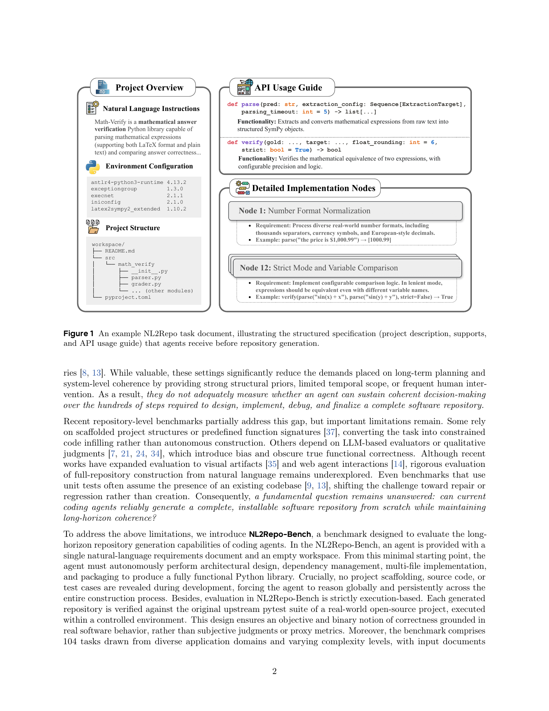
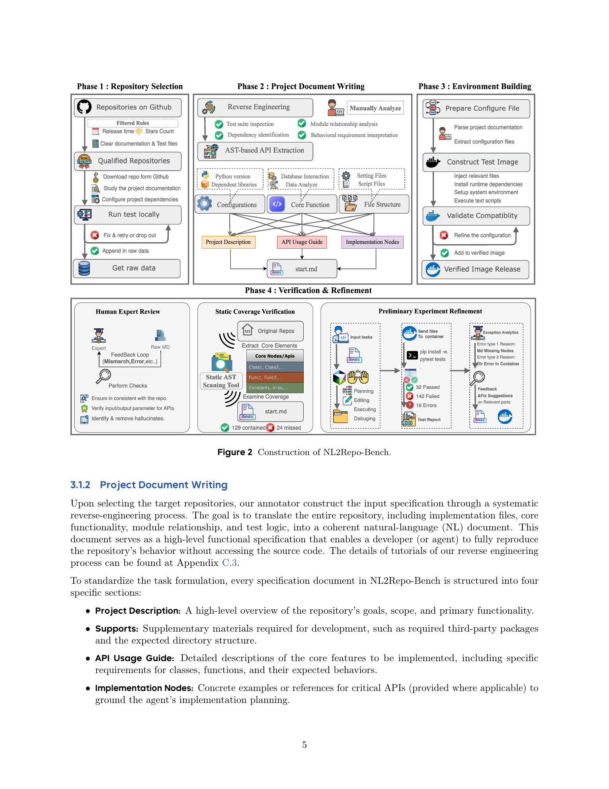
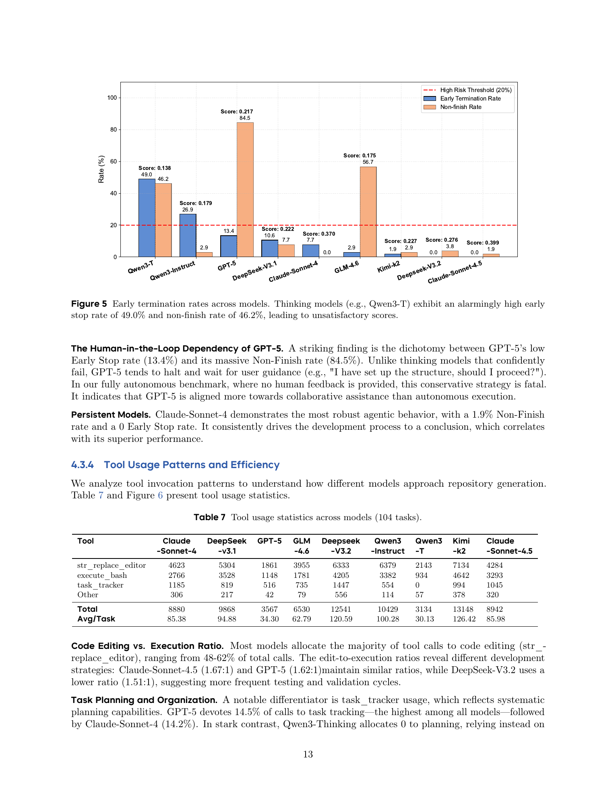
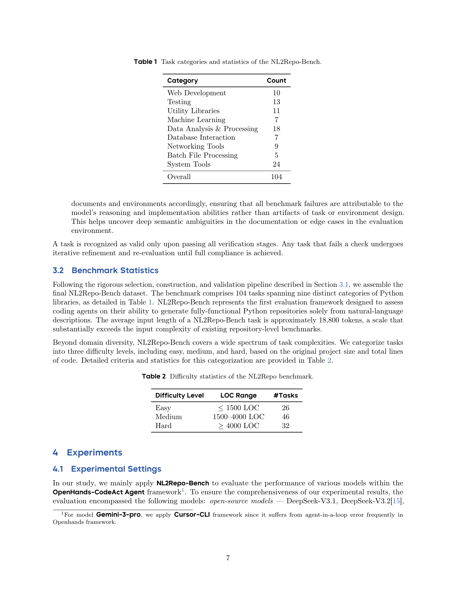
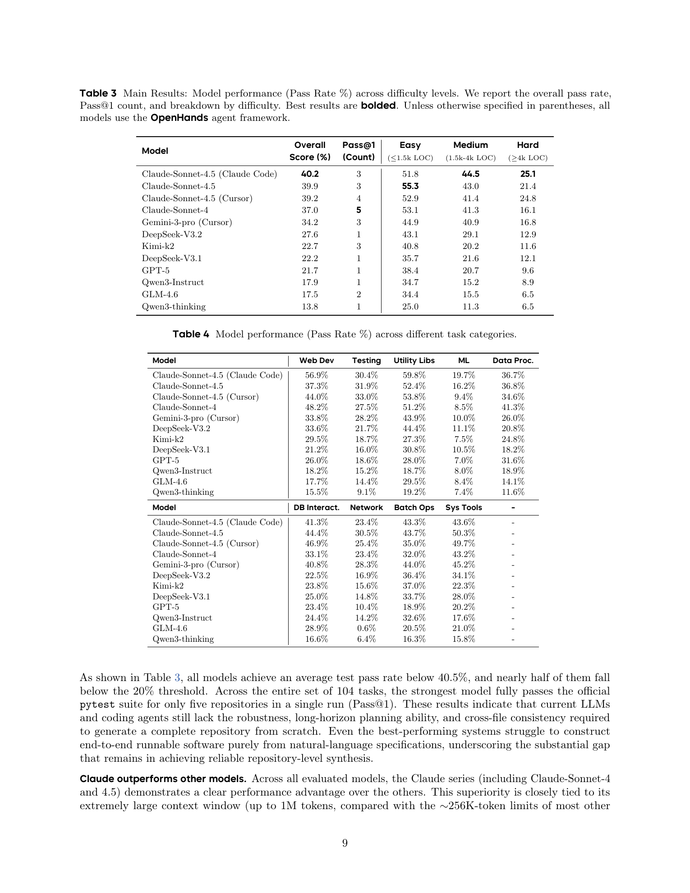
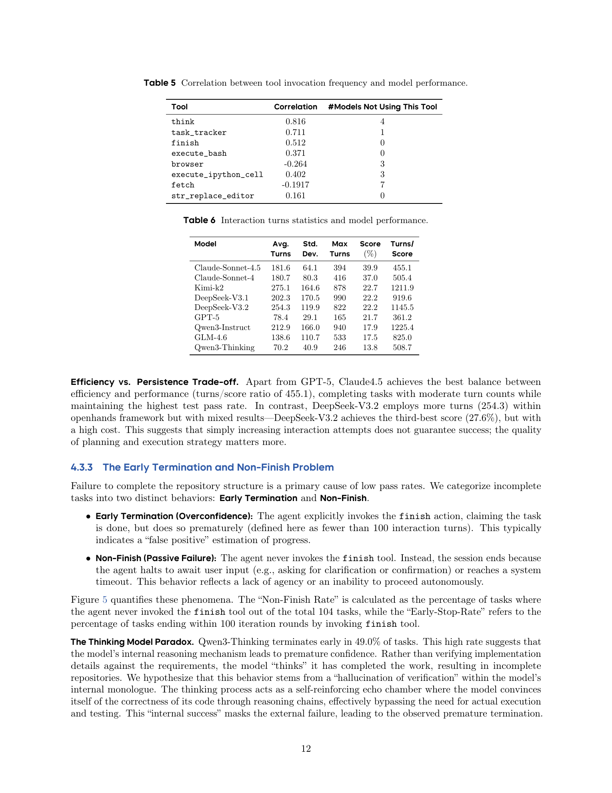

# NL2Repo-Bench: Towards Long-Horizon Repository Generation Evaluation of Coding Agents

## TL;DR

NL2Repo-Bench tests whether coding agents can build complete Python repositories from scratch, starting only from a long natural-language requirements document and an empty workspace. The benchmark contains 104 real-library reconstruction tasks and evaluates generated repositories by running the original upstream pytest suites. The headline result is blunt: even the strongest evaluated agents remain below 40.5% average test pass rate, and the best single run fully passes only five repositories. The paper argues that repository generation is limited less by short code synthesis and more by long-horizon planning, cross-file coherence, dependency management, and persistent verification.

Source: [arXiv:2512.12730](https://arxiv.org/abs/2512.12730), [PDF](https://arxiv.org/pdf/2512.12730.pdf), [project page](https://github.com/multimodal-art-projection/NL2RepoBench)

## Background

Most coding benchmarks measure localized competence. HumanEval and MBPP ask for single functions. SWE-bench evaluates patching existing repositories. RepoBench-style completion tasks usually expose scaffolding, file context, or signatures. These settings are useful, but they do not fully test whether an agent can turn a product-level requirement into a coherent, installable software package.

NL2Repo-Bench targets that missing regime. Each task begins with a single requirements document that describes a real Python library: project intent, expected dependencies, directory structure, API behavior, and implementation examples. The agent receives no source code, no scaffold, and no hidden tests. It must decide the architecture, create files, implement modules, manage packaging, run commands, debug failures, and eventually finish.

The benchmark is deliberately closer to “greenfield software construction” than to repair. That distinction matters because repository generation compounds errors: a wrong public API can break many tests, a bad package layout can prevent collection, and a missing dependency can invalidate otherwise correct logic. The work therefore evaluates coding agents as long-running engineering systems rather than as stateless code generators.

## Problem

The core problem is how to evaluate long-horizon coding agents with a ground truth that is both realistic and objective. A natural-language-to-repository task should satisfy four constraints:

- the input should be high-level enough to require design decisions;
- the output should be a complete, installable repository, not a snippet;
- the evaluation should use executable behavior, not LLM judgment;
- the task set should be large and diverse enough to expose systematic failure modes.

NL2Repo-Bench formalizes each task as:

\[
x_i \rightarrow \hat{R}_i,
\]

where \(x_i\) is the natural-language specification and \(\hat{R}_i\) is the repository produced by the agent. Correctness is measured by running the target project’s original pytest suite in a controlled environment:

\[
\mathrm{Score}(\hat{R}_i)
=
\frac{\#\text{passed tests}}{\#\text{total executable tests}}
\times 100.
\]

The stricter Pass@1 count records whether a generated repository passes the entire upstream suite in a single run. This is the more practical “did the repository actually work?” signal.

## Method

The benchmark pipeline starts from real open-source Python libraries. Candidate repositories must have 300 to 120,000 lines of code, at least 10 GitHub stars, pytest-based tests that pass in the official version, and recent maintenance activity. Human annotators inspect each repository, run its tests, and only keep projects that can produce stable behavioral ground truth.

The input document is then reverse engineered from the target repository. Each specification contains four sections:

- project description;
- support information, including dependencies and expected file layout;
- API usage guide;
- implementation nodes with concrete examples for critical behavior.

This design gives the agent enough information to build the project, while still requiring it to plan a multi-file architecture and infer how APIs should work together. The paper emphasizes that the API usage guide must cover the functional nodes exercised by the tests; otherwise the task would become underspecified.

The final benchmark has 104 tasks across nine Python-library categories: system tools, data analysis and processing, testing, utility libraries, web development, networking tools, database interaction, machine learning, and batch file processing. Difficulty is defined by original repository size: 26 easy tasks up to 1.5K LOC, 46 medium tasks from 1.5K to 4K LOC, and 32 hard tasks above 4K LOC. The average task document is about 18,800 tokens.

Evaluation uses a standardized image and the original upstream pytest suites. The agent’s generated workspace is packaged and tested after development finishes. The paper also modifies test execution so collection errors do not automatically collapse the entire score to zero; tests that can be collected still run, which gives a more informative partial pass rate.

## Experiments

The main experiments evaluate models inside OpenHands-CodeAct and, for selected models, commercial coding-agent frameworks such as Cursor and Claude Code. The model list includes Claude-Sonnet-4.5, Claude-Sonnet-4, Gemini-3-pro, DeepSeek-V3.1, DeepSeek-V3.2, Kimi-k2, GPT-5, Qwen3-Instruct, GLM-4.6, and Qwen3-thinking.

The strongest reported average score is 40.2% for Claude-Sonnet-4.5 in Claude Code. Claude-Sonnet-4.5 in OpenHands reaches 39.9%, the Cursor variant reaches 39.2%, Claude-Sonnet-4 reaches 37.0%, and Gemini-3-pro in Cursor reaches 34.2%. The rest of the models are substantially lower: DeepSeek-V3.2 reaches 27.6%, Kimi-k2 22.7%, DeepSeek-V3.1 22.2%, GPT-5 21.7%, Qwen3-Instruct 17.9%, GLM-4.6 17.5%, and Qwen3-thinking 13.8%.

Performance degrades sharply with repository size. For example, Claude-Sonnet-4.5 in Claude Code scores 51.8% on easy tasks, 44.5% on medium tasks, and 25.1% on hard tasks. GPT-5 drops from 38.4% on easy tasks to 20.7% on medium and 9.6% on hard. This difficulty gradient is one of the benchmark’s useful properties: it separates small-library synthesis from sustained repository-level coordination.

The category breakdown shows that current agents are stronger on infrastructure-style packages than on algorithmically dense domains. Claude-family models perform well on system tools, utility libraries, and database interaction, while all models struggle more on machine learning and networking repositories.

The analysis sections add process-level diagnostics. Tool usage suggests planning is important: `task_tracker` usage has a reported 0.711 correlation with model performance, while raw editing frequency is much less informative. Interaction length also matters, but only up to a point. GPT-5 averages only 78.4 turns and reaches 21.7%, indicating high per-turn quality but poor task completion. Kimi-k2 and DeepSeek variants often use far more turns without matching the top scores, so persistence alone is not enough.

The paper highlights two completion failures. “Early termination” means the agent calls finish too soon, under 100 turns. “Non-finish” means the agent never finishes, usually because it waits for user input or times out. Qwen3-thinking has a 49.0% early-stop rate and 46.2% non-finish rate. GPT-5 has a lower early-stop rate of 13.4% but an 84.5% non-finish rate, which the authors interpret as a mismatch between collaborative assistant behavior and fully autonomous benchmark requirements.

## Critical Analysis

The benchmark’s main strength is its executable evaluation. LLM-judged repository quality is hard to trust because style, intent, and partial functionality can be over-weighted. Running upstream pytest suites gives a concrete behavioral target. It also surfaces failure modes that local benchmarks miss: package import errors, incompatible dependency choices, broken cross-file APIs, and incomplete end-to-end workflows.

The single-document setup is also valuable. It removes scaffolding and tests as crutches, so the benchmark stresses planning and implementation from requirements. In practical terms, this is closer to asking an agent to build a small library than asking it to patch a known bug.

However, the benchmark is not a pure measure of “software engineering intelligence.” It also measures how completely annotators reverse engineered each project into natural language. If a hidden test expects behavior that the specification did not capture, the agent is penalized for missing information rather than for weak reasoning. The paper’s human review and AST-assisted workflow reduce this risk, but do not eliminate it.

The reliance on upstream tests has a second caveat: tests encode the original project’s observable behavior, not necessarily all valid implementations. A generated library could be useful yet fail brittle tests that assume exact formatting, edge-case quirks, or internal API conventions. Conversely, passing many tests may still leave gaps not covered by the upstream suite. The benchmark is objective, but its target is “match this project’s tests,” not “build the best possible library.”

The GPT-5 interpretation also needs care. The paper’s conclusion that GPT-5 is more aligned for human-in-the-loop assistance than autonomous completion is plausible from the non-finish data, but it is still partly an interaction-protocol result. A benchmark prompt that explicitly forbids asking for confirmation, or an agent wrapper that auto-continues after clarification requests, might change this failure mode without changing the base model.

Finally, exposing all test cases raises Claude-Sonnet-4.5 in Claude Code from 40.2% to 59.4%, but still below 60%. That is a useful upper-bound experiment: some failures come from incomplete requirement inference, but a large residual remains even with tests visible. This supports the paper’s central claim that long-horizon repository generation still requires better global planning, cross-file consistency, and repair loops.

## Implementation Notes

For benchmark users, the important engineering details are the task harness and test isolation. Each task should run in a clean environment with deterministic dependency installation, a preserved generated workspace, and logs for command execution, test collection, and test results. Without those artifacts, failure analysis becomes anecdotal.

The scoring function should separate at least four outcomes:

- pytest collection/import failure;
- partial test execution with some passing tests;
- full suite pass;
- agent non-finish or timeout before evaluation.

Those categories are more actionable than a single pass rate. A model that writes good code but misses packaging needs a different fix from a model that stops after scaffolding or one that never invokes tests.

The paper’s results also imply that agent wrappers should treat “finish” as a verified action, not a language-model assertion. A robust workflow would require a final install, import smoke test, and pytest run before finish is accepted. Similarly, clarification-seeking behavior should be handled explicitly: in a fully autonomous benchmark, asking the user whether to proceed should be counted as non-finish unless the framework has a deterministic auto-continue policy.

For model development, NL2Repo-Bench is most useful when paired with trajectory-level diagnostics: number of edit calls, shell calls, tests run, TODO/task tracker updates, context length at finish, and failure location. Aggregate pass rates show the gap, but the trajectories explain whether the bottleneck is planning, implementation, environment setup, or verification discipline.

## Captured Figures and Tables

