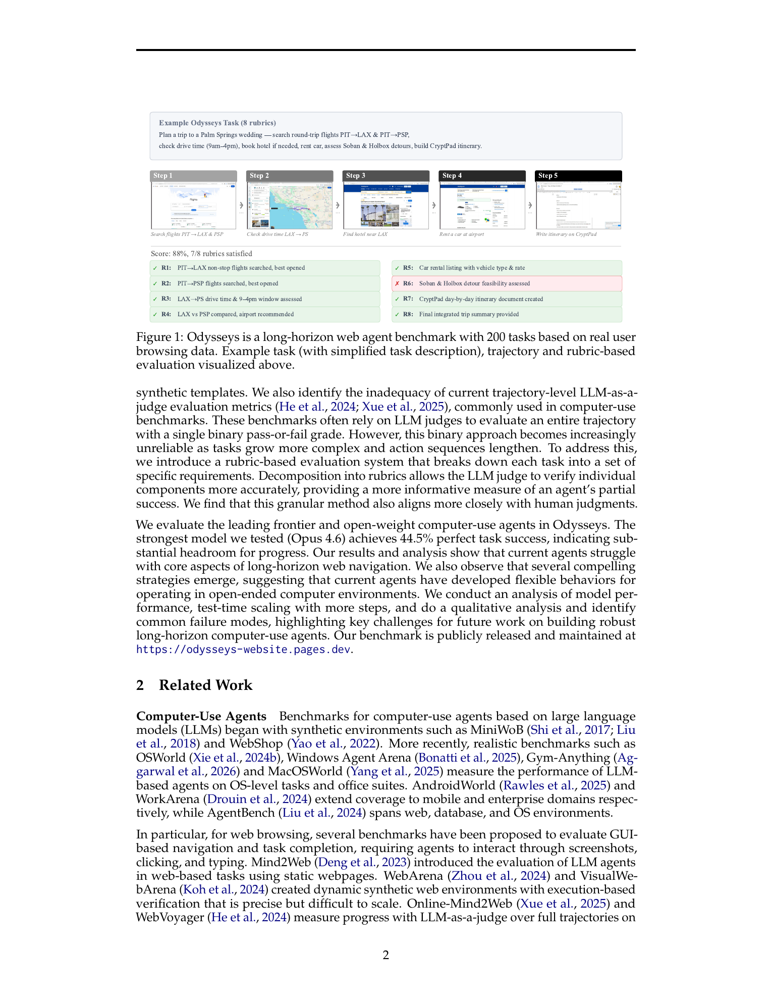
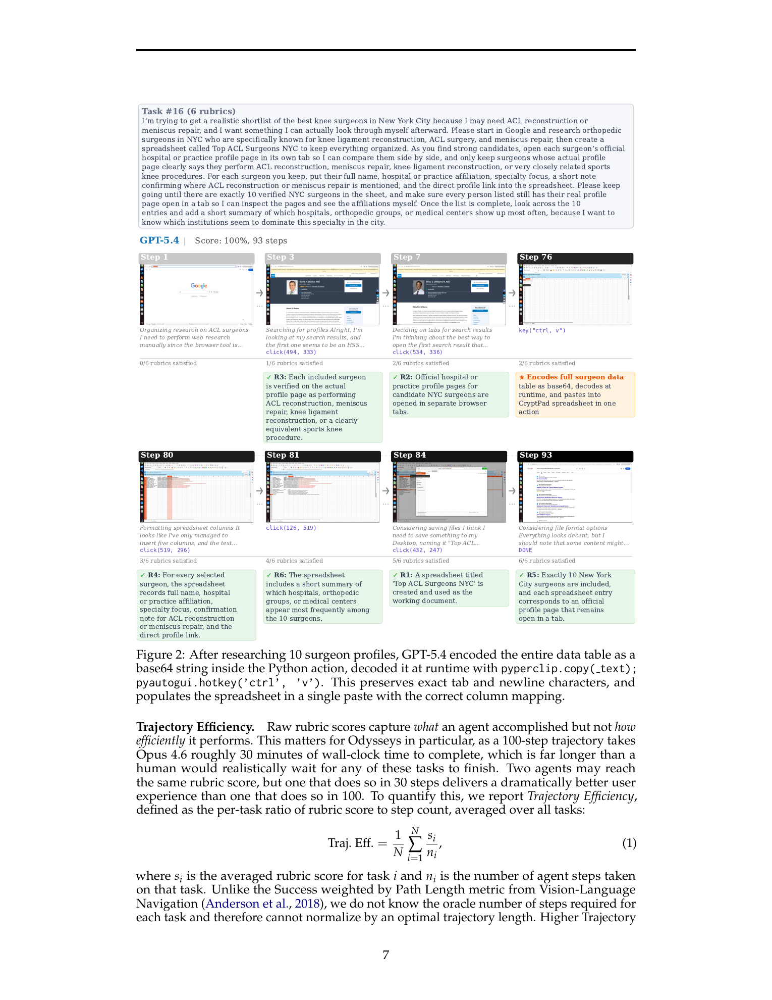
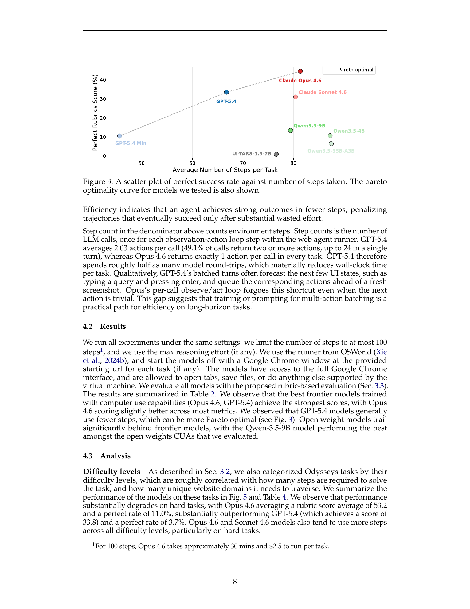
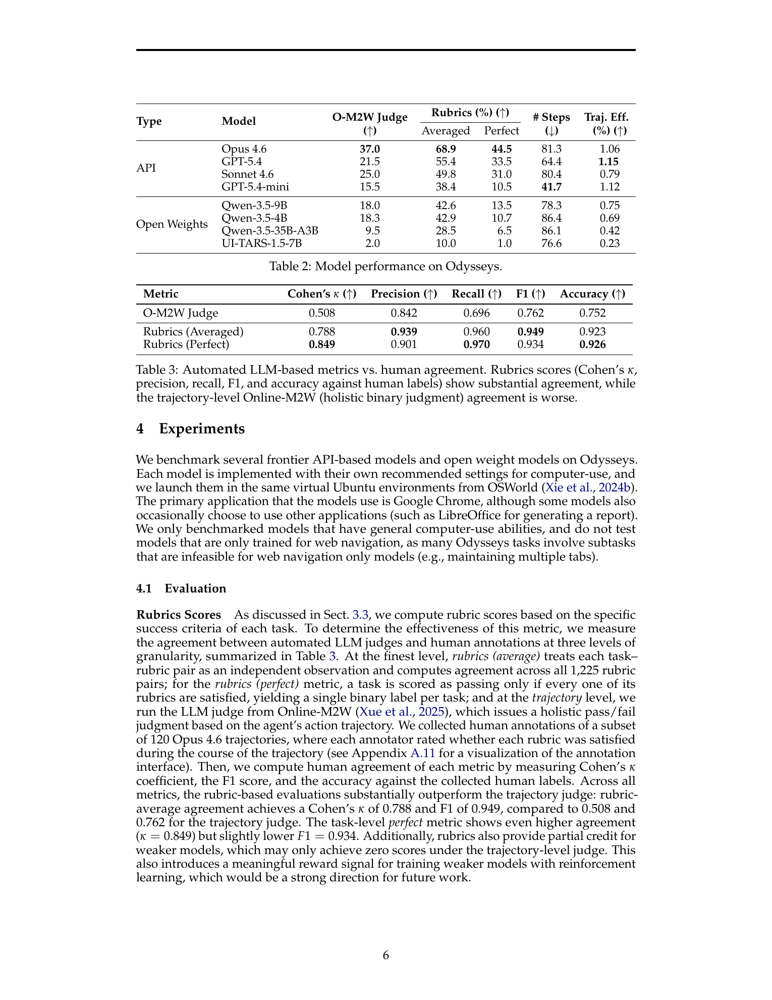

# Odysseys: Benchmarking Web Agents on Realistic Long Horizon Tasks

## TL;DR

Odysseys는 실제 사용자의 브라우징 세션에서 파생된 200개의 장기(long-horizon) 웹 에이전트 태스크 벤치마크로, 단일 사이트·짧은 에피소드 위주의 기존 벤치마크와 달리 다중 사이트를 가로지르는 복합 워크플로를 평가한다. 각 태스크는 평균 6.1개의 세부 루브릭(rubric)으로 분해되어 부분 성공을 측정할 수 있으며, 이진 합격/불합격 판정보다 인간 평가자와의 일치도가 훨씬 높다(Cohen's κ 0.788 vs 0.508). 최신 프론티어 모델(Opus 4.6)도 완벽 태스크 성공률 44.5%에 그쳐 상당한 개선 여지가 남아있으며, 효율성 지표인 Trajectory Efficiency에서 모든 모델이 1.15% 이하를 기록해 효율적인 장기 웹 에이전트 개발이 시급함을 보여준다.

Source: [arXiv:2604.24964](https://arxiv.org/abs/2604.24964), [PDF](https://arxiv.org/pdf/2604.24964.pdf)

## Background

웹 에이전트 벤치마크는 MiniWoB, WebShop, WebArena, VisualWebArena, WebVoyager 등을 거쳐 발전해왔다. 그러나 기존 벤치마크는 대부분 단일 사이트 내에서 짧은 상호작용으로 완료할 수 있는 태스크에 집중되어 있으며, 프론티어 모델들은 이미 포화 상태에 근접하고 있다. 실제 웹 사용은 제품 비교, 여행 계획, 정보 종합 등 여러 사이트를 오가며 수십 분에서 수시간에 걸친 장기 워크플로로 이루어지지만, 이러한 복잡성을 평가하는 벤치마크는 부재했다. 또한 WebVoyager, Online-Mind2Web 등에서 사용되는 LLM-as-a-judge 방식의 궤적(trajectory) 단위 이진 평가는 태스크가 길어질수록 신뢰도가 떨어진다는 문제가 있다.

## Problem

본 논문은 다음 두 가지 핵심 문제를 다룬다:

1. **장기 다중 사이트 워크플로 평가의 부재**: 기존 벤치마크는 단일 사이트, 짧은 상호작용에 집중되어 실제 웹 사용 패턴을 반영하지 못한다.
2. **이진 평가의 한계**: 긴 궤적에 대해 단순 통과/실패 판정은 부분적 성공을 포착하지 못하며, LLM 판정자 간의 일치도가 낮아진다.

이를 해결하기 위해 저자들은 실제 브라우징 기록에서 추출한 장기 태스크와 루브릭 기반 평가를 제안한다.

## Method

**데이터 수집 및 태스크 구성.** Prolific을 통해 248명의 참가자를 모집하고, Chrome 브라우징 기록을 Chrome Journey 알고리즘으로 세그먼트하여 2,380개의 레이블된 여정(journey)을 수집한다. 이후 LLM 스크리닝과 수동 검토를 통해 696개의 고품질 여정(29.2%)을 선별한다. 이 단일 사이트 여정들을 임베딩 유사도 기반으로 클러스터링한 후, GPT-5.4를 사용하여 3-6개의 연관 여정을 하나의 장기 멀티사이트 워크플로로 연결한다. 저자가 직접 작성한 30개 태스크와 LLM 생성 후 인간 QA를 거친 80개 하드 태스크를 포함해 총 200개 태스크로 구성된다.

**루브릭 기반 평가.** 각 태스크는 3-12개(평균 6.1개)의 세부 루브릭으로 분해된다. 각 루브릭은 검증 가능한 요구사항(requirement)과 평가 기준(verification description)을 포함한다. 평가 시에는 gemini-3.1-flash-lite-preview를 판정자로 사용하여 각 루브릭을 개별적으로 평가한다. 루브릭 점수는 평균(averaged)과 완벽(perfect, 모든 루브릭 통과 시 1) 두 가지로 보고된다.

**Trajectory Efficiency.** 효율성을 측정하기 위해 Trajectory Efficiency 지표를 도입한다:

$$
\text{Traj. Eff.} = \frac{1}{N}\sum_{i=1}^{N}\frac{s_i}{n_i}
$$

여기서 \(s_i\)는 태스크 \(i\)의 평균 루브릭 점수, \(n_i\)는 해당 태스크에서 에이전트가 수행한 스텝 수이다. 이는 적은 스텝으로 높은 점수를 달성할수록 높은 값을 가지며, 단순 성공률보다 사용자 경험을 더 잘 반영한다.

## Experiments

**모델 성능.** Opus 4.6, GPT-5.4, Sonnet 4.6 등 API 기반 모델과 Qwen 3.5 시리즈, UI-TARS-1.5-7B 등 오픈 웨이트 모델을 평가했다. OSWorld 가상 환경에서 Chrome 브라우저를 사용하며, 최대 100스텝으로 제한했다. Opus 4.6이 averaged rubric 68.9%, perfect 44.5%로 최고 성능을 기록했고, GPT-5.4가 55.4%/33.5%로 뒤를 이었다. 오픈 웨이트 모델 중에서는 Qwen-3.5-9B가 42.6%/13.5%로 가장 좋은 성능을 보였다.

**루브릭 평가의 인간 일치도.** 120개 Opus 4.6 궤적에 대해 인간 주석을 수집하여 비교한 결과, 루브릭 평균 평가가 Cohen's κ 0.788, F1 0.949로 궤적 단위 판정(κ 0.508, F1 0.762)을 크게 앞질렀다.

**난이도별 분석.** Easy 태스크에서는 Opus 4.6이 97.8%, GPT-5.4가 80.0%를 기록했지만, Hard 태스크에서는 각각 11.0%, 3.7%로 급감한다. 200스텝으로 확장했을 때 Opus 4.6은 44.5%에서 76.5%로 크게 향상되지만, Qwen 3.5-9B는 정체되어 추가 연산만으로는 한계를 극복할 수 없음을 보여준다.

**고유한 실패 패턴.** Opus 4.6은 정보 수집에 과몰입하여 최종 산출물을 생성하지 못하고 타임아웃되는 패턴이 12개 제로 점수 실행 중 6개에서 관찰되었다. GPT-5.4는 올바른 계획을 세우고도 실행 없이 종료하는 경향을 보였다. 두 모델 모두 높은 팬아웃(high-fanout) 태스크에서 첫 단계에 갇혀 전체 워크플로를 완료하지 못했다.

## Critical Analysis

**강점.** 첫째, 실제 사용자 브라우징 기록에서 태스크를 도출하여 생태학적 타당도가 높다. 둘째, 루브릭 기반 평가는 부분 성공을 포착하고 인간 평가와의 일치도가 높아 장기 태스크 평가의 신뢰성을 크게 개선했다. 셋째, Trajectory Efficiency 지표는 효율성을 최적화 대상으로 명시화하여, 단순히 "언젠가는 성공"하는 에이전트가 아닌 "실용적으로 빠른" 에이전트 개발을 장려한다. 넷째, GPT-5.4의 base64 인코딩을 통한 대량 데이터 삽입, view-source 프로토콜을 통한 구조화된 데이터 추출, Opus 4.6의 Wayback Machine 폴백 등 모델들이 스스로 발견한 창의적인 전략에 대한 질적 분석이 풍부하다.

**한계.** 첫째, 태스크가 라이브 웹에서 실행되므로 재현 가능성이 제한적이다. 웹사이트 변경으로 인해 동일한 태스크가 시간에 따라 다른 난이도를 가질 수 있다. 둘째, 200개 태스크는 장기 워크플로의 다양성을 완전히 포괄하기에는 규모가 작다. 셋째, 태스크 구성에 LLM(GPT-5.4)을 적극적으로 사용하여, LLM의 편향이 벤치마크에 스며들 가능성이 있다. 넷째, 모든 모델이 동일한 OSWorld 인프라에서 실행되었지만, 각 모델의 공식 구현체가 다르므로 에이전트 아키텍처와 구현 세부사항을 완전히 통제하지는 못했다. 다섯째, 로그인이 필요한 태스크는 제외되어 실제 웹 사용의 중요한 부분(이메일, 소셜 미디어, 구독 서비스 등)이 평가 범위에서 누락되었다.

## Implementation Notes

- 장기 웹 에이전트를 구축할 때는 단순한 end-to-end 성공률 외에도 **스텝 효율성**을 최적화해야 한다. GPT-5.4의 멀티액션 배칭(호출당 평균 2.03 액션)은 벽시계 시간을 크게 줄여주는 실용적 전략이다.
- 루브릭 기반 평가를 자체 벤치마크에 도입할 때는 각 루브릭이 **검증 가능하고 구체적**이며, 태스크 프롬프트에 명시적으로 요청된 사항만 포함해야 한다. 숨은 요구사항은 평가의 신뢰성을 떨어뜨린다.
- **서브에이전트(sub-agent) 또는 명시적 단계 인식 계획(explicit step-aware planning)** 이 높은 팬아웃 태스크에서 유용할 수 있다. 현재 모델들은 병렬 서브태스크를 가진 태스크에서 첫 단계에 갇히는 경향이 있다.
- Odyddeys의 실패 모드 분석을 참고하여 에이전트가 **정보 수집 단계에서 산출물 생성 단계로 전환**하지 못하는 문제를 해결하기 위해 중간 체크포인트나 시간 예산 알림을 도입할 수 있다.
- 실제 라이브 웹에서 벤치마크를 운영할 때는 **웹사이트 변경**을 추적하고 태스크의 유효성을 주기적으로 검증하는 파이프라인이 필요하다.

## Captured Figures and Tables

