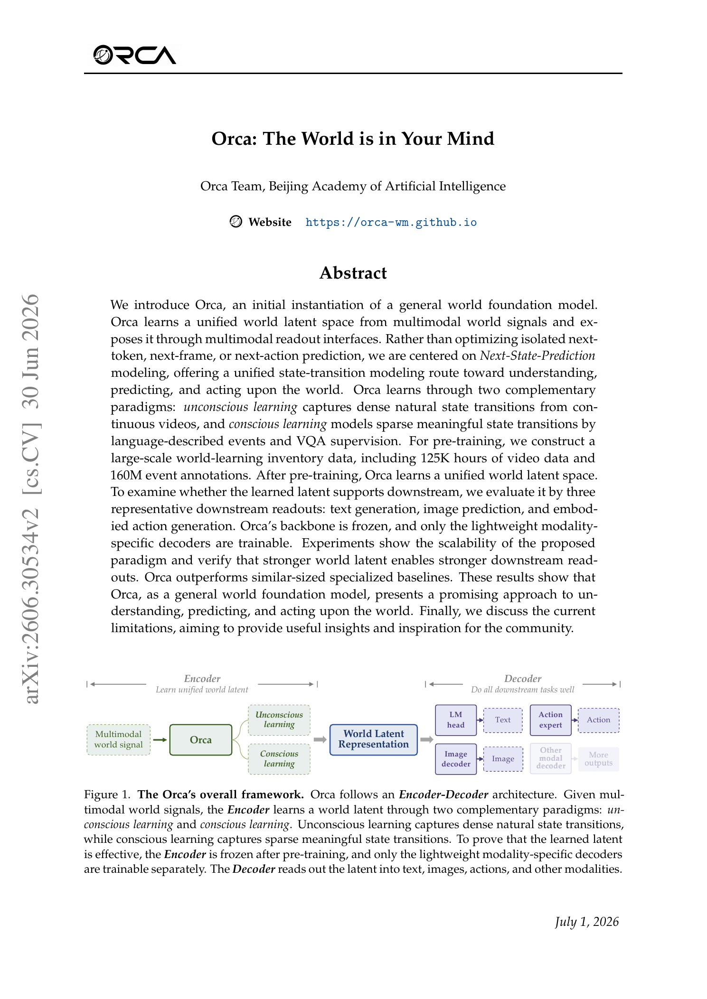
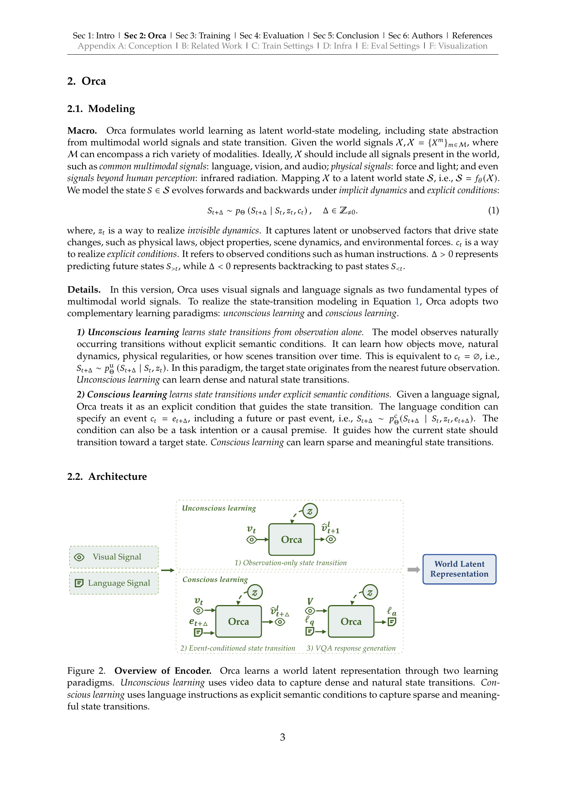
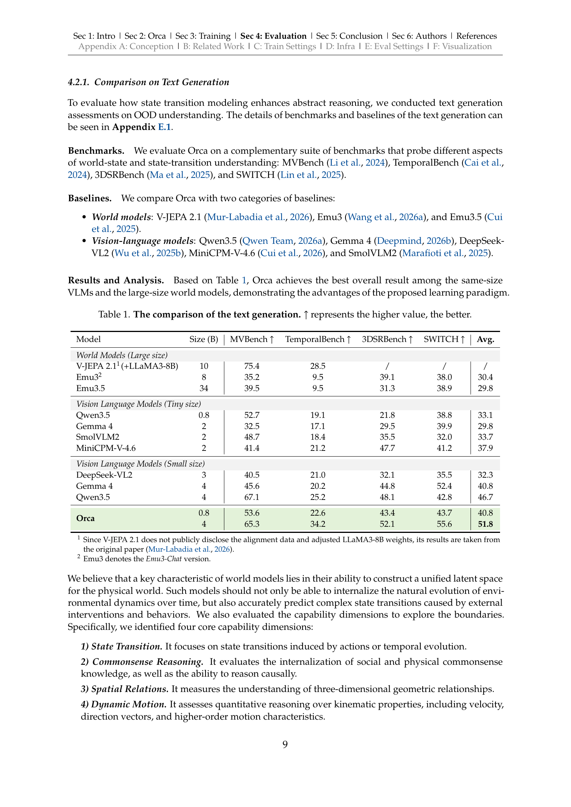
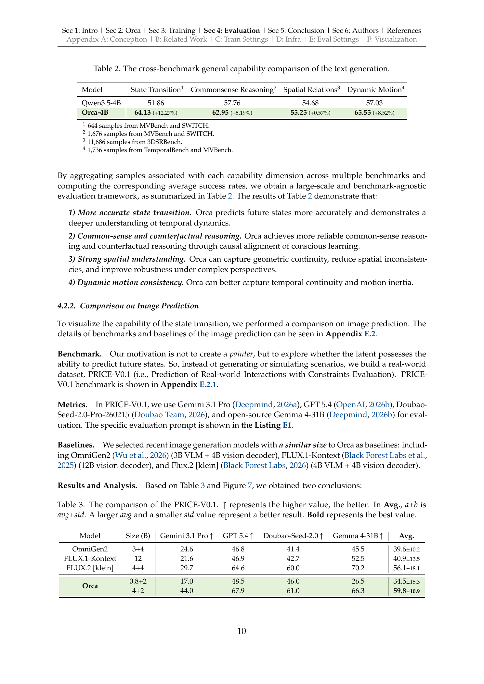

# Orca: The World is in Your Mind

**Authors:** Yihao Wang, Yuheng Ji, Mingyu Cao, Yanqing Shen, Runze Xiao, Huaihai Lyu, Senwei Xie, Euan Liu, Klara Tian, Tianfeng Long, Yichi Zhang, Zhengliang Cai, Ruike Chen, Jifan Zhao, Ruochuan Shi, Zihan Tang, Jing Lyu, Wenxing Tan, Ningbo Zhang, Yangtao Hu, Yuming Gao, Xiansheng Chen, Junkai Zhao, Congsheng Xu, Boan Zhu, Ziqi Wang, Yupu Feng, Qiongqiong Zhang, Yingli Zhao, Yulong Ao, Shaoxuan Xie, You Liu, Guocai Yao, Leiduo Zhang, Xiaodan Liu, Yunyan Zhang, Yance Jiao, Xinyan Yang, Jiaxing Wei, Xu Liu, Tengfei Pan, Shaokai Nie, Chunlei Men, Sen Cui, Xiaojie Jin, Hongyang Li, Jianlan Luo, Yao Mu, Yunchao Wei, Jun Yan, Hang Zhao, Xiaolong Zheng, Jiaming Li, Yonghua Lin, Tiejun Huang, Zhongyuan Wang, Pengwei Wang

**Published:** 2026-06-29 (v2: 2026-06-30)

**Tags:** world-model, next-state-prediction, multimodal, embodied-ai, self-supervised-learning

## TL;DR

Orca is a general world foundation model that learns a unified world latent space from multimodal signals (vision + language) through Next-State-Prediction, using two complementary paradigms: *unconscious learning* (dense natural state transitions from continuous video) and *conscious learning* (sparse meaningful state transitions via language-described events and VQA). Pre-trained on 125K hours of video and 160M event annotations, the frozen backbone supports downstream text, image, and action readouts, outperforming similar-sized specialized baselines.

## Background

Current foundation models are organized around isolated prediction targets: LLMs do next-token prediction, video models do next-frame prediction, and embodied models do next-action prediction. Orca argues that intelligence should instead be defined by the ability to build world states and support diverse downstream tasks from a unified latent representation.

## Problem

How can we build a model that learns a unified world latent space from multimodal signals, such that the latent supports understanding (text), prediction (image), and intervention (action) simultaneously — without task-specific fine-tuning of the backbone?

## Method

**Core idea:** Next-State-Prediction — model the latent world state $S$ evolving under implicit dynamics $z_t$ and explicit conditions $c_t$:

$$S_{t+\Delta} \sim p_\Theta(S_{t+\Delta} \mid S_t, z_t, c_t), \quad \Delta \in \mathbb{Z}_{\neq 0}$$

**Two learning paradigms:**
- **Unconscious learning:** observation-only state transition from continuous video ($c_t = \emptyset$). Predicts latent of next frame via teacher forcing from frozen vision encoder.
- **Conscious learning:** event-conditioned state transition guided by language instructions ($c_t = e_{t+\Delta}$), plus VQA response generation.

**Architecture:** Uses a pre-trained VLM backbone with learnable query vectors. Three pre-training objectives: (1) observation-only state transition ($\mathcal{L}_{\text{obs}}$), (2) event-conditioned state transition ($\mathcal{L}_{\text{evt}}$), (3) VQA generation ($\mathcal{L}_{\text{vqa}}$).

**Pre-training data:** 125K hours of video (ego-centric interaction, exo-centric manipulation, action-free robot execution, natural dynamics), 160M event annotations, 11.5M VQA samples. Only 1/10 used in this version.

**Downstream post-training:** Backbone frozen. Lightweight readout modules for text (LM head), image (MLP + LoRA on SD3.5), and action (DiT-based Action Expert from scratch with flow-matching loss).

## Experiments

*Figure 1: Orca's overall Encoder-Decoder framework.*

*Figure 2: Encoder overview with unconscious and conscious learning paradigms.*

*Table 1: Text generation comparison across 4 benchmarks.*

*Table 2: Cross-benchmark capability comparison (State Transition, Commonsense Reasoning, Spatial Relations, Dynamic Motion).*

*Table 3: Image prediction comparison on PRICE-V0.1 benchmark.*

**Key results:**
- Scaling: Loss decreases with more data and larger model (0.8B → 4B); stronger latent → stronger downstream readouts across all three modalities
- Text generation (4B): 51.8 Avg vs Qwen3.5-4B's 46.7 (+5.1); particularly strong on State Transition (+12.27%) and Dynamic Motion (+8.52%)
- Image prediction (4B+2B): 59.8 Avg vs FLUX.2 [klein]'s 56.1 on PRICE-V0.1
- Action generation (4B): 32.4 Overall Rule-based vs $\pi_{0.5}$'s 29.4; excels at recovery (higher DRR) and progress (higher FNS)
- Ablation: All three objectives needed for balanced performance; $\mathcal{L}_{\text{obs}}$ critical for action, $\mathcal{L}_{\text{evt}}$ critical for vision readout

## Critical Analysis

**Strengths:**
- Elegant framing of world learning as Next-State-Prediction with conscious/unconscious paradigms
- Unified latent space demonstrated across three very different downstream modalities
- Impressive zero-shot transfer: no action labels used during pre-training, yet action readout benefits from video pre-training
- Strong real-robot results with only 200 trajectories per task (5 tasks)
- Comprehensive infrastructure optimization (4.4× throughput vs StarVLA)

**Weaknesses:**
- Only 4B/0.8B scales tested — unclear if paradigm holds at larger scales
- ViT-space supervision limits the latent to pre-trained vision encoder space rather than a truly native world state
- Short-horizon events (minute-level); long-term state evolution over hours/days not addressed
- Action readout still limited to short, relatively easy embodied tasks
- 125K hours of video but only 1/10 used — scaling conclusions are preliminary
- Ablation table missing image prediction for some conditions (marked "-")

**Open questions:**
- Does the unconscious/conscious learning distinction hold at much larger scales (e.g., 70B+)?
- Can a truly native (from-scratch) world model outperform one built on top of a pre-trained VLM?
- How to extend to audio, tactile, force, and other modalities within the same latent space?

## Implementation Notes

- Project page: https://orca-wm.github.io/
- Built on FlagScale with FSDP2, Chunked Cross-Entropy Loss, and communication scheduling
- Action Expert: DiT-based with flow-matching loss, trained from scratch
- Pre-training: 3 losses with weighting coefficients $\lambda_{\text{obs}}, \lambda_{\text{evt}}, \lambda_{\text{vqa}}$
- Image readout: MLP adaptor + LoRA on frozen SD3.5
- All downstream evaluations are zero-shot (no benchmark-specific training data used)
