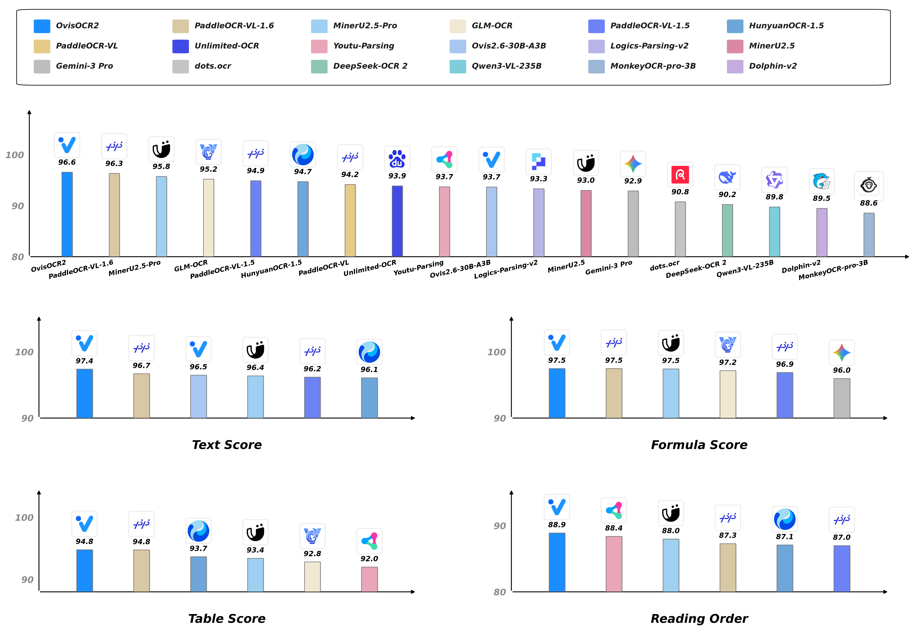
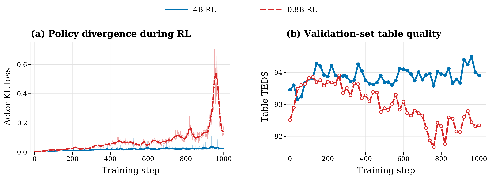
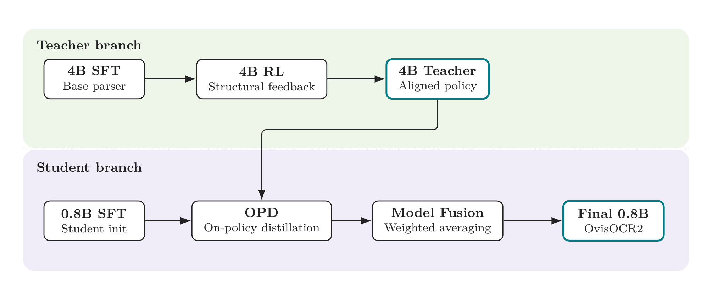

# OvisOCR2 Technical Report

**Authors:** Shiyin Lu, Yinglun Li, Yu Xia, Yuhui Chen, An-Yang Ji, Jun-Peng Jiang, Qing-Guo Chen, Jianshan Zhao, En Lin, Haijun Li, Cheng Qin, Zhao Xu, Weihua Luo (ATH-MaaS, Alibaba Group)

**Published:** 2026-07-15

**Tags:** document-parsing, end-to-end-ocr, reinforcement-learning, on-policy-distillation, multimodal-vlm

## TL;DR

OvisOCR2 is a 0.8B end-to-end document parsing model that converts document page images directly to Markdown, covering text, formulas, tables, and visual regions. Built on Qwen3.5-0.8B with a dual-branch training recipe — SFT, RL on a 4B branch with multi-component rewards (text edit distance, formula CDM, table TEDS), on-policy distillation back to 0.8B, and model fusion — it achieves SOTA on OmniDocBench v1.6 (96.58 overall, surpassing all pipeline methods) and PureDocBench (75.06 Avg3), demonstrating that a compact single-pass model can outperform multi-stage pipeline systems.

## Background

Document parsing converts visually rich document images into structured Markdown representations, requiring preservation of text, tables, formulas, reading order, and layout. Two paradigms dominate:

- **Pipeline methods** (PaddleOCR-VL-1.6, MinerU2.5-Pro, GLM-OCR): decompose parsing into layout analysis → region-level recognition → page merging. Strong on leaderboards but complex to deploy, and errors accumulate across stages.
- **End-to-end methods** (HunyuanOCR, FireRed-OCR, etc.): single model reads the page image and generates Markdown in one pass. Simpler deployment, page-level context conditioning, but historically lagged pipeline methods in accuracy.

Previous SOTA pipeline methods held the top positions on OmniDocBench v1.6, making end-to-end's sub-95 performance a persistent gap.

## Problem

Achieving SOTA document parsing with a compact end-to-end model requires solving three intertwined challenges simultaneously:

1. **Data quality and coverage**: Real-world document annotations are noisy; purely synthetic data lacks realism. No single source suffices.
2. **Training signal beyond token imitation**: Many parsing errors are structural (wrong table topology, unrenderable formulas, incomplete reading order) — next-token loss is insufficient.
3. **Small model capacity**: A 0.8B backbone must absorb complex structural supervision without the stability issues seen when applying RL directly to small models.

## Method

### Data Engine

Two complementary pipelines:

**Real-world pipeline**: Uses PaddleOCR-VL-1.5 and MinerU2.5-Pro to produce structured JSON, then normalizes to unified Markdown via source-specific rules (strict category validation, text/formula/table/visual-region normalization). A manual spot-checking stage filters subsets with frequent errors while retaining subsets with only occasional minor issues.

**Synthetic pipeline**: Follows a "source-of-truth" principle — both rendered images and Markdown targets derive from the same HTML source (not by parsing the rendered image). Pipeline:
1. Hard sample mining from failure cases
2. Multimodal model converts failures into HTML templates
3. Agent-based HTML diversification (content + structure variation)
4. Markdown ground truth from HTML, images via Playwright rendering
5. Iterative quality control

### Training Pipeline (Two-Branch)

```
Teacher branch:  4B SFT → 4B RL (GRPO with multi-component reward) → 4B Teacher
Student branch:  0.8B SFT → OPD (on-policy distillation) → Model Fusion → 0.8B OvisOCR2
```

**RL Reward Design** — Page-level scalar reward averaging over available components:

| Component | Score | Measured aspect |
|-----------|-------|-----------------|
| Text | 1 − normalized edit distance | Text fidelity |
| Formula | CDM (character detection matching) | Visual formula matching |
| Table | TEDS (tree-edit distance similarity) | Table content and topology |

Availability indicators ensure only components present in the reference contribute.

**On-Policy Distillation (OPD)**: The 4B RL teacher provides token-level distribution supervision to the 0.8B student. Uses student top-k reverse KL (mode-seeking), reducing tensor size from O(TV) to O(Tk). Avoids the KL drift and table quality degradation observed when applying RL directly to the 0.8B model.

**Model Fusion**: Weighted parameter averaging over candidate variants trained with different data mixtures and configurations.

## Experiments



*Figure 1: OvisOCR2 performance on OmniDocBench v1.6, showing the highest overall score among all methods.*

### OmniDocBench v1.6

1,651 PDF pages across 10 document types, 5 layout types, 5 language types. Overall = average of text score, formula CDM, and table TEDS.

| Method | Params | Overall ↑ | TextEdit ↓ | FormulaCDM ↑ | TableTEDS ↑ | TableTEDS-S ↑ | ROEdit ↓ |
|--------|--------|-----------|------------|--------------|-------------|---------------|----------|
| PaddleOCR-VL-1.6 (pipeline) | 0.9B | 96.33 | 0.033 | 97.49 | 94.76 | 97.11 | 0.127 |
| MinerU2.5-Pro (pipeline) | 1.2B | 95.75 | 0.036 | 97.45 | 93.42 | 95.92 | 0.120 |
| HunyuanOCR-1.5 (E2E) | 1B | 94.74 | 0.039 | 94.50 | 93.67 | 94.71 | 0.129 |
| **OvisOCR2 (E2E)** | **0.8B** | **96.58** | **0.025** | **97.53** | **94.76** | **97.16** | **0.111** |

OvisOCR2 leads on every sub-metric: lowest text edit distance, highest formula CDM, tied highest TEDS, highest TEDS-S, and lowest reading-order error.

### PureDocBench

1,475 pages across Clean/Digital/Real tracks (4,425 images). Avg3 = mean of track scores.

| Method | Params | Clean ↑ | Digital ↑ | Real ↑ | Avg3 ↑ |
|--------|--------|---------|-----------|--------|--------|
| FD-RL (E2E) | 4B | 78.38 | 76.33 | 67.04 | 73.92 |
| **OvisOCR2 (E2E)** | **0.8B** | **81.55** | **77.09** | 66.56 | **75.06** |

SOTA on Clean and Digital tracks. On the Real track (phone-captured, photocopies, screen photography), OvisOCR2 (66.56) trails general VLMs like Gemini-3.1-Pro (71.98) and Qwen3.5-122B-A10B (69.85).

### In-house Benchmark (1000+ pages)

| Method | Overall ↑ | TextEdit ↓ | FormulaCDM ↑ | TableTEDS ↑ | ROEdit ↓ |
|--------|-----------|------------|--------------|-------------|----------|
| PaddleOCR-VL-1.6 | 82.88 | 0.1292 | 85.13 | 76.42 | 0.2358 |
| GLM-OCR | 82.80 | 0.1378 | 84.04 | 78.12 | 0.2393 |
| **OvisOCR2** | **85.54** | **0.0850** | **86.32** | **78.80** | **0.1885** |

Leads across Easy/Medium/Hard difficulty tiers. On the complex-table subset, OvisOCR2 achieves 83.97 overall vs. 74.08 for the next best (GLM-OCR), with a table missing rate of 7.96% vs. 13–17% for pipeline methods — a structural advantage of end-to-end parsing that avoids layout-analysis-induced table omissions.



*Figure 2: Training stability comparison — 4B RL shows lower KL drift and more stable table TEDS than direct 0.8B RL, motivating the on-policy distillation approach.*



*Figure 3: Two-branch training architecture — the 4B branch produces an RL-aligned teacher, while the 0.8B branch proceeds through SFT → OPD → model fusion.*

## Critical Analysis

**Strengths:**

- **End-to-end surpasses pipeline**: First end-to-end model to top OmniDocBench v1.6, validating the single-pass paradigm for document parsing.
- **Compact deployment**: 0.8B parameters, practical for edge deployment unlike the 241B general VLMs or multi-model pipeline systems.
- **Structural advantage on complex tables**: The low table missing rate (7.96% vs. 13–17%) highlights a fundamental advantage — end-to-end models don't lose tables during layout-stage errors.
- **Well-designed data engine**: The synthetic pipeline's "source-of-truth" principle (HTML → image + Markdown from same source) avoids label noise that plagues parser-derived synthetic data.
- **Multi-component RL reward**: Rewards that measure structural quality (CDM for formulas, TEDS for tables) rather than just text similarity is a well-motivated design for document parsing.

**Limitations:**

- **Real-world degradation robustness**: On PureDocBench's Real track, OvisOCR2 (66.56) trails Gemini-3.1-Pro (71.98) and Qwen3.5-122B-A10B (69.85), suggesting the model is sensitive to physical image degradations (phone captures, photocopies). The paper acknowledges this as future work.
- **Closed-source components**: The data engine relies on PaddleOCR-VL-1.5 and MinerU2.5-Pro as initial parsers, and the synthetic pipeline uses unnamed multimodal models for HTML template generation. Reproducibility is limited.
- **No runtime analysis**: Despite emphasizing deployment simplicity, the paper provides no inference latency, throughput, or memory benchmarks. The "deployment footprint" advantage is claimed but not measured.
- **In-house benchmark**: The in-house benchmark is not publicly available, limiting independent verification. The paper notes it follows OmniDocBench v1.6 protocol, but the composition and difficulty distribution are not fully disclosed.
- **Handwriting gap**: While OvisOCR2 leads overall on handwriting subsets, GLM-OCR achieves higher table TEDS (57.31 vs. 50.95), suggesting handwriting table parsing remains a weakness.
- **Model fusion details**: The paper mentions "several candidate variants" and "weighted parameter averaging" but provides no ablation on how many variants, what they differ by, or how fusion weights are determined.

## Implementation Notes

- Built on Qwen3.5-0.8B as the deployable backbone and Qwen3.5-4B as the teacher branch.
- RL uses GRPO (Group Relative Policy Optimization) — no value model needed.
- Training uses 16K max sequence length with dynamic image-resolution budget.
- The 4B branch is trained for only 20% of an epoch in SFT to save cost.
- Synthetic data rendering uses Playwright for realistic browser-based document rendering.
- Model available at https://huggingface.co/ATH-MaaS/OvisOCR2.
- License: CC BY 4.0.
