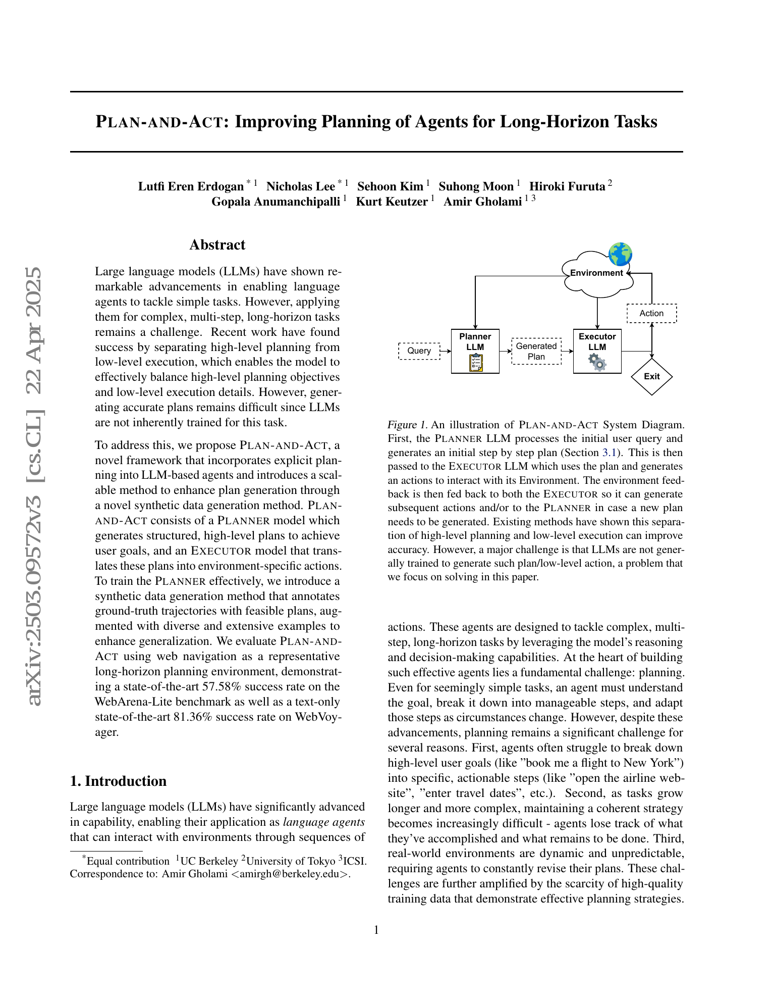
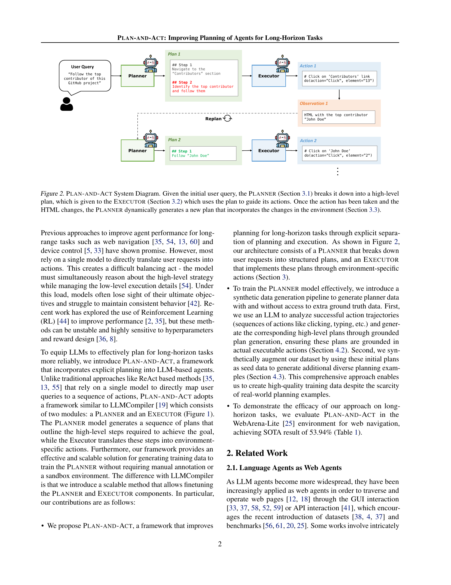
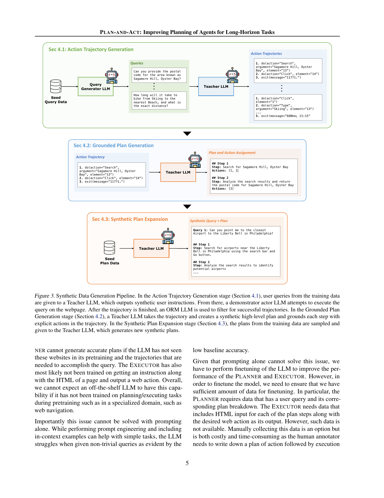
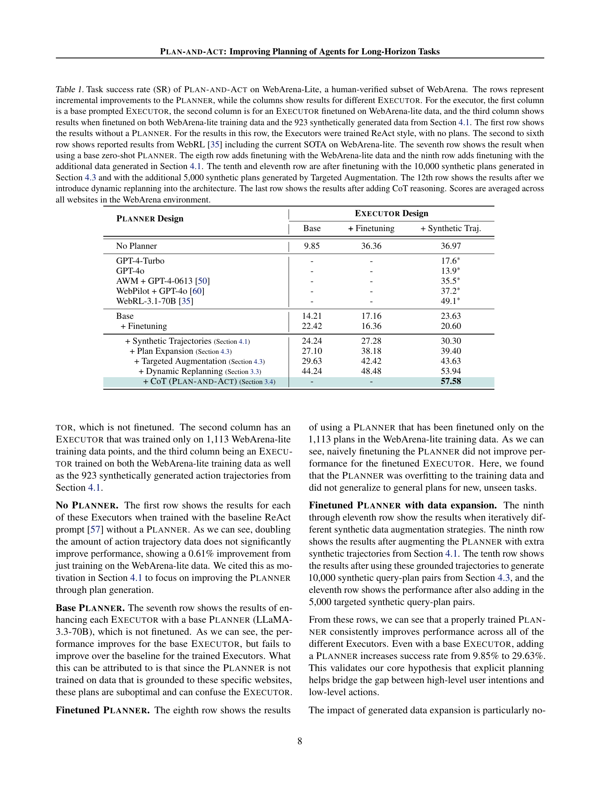
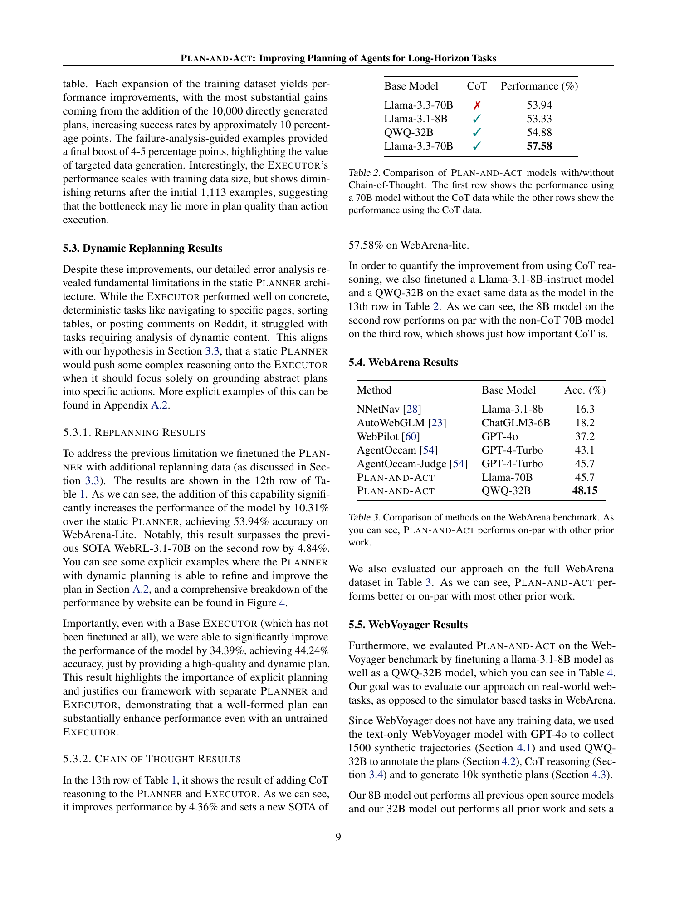
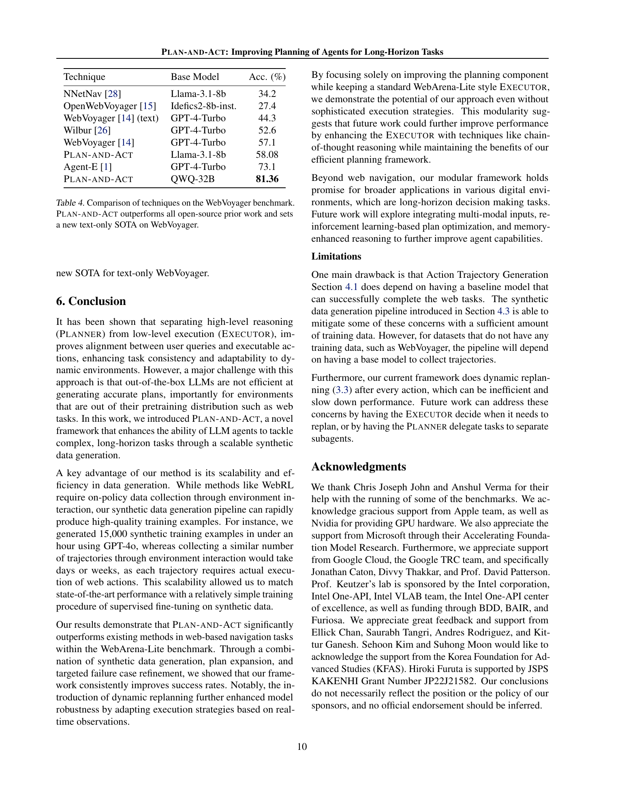

# Plan-and-Act: Improving Planning of Agents for Long-Horizon Tasks

## TL;DR

Plan-and-Act argues that long-horizon web agents fail partly because one model is asked to both plan the task and execute low-level browser actions. The paper separates these roles into a Planner and Executor, then trains the Planner with synthetic plans derived from successful action trajectories plus expanded and targeted plan examples. On WebArena-Lite, the full system reaches 57.58% success, improving over WebRL-3.1-70B's reported 49.1%; on text-only WebVoyager, the QWQ-32B version reaches 81.36%. The strongest lesson is that explicit, dynamically updated plans can be a high-leverage interface between user goals and web actions, but the data pipeline still depends on seed trajectories and replanning after every action can be expensive.

Source: [arXiv:2503.09572](https://arxiv.org/abs/2503.09572), [PDF](https://arxiv.org/pdf/2503.09572.pdf)

## Background

Many web-agent systems use a single LLM policy to translate a user instruction directly into actions such as clicking, typing, searching, and exiting with an answer. That model must hold the high-level task objective, interpret page state, decide the next subgoal, and emit environment-specific actions at the same time. As tasks become longer, this mixed responsibility makes the agent more likely to lose track of the goal or overfit to immediate page details.

Prior systems already showed that planning can help web navigation, but many of them use closed-source prompting stacks or complex multi-agent control loops. Plan-and-Act keeps the runtime architecture deliberately simple: one Planner writes high-level steps, and one Executor grounds those steps into concrete web actions. The paper's main focus is therefore not just "add a planner," but how to create enough grounded planner training data to make that planner useful for long-horizon web tasks.

## Problem

The target setting is long-horizon decision making in web environments. Given a user instruction \(q\) and a sequence of page observations \(o_1, o_2, \ldots\), the agent must produce actions \(a_t\) that eventually satisfy the task. A direct ReAct-style executor can be viewed as:

\[
a_t = \pi_{\theta}(q, o_{\leq t}, a_{<t}).
\]

Plan-and-Act instead introduces an intermediate plan:

\[
p_t = \pi_{\mathrm{planner}}(q, o_{\leq t}, p_{<t}, a_{<t}), \quad
a_t = \pi_{\mathrm{executor}}(q, p_t, o_t).
\]

The key challenge is that \(p_t\) must be both abstract enough to guide strategy and grounded enough that the Executor can actually carry it out in a specific website. Naively asking a teacher model to write plans from user queries alone can produce plausible but unexecutable steps, because the teacher may not know the site structure or the exact action path.

## Method

Plan-and-Act has three runtime pieces.

First, the Planner receives the user query and produces a structured high-level plan. For example, a GitHub task may become "navigate to contributors" and then "identify and follow the top contributor." The plan is meant to reduce the Executor's reasoning burden.

Second, the Executor receives the current plan plus the page observation and emits a concrete environment action. In the web-navigation setup, observations are text/HTML representations, and actions follow the WebArena-style action space.

Third, the system supports dynamic replanning. After each Executor action, the Planner can revise the remaining plan using the new observation and previous actions. This matters when the next step depends on information discovered during execution, such as the name of the top contributor, a search-result item, or an order status.

The training-data pipeline is the main technical contribution:

1. Action trajectory generation: sample or synthesize user queries, run a demonstrator agent in the environment, and filter successful trajectories with an outcome-supervised reward model.
2. Grounded plan generation: ask a teacher LLM to convert each successful trajectory into high-level plan steps and assign low-level actions to those steps.
3. Synthetic plan expansion: use grounded plans as seeds for additional query-plan pairs, including targeted augmentation based on planner failure categories.
4. Replanning and reasoning data: generate examples where the Planner updates a plan mid-trajectory and, in the final system, generate chain-of-thought traces before plans and actions.

This turns a small amount of environment interaction into much larger supervised data for the Planner. The paper reports generating 10,000 synthetic plans plus 5,000 targeted plans, and also adds replanning and CoT-style training data.

## Experiments

The main benchmark is WebArena-Lite, a 165-task human-verified subset of WebArena. Without a Planner, a base Executor reaches 9.85% success, while a fine-tuned Executor with synthetic trajectories reaches 36.97%. Adding a base Planner helps only the base Executor, but a properly trained Planner improves consistently.

The WebArena-Lite ablation is the clearest result. With a synthetic-trajectory-trained Executor, Plan-and-Act improves from 30.30% after basic planner data to 39.40% after synthetic plan expansion, 43.63% after targeted augmentation, 53.94% after dynamic replanning, and 57.58% after adding CoT reasoning. The final number exceeds the paper's cited WebRL-3.1-70B result of 49.1%.

The paper also reports full WebArena results. Plan-and-Act with Llama-70B reaches 45.7%, matching AgentOccam-Judge, while the QWQ-32B version reaches 48.15%. This suggests the approach is competitive beyond the smaller WebArena-Lite subset, though not a decisive leap over all prior systems.

On WebVoyager, the authors train from synthetic trajectories because the benchmark lacks training data. The Llama-3.1-8B version reaches 58.08%, above the text-only WebVoyager GPT-4-Turbo result of 44.3%, and the QWQ-32B version reaches 81.36%, above Agent-E's cited 73.1%. The paper frames this as a new text-only state of the art.

## Critical Analysis

The most useful contribution is the grounded planner-data recipe. The paper does not assume that high-level plans from a teacher model are automatically correct. Instead, it derives plans from successful action trajectories, which makes the plan labels closer to what the Executor can actually execute.

The ablation also makes a strong case for dynamic replanning. Static plans improve with synthetic data, but a large jump appears when the Planner is trained to revise plans after observing intermediate page state. This matches how real web tasks work: important details often become available only after navigation.

The main limitation is dependency on successful seed trajectories. The action trajectory stage still needs a baseline agent and an environment where trajectories can be run and scored. For domains without a simulator, reliable evaluator, or capable starter agent, the pipeline becomes harder to bootstrap.

The second limitation is runtime cost. Replanning after every action is simple and robust, but it adds another LLM call per step. A production system would likely need a cheaper policy for deciding when the current plan is stale enough to replan.

Finally, the method is evaluated in text/HTML web-agent settings. It does not directly solve visual grounding, popups, authentication flows, browser latency, or irreversible action safety. The planner/executor split is broadly useful, but deployment still requires robust environment adapters and guardrails.

## Implementation Notes

For builders, the paper suggests treating plans as a trained interface contract between strategic reasoning and action grounding. A practical implementation should keep the Planner output structured, short, and directly consumable by the Executor:

\[
\text{PlanStep} = \{\text{goal}, \text{status}, \text{evidence}, \text{next constraints}\}.
\]

The Executor should not need to infer the whole strategy from scratch. It should receive the current plan, current observation, and action schema, then emit only the next concrete action.

The data pipeline is also reusable outside web navigation. If a system has successful trajectories, it can ask a stronger model to annotate those trajectories into plans, verify that each plan step maps to observed actions, and then fine-tune a smaller Planner. The important implementation detail is grounding: plan labels should be tied to executable traces, not generated only from task descriptions.

For efficiency, a production variant should not replan unconditionally. It can track plan validity with simple triggers: new page type, empty search results, repeated action failure, newly discovered entity, or a mismatch between expected and observed state. That preserves the paper's main benefit while reducing Planner calls.

## Captured Figures and Tables

