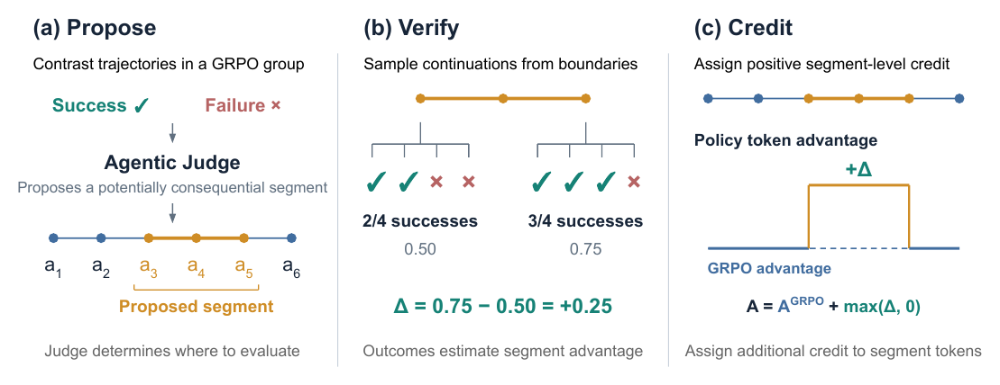
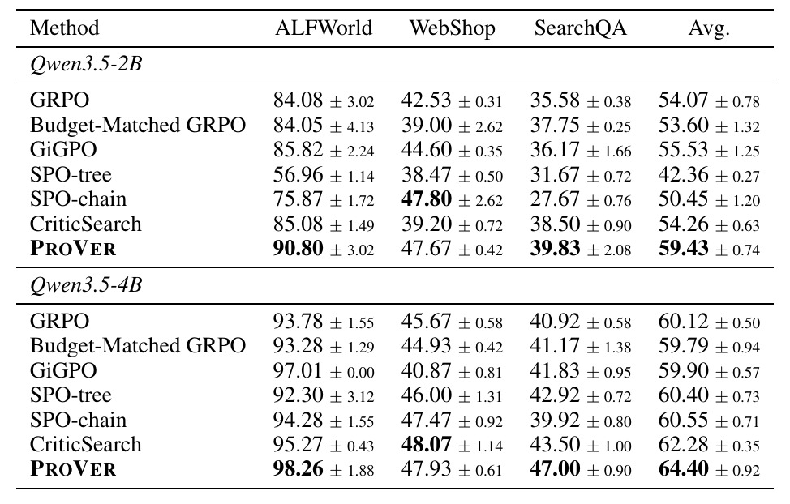
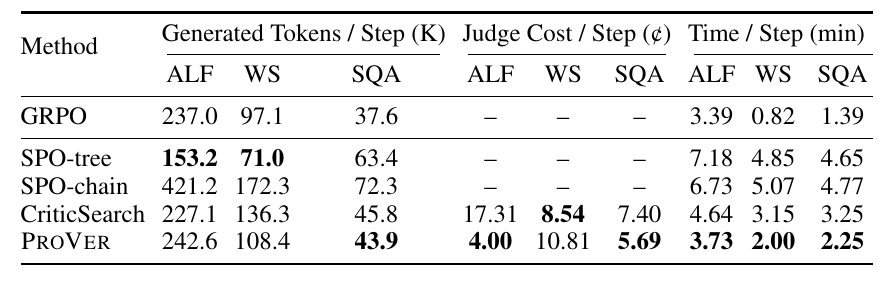
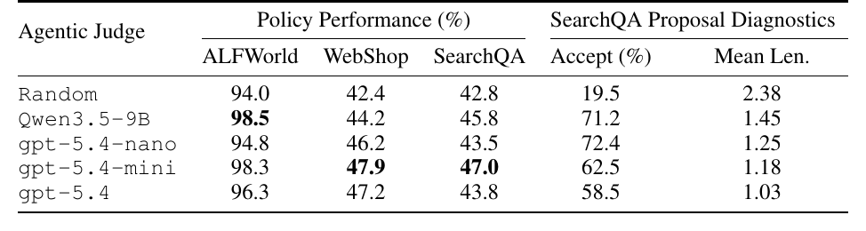

# Targeting Pivotal Decisions for Credit Assignment in Agentic Reinforcement Learning

## TL;DR

GRPO gives every token in a trajectory the same advantage, so in long agent rollouts it cannot tell the one decision that won the episode from the twenty that did not matter. ProVer (Propose, Verify, Credit) splits the job: an LLM agentic judge compares successful and failed trajectories in a GRPO group and proposes one short segment of the successful run that probably made the difference; the environment is then restored to the states just before and just after that segment, $K = 8$ current-policy continuations are sampled from each, and the gap in success rates $\hat\Delta_{seg}$ becomes a bonus on that segment's tokens when positive. The judge only decides where to spend the verification budget and never supplies the credit number itself. On ALFWorld, WebShop, and SearchQA with Qwen3.5-2B and 4B, ProVer has the best average at both scales (59.43 and 64.40 vs 54.07 and 60.12 for GRPO, +9.91% and +7.12% relative), beats a rollout-budget-matched GRPO in every setting, and runs faster per step than SPO-chain, SPO-tree, and CriticSearch.

Source: [arXiv:2609.36178](https://arxiv.org/abs/2609.36178), [PDF](https://arxiv.org/pdf/2609.36178.pdf). Preprint from UC Davis, Microsoft, University of Washington, and Purdue.

## Background

Agentic RL with verifiable outcomes (WebAgent-R1, Search-R1, ReTool) mostly runs on GRPO because group-relative advantages need no value model. With binary rewards the advantage is just $A_i^{GRPO} = R_i - \frac{1}{G}\sum_j R_j$, applied uniformly to every policy token in trajectory $i$. That works for short reasoning traces but degrades over 15 to 50 environment turns: mistakes inside winning runs get reinforced and useful progress inside losing runs gets penalized.

Two families of fixes exist. Critic-based process supervision (PRMs, LLM critics such as CriticSearch, role-typed or contribution-weighted credit) gives dense local signals, but the evaluator's judgment becomes the reward and can be wrong, drift as the policy changes, or be exploited. Outcome-based Monte Carlo methods (VinePPO, SPO-chain, SPO-tree, TreeRL) branch from intermediate states and average real terminal rewards, which is grounded but expensive, because every boundary evaluated means restoring environment state and running full continuations. GiGPO sits in between, comparing actions taken from repeated states within a group for free, but only covers states that happen to recur.

## Problem

The paper asks whether you can get outcome-grounded, local credit without paying to evaluate every step. The bet is that a small number of decisions are pivotal, and a model can guess where they are well enough to target an expensive Monte Carlo check at only those boundaries, as long as the model's guess never directly becomes the reward.

## Method

ProVer runs on mixed-outcome GRPO groups, restricted in practice to groups with 1 to 3 successes out of $G = 8$.

Propose. From each eligible group, take the successful trajectory with the shortest horizon. An external agentic judge (gpt-5.4-mini by default) receives that trajectory in full, compact previews of the failed ones, and two tools adapted from agentic aggregation work: `search_trajectory(query, k)` over the failed runs and `get_segment(traj_id, start_turn, end_turn)` to read turn ranges. The prompt asks it to diagnose one failure mode that recurs across failed runs and return the shortest nonterminal segment $(\ell, r)$ of at most four action turns in the successful run that solves or avoids that failure. Malformed or error-producing actions must be excluded even if recovering from them helped. Outputs are validated for schema, bounds, action validity, and a nonterminal endpoint, with up to three repair turns.

Verify. Treating the recorded segment as a temporally extended action with no intermediate rewards and $\gamma = 1$, its advantage under the fixed policy $\pi$ reduces to a difference of boundary values:

$$
A^\pi_{seg}(s_{pre}, a_{\ell:r}) = V^\pi(s_{post}) - V^\pi(s_{pre}).
$$

With binary rewards these values are success probabilities. ProVer restores the exact agent and environment state at $s_{pre} = s_\ell$ and $s_{post} = s_{r+1}$, samples $K$ continuations from each, and estimates

$$
\hat\Delta_{seg} = \frac{1}{K}\sum_{k=1}^K R_k^{post} - \frac{1}{K}\sum_{k=1}^K R_k^{pre}.
$$

Appendix B shows this is conditionally unbiased for the segment advantage given the selected segment, assuming deterministic segment execution.

Credit. If $\hat\Delta_{seg} > 0$, every trainable token in the segment gets $A^{GRPO} + \lambda\hat\Delta_{seg}$ with $\lambda = 1$. Everything else keeps its GRPO advantage, the boundary continuations are not added to the training batch, and the clipping and ratio terms of the objective are unchanged. Figure 1 below walks through a toy case: 2/4 successes before the segment, 3/4 after, so the segment's tokens receive $+0.25$.

## Experiments

Setup: AgentGym versions of ALFWorld (50 turns, 134 valid-unseen games), WebShop (15 turns, 500 test goals), and SearchQA (30 turns, FAISS over 2018 Wikipedia, a 400-question stratified mix of NQ, TriviaQA, PopQA, HotpotQA, 2Wiki, Bamboogle, and MuSiQue, scored by gpt-5.4-mini semantic match). Training uses Prime-RL for 100 optimizer steps, 16 groups of 8 per update, on 4+4 A100s. Baselines are GRPO, Budget-Matched GRPO (extra rollouts per group sized to match ProVer's realized continuation budget), GiGPO, SPO-chain and SPO-tree (adapted to the same eligible-group regime), and CriticSearch using the same gpt-5.4-mini as critic.

Main results (Table 1). ProVer has the best average at both scales and improves over GRPO in all six model-environment cells. The budget-matched control is the most useful comparison: it does not reliably beat plain GRPO (53.60 vs 54.07 at 2B, 59.79 vs 60.12 at 4B), and ProVer beats it everywhere by 5.3% to 22.2% relative, so the gain is not just more samples. SPO-chain and SPO-tree, which spend continuations at fixed boundaries, trail badly on SearchQA (SPO-chain 27.67 at 2B vs ProVer 39.83), and SPO-tree collapses on 2B ALFWorld (56.96). The closest competitor at 4B is CriticSearch (62.28 vs 64.40), which uses the same LLM but turns its judgments directly into credit; it edges ProVer on 4B WebShop (48.07 vs 47.93).

Cost (Table 2, Qwen3.5-4B). ProVer adds 2.4%, 11.6%, and 16.8% generated policy tokens over GRPO on ALFWorld, WebShop, and SearchQA. Per-step wall time is 3.73, 2.00, and 2.25 minutes, lower than every other fine-grained method; SPO-tree generates fewer tokens than GRPO on two environments yet takes about 5 minutes per step because of sequential branching and state restoration. Judge API cost averages 38.4% below CriticSearch, which has to label all eight trajectories per eligible group.

Judge ablation (Table 3). Replacing the judge with uniformly random valid segments, while keeping verification and credit the same, gives 94.0 / 42.4 / 42.8, an average of about 59.7 that is no better than GRPO's 60.12. On SearchQA only 19.5% of random proposals verify positive, against 58.5% to 72.4% for LLM judges, even though random segments are longer (2.38 vs 1.03 to 1.45 turns). Bigger judges do not help: gpt-5.4-mini gives the best WebShop and SearchQA policies, a locally served Qwen3.5-9B gives the best ALFWorld score (98.5), and full gpt-5.4 wins nowhere.

## Critical Analysis

The idea I find most worth keeping is the division of labor. LLM judges are good at reading two trajectories and pointing at where they diverged, and bad at producing calibrated numbers. ProVer uses them only for the first job and lets environment rollouts produce the number. The random-selection ablation is what makes this convincing: Monte Carlo verification on random segments roughly recovers GRPO, so the gain comes from where the budget is spent rather than from verification as such. The budget-matched GRPO control is also more careful than most credit-assignment papers bother with.

There are reasons to read the numbers cautiously. The reported spread is the standard deviation over three evaluation runs, which appears to measure evaluation noise on a fixed trained checkpoint rather than variance across training seeds. Several cell-level comparisons sit within about one point (ProVer vs CriticSearch on 4B WebShop, ProVer vs GiGPO on 4B ALFWorld, ProVer vs SPO-chain on 2B WebShop), and Table 3 reports single numbers with no spread at all, so claims like "gpt-5.4-mini beats gpt-5.4" rest on differences of one to three points from presumably one run each. Training is also short at 100 optimizer steps; it is unclear whether the advantage persists, grows, or washes out as GRPO itself converges.

The estimator is noisier than the unbiasedness result suggests. With $K = 8$ and boundary success rates near 0.5, the standard error of $\hat\Delta_{seg}$ is around 0.25, which is the same size as a typical bonus. The unbiasedness claim covers $\hat\Delta_{seg}$, but the credit rule applies $\max(\hat\Delta_{seg}, 0)$, and thresholding a noisy estimate at zero gives a zero-advantage segment a positive expected bonus. In practice this is probably a mild, mostly harmless optimism, because the bonus only touches segments of already-successful trajectories, but it means part of the credit is noise selected by a sign test, and the paper does not measure how much.

Applicability is bounded by the verify step. It requires exact restoration of agent and environment state at arbitrary turns, plus deterministic replay of the segment. AgentGym simulators allow that; live websites, stateful APIs, and anything with side effects do not, and those are where agent RL is heading. The baselines SPO-chain and SPO-tree were also adapted by the authors to fit the eligible-group regime (the paper notes the original methods are impractical for long stateful trajectories), so their weak results, especially the 2B ALFWorld collapse, may partly reflect the adaptation. Finally, SearchQA evaluation uses gpt-5.4-mini as answer judge, the same model that serves as ProVer's agentic judge and CriticSearch's critic during training; that is unlikely to favor one method, but it is a shared dependency worth noting.

For this archive, ProVer sits between GAPO and score centering on the GRPO-mechanics side and CriticSearch-style critic credit on the agent side. It is a cleaner answer than either to the question of how to use an LLM judge inside RL without making it the reward.

## Implementation Notes

To try the pattern on your own environment: only fire it on groups with a low but nonzero success rate (here 1 to 3 of 8), pick the shortest successful trajectory, and ask the judge for the shortest nonterminal segment, capped at a few turns, that fixes a failure mode recurring across the failed runs. Validate the judge output deterministically and drop invalid proposals rather than retrying forever. Snapshot full agent and environment state at every turn so boundaries can be restored; without cheap snapshots the method does not apply. Keep boundary continuations out of the training batch, add the bonus only when positive, and leave clipping and ratios alone. A small or local judge model is enough to start with. If you have the budget, raise $K$ or require $\hat\Delta_{seg}$ to clear a margin rather than zero, and log the acceptance rate as a health metric, since a judge that is no better than random shows up there first.

## Captured Figures and Tables

