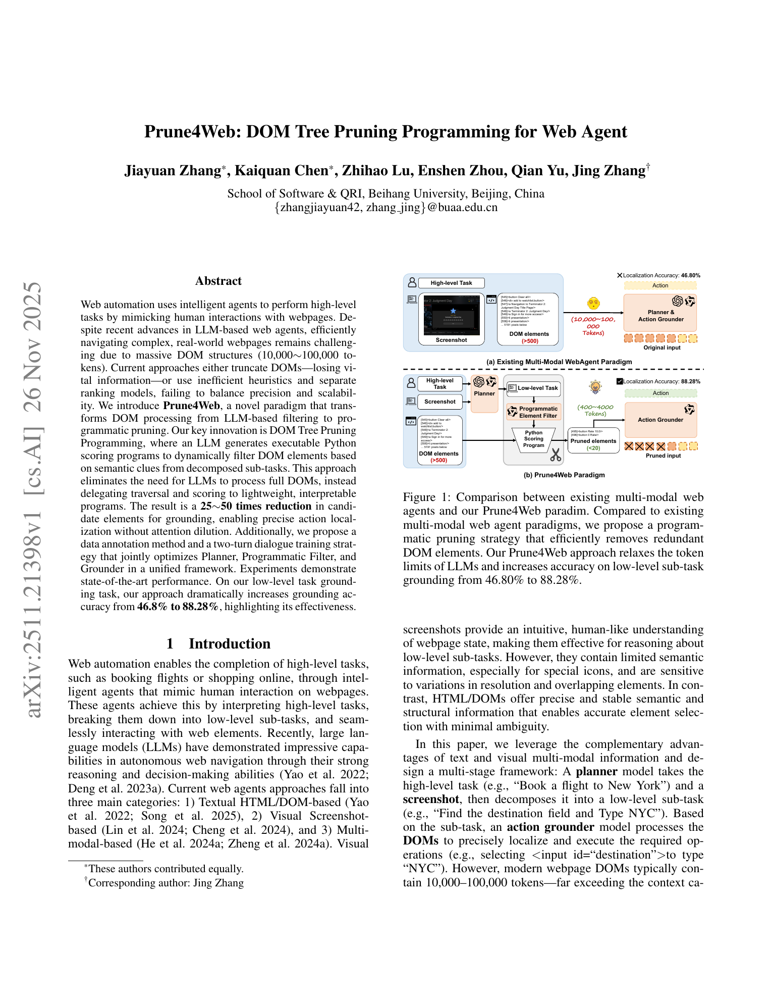
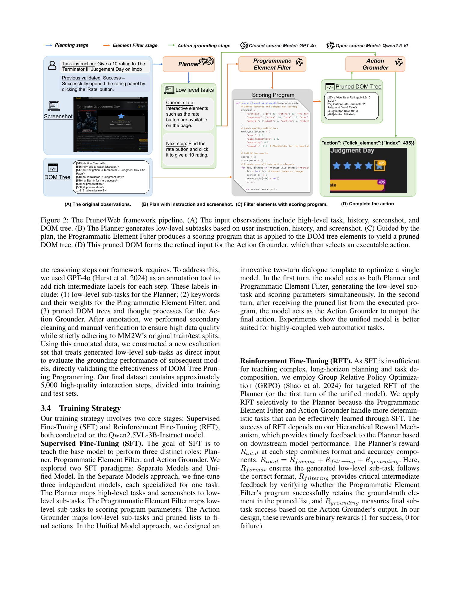
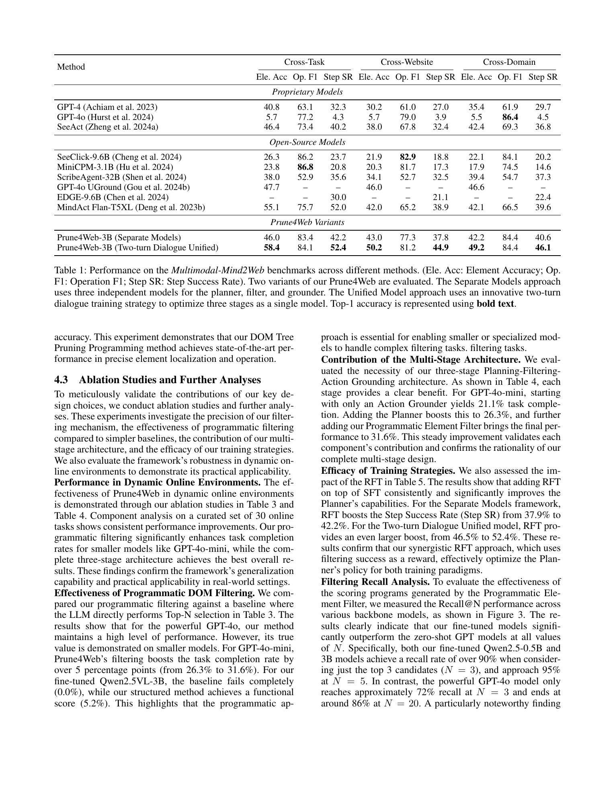

# Prune4Web: DOM Tree Pruning Programming for Web Agent

## TL;DR

Prune4Web is a web-agent architecture that avoids feeding huge DOM trees directly into an LLM. A planner first turns the user's high-level instruction into a low-level sub-task, then a programmatic filter generates a lightweight Python scoring program that ranks DOM elements, and a grounder chooses the final action from the short list. The main result is a 25-50x candidate reduction and a low-level grounding accuracy jump from 46.80% without pruning to 88.28% with Prune4Web's programmatic filtering pipeline.

Source: [arXiv:2511.21398](https://arxiv.org/abs/2511.21398), [PDF](https://arxiv.org/pdf/2511.21398.pdf)

## Background

Web agents usually need both visual context and exact web structure. Screenshots help the model reason like a human user, but they can hide semantic details behind icons, dynamic layout, or overlapping elements. DOM and HTML observations expose exact tags, labels, attributes, and structure, but real pages can produce tens of thousands of tokens.

That creates a tension for LLM-based agents. If the model reads the full DOM, context length and attention dilution become serious bottlenecks. If the system truncates or heuristically simplifies the DOM, it may remove the one element needed for the next action. Prune4Web targets this bottleneck directly.

## Problem

The paper frames web automation as a high-level task decomposition and element-grounding problem. At each step, the agent must convert a user task and current page state into an executable action such as clicking a button, typing into an input, or declaring the task complete.

The hard case is element-specific action grounding. The useful target is often one node inside a large DOM:

\[
\text{target} \in \{e_1, e_2, \ldots, e_n\}, \quad n \gg 100.
\]

The authors argue that existing DOM reduction strategies are either too rigid, because they use fixed rules, or too expensive, because they ask another model to rank many candidates. Prune4Web asks whether the LLM can instead write a small scoring program and let ordinary code traverse the DOM.

## Method

Prune4Web has three stages.

The Planner receives the high-level task, screenshot, and action history. It does not read the full HTML. Its job is to produce the next low-level sub-task:

\[
S_t = \text{Planner}(T, Sc_t, H_t).
\]

The Programmatic Element Filter receives that low-level sub-task and the DOM. Instead of asking an LLM to inspect every candidate, the model fills a controlled scoring-template with keywords and weights. The generated Python scoring function runs outside the LLM over a pre-filtered interactive DOM:

\[
C_t = \text{ProgrammaticElementFilter}(S_t, HTML_t).
\]

The scoring template uses attribute priority and match quality. Visible text, trusted attributes such as `aria-label` or `placeholder`, and weaker attributes such as `class` or `id` are weighted differently. Exact, phrase, word, and fuzzy matches also receive different multipliers. This keeps the generated code constrained while preserving task-specific flexibility.

The Action Grounder then receives the low-level sub-task and the pruned candidate list:

\[
A_t = \text{ActionGrounder}(S_t, C_t).
\]

For non-element actions, such as reporting completion, the grounder can act directly from the sub-task. For click/type/select actions, it chooses from the reduced DOM list, usually with far fewer than the hundreds of elements present on the original page.

Training uses an annotated version of Multimodal-Mind2Web. GPT-4o is used to synthesize intermediate labels such as low-level sub-tasks, filter keywords, weights, pruned DOM lists, and action-grounding reasoning. The authors train Qwen2.5VL-3B-Instruct with supervised fine-tuning, then apply reinforcement fine-tuning to improve planning. Their reward combines output-format validity, whether the filter retains the ground-truth element, and whether the final grounded action is correct:

\[
R_{\text{total}} = R_{\text{format}} + R_{\text{filtering}} + R_{\text{grounding}}.
\]

## Experiments

The primary offline benchmark is Multimodal-Mind2Web, evaluated with Element Accuracy, Operation F1, and Step Success Rate across Cross-Task, Cross-Website, and Cross-Domain splits.

On Multimodal-Mind2Web, the Two-turn Dialogue Unified Prune4Web-3B model reports:

- Cross-Task: 58.4 Element Accuracy, 84.1 Operation F1, 52.4 Step Success Rate.
- Cross-Website: 50.2 Element Accuracy, 81.2 Operation F1, 44.9 Step Success Rate.
- Cross-Domain: 49.2 Element Accuracy, 84.4 Operation F1, 46.1 Step Success Rate.

The low-level grounding benchmark is the clearest evidence for the core pruning idea. With ground-truth low-level sub-tasks:

- Qwen2.5VL-3B with original HTML and no pruning reaches 46.80% grounding accuracy.
- GPT-4o with Prune4Web's programmatic filter reaches 80.65%.
- Fine-tuned Qwen2.5-0.5B and Qwen2.5VL-3B with Prune4Web both reach 88.28%.
- The fine-tuned 0.5B filter reaches 97.64 Recall@20, nearly matching the 3B model at 97.46.

The ablations also support the architecture. For GPT-4o-mini on 30 online tasks, adding a planner to the action grounder raises task completion from 21.1% to 26.3%, and adding Prune4Web filtering raises it to 31.6%. Reinforcement fine-tuning improves the Two-turn Dialogue model's Cross-Task Step Success Rate from 46.5% to 52.4%.

## Critical Analysis

The strongest idea is the role shift: the LLM does not consume the massive DOM, it writes a compact procedure that handles the massive DOM. That is a good systems move because traversal, scoring, and ranking are cheaper and more inspectable as code than as repeated model attention over long context.

The second strength is that the method appears to help smaller models. If a 0.5B downstream model can retain the right element at high Recall@20 and match the 3B model's final grounding accuracy, then the programmatic representation is doing useful work. This matters for latency and deployment cost.

The main limitation is that the paper's strongest gains depend on a custom re-annotated dataset and synthetic intermediate supervision. The method is compelling, but reproducing it requires high-quality low-level sub-task labels, keyword/weight labels, and action traces. That is more involved than simply adding a pruning module to an existing agent.

A second limitation is that the scoring-program template assumes useful textual or attribute cues exist in the DOM. Many web failures come from hidden state, canvas-heavy interfaces, icon-only controls, stale accessibility labels, login state, CAPTCHAs, or elements whose relevance only becomes clear through visual layout. Prune4Web helps with DOM overload, but it does not remove the need for strong visual state understanding and recovery behavior.

Finally, the failure cases in the appendix show that better grounding cannot compensate for bad planning. If the planner selects the wrong strategy, precise pruning can make the wrong path more efficient. This is a useful reminder that web-agent reliability depends on the whole loop, not only click localization.

## Implementation Notes

For builders, the reusable pattern is:

1. Keep planning separate from raw DOM inspection.
2. Convert the current low-level sub-task into a constrained scoring program.
3. Run the program locally over a structured DOM representation.
4. Give the action model only the top-ranked candidates.
5. Reward or test the filter by checking whether the ground-truth element survives in the candidate list.

The key engineering detail is constraining generation. A free-form Python script would be brittle and risky. Prune4Web's safer pattern is closer to a parameterized scoring template:

\[
\text{score}(e) =
\sum_{k \in W}
w_k \cdot \alpha(\text{match}(k, e)) \cdot \beta(\text{attribute}(e)).
\]

The LLM supplies `W` and weights, while the runtime owns parsing, traversal, scoring rules, and output formatting. That split makes the method easier to audit and debug.

## Captured Figures and Tables

