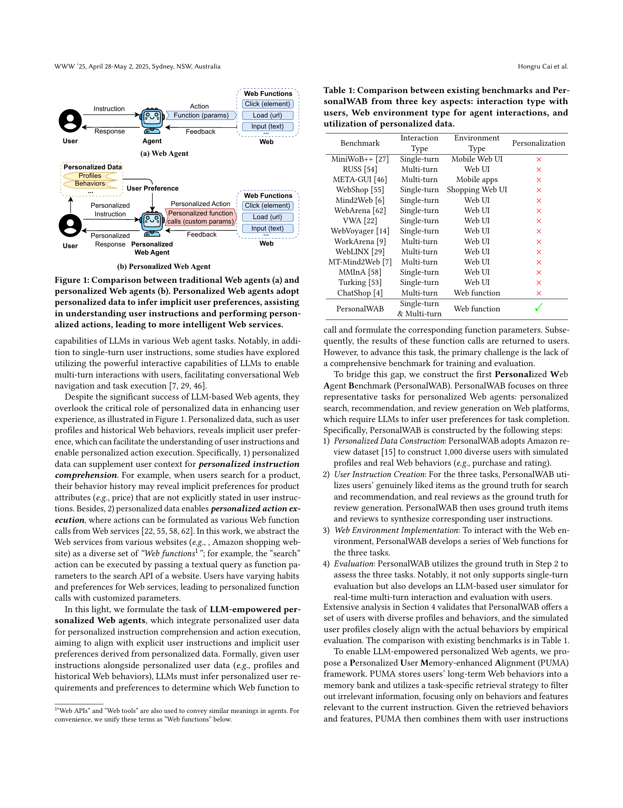
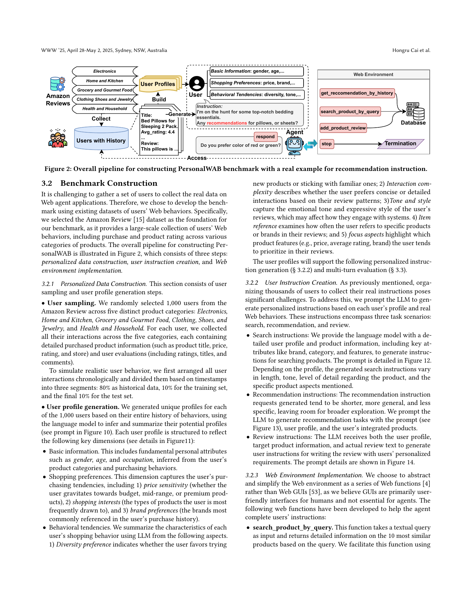
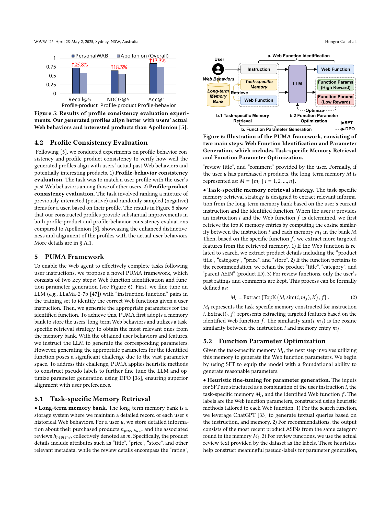
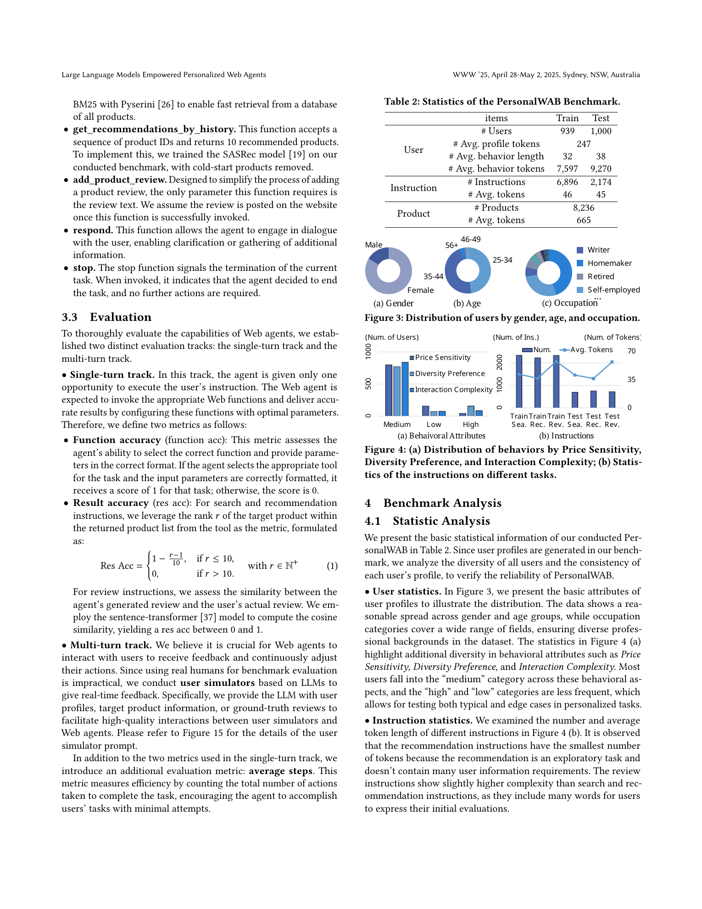
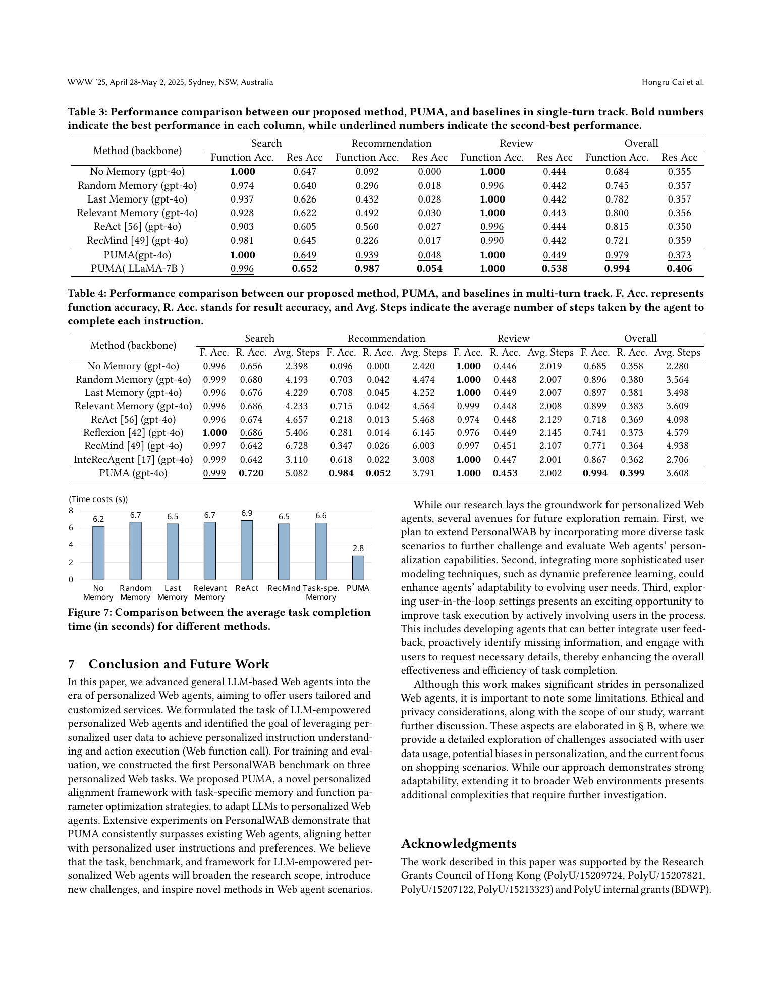

# Large Language Models Empowered Personalized Web Agents

## TL;DR

This paper argues that web agents should not treat every user instruction as stateless. It introduces personalized web agents, where the agent receives a user instruction plus profile and behavior history, then selects a web function and parameters that reflect the user's implicit preferences. The authors build PersonalWAB, a benchmark for personalized search, recommendation, and review generation, and propose PUMA, a memory retrieval plus SFT/DPO alignment framework. PUMA greatly improves function selection, especially for recommendation tasks, though result accuracy remains modest and the setting is still a shopping-function abstraction rather than a full browser benchmark.

Source: [arXiv:2410.17236](https://arxiv.org/abs/2410.17236), [PDF](https://arxiv.org/pdf/2410.17236.pdf), [project](https://hongrucai.github.io/PersonalWAB/)

## Background

Most web-agent benchmarks evaluate whether an agent can follow an explicit instruction against a page, tool, or simulated web environment. That framing misses an important user-facing constraint: two users may issue the same instruction but expect different products, result ordering, wording, or follow-up behavior because their preferences differ.

The paper positions personalization as a missing axis in web-agent research. A personalized web agent should use user profiles and historical web behaviors, such as purchases, ratings, and reviews, to infer preferences that are not fully specified in the instruction. In the paper's abstraction, the web environment is exposed through callable functions rather than visual UI operations, so the core challenge becomes selecting the right function and passing personalized parameters.

## Problem

Given a user \(u\), profile \(P_u\), historical behavior sequence \(H_u = \{h_u^1, h_u^2, \ldots, h_u^N\}\), and instruction \(i_u\), the agent must choose a web function \(f\) and parameter \(p\) that return useful personalized output \(O_f^p\). A generic agent might map "I need bedding essentials" to a broad search query, while a personalized agent should infer preferred price range, brand habits, writing style, or product types from the user's memory.

The paper studies three personalized web tasks:

- Search: generate a query for `search_product_by_query`.
- Recommendation: provide product IDs to `get_recommendations_by_history`.
- Review generation: draft a review through `add_product_review`.

The evaluation separates two failure modes. Function accuracy checks whether the agent chose the right tool and parameter format. Result accuracy checks whether the chosen parameters actually recover the target item or match the user's real review. For search and recommendation, result accuracy is a top-10 rank score, roughly:

\[
\text{ResAcc}(r) =
\begin{cases}
1 - \frac{r - 1}{10}, & r \leq 10,\\
0, & r > 10.
\end{cases}
\]

## Method

PersonalWAB is built from Amazon Review data. The authors sample 1,000 users across five shopping categories, then split each user's chronological behavior into historical data, training data, and test data. They use LLMs to synthesize user profiles and task instructions from real products and reviews. The benchmark includes 6,896 training instructions, 2,174 test instructions, 8,236 products, and both single-turn and multi-turn evaluation tracks. Multi-turn evaluation uses an LLM-based user simulator to provide feedback.

PUMA has two stages.

First, it identifies the web function. The model is fine-tuned on instruction-function pairs so it can distinguish search, recommendation, review, response, and stop actions. This matters because recommendation instructions are frequently misclassified as search by generic baselines.

Second, it generates function parameters from task-specific user memory. PUMA stores each user's purchase and review history in a long-term memory bank, retrieves the top-\(K\) relevant behaviors by cosine similarity to the instruction, and extracts different fields depending on the selected function:

- Search uses product title, category, price, and store.
- Recommendation uses title, category, and parent ASIN.
- Review generation uses past ratings and comments.

For parameter learning, PUMA first creates heuristic SFT labels: GPT-generated search queries, recent same-category ASINs for recommendation, and real review text for review tasks. It then samples multiple candidate parameters and applies DPO, treating higher-result-accuracy parameters as preferred:

\[
\mathcal{L}_{DPO}
= -\mathbb{E}\left[
\log\sigma\left(
\beta\log\frac{\pi_\theta(p^b \mid x)}{\pi_{ref}(p^b \mid x)}
- \beta\log\frac{\pi_\theta(p^w \mid x)}{\pi_{ref}(p^w \mid x)}
\right)
\right].
\]

Here \(x\) contains the instruction, task-specific memory, and selected function, while \(p^b\) and \(p^w\) are the better and worse parameter candidates.

## Experiments

The paper compares PUMA with no-memory, random-memory, last-memory, relevant-memory, ReAct, RecMind, Reflexion, and InteRecAgent variants. GPT-4o-based baselines use the same prompt template, differing mainly in their memory strategy.

In the single-turn track, PUMA with LLaMA-2-7B reaches 0.994 overall function accuracy and 0.406 overall result accuracy. The strongest baselines are far lower on function accuracy: Relevant Memory reaches 0.800/0.356, ReAct reaches 0.815/0.350, and RecMind reaches 0.721/0.359 for overall function/result accuracy. The largest gain is recommendation function selection: No Memory gets 0.092, ReAct gets 0.560, and PUMA with LLaMA-2-7B gets 0.987.

In the multi-turn track, the PUMA variant reported with GPT-4o reaches 0.994 overall function accuracy, 0.399 result accuracy, and 3.608 average steps. It also improves search result accuracy to 0.720 and recommendation function accuracy to 0.984. The authors report that PUMA's average single-turn completion time is 2.8 seconds, compared with roughly 6.2 to 6.9 seconds for GPT-based baselines.

Ablations support the framework design. Removing task-specific memory drops overall result accuracy from 0.406 to 0.373. Removing SFT collapses result accuracy to 0.054, while removing DPO gives a smaller decline to 0.399. This suggests that supervised parameter learning is the critical ingredient, with DPO providing additional alignment.

## Critical Analysis

The strongest contribution is the problem formulation. Personalization is not just a better prompt; it changes what should count as successful web action execution. By measuring both function accuracy and personalized result accuracy, the benchmark exposes errors that ordinary web-agent benchmarks would hide.

The function abstraction is also pragmatic. It makes personalized action execution measurable without needing fragile browser state, DOM grounding, or visual parsing. That is useful for isolating memory and preference modeling.

The main limitation is realism. PersonalWAB is shopping-focused, based on generated profiles and generated instructions, and uses web functions rather than messy live websites. The work is therefore closer to personalized tool use than full web automation. A browser agent still has to handle UI grounding, dynamic pages, authentication, popups, and visual ambiguity.

The second limitation is that result accuracy remains low, especially for recommendation. Even PUMA's best recommendation result accuracy is 0.054 in the single-turn table. The framework learns to call the right function, but choosing the exact product IDs that match a user's implicit preference is still hard.

Finally, the benchmark depends on sensitive behavioral history. The paper discusses privacy and bias, but a production version would need stronger controls: data minimization, retention policies, user-visible memory editing, and evaluation for personalization-induced stereotyping.

## Implementation Notes

The paper suggests a useful engineering pattern for personalized agents:

1. Keep long-term user memory structured, not just as raw transcript text.
2. Retrieve memory differently for each tool or function.
3. Train function selection separately from parameter generation.
4. Use weak labels to bootstrap tool parameters, then optimize against task rewards.
5. Report function accuracy and outcome quality separately.

For an implementation, the key object is a task-conditioned memory view:

\[
M_i = \text{Extract}(\text{TopK}(M, \text{sim}(i, m_j), K), f).
\]

This avoids sending the same large user history to every tool call. It also gives each function only the fields that matter for its parameter schema.

## Captured Figures and Tables

