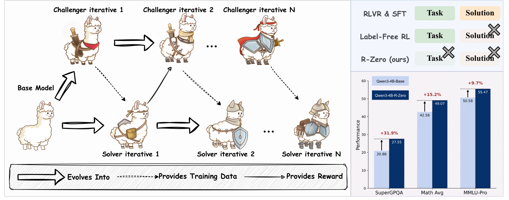
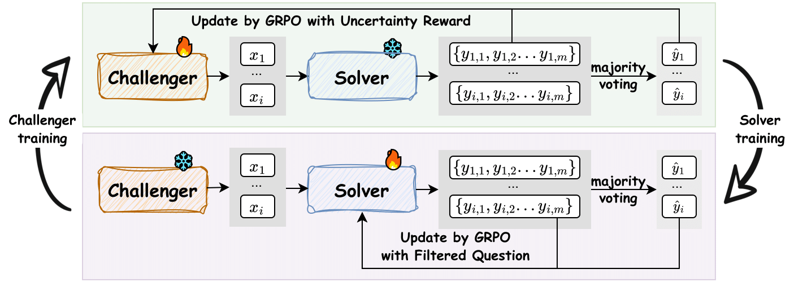
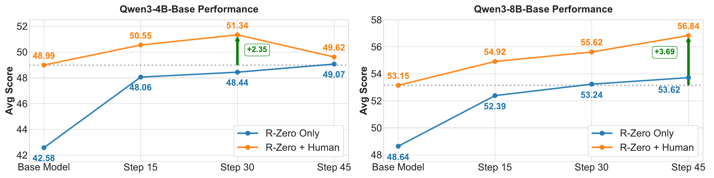
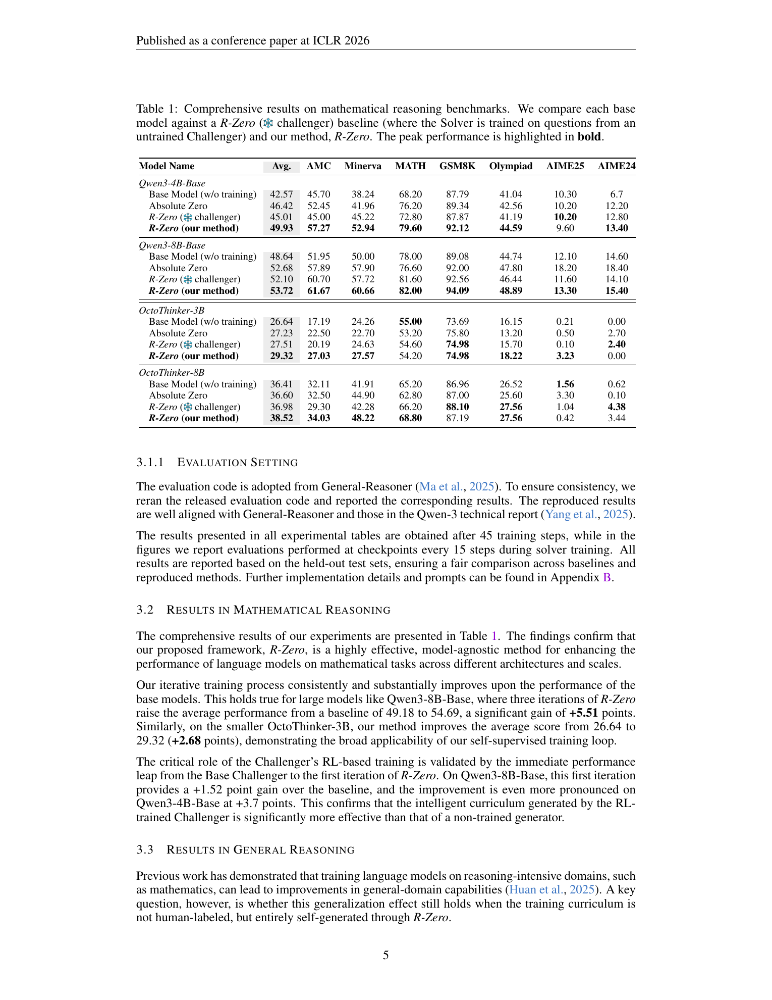
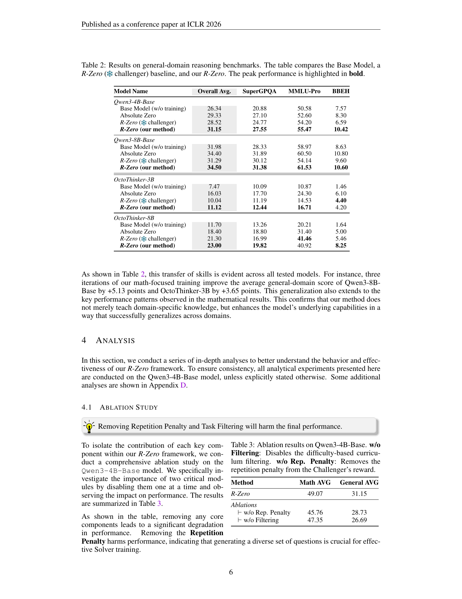

# R-Zero: Self-Evolving Reasoning LLM from Zero Data

## TL;DR
R-Zero is a fully autonomous framework where two LLMs (Challenger & Solver) co-evolve via GRPO to generate their own training curriculum from scratch — no human-curated tasks, no labels, no seed dataset. Applied to Qwen3-4B-Base, it yields +6.49 on math benchmarks and +7.54 on general reasoning.

## Background
Self-evolving LLMs promise scalable paths to superintelligence by learning from self-generated experience. However, existing methods still depend on large human-curated task pools (for fine-tuning or RLVR). Even label-free RL methods (confidence scores, entropy minimization) and self-challenging approaches (model-generated tasks) require either pre-existing unlabeled problems or external verifiers (e.g., code executors). This creates a fundamental bottleneck for scaling beyond human-level capabilities.

## Problem
**Can an LLM framework bootstrap its own training data from absolute zero — no human tasks, no labels, no seed examples — and iteratively improve its reasoning ability in domains without external verification oracles?**

## Method
R-Zero initializes two independent models from the same base LLM:

1. **Challenger ($Q_\theta$)** — trained via **GRPO** to generate math questions that maximize the Solver's uncertainty (accuracy ≈ 50%). Reward = `max(0, runcertainty − rrep)` where:
   - `runcertainty = 1 − 2|p̂ − 0.5|` (Solver self-consistency over 10 samples)
   - `rrep` penalizes BLEU-similar questions within a batch (agglomerative clustering)

2. **Solver ($S_\phi$)** — trained via **GRPO** on a filtered set of Challenger-generated questions where consistency `|p̂ − 0.5| ≤ δ` (retains only questions near the frontier). Uses majority-vote pseudo-labels as the verifiable reward.

The loop repeats iteratively: Challenger → Dataset Construction → Solver → Challenger.

## Experiments
- **Backbones**: Qwen3 (4B, 8B) and OctoThinker (3B, 8B, a Llama-3.1 lineage)
- **Math benchmarks**: AMC, Minerva, MATH-500, GSM8K, OlympiadBench, AIME 2024/2025
- **General reasoning**: SuperGPQA, MMLU-Pro, BBEH
- **Key result (Qwen3-4B-Base)**:
  - Math Avg: 42.57 → 49.93 (+7.36)
  - General Avg: 26.34 → 31.15 (+4.81)
- **Ablations**: Removing repetition penalty (−3.31 math, −2.42 general); removing task filtering (−1.72 math, −4.46 general)
- **Synergy with SFT**: Using R-Zero as mid-training before supervised fine-tuning yields +2.35 over SFT-alone baseline

## Critical Analysis
**Strengths:**
- Fully autonomous — genuinely zero-data bootstrapping is impressive and novel
- Model-agnostic: works across Qwen and Llama-derived architectures
- Clean theoretical motivation for the uncertainty reward (KL-divergence lower bound)
- Synergy with human data suggests practical utility

**Weaknesses:**
- **Inevitable collapse**: All models eventually degrade after enough iterations (larger models delay but don't avoid it). The authors identify pseudo-label accuracy decay and model collapse as causes but don't solve either.
- **Math-only domain**: Current implementation is constrained to math where majority-vote pseudo-labels are reliable. Generalization to open-ended tasks (creative writing, dialogue) is explicitly unsolved.
- **Computational cost**: Two models per iteration, each requiring GRPO rollouts with 10 Solver samples per Challenger question. $N=8{,}000$ candidate questions per iteration adds up.
- **Pseudo-label accuracy drops** from 79% to 63% across 3 iterations — the self-generated curriculum becomes increasingly noisy.

## Implementation Notes
- Built on EasyR1 codebase
- GRPO with KL penalty ($\lambda_{KL}=10^{-2}$), group size 128, LR $10^{-6}$
- BLEU clustering: `nltk` sentence-bleu with smoothing, `sklearn` agglomerative clustering, `τ_{BLEU} = 0.5`
- Reproducibility: hyperparameters, prompts (Challenger/Solver templates), and GPT-4o judge config fully documented in appendix
- Code: https://github.com/Chengsong-Huang/R-Zero

## Captured Figures and Tables

