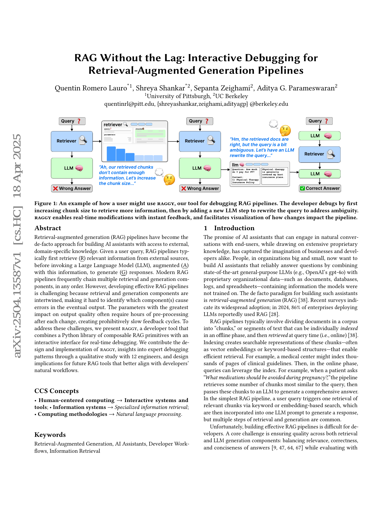
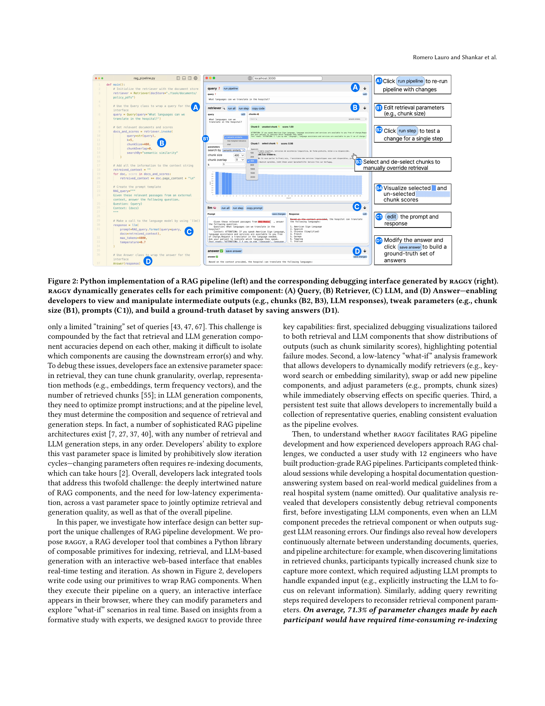
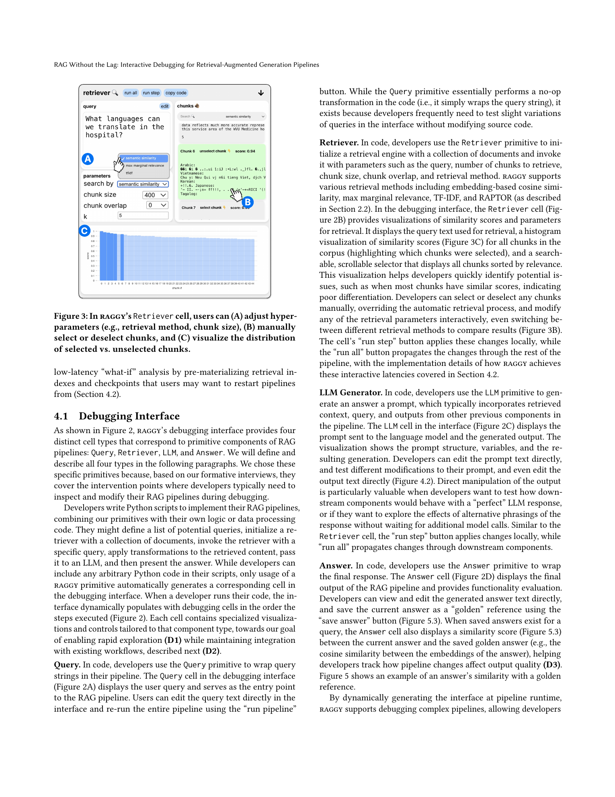
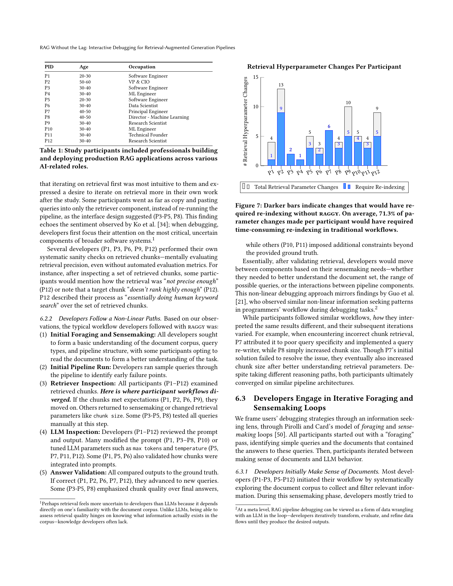
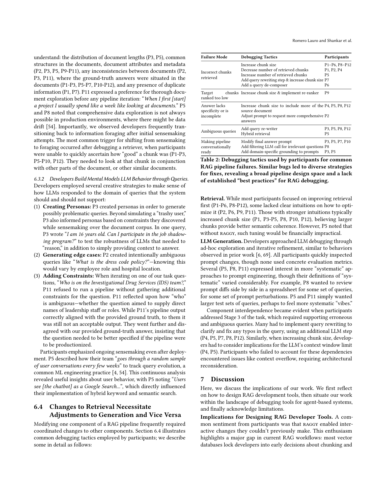

# RAG Without the Lag: Interactive Debugging for Retrieval-Augmented Generation Pipelines

## TL;DR

RAGGY is an interactive developer tool for debugging retrieval-augmented generation pipelines. It wraps RAG components as Python primitives, auto-generates a browser UI with cells for queries, retrievers, LLM calls, and answers, and lets developers inspect intermediate outputs, change retrieval or prompt parameters, rerun one step, or propagate changes downstream. Its main systems idea is to pay a one-time preprocessing cost for many retrieval indexes, then use program checkpoints to make "what-if" debugging feel immediate. In a qualitative study with 12 experienced RAG engineers, participants used RAGGY to iterate quickly, usually debugged retrieval before generation, and revealed unmet needs around systematic evaluation, provenance, and long-term experiment tracking.

Source: [arXiv:2504.13587](https://arxiv.org/abs/2504.13587), [PDF](https://arxiv.org/pdf/2504.13587.pdf)

## Background

Retrieval-augmented generation has become the default pattern for building assistants that answer using private or domain-specific data. A typical pipeline chunks documents, indexes those chunks, retrieves relevant chunks for a query, and passes retrieved context into an LLM prompt. Practical systems quickly grow beyond that simple shape: they may rewrite queries, combine keyword and embedding retrieval, rerank chunks, decompose questions, filter irrelevant inputs, and refine answers.

This makes debugging difficult. Retrieval and generation errors are coupled: an incorrect answer can come from missing chunks, irrelevant chunks, a poor prompt, model behavior, context overflow, or a mismatch between the query and the corpus. The parameter space is also large. Developers tune chunk size, overlap, retrieval method, embedding model, number of chunks, prompts, temperature, and pipeline structure. Some of the most important changes require re-indexing documents, which creates slow feedback cycles.

The authors first interviewed six RAG practitioners. They found three recurring pain points: chunking and indexing choices are hard, evaluation is often informal because labeled query-answer sets are scarce, and feedback cycles are delayed because changing retrieval parameters can require expensive preprocessing.

## Problem

The paper asks how an interface can make RAG pipeline debugging closer to ordinary interactive debugging. The target workflow is not just "evaluate final answers." Developers need to inspect each component, test hypotheses locally, and understand how local changes affect downstream output.

The key requirements are:

- Rapid exploration of pipeline configurations, especially retrieval parameters that usually require re-indexing.
- Systematic evaluation support even when the developer has only a small set of example queries and reference answers.
- Integration with Python workflows, so developers do not need to rebuild pipelines in a separate visual tool.

In notation, a simple RAG pipeline can be sketched as:

\[
C_k = R(q; \theta_r), \qquad y = G(q, C_k; \theta_g),
\]

where \(R\) retrieves chunks under retrieval parameters \(\theta_r\), and \(G\) generates an answer under prompt/model parameters \(\theta_g\). RAGGY is designed for the harder case where pipelines compose many such \(R\) and \(G\) steps, and developers need to perturb \(\theta_r\), \(\theta_g\), or the pipeline graph while preserving enough execution state to see the effect quickly.

## Method

RAGGY combines a Python library and an interactive web UI. Developers write normal Python scripts, but wrap important pipeline points with RAGGY primitives:

- Query: the user query or a query variant.
- Retriever: a retrieval call over a document corpus.
- LLM: a prompt and generation step.
- Answer: the final answer and optional saved reference output.

When the script runs, RAGGY generates an ordered browser interface with one cell per primitive invocation. The interface is therefore derived from code rather than manually assembled. This keeps the workflow close to the developer's existing Python environment while exposing live controls for the RAG-specific components.

The Retriever cell shows the query used for retrieval, retrieved and non-retrieved chunks, similarity-score distributions, and editable parameters such as retrieval method, chunk size, chunk overlap, and \(k\). Developers can manually select or deselect chunks to test whether retrieval is the source of an error. The LLM cell shows prompts and outputs, allows prompt edits, and even lets developers edit intermediate model outputs to test downstream behavior. The Answer cell stores and compares outputs against saved reference answers.

The backend has two latency-reduction mechanisms. First, RAGGY precomputes many vector indexes during a one-time preprocessing phase. It builds chunking configurations with sizes from 100 to 2000 characters, overlaps from 0 to 400 characters, and retrieval modes including cosine similarity, TF-IDF, max marginal relevance, and RAPTOR-style summary retrieval. This turns later changes such as "try chunk size 500 instead of 200" into an index selection rather than a fresh document-processing job.

Second, RAGGY preserves program state with checkpoints. At each primitive invocation, it forks the Python process before the component returns. The parent continues execution while the child waits as a resumable state. When the developer changes a step in the UI and clicks run, the relevant checkpoint resumes, becomes the active execution path, and regenerates downstream cells. The server cleans up obsolete sleeping processes so repeated exploration does not accumulate stale checkpoints.

## Experiments

The evaluation is a qualitative user study with 12 participants who had Python proficiency and prior experience deploying RAG systems. Participants included software engineers, ML engineers, data scientists, research scientists, a principal engineer, a technical founder, and a VP/CIO. Some had worked on production copilots serving large user bases.

Each one-hour session included onboarding, 45 minutes of programming tasks, and a semi-structured interview. Participants used RAGGY to improve a naive RAG pipeline over 220 PDFs from a real hospital system. The task progressed through three stages:

- Answer well-formed questions, including single-hop, multi-hop, and reasoning-intensive cases.
- Handle noisy keyword-style queries.
- Reject irrelevant or off-topic queries instead of answering them.

The baseline used embedding retrieval with chunk size 200, no overlap, \(k=5\), and an LLM answer-generation step. The authors analyzed think-aloud behavior, screen interactions, and interview transcripts using open coding and affinity diagramming.

The main findings were:

- Participants valued low-latency iteration. On average, 71.3% of retrieval-parameter changes per participant would have required re-indexing in a traditional workflow.
- Participants generally validated retrieval before LLM behavior. All participants inspected retrieved chunks, and most focused on retrieval quality before prompt or answer debugging.
- Developers followed non-linear debugging paths. They moved among document sensemaking, retriever inspection, prompt edits, and answer validation depending on what they discovered.
- Changes to retrieval often forced changes to generation, and vice versa. For example, increasing chunk size could require prompt changes or context-window management.
- Participants wanted more systematic evaluation, stronger provenance for chunks, side-by-side comparisons across experiments, and visibility into how outputs change over time.

## Critical Analysis

The paper is strongest as a workflow study plus tool probe. RAGGY is not only a convenience UI; it exposes how experienced developers actually debug RAG systems. The finding that developers usually inspect retrieval first is especially useful. It suggests that RAG tooling should make retrieval observability a primary surface rather than treating retrieval as a hidden preprocessing step behind answer evaluation.

The backend design is also pragmatic. Precomputing a broad set of indexes is storage- and preprocessing-heavy, but it directly attacks the delay that prevents exploration. The checkpointing design is similarly aligned with the task: RAG debugging is often about rerunning from an intermediate component, not restarting the whole pipeline.

The study avoids overclaiming quantitative performance. The authors do not argue that RAGGY produces better final pipelines under a benchmark metric. Instead, they show how the interface changes debugging behavior and what participants found missing. For an HCI systems paper, that is the right level of evidence.

There are important limitations. The one-hour sessions cannot capture the full lifecycle of production RAG, where teams deal with document ingestion, changing corpora, monitoring, cost budgets, latency constraints, access control, and evaluation drift. The study task is realistic enough to reveal debugging patterns, but not long enough to prove that RAGGY improves deployed systems.

The precomputation approach also has scaling tradeoffs. Hundreds of indexes may be acceptable for a medium corpus and research prototype, but large production corpora, frequent document updates, multimodal documents, and strict storage budgets may need incremental indexing, sampling, or adaptive index materialization.

Finally, RAGGY helps developers observe effects, but participants still sometimes formed weak or incorrect causal explanations for why a change helped. That points to the next layer of tooling: not only "show me what changed," but "help me build a correct mental model of why it changed."

## Implementation Notes

For RAG tool builders, the most portable idea is to make intermediate components first-class. A useful debugging interface should expose retrieved chunks, unselected candidates, score distributions, prompt construction, model outputs, and final answers in one trace.

The Retriever cell is the highest-leverage piece. It should support side-by-side retrieval modes, manual chunk override, chunk provenance, document-context viewing, and quick changes to chunk size, overlap, and \(k\). A final answer can be wrong for many reasons, but retrieval inspection often narrows the search space quickly.

RAGGY's checkpointing pattern is worth generalizing. For any LLM pipeline where downstream steps are expensive or non-deterministic, preserving resumable state at semantic boundaries can make debugging feel more like editing a notebook cell than rerunning a full application.

The paper also reinforces a practical evaluation lesson. RAG teams need lightweight ways to turn debugging examples into regression cases. Saving a corrected answer is a start, but production teams need query sets, provenance, expected source documents, side-by-side diffs, and longitudinal comparison across pipeline versions.

## Captured Figures and Tables

