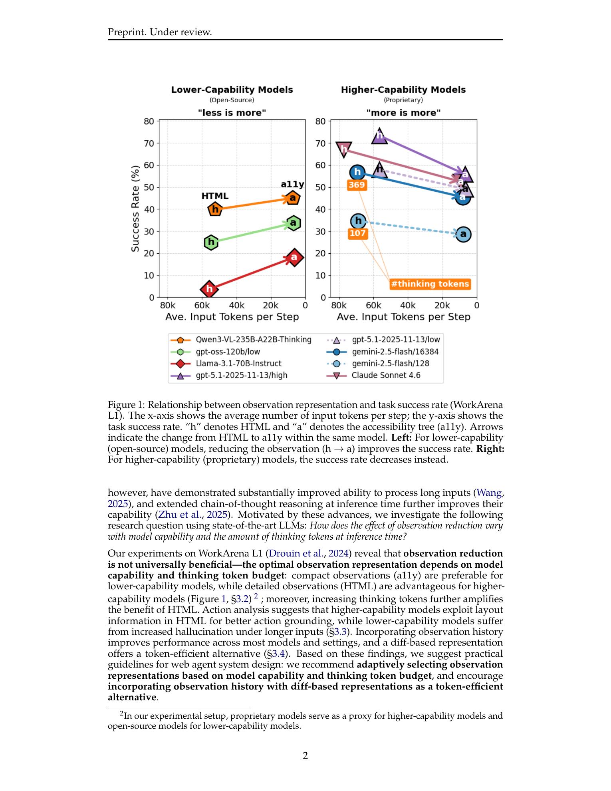
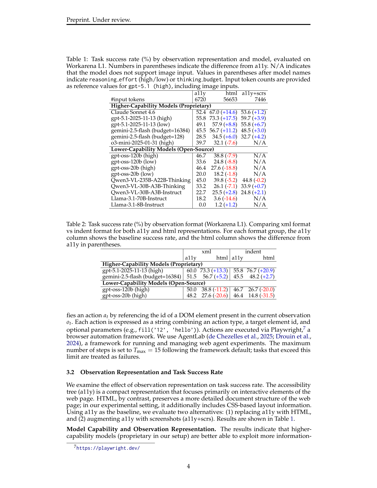
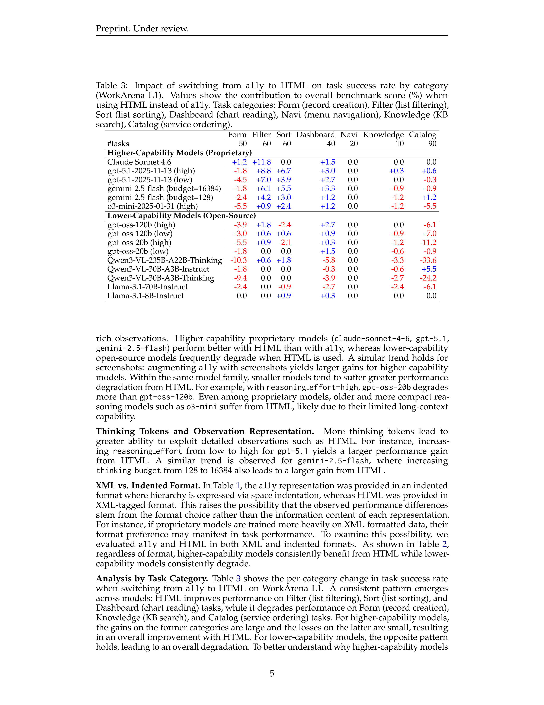
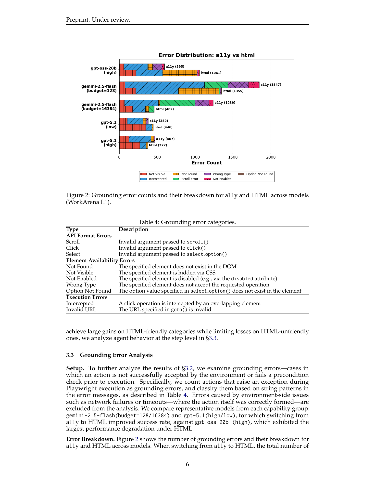
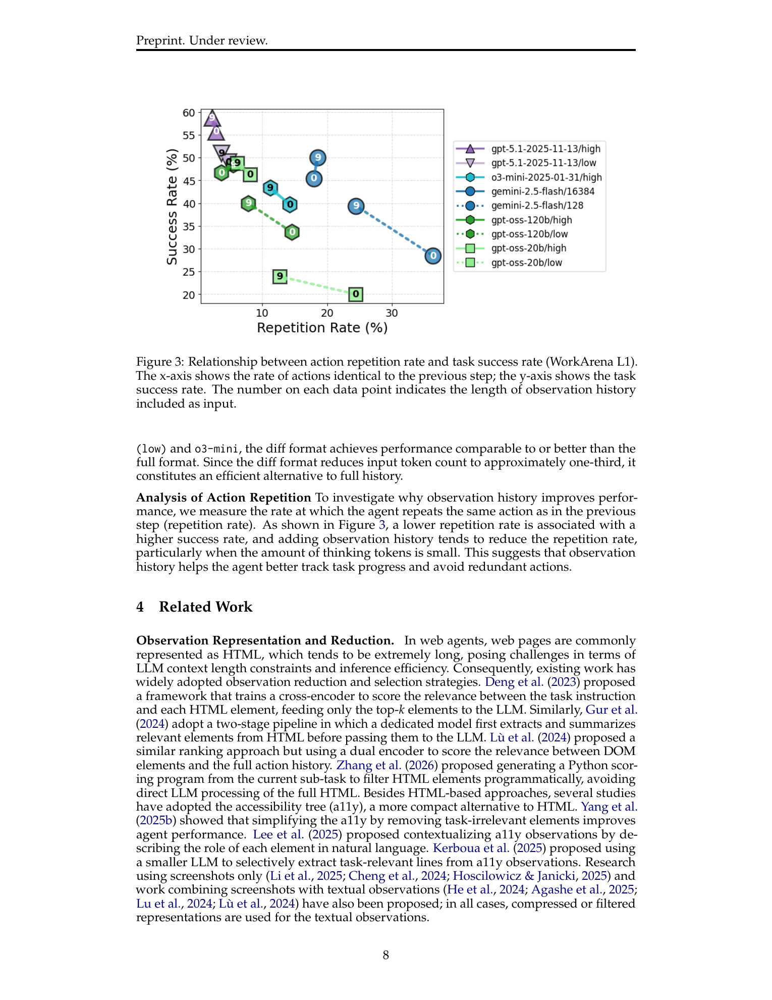

# Read More, Think More: Revisiting Observation Reduction for Web Agents

## TL;DR

웹 에이전트 분야에서 HTML 관측(observation)이 지나치게 길다는 이유로 Accessibility Tree(a11y)와 같은 축약된 표현을 사용하는 것이 표준 관행이었다. 이 논문은 이러한 관측 축소(observation reduction)가 항상 정답은 아님을 보여준다. 구체적으로, 고성능 모델(proprietary)은 HTML의 풍부한 레이아웃 정보를 활용해 더 높은 성공률을 달성하는 반면, 저성능 모델(open-source)은 긴 입력으로 인한 환각(hallucination)으로 성능이 저하된다. Thinking token 예산이 많을수록 HTML의 이점은 더욱 커지며, 관측 히스토리를 추가하면 대부분의 모델에서 성능이 향상된다. WorkArena L1에서 GPT-5.1(high)은 a11y 대비 HTML 사용 시 17.5%p의 성능 향상을 보였다.

Source: [arXiv:2604.01535](https://arxiv.org/abs/2604.01535), [PDF](https://arxiv.org/pdf/2604.01535.pdf)

## Background

LLM 기반 웹 에이전트는 매 스텝마다 웹 페이지를 관측(observation)으로 받아들이고, 그 정보를 바탕으로 다음 액션을 결정한다. HTML은 웹 페이지의 완전한 구조적 정보를 담고 있지만, WorkArena 기준 최소 40K에서 최대 500K 토큰에 달할 정도로 길다. 이러한 길이 문제를 해결하기 위해 기존 연구들은 크게 두 가지 접근법을 취해왔다:

1. **관측 축소(Observation Reduction)**: HTML에서 task-relevant 요소만 추출하거나 (Deng et al., 2023; Gur et al., 2024), Accessibility Tree(a11y)와 같은 더 간결한 표현으로 대체 (Yang et al., 2025b; Lee et al., 2025)
2. **컨텍스트 확장**: Gemini, GPT-5 등百万토큰급 컨텍스트 윈도우를 가진 LLM의 등장

그러나 최근 모델들의 장기 컨텍스트 처리 능력과 추론 시 chain-of-thought 추론 능력이 크게 향상되었음에도 불구하고, 대부분의 연구는 여전히 관측 축소를 기본 전제로 삼고 있다. 이 논문은 "과연 관측 축소가 항상 최선인가?"라는 질문을 재검토한다.

## Problem

이 논문은 웹 에이전트 태스크를 부분 관측 마르코프 결정 과정(POMDP)으로 공식화한다:

\[
\langle S, A, O, P, R, \Omega \rangle
\]

정책 \(\pi_{\text{LLM}}(a_t \mid I, o_t, \{(o_i, a_i)\}_{i=0}^{t-1})\)은 시스템 프롬프트 \(I\), 현재 관측 \(o_t\), 과거 관측-액션 쌍의 히스토리를 조건으로 액션을 선택한다.

연구의 핵심 질문은 두 가지 설계 축이 모델 성능 및 thinking token 예산과 어떻게 상호작용하는지다:

1. **관측 표현(Observation Representation)**: HTML, Accessibility Tree(a11y), 스크린샷, 또는 이들의 조합
2. **관측 히스토리 길이(Observation History Length)**: 과거 관측을 얼마나 포함할 것인가

이 두 축을 다양한 모델(proprietary/open-source)과 thinking token 예산(low/high) 조건에서 평가한다.

## Method

**실험 설정.** WorkArena L1 (33개 태스크 유형 × 10 seed = 330개 태스크)에서 평가했다. 모델은 고성능 proprietary 모델(Claude Sonnet 4.6, GPT-5.1, o3-mini, Gemini 2.5 Flash)과 저성능 open-source 모델(GPT-OSS-120B/20B, Qwen3-VL, Llama-3.1)을 포함한다. Thinking token은 reasoning effort(low/high) 또는 thinking budget(128/16384) 파라미터로 제어된다. 액션 그라운딩은 id 기반(id-based grounding)을 사용했으며, Playwright를 통해 실행된다.

**세 가지 주요 실험:**

1. **관측 표현 비교 (§3.2)**: a11y(기준선) 대 HTML 대 a11y+스크린샷
2. **그라운딩 오류 분석 (§3.3)**: HTML 전환 시 발생하는 오류 유형 분류
3. **관측 히스토리 효과 (§3.4)**: 히스토리 길이(0/4/9 스텝)와 diff 기반 표현 비교

## Experiments

**Observation Representation (Table 1).** 핵심 결과는 모델 성능에 따라 관측 표현의 효과가 정반대라는 점이다:

- **고성능 모델**: 모든 proprietary 모델이 a11y보다 HTML에서 더 높은 성능을 보였다. GPT-5.1(high)은 a11y 55.8% → HTML 73.3% (+17.5%p), Claude Sonnet 4.6은 52.4% → 67.0% (+14.6%p)
- **저성능 모델**: 대부분의 open-source 모델은 HTML에서 성능이 하락했다. GPT-OSS-20B(high)는 46.4% → 27.6% (−18.8%p), Llama-3.1-70B는 18.2% → 3.6% (−14.6%p)
- **Thinking token 효과**: GPT-5.1의 reasoning effort를 low→high로 올리면 HTML 이점이 +8.8%p에서 +17.5%p로 확대된다. Gemini 2.5 Flash도 thinking budget 128→16384에서 +6.0%p에서 +11.2%p로 증가
- **a11y+스크린샷**: 고성능 모델에서 추가 향상이 있었지만, HTML만큼의 큰 이점은 없었다

**Format Confound 제거 (Table 2).** a11y는 indent 형식, HTML은 XML 형식으로 제공된 점이 confound일 가능성을 확인하기 위해, 두 표현을 XML과 indent 두 가지 형식으로 각각 평가했다. 형식과 무관하게 고성능 모델은 HTML에서 일관된 이점을, 저성능 모델은 일관된 성능 저하를 보였다.

**Task Category 분석 (Table 3).** HTML의 이점은 특정 태스크 유형에 집중된다:

- **HTML-friendly**: Filter (+11.8%p, Claude), Sort (+6.7%p, GPT-5.1 high), Dashboard (+3.3%p, Gemini budget=16384) — 레이아웃 정보가 중요한 태스크
- **HTML-unfriendly**: Form (−1.8%p), Catalog (−6.1%p, GPT-OSS-120B), Knowledge — 고성능 모델은 손실이 작고 이득이 커서 순이득, 저성능 모델은 반대

**Grounding Error Analysis (Figure 2, Table 4).** HTML로 전환 시:

- 고성능 모델(GPT-5.1, Gemini)은 전체 grounding 오류가 감소했다. 특히 CSS z-index 정보를 활용해 Intercepted 오류(겹친 요소 클릭)가 크게 줄었다.
- 저성능 모델(GPT-OSS-20B high)은 Not-found 오류(존재하지 않는 요소 ID 참조)가 급증했다 — 긴 입력에서 환각이 증가한 것으로 해석된다.
- Thinking budget이 큰 Gemini(budget=16384)는 작은 버전(budget=128)에 비해 Not-found 오류를 효과적으로 억제했다.

**Observation History (Table 5, Figure 3).** a11y를 고정하고 히스토리 길이를 비교:

- 히스토리 추가는 거의 모든 모델에서 성능 향상 (hist0 vs hist4/hist9)
- Diff 기반 표현(character-level diff)은 full history의 약 1/3 토큰만 사용하면서도 비슷하거나 더 나은 성능 달성
- Action repetition rate 분석 결과, 히스토리가 에이전트의 반복 액션을 줄여 성공률을 높이는 것으로 나타남

## Critical Analysis

**강점:**
1. **직관에 도전하는 연구 질문**: "HTML이 길면 무조건 나쁘다"는 업계의 암묵적 가정을 데이터로 반박했다. 이는 실용적인 가이드라인으로 이어져, 단순히 "축약하라"는 기존 조언보다 더 정교한 설계 원칙을 제공한다.
2. **체계적인 실험 설계**: 모델 성능, thinking token 예산, 관측 표현, 히스토리 등 여러 축을 교차 평가하여 상호작용을 밝혀냈다. 특히 format confound(Table 2), task category 분석(Table 3), grounding error 분석(Figure 2)으로 이어지는 분석 체인이 설득력 있다.
3. **실용적 통찰**: "고성능 모델에는 HTML, 저성능 모델에는 a11y"라는 단순한 규칙과 함께, diff 기반 히스토리가 토큰 효율적인 대안이 될 수 있다는 점은 실제 시스템 설계에 유용하다.

**약점 및 한계:**
1. **단일 벤치마크 의존성**: 실험이 WorkArena L1에만 국한되었다. ServiceNow라는 특정 웹 플랫폼의 특성이 결과에 영향을 미쳤을 가능성이 있다. 다양한 도메인(WebArena, VisualWebArena 등)에서의 검증이 필요하다.
2. **그라운딩 방식의 제한**: id-based grounding만 사용했다. Coordinate-based grounding이나 다른 방식에서는 HTML의 레이아웃 정보가 다르게 작용할 수 있다. 특히 HTML의 z-index 정보 활용은 id 기반 그라운딩에서 더 유용했을 가능성이 있다.
3. **CSS 레이아웃 정보의 역할**: HTML 이점의 메커니즘으로 CSS z-index를 지목했지만, 직접적인 ablation study가 없어 인과 관계가 명확하지 않다. HTML이 제공하는 다른 정보(예: DOM 구조, 요소 간 관계, 텍스트 밀도)가 더 중요할 수도 있다.
4. **히스토리와 풍부한 관측의 조합 미탐구**: 히스토리 실험에서는 a11y만 사용했는데, HTML 관측과 히스토리를 결합하면 시너지가 있을 수 있다. 또한 WorkArena L1은 최대 15 스텝으로, 더 긴 Horizon 태스크에서의 효과는未知다.
5. **비용-효용 분석 부재**: HTML은 a11y보다 약 8.4배 많은 토큰(6,720 vs 56,653)을 사용한다. 성능 향상이 추가 비용을 정당화하는지에 대한 실용적 분석이 없다. 예를 들어, GPT-5.1 high에서 +17.5%p 향상을 위해 약 8배의 입력 비용을 지불할 가치가 있는가는 태스크의 중요도에 따라 달라진다.
6. **통계적 유의성 미보고**: Table 1의 성능 차이가 통계적으로 유의한지에 대한 검정이 없다. 330개 태스크에서의 차이가 random seed의 변동 범위 내일 가능성을 배제할 수 없다.

**후속 연구 방향:**
- 다양한 그라운딩 방식에서 HTML의 이점 재검증
- CSS 레이아웃 정보의 직접적 ablation
- HTML + 히스토리 diff의 조합 실험
- 긴 Horizon 태스크(20+ 스텝)에서의 히스토리 효과
- Adaptive observation selection: 모델이 스스로 태스크 난이도나 현재 상황에 따라 a11y/HTML을 선택

## Implementation Notes

- **Adaptive observation selection**: 고성능 모델(GPT-5.1, Claude 4.6 이상)과 충분한 thinking budget이 있다면 HTML 사용을 권장. 저성능 모델이나 thinking budget이 제한된 경우 a11y가 더 안전하다. Task category도 고려: Filter/Sort/Dashboard 계열에는 HTML, Form/Catalog 계열에는 a11y가 유리할 수 있다.
- **Diff 기반 히스토리**: 토큰 효율성이 중요하다면 full history 대신 character-level diff를 사용. 약 1/3 토큰으로 유사한 성능 달성이 가능하다.
- **모델 선택 가이드**: Llama-3.1-8B와 같은 저성능 모델은 HTML에서 거의 작동하지 않는다(1.2%). 웹 에이전트 목적이라면 최소한 GPT-OSS-120B 이상 또는 proprietary 모델을 고려해야 한다.
- **Thinking token 예산 조정**: HTML 사용 시 low reasoning effort는 오히려 독이 될 수 있다. 충분한 thinking token 예산을 확보한 후 HTML을 도입하는 것이 효과적이다. 예를 들어, GPT-5.1 low + HTML은 +8.8%p이지만 high + HTML은 +17.5%p다.

## Captured Figures and Tables

