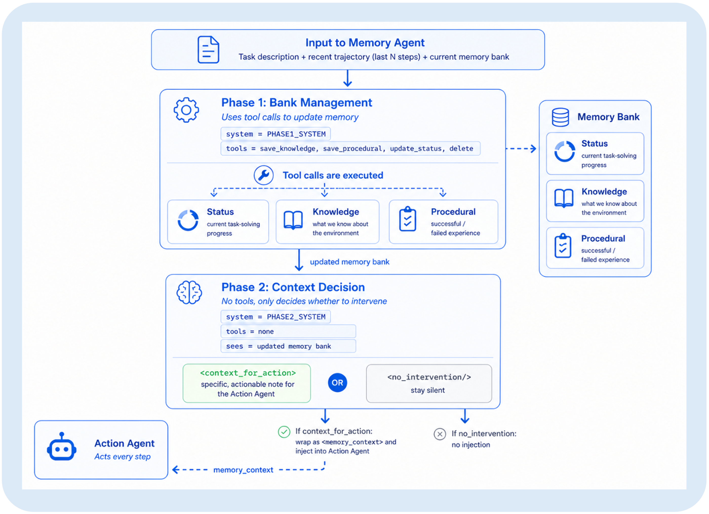
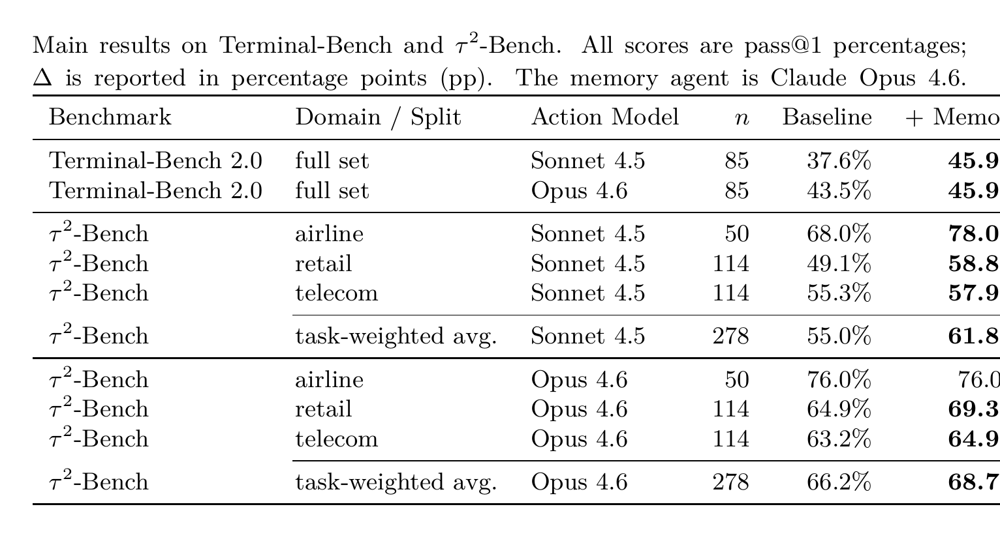
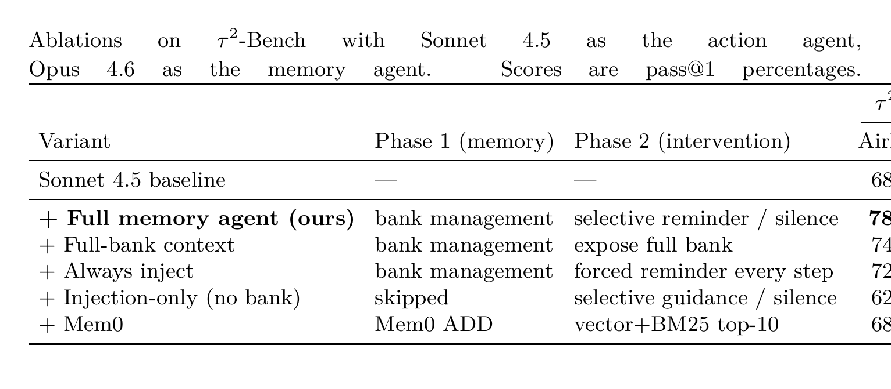
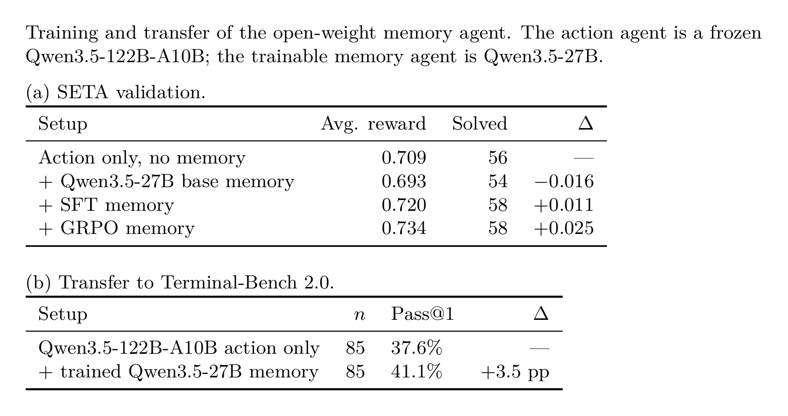

# Remember When It Matters: Proactive Memory Agent for Long-Horizon Agents

**Authors:** Yifan Wu, Lizhu Zhang, Yuhang Zhou, Mingyi Wang, Bo Peng, Serena Li, Xiangjun Fan, Zhuokai Zhao

**Published:** 2026-07-09

**Tags:** agent-memory, context-management, long-horizon-agents, reinforcement-learning, proactive-intervention

## TL;DR

A separate memory agent runs alongside an unmodified action agent, maintaining a structured memory bank and deciding whether to inject grounded reminders into the action loop. The key insight is framing memory as a selective intervention policy rather than passive retrieval: the memory agent chooses when execution state should re-enter the control loop. On Terminal-Bench 2.0 and $\tau^2$-Bench, it yields +8.3 pp and +6.8 pp pass@1 improvements for weaker agents, with gains persisting for stronger ones. An open-weight Qwen3.5-27B memory agent trained with SFT and GRPO shows partial transfer to held-out tasks.

## Background

LLM agents evaluated on long-horizon tasks — command-line execution, multi-step ML engineering, interactive tool use — often fail not from poor local reasoning but from losing track of information that should shape future decisions. A requirement discovered early gets violated during a later debugging step; a failed command is retried identically; a diagnosed error pattern is treated as new. This phenomenon, which the authors call *behavioral state decay*, differs from simple context-window overflow: the information may remain in the transcript or context but no longer influences the agent's next decision.

Existing memory systems focus on storage, update, and retrieval — useful for personalization and cross-session recall but not for deciding when remembered state should interrupt an ongoing action loop. Too little memory lets agents repeat mistakes; too much adds latency, consumes tokens, and distracts from local progress.

## Problem

How can a memory system for long-horizon agents decide not only *what* to remember, but *when* that remembered execution state should re-enter the action agent's context as a targeted intervention? And can this intervention policy be learned rather than prompted?

## Method

**Architecture.** A separate memory agent $\pi_M$ runs alongside an unchanged action agent $\pi_A$. At fixed intervals (every step, by default), it:

1. **Phase 1 — Memory Management:** Updates a structured memory bank $B_t = (s_t, K_t, P_t)$ via predefined tool calls:
   - $s_t$: private status field (progress tracking, never shown to the action agent)
   - $K_t$: knowledge memories (task requirements, environment facts, file paths, verified observations)
   - $P_t$: procedural memories (failed commands, successful fixes, hypotheses, diagnostics)

2. **Phase 2 — Intervention Selection:** Reads the updated bank and emits either a memory-grounded reminder $r_t$ (injected as transient context into the next action-agent call) or a null intervention $\varnothing$.

This creates a control problem rather than a retrieval problem: the memory agent must calibrate when silence is preferable to a reminder, and when a targeted prompt is worth the latency cost.

**Training.** For open-weight deployment, Qwen3.5-27B is trained as the memory agent (action agent frozen at Qwen3.5-122B-A10B):
- **SFT** on SETA distills prompted-memory trajectories, teaching the model to perform bank operations and choose between reminder and silence.
- **GRPO** further calibrates intervention timing, with rewards focused on pivot turns that affect downstream task success.

## Experiments

*Figure 1: System integration. The memory agent (right) runs as a separate process beside the action agent (left), observing a sliding window of recent steps and the current memory store.*

*Figure 2: Memory agent internals. Phase 1 manages the structured memory bank through tool calls. Phase 2 reads the updated bank and emits either a context reminder or no intervention.*

**Benchmarks:**
- **Terminal-Bench 2.0** (85 tasks): autonomous command-line execution requiring debugging continuity and environment grounding.
- **$\tau^2$-Bench** (278 tasks): conversational tool-use across airline, retail, and telecom domains requiring policy adherence and user-state tracking.

*Table 1: Main results. Memory intervention with Claude Opus 4.6 improves both Sonnet 4.5 and Opus 4.6 on both benchmarks.*

**Key results:**
- Sonnet 4.5: +8.3 pp on Terminal-Bench (37.6% → 45.9%), +6.8 pp on $\tau^2$-Bench (55.0% → 61.8%)
- Opus 4.6: +2.4 pp on Terminal-Bench, +2.5 pp on $\tau^2$-Bench — gains persist for stronger agents
- $\tau^2$-Bench domain variation: airline (+10.0 pp) and retail (+9.6 pp) show largest lifts; telecom smaller (+2.6 pp), consistent with domain-sensitive intervention rather than fixed summarization

*Table 2: Ablations on $\tau^2$-Bench (Sonnet 4.5 action, Opus 4.6 memory). Selective intervention outperforms passive bank exposure, always-on injection, and advisor-style guidance.*

**Ablation highlights:**
- Full-bank context (passive exposure): trails full system by 2.8 macro points — maintaining memory helps but exposing everything is insufficient
- Always inject: competitive on micro-average (+0.3 pp) but less balanced; selective silence improves airline performance
- Injection-only (no bank): helps telecom (+66.7 pp) but hurts airline (-6.0 pp) — advisor guidance without persistent state is unstable
- Mem0 (production memory layer): improves average but falls short on airline, highlighting that retrieval ≠ intervention

*Table 3: Training and transfer. SFT + GRPO improves validation reward, with partial transfer to held-out Terminal-Bench 2.0.*

**Training:**
- Untrained 27B memory agent hurts: 0.709 → 0.693 reward
- SFT recovers and improves to 0.720; GRPO further raises to 0.734
- Transfer: 37.6% → 41.1% pass@1 on Terminal-Bench 2.0 (+3.5 pp)

## Critical Analysis

**Strengths:**
- Clean separation of memory maintenance from action selection — the two-phase design is principled and testable
- Ablation design isolates the value of selective intervention vs. passive exposure, always-on, and advisor-style variants
- Gains persist for stronger action agents (Opus 4.6), showing the benefit is not merely compensating for capacity
- Open-weight training with SFT + GRPO demonstrates the intervention policy is learnable, not just prompted
- Plug-and-play: no modification to the action agent or scaffold required

**Weaknesses:**
- Memory agent runs at every step — no learned trigger function; the fixed-interval schedule is simple but may be suboptimal
- Qualitative analysis suggests failure modes are calibration errors (speculative inferences, redundant reminders), but no systematic study of when interventions hurt
- Only two benchmarks (terminal + conversational tool-use); web navigation, multi-agent, or collaborative settings untested
- Open-weight results are preliminary: partial transfer only, no comparison with prompted Opus at matched scale
- Memory bank size/latency tradeoffs not quantified; every step incurs an additional LLM call

**Open questions:**
- Can the trigger function be learned (e.g., invoke memory only after errors or large context shifts) rather than fixed?
- How does the system scale when the memory bank grows across very long trajectories (thousands of steps)?
- Would joint training of memory and action agents yield stronger results than keeping them decoupled?

## Implementation Notes

- Code: https://github.com/yifannnwu/proactive-memory-agent
- Memory agent uses tool-call interface: `memory_update_status`, `memory_save_knowledge`, `memory_save_procedural`, `memory_delete`
- Default memory agent trigger: first step + every subsequent step (k=8 messages sliding window)
- Training data: SETA (terminal-agent tasks with verifier rewards)
- Training: SFT distillation from prompted trajectories, then GRPO with pivot-turn reward focus
- Transient injection: reminder injected as separate context into action-agent call, no modification to action agent's base instructions or tools
