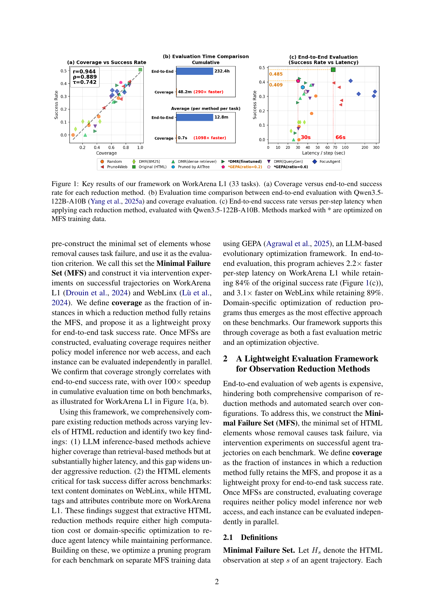
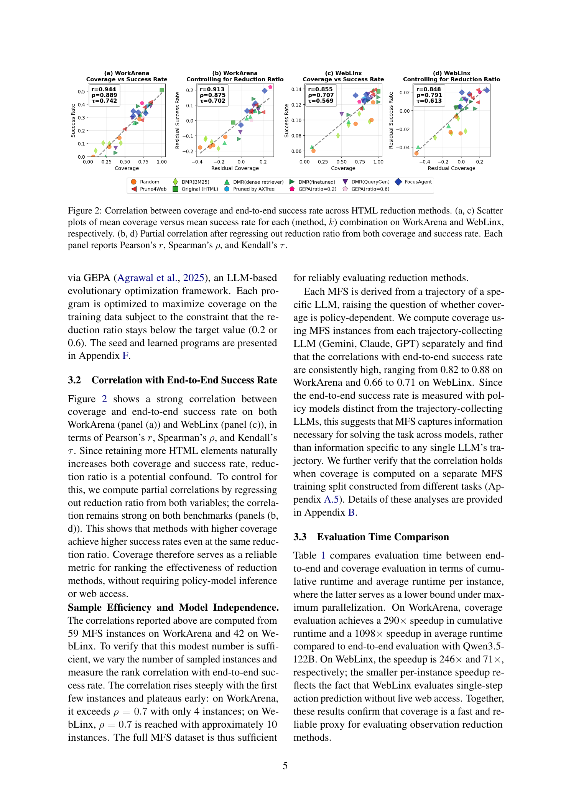
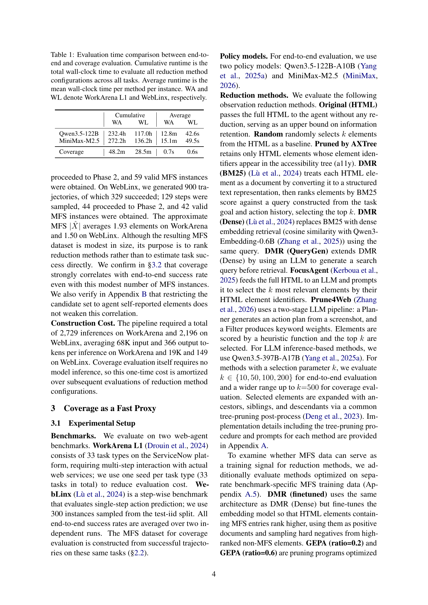
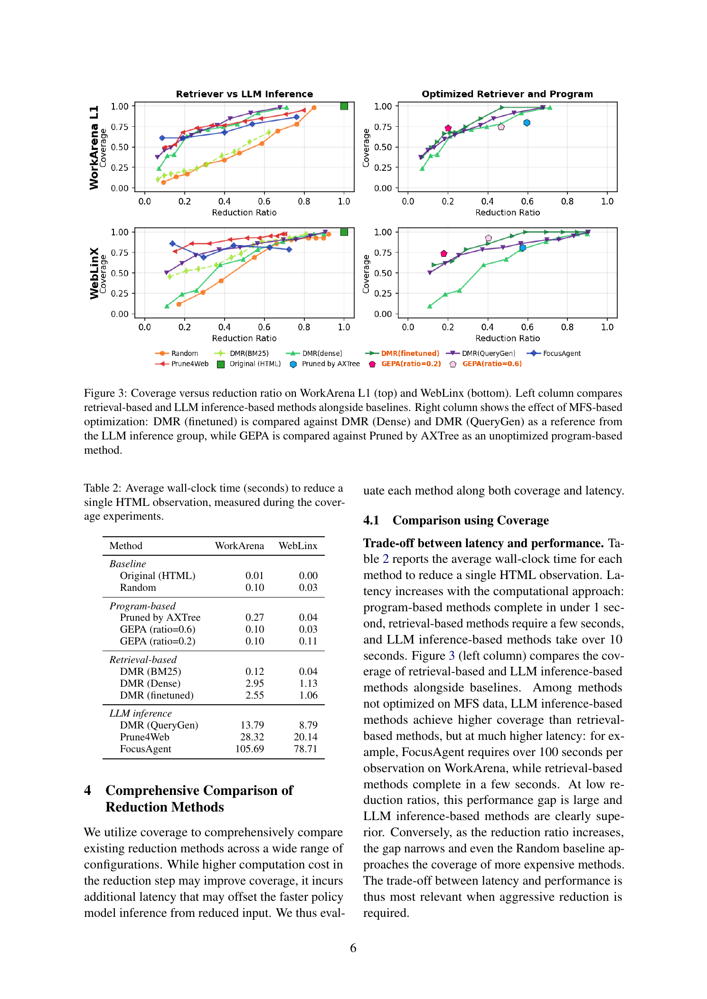
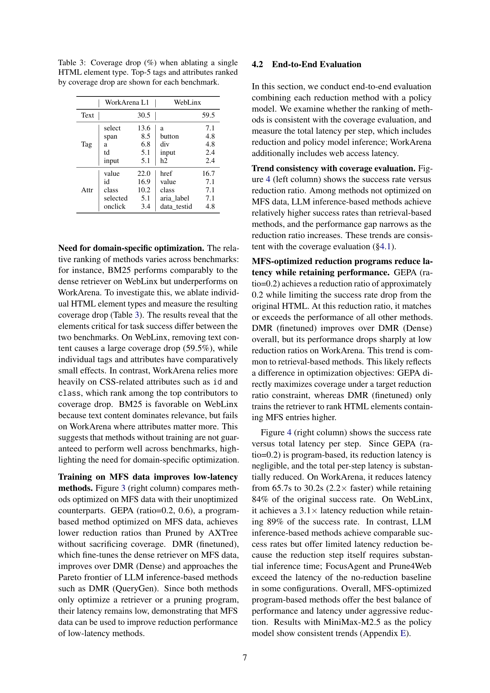

# Revisiting Observation Reduction for Web Agents: Comprehensive Evaluation with a Lightweight Framework

## TL;DR

전편 "Read More, Think More"이 "과연 observation reduction이 항상 필요한가?"를 질문했다면, 이 후속 논문은 "관측 축소 방법들을 어떻게 효율적으로 평가할 것인가?"라는 실용적 문제로 초점을 이동한다. 핵심 아이디어는 Minimal Failure Set (MFS) — HTML 요소 중 제거 시 태스크 실패를 유발하는 최소 집합 — 을 구축하고, 축소 방법이 MFS를 온전히 보존하는 비율(coverage)을 end-to-end 성공률의 대리 지표(proxy)로 사용하는 것이다. Coverage는 policy model 추론이나 웹 접근 없이 평가 가능하며, 100배 이상의 누적 평가 시간 단축을 달성하면서도 end-to-end 성공률과 강한 상관관계(Pearson r > 0.9)를 보인다. 이 프레임워크를 통해 11가지 축소 방법을 종합 비교하고, MFS 데이터로 최적화된 pruning program(GEPA)이 WorkArena L1에서 2.2×, WebLinx에서 3.1×의 latency 감소를 이루면서도 각각 84%, 89%의 성공률을 유지함을 보인다.

Source: [arXiv:2605.29397](https://arxiv.org/abs/2605.29397), [PDF](https://arxiv.org/pdf/2605.29397.pdf)

## Background

LLM 기반 웹 에이전트는 매 스텝마다 DOM을 관측(observation)으로 받아들인다. WorkArena 기준 HTML은 40K–500K 토큰에 달해 높은 추론 비용과 지연 시간을 유발한다. 이를 해결하기 위해 다양한 observation reduction 방법이 제안되어 왔다:

- **Program-based heuristics**: 접근성 트리(a11y) 기반 필터링, <script>/<meta> 제거 등 (de Chezelles et al., 2025)
- **Retrieval-based**: BM25, dense embedding을 사용해 task-relevant 요소를 검색 (Deng et al., 2023; Lù et al., 2024)
- **LLM inference-based**: LLM이 직접 관련 요소를 선택 (FocusAgent, Prune4Web; Kerboua et al., 2025; Zhang et al., 2026)

그러나 이 방법들을 공정하게 비교하는 것은 매우 어렵다. 11개 방법 × 32개 설정 × 33개 태스크의 WorkArena L1 평가에 232.4시간이 소요될 정도로 end-to-end 평가 비용이 지나치게 높기 때문이다. 또한 기존 연구는 각 방법을 독립적으로 제안하고 서로 다른 설정에서 평가하여 일관된 비교가 불가능했다. 이 논문은 전편(2604.01535)과 동일한 저자진이 작성한 후속 연구로, 전편이 "HTML이 a11y보다 나은가?"라는 질문을 탐구했다면 이번에는 "축소 방법들을 어떻게 효율적이고 공정하게 평가할 것인가?"를 다룬다.

## Problem

End-to-end 평가의 높은 비용은 observation reduction 방법의 체계적인 비교와 자동 최적화를 가로막는 주요 장애물이다. 저자들은 이 문제를 해결하기 위해 다음과 같은 질문을 던진다:

1. End-to-end 평가 없이 reduction 방법의 효과성을 예측할 수 있는 경량 대리 지표(lightweight proxy)는 무엇인가?
2. Coverage가 과연 end-to-end 성공률과 일관된 순위를 제공하는가?
3. 다양한 축소 방법들은 coverage, latency, reduction ratio 측면에서 어떤 trade-off를 보이는가?
4. 축소 방법의 도메인별 최적화(domain-specific optimization)는 효과적인가?

핵심 통찰: observation reduction의 목표는 **태스크 성공에 필요한 요소만 남기고 나머지는 제거**하는 것이다. 따라서 각 HTML 관측에 대해 "제거되면 태스크가 실패하는 최소 요소 집합"을 정의할 수 있다면, 축소 방법이 이 집합을 보존하는지 여부가 성공률의 좋은 대리 지표가 될 수 있다.

## Method

저자들은 Minimal Failure Set (MFS)을 기반으로 한 경량 평가 프레임워크를 제안한다.

**Minimal Failure Set (MFS) 정의.** 성공적 에이전트 궤적의 각 스텝 \(s\)에서 HTML 관측 \(H_s\)의 요소를 \((i, \text{attr})\) 쌍으로 분해한다. 여기서 \(i\)는 요소 식별자, attr는 속성명(@tag, @text 포함)이다. 부분집합 \(X \subseteq H_s\)에 대해 개입(intervention)을 수행하여 \(X\) 제거 시 태스크가 실패하면 \(f(X)=1\)로 정의한다. MFS는 \(X^* = \arg\min_{X \subseteq H_s, f(X)=1} |X|\)로 정의되는 최소 실패 집합이다.

**MFS 근사 구성 (2단계).** 정확한 MFS는 \(2^{|H_s|}\)의 개입이 필요하므로 현실적으로 불가능하다. 저자들은 두 단계로 근사 MFS \(\hat{X}\)를 구축한다:

- **Phase 1 (Agent Self-Reports)**: 에이전트가 스스로 보고한 관련 요소 \(E_s\)를 수집한다. \(C_s \subseteq E_s\)를 실제 존재하는 요소로 제한한 후, \(C_s\)를 제거하고 에이전트를 실행하여 태스크 실패를 확인한다.
- **Phase 2 (Iterative Minimization)**: ddmin 알고리즘(Zeller and Hildebrandt, 2002)을 적용해 \(C_s\)에서 최소 실패 집합을 찾는다. WorkArena의 경우 Phase 1의 오류 액션을 proxy oracle로 사용해 각 테스트를 단일 추론 스텝으로 단축한다. 요소는 DOM 트리 거리 기반 Farthest Point Sampling으로 그룹화하여 ddmin 효율을 높인다.

**Coverage와 Reduction Ratio.** 축소 방법 \(R\)에 대해:
$$
\text{Coverage}(R) = \frac{|\{(H_s, \hat{X}) \in D \mid \hat{X} \subseteq R(H_s)\}|}{|D|}
$$
$$
\text{RR}(R) = \frac{1}{|D|} \sum_{d \in D} \frac{|R(H_s)|}{|H_s|}
$$

여기서 \(D\)는 성공적 궤적에서 추출한 (HTML, MFS) 쌍의 집합이고, \(|\cdot|\)은 문자 수로 측정한다. 완전한 HTML은 항상 Coverage 1.0을 달성하므로, 좋은 방법은 낮은 RR에서 높은 Coverage를 달성하는 것이다.

**MFS 통계.** WorkArena에서 3개 LLM(Gemini, Claude, GPT)으로 99개 궤적을 수집, 63개 성공, 59개 유효 MFS 인스턴스 획득. WebLinx에서는 900개 궤적, 329개 성공, 42개 유효 MFS 인스턴스. 평균 MFS 크기는 WorkArena 1.93, WebLinx 1.50 요소로 매우 작다. MFS 구축 비용은 WorkArena 2,729회, WebLinx 2,196회 추론으로 일회성이며 이후 평가에서 분할 상환된다.

**평가 메트릭으로서 Coverage의 검증.** 저자들은 다음과 같이 Coverage의 타당성을 검증한다:

1. **상관관계**: Coverage와 end-to-end 성공률 간 Pearson \(r > 0.9\) (partial correlation controlling for RR에서도 \(r > 0.85\) 유지, Figure 2)
2. **샘플 효율성**: WorkArena에서 4개 인스턴스만으로 Spearman \(\rho > 0.7\) 달성 (Figure 5)
3. **모델 독립성**: 서로 다른 궤적 수집 LLM 간에도 일관된 상관관계 유지 (0.82–0.88 on WorkArena)
4. **평가 시간**: WorkArena에서 end-to-end 232.4시간 → Coverage 48.2분 (290× speedup, Table 1)

## Experiments

저자들은 MFS 기반 Coverage 프레임워크를 사용해 11가지 observation reduction 방법을 종합 비교한다.

**비교 대상 방법:**
- Baseline: Original (full HTML), Random
- Program-based: Pruned by AXTree (a11y 기반), GEPA (ratio=0.2/0.6, MFS-optimized)
- Retrieval-based: DMR (BM25), DMR (Dense), DMR (finetuned, MFS-optimized), DMR (QueryGen)
- LLM inference-based: FocusAgent, Prune4Web

**Coverage vs. Reduction Ratio (Figure 3).** LLM inference 기반 방법(FocusAgent, Prune4Web)이 가장 높은 Coverage를 달성하지만, reduction latency가 100초 이상으로 매우 높다(Table 2: FocusAgent WorkArena 105.69초/인스턴스). 반면 retrieval 기반 방법은 수 초 내에 완료되지만 Coverage가 낮다. 그러나 reduction ratio가 증가(더 aggressive한 축소)할수록 LLM 방법과 저비용 방법 간의 격차는 좁혀진다. 즉, **aggressive reduction이 필요할 때 오히려 저비용 방법도 경쟁력**을 가진다는 중요한 발견이다.

**도메인별 차이 (Table 3).** 요소 유형별 ablation 실험 결과, WorkArena와 WebLinx에서 중요한 요소 유형이 크게 다르다:

- **WebLinx**: 텍스트 콘텐츠 제거 시 Coverage drop 59.5%로 압도적 → BM25 같은 텍스트 기반 검색이 효과적
- **WorkArena**: `id` (16.9%), `class` (10.2%), `value` (22.0%) 등 CSS 속성과 form 관련 속성의 중요성이 높음 → 단순 텍스트 매칭으로는 부족

이는 BM25가 WebLinx에서는 dense retriever에 필적하지만 WorkArena에서는 크게 뒤처지는 현상을 설명한다. 또한 domain-specific optimization의 필요성을 강력히 시사한다.

**MFS 최적화 효과 (Figure 3 right).** GEPA (ratio=0.2)는 program-based 방법임에도 LLM inference 방법에 필적하는 Coverage를 달성하면서 latency는 0.1초에 불과하다. DMR (finetuned)도 DMR (Dense) 대비 개선을 보이지만, 낮은 reduction ratio에서는 급격히 성능이 하락한다. 이는 GEPA가 reduction ratio 제약 조건 하에서 직접 Coverage를 최적화하는 반면, DMR finetuning은 단순히 MFS 요소의 순위만 높이기 때문이다.

**End-to-End 평가 (Figure 4).** Qwen3.5-122B-A10B를 policy model로 한 end-to-end 평가에서, GEPA (ratio=0.2)는 WorkArena에서 latency를 65.7s → 30.2s (2.2×)로 줄이면서 성공률의 84% 유지, WebLinx에서는 3.1× latency 감소에 89% 성공률 유지. 반면 FocusAgent와 Prune4Web은 reduction step 자체의 latency가 높아 오히려 전체 latency가 baseline(축소 없음)을 초과하는 경우도 발생한다. MiniMax-M2.5 정책 모델에서도 일관된 경향이 확인되었다(Figure 8).

## Critical Analysis

**강점:**
1. **문제 정의의 명확성**: "축소 방법 평가의 높은 비용"이라는 구체적이고 실용적인 문제를 정확히 정의하고, MFS와 Coverage라는 우아한 해결책을 제시했다. MFS의 크기가 평균 1.5–1.9 요소로 매우 작다는 발견은 이 접근법의 효율성을 뒷받침한다.
2. **검증의 체계성**: 단순히 상관관계만 보인 것이 아니라, sample efficiency (4개 인스턴스면 충분), model independence (LLM별 일관성), cross-split robustness (다른 태스크로 구축한 MFS도 유효), candidate set restriction 분석 (self-report로 충분) 등 다양한 각도에서 Coverage의 타당성을 검증했다.
3. **실용적 통찰**: "단순한 방법이라도 aggressive reduction 상황에서는 경쟁력 있다", "도메인별 특성에 따라 최적 방법이 다르다", "축소 단계의 latency를 고려한 총 latency 비교가 필요하다"는 통찰은 실제 웹 에이전트 시스템 설계에 직접적으로 활용 가능하다.
4. **End-to-end와 proxy 평가의 간극 해소**: Coverage가 end-to-end 성공률의 대리 지표로서 단순한 상관관계를 넘어, **방법 간 순위(ranking)를 보존**함을 입증했다. 이는 coverage를 최적화 목표로 사용할 수 있는 근거가 된다.

**약점 및 한계:**
1. **Extractive 방법에만 적용 가능**: Coverage는 요약(summarization)이나 의미론적 압축(semantic compression) 등 representation-transforming 방법을 평가할 수 없다. 이는 논문에서 명시한 한계이지만, 최근 Web Agent 분야가 점점 더 다양한 관측 표현을 실험하고 있다는 점에서 중요한 제약이다.
2. **궤적 의존성**: MFS는 관찰된 성공 궤적에서만 구성된다. 관찰되지 않은 궤적에서 필요한 요소는 MFS에 포함되지 않으며, 이는 특히 실패 케이스에 대한 보상이 중요한 강화학습 설정에서 문제가 될 수 있다.
3. **데이터 재현성 제약**: WorkArena HTML(ServiceNow)의 재배포 제한으로 MFS 데이터셋을 공개하지 못한다. MFS 구축 절차와 코드는 제공되지만, 재현에는 상당한 시간과 비용이 필요하다. 특히 2729회의 WorkArena 추론과 복잡한 DOM 정규화(Category A–G, 수십 개 규칙)는 재현 장벽을 높인다.
4. **MFS 구성 비용의 간과 가능성**: 저자들은 MFS 구축이 "일회성 비용"이라고 주장하지만, 이 비용도 상당하다. WorkArena에서만 2,729회 추론 × 평균 68K 입력 토큰 = 약 185M 토큰 처리가 필요하다. 새로운 벤치마크나 웹사이트가 추가될 때마다 이 비용이 재발생한다는 점을 고려해야 한다.
5. **제한된 벤치마크 스케일**: WorkArena 33개 태스크 + 300개 WebLinx 인스턴스만 평가되었다. 최근 200개 태스크 규모의 Odysseys 벤치마크나 더 다양한 도메인의 WebArena 등에서도 이 프레임워크가 유효한지 검증이 필요하다.
6. **전편과의 관계 모호성**: 전편(2604.01535)은 HTML 자체의 이점을 주장했다. 그렇다면 HTML에서 축소를 전혀 하지 않는 것이 최선인 상황도 있을 텐데, 이 논문의 프레임워크는 "축소 방법 평가"에 초점이 맞춰져 있어 두 연구의 실용적 종합이 부족하다. 예를 들어, 고성능 모델(GPT-5.1)에게는 HTML을 그대로 주는 것이 최적일 수 있는데, 이 경우 reduction 자체가 불필요하다.

**후속 연구 방향:**
- Representation-transforming 방법(summarization, structured compression)을 평가할 수 있는 MFS 확장
- 다양한 벤치마크(WebArena, VisualWebArena, Odysseys)로 프레임워크 확장 검증
- MFS의 PID(Preference In Dependency) 개념 도입 — 요소 간 관계(예: 두 요소 중 하나만 필요)를 포착할 수 있는 일반화
- Adaptation: 에이전트가 태스크 진행 상태에 따라 축소 강도를 동적으로 조절

## Implementation Notes

- **프레임워크 활용**: 새로운 observation reduction 방법을 개발했다면, MFS를 구축하고 Coverage를 평가 지표로 사용하라. end-to-end 평가에 비해 100배 이상 빠르게 prototype을 반복(iterate)할 수 있다.
- **MFS 구축 실용 조언**: agent self-reports만으로도 충분한 MFS 근사가 가능하다(Appendix B.3). ddmin의 DOM 거리 기반 FPS 그룹화는 선택 사항이지만, oracle call 수를 약 10–20% 줄여준다(Table 4).
- **GEPA 최적화 전략**: MFS를 최적화 목표로 사용하는 pruning program을 GEPA로 진화시키는 것이 가장 효과적이다. Program-based 방법이므로 reduction latency가 0.1초로 무시할 수준이며, 도메인별 특성을 포착할 수 있다. WorkArena와 WebLinx에서 학습된 프로그램(Listings 3, 4)은 각 도메인의 중요 속성(`id`, `class`, `href` 등)과 키워드 매칭 전략이 다르게 진화했다.
- **도메인 특화 설계**: 온라인 쇼핑 도메인이라면 텍스트 + `href` 중심, 기업 웹 앱(ServiceNow 등)이라면 `id` + `class` + `value` 중심으로 pruning 프로그램을 설계하라.
- **Total latency 계산**: reduction latency + policy model inference latency + web access latency를 모두 포함한 total per-step latency를 최적화 목표로 삼아야 한다. LLM inference 기반 방법은 reduction latency가 매우 높아(100+초) 오히려 전체 latency를 증가시킬 수 있다.
- **전편과의 통합**: 고성능 모델(GPT-5.1, Claude 4.6+) + 충분한 thinking budget + ServiceNow 같은 특정 도메인에서는 HTML을 그대로 사용하는 것이 최적일 수 있다. 이 프레임워크는 축소가 **필요한 상황**에서 사용하라.

## Captured Figures and Tables

