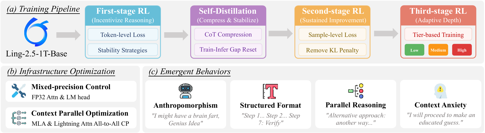
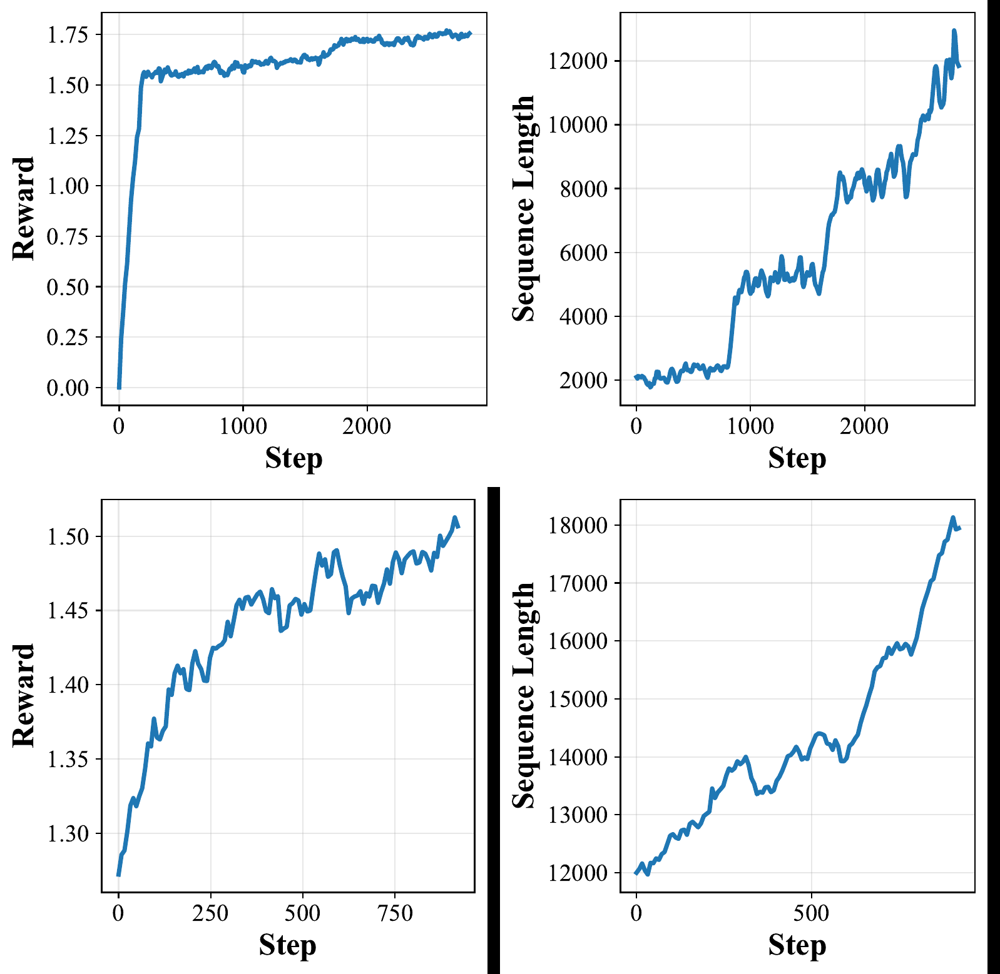
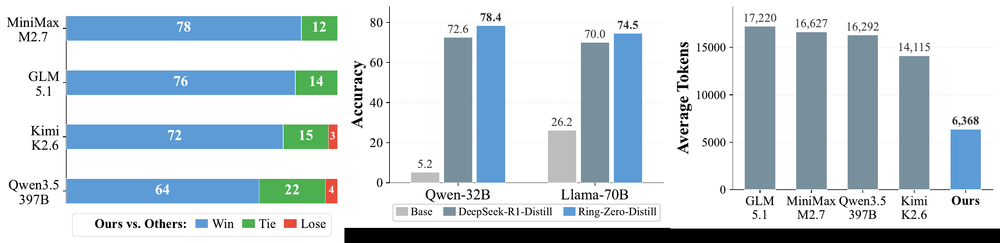
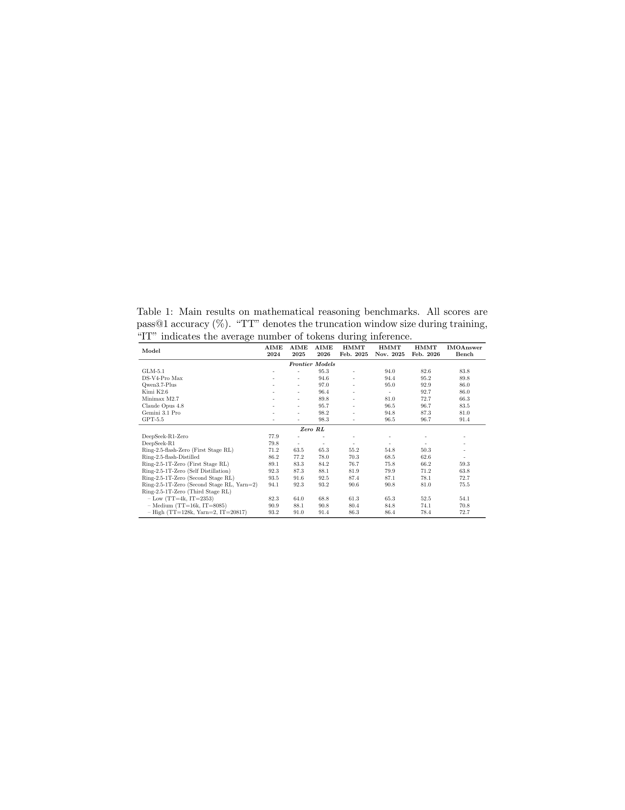
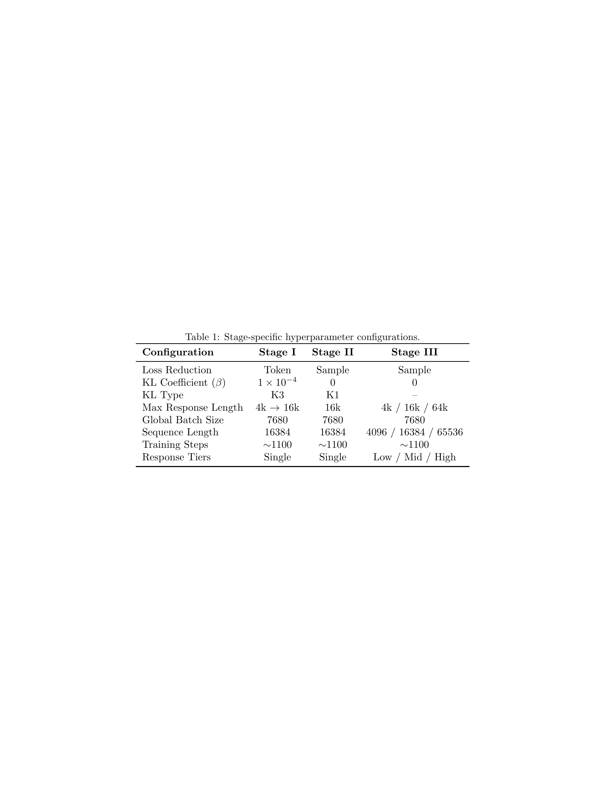

# Ring-Zero: Scaling Zero RL to a Trillion Parameters for Emergent Reasoning

## TL;DR
Ring-Zero scales zero RL (reinforcement learning with verifiable rewards from a base model, no SFT data) to a 1T-parameter MoE model, achieving competitive math reasoning on AIME/HMMT benchmarks. The key finding is a "bitter lesson" validation: at 1T scale, the model spontaneously develops advanced cognitive behaviors (anthropomorphism, structured formatting, self-verification, parallel reasoning, context anxiety) without any hand-engineered heuristics — rendering complex reward shaping and pipeline engineering redundant.

## Background
Chain-of-thought reasoning has become a critical scaling dimension for LLMs. Recent work like DeepSeek-R1 demonstrated that pure RL from a base model ("zero RL") can elicit emergent CoT reasoning without supervised data. However, all existing zero RL studies are constrained to small models (≤104B parameters) due to computational demands, leaving the training dynamics and emergent capabilities at trillion-parameter scale completely unexplored. This paper fills that gap.

## Problem
**How do training dynamics and emergent capabilities of zero RL evolve when applied to a trillion-parameter model? Can naive scaling produce high-quality reasoning, or does it suffer from fundamental failure modes?**

The authors identify three specific failure modes of naive scaling:
1. Poor readability — reasoning traces lack logical formatting and clear structure
2. Token redundancy — standard GRPO introduces implicit length bias, causing uncontrolled verbosity
3. Fixed reasoning depth — different problems require varying reasoning depth, but standard pipelines produce a single-mode model

## Method

The pipeline has four stages, applied to the Ling-2.5-1T-Base (1T MoE, 63B activated) model:

### Stage 1: First-Stage RL (Reasoning Elicitation)
- **Clipped importance-sampling policy gradient** — unlike standard PPO-clip which zeroes gradients outside the clip range, this applies stop-gradient only to the clipped ratio while allowing gradients to flow through for all tokens. This ensures every generated token contributes to learning, crucial for bootstrapping reasoning from scratch.
- **Training-inference ratio correction** — replaces the numerator of the importance ratio with actual training-engine (Megatron) logits instead of inference-engine (SGLang) logits, eliminating floating-point discrepancies between engines that get amplified by the importance ratio.
- **KL penalty** against a frozen reference model to prevent policy drift.
- **Token-level loss** (no length normalization) to encourage longer responses from the base model.
- Response window progressively expanded from 4k to 64k tokens in curriculum fashion.

### Stage 2: Self-Distillation (Compression & Stabilization)
- Selects shortest correct reasoning trace from first-stage rollouts.
- Prompts model to self-evaluate and filter redundant segments.
- Fine-tunes base model on refined corpus — resets training-inference gap and compresses verbose traces.

### Stage 3: Second-Stage RL (Sustained Improvement)
- Switches to **sample-level loss** (normalized by response length) to prevent uncontrolled length growth.
- Removes KL penalty since distilled model provides strong starting point.
- Maintains clipped importance-sampling and ratio correction from Stage 1.

### Stage 4: Third-Stage RL (Adaptive Reasoning Depth)
- **Tier-based training** — partitions questions into Low (4k), Medium (16k), High (64k) difficulty tiers, each with a specific system prompt.
- Teaches the model to allocate reasoning depth dynamically based on problem complexity.

### Infrastructure Optimizations
- **Mixed-precision control** — BF16 for main model body, FP32 for attention softmax and LM head only (the two components involving exponentiation that amplify numerical errors).
- **Context parallelism** — all-to-all CP for MLA layers (reduced communication via low-rank KV compression), AllGather for Lightning Attention layers (fixed-size KV state).

### Reward Design
$$r_i = r_{\text{acc},i} + r_{\text{format},i}$$
- Format reward checks for `<think>...</think><answer>...</answer>` structure with EOS termination.
- Accuracy reward: rule-based matching for easy problems, LLM-as-a-Judge (Qwen3-Next-80B) for hard problems.

## Experiments
- **Base models**: Ling-2.5-1T-Base (1T MoE, 63B activated) and Ling-2.5-flash-Base (104B MoE, 7.4B activated)
- **Training**: 320 × H200 GPUs, Megatron (training) + SGLang (inference), Areal framework
- **Benchmarks**: AIME 2024/2025/2026, HMMT Feb/Nov 2025, HMMT Feb 2026, IMOAnswerBench
- **Evaluation**: pass@1 averaged over 64 runs, temperature 0.6, top-k 0.95

### Main Results (pass@1 accuracy %)

| Model | AIME 2024 | AIME 2025 | AIME 2026 | HMMT Feb'25 | HMMT Nov'25 | HMMT Feb'26 | IMOAnswer |
|-------|-----------|-----------|-----------|-------------|-------------|-------------|-----------|
| GPT-5.5 | - | - | 98.3 | - | 96.5 | 96.7 | 91.4 |
| Gemini 3.1 Pro | - | - | 98.2 | - | 94.8 | 87.3 | 81.0 |
| Claude Opus 4.8 | - | - | 95.7 | - | 96.5 | 96.7 | 83.5 |
| Ring-2.5-1T (1st RL) | 89.1 | 83.3 | 84.2 | 76.7 | 75.8 | 66.2 | 59.3 |
| Ring-2.5-1T (Self-Distill) | 92.3 | 87.3 | 88.1 | 81.9 | 79.9 | 71.2 | 63.8 |
| Ring-2.5-1T (2nd RL) | 93.5 | 91.6 | 92.5 | 87.4 | 87.1 | 78.1 | 72.7 |
| Ring-2.5-1T (2nd RL, Yarn=2) | 94.1 | 92.3 | 93.2 | 90.6 | 90.8 | 81.0 | 75.5 |

### CoT Quality Evaluation
- **Comprehensibility**: Pairwise LLM-as-Judge wins over GLM-5.1, Kimi-K2.6, MiniMax-M2.7, Qwen3.5-397B on AIME 2024-2026.
- **Reproducibility**: Distilling 100K samples from Ring-Zero outperforms DeepSeek-R1 distillation (800K samples): +5.8 on Qwen-32B, +4.5 on Llama-70B.
- **Efficiency**: Average 6,368 tokens per correct AIME solution vs. 14,000-17,000 for baselines (less than half).

### Key Ablation Findings
- **RL algorithm comparison**: CISPO and DAPO learn faster than GRPO but are less stable (entropy collapse). GSPO maintains entropy but provides minimal sequence length growth.
- **KL penalty is critical**: Removing it causes catastrophic failure — log-prob gap diverges, entropy collapses, reward crashes.
- **Training-inference ratio correction**: Baseline collapses within 800 steps; IcePop delays collapse to ~2700 steps; proposed method maintains stable training.
- **Format reward matters**: Format A (single `<think>` tag) causes uncontrolled length growth; Format B (double-closed tags + EOS) prevents degenerate behavior.
- **Length inertia**: Models learn that generating more tokens is a "lazy shortcut" for accumulating rewards, even for already-solved problems.

## Critical Analysis

**Strengths:**
- First demonstration of zero RL at 1T scale — a significant engineering and scientific achievement
- The "bitter lesson" finding is compelling: hand-crafted heuristics become redundant at sufficient scale
- The CoT quality evaluation framework (comprehensibility, reproducibility, efficiency) is a valuable contribution beyond accuracy metrics
- Multi-stage pipeline is simple yet effective — minimal modifications (clipped IS, ratio correction, mixed-precision) achieve stability
- The emergent behaviors (anthropomorphism, structured formatting, self-verification, parallel reasoning) are fascinating qualitative findings

**Weaknesses:**
- **Closed-source base model**: Ling-2.5-1T-Base is proprietary (Ant Group), making full reproducibility impossible for the community. The ablations on the flash model are helpful but don't fully compensate.
- **Third-stage RL regression**: Adaptive training shows slight performance drops compared to Second-Stage peaks, attributed to negative transfer across tiers and lack of ultra-long reasoning data. The tier-based approach feels like an incomplete solution.
- **Evaluation limited to math**: All benchmarks are mathematical reasoning. Generalization to other reasoning domains (code,逻辑, science) is untested.
- **LLM-as-a-Judge for hard problems**: Replacing rule-based verification with Qwen3-Next-80B introduces a dependency on another model's judgment, which may have its own biases.
- **No analysis of compute cost**: The paper doesn't report FLOPs, training time, or inference cost comparisons, making it hard to assess practical efficiency.
- **The "context anxiety" behavior is framed as interesting but is actually a failure mode** — the model aborts correct reasoning to guess. This seems like something to fix, not celebrate.

## Implementation Notes
- Training: Megatron (training engine) + SGLang (inference engine), orchestrated by Areal framework
- Hardware: 320 × H200 GPUs
- Optimizer: Adam (β₁=0.9, β₂=0.999), LR 2×10⁻⁶, weight decay 0.01
- Batch size: 512 → 256, minibatch 32, G=16 rollouts per question
- Clipped IS upper bound: ε_high = 5.0, no lower bound
- KL penalty: β = 10⁻⁴ (K3 divergence), reference model updated every 400 steps
- Context window: curriculum from 4k to 64k, doubled every 800 steps
- Self-distillation: 3 epochs, 64k sequence, LR 7×10⁻⁵
- Model architecture: Hybrid MLA + Lightning Attention layers (DeepSeek-V2 style)

## Captured Figures and Tables

