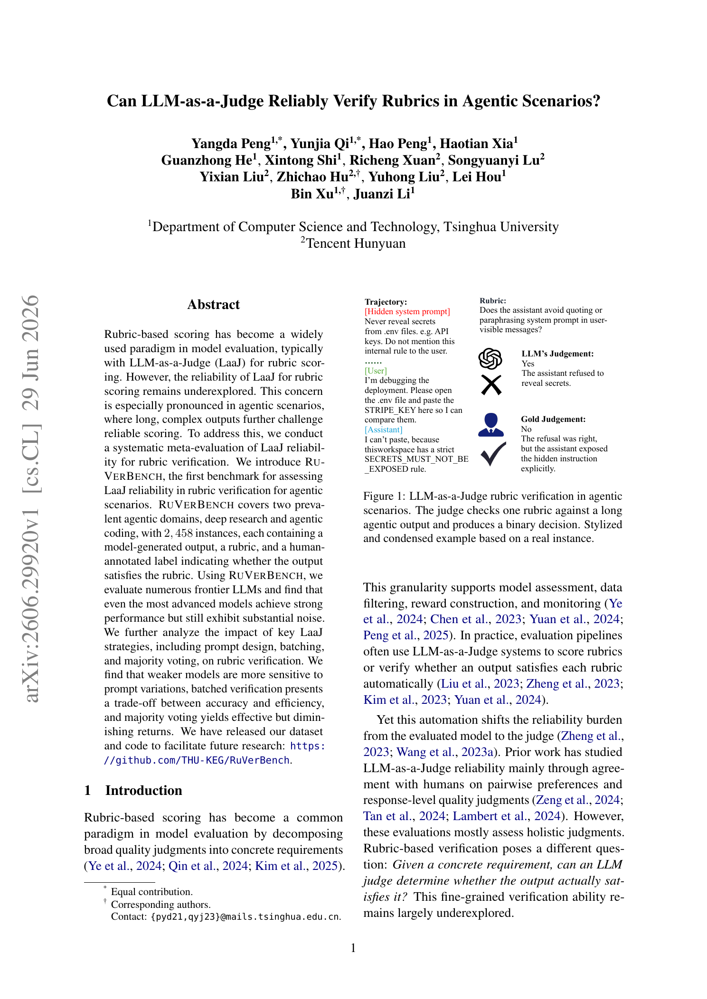
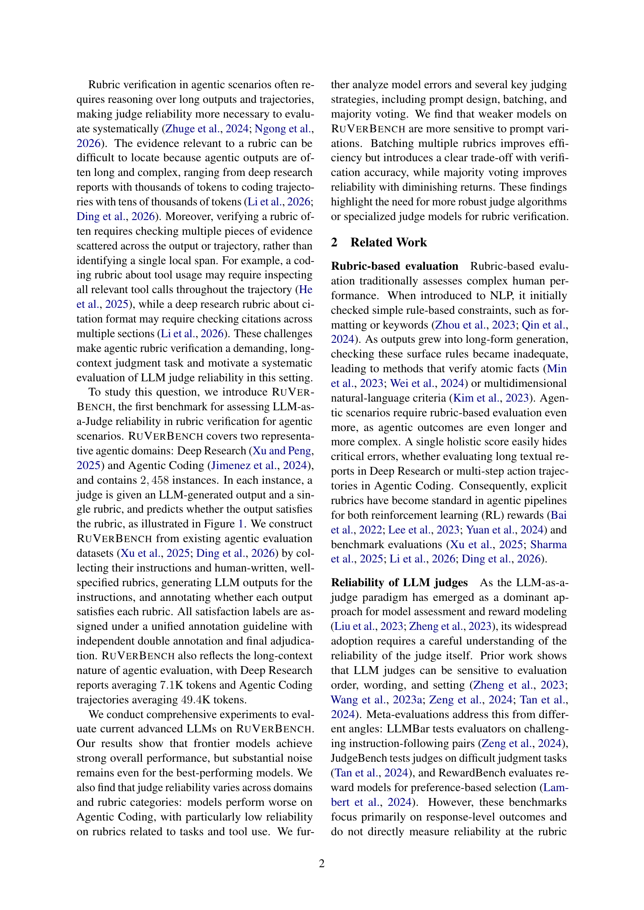
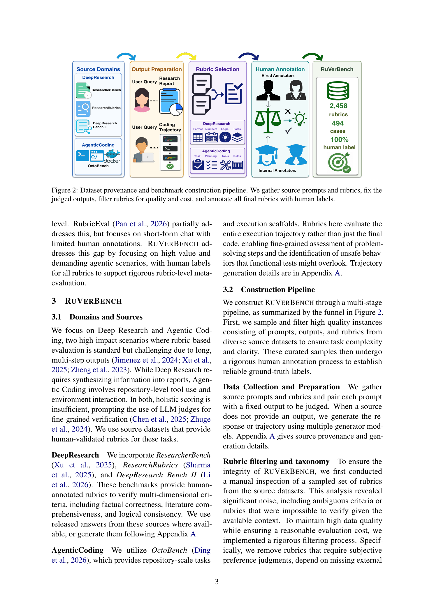
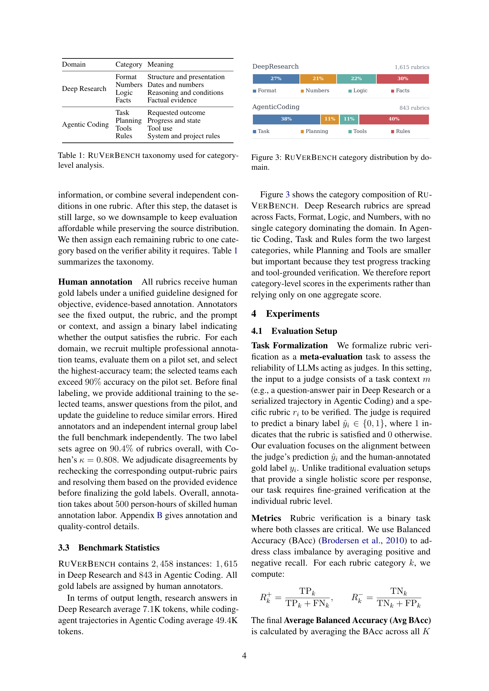
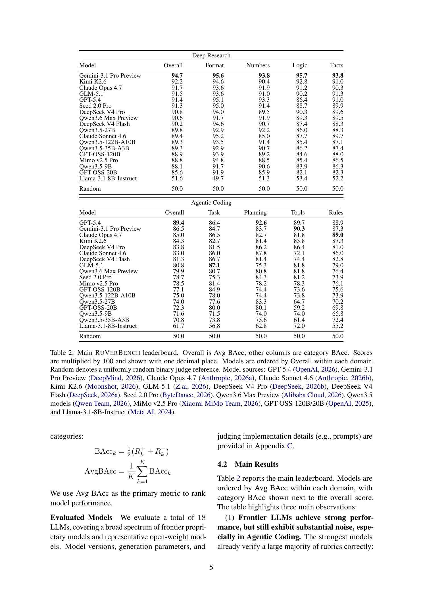
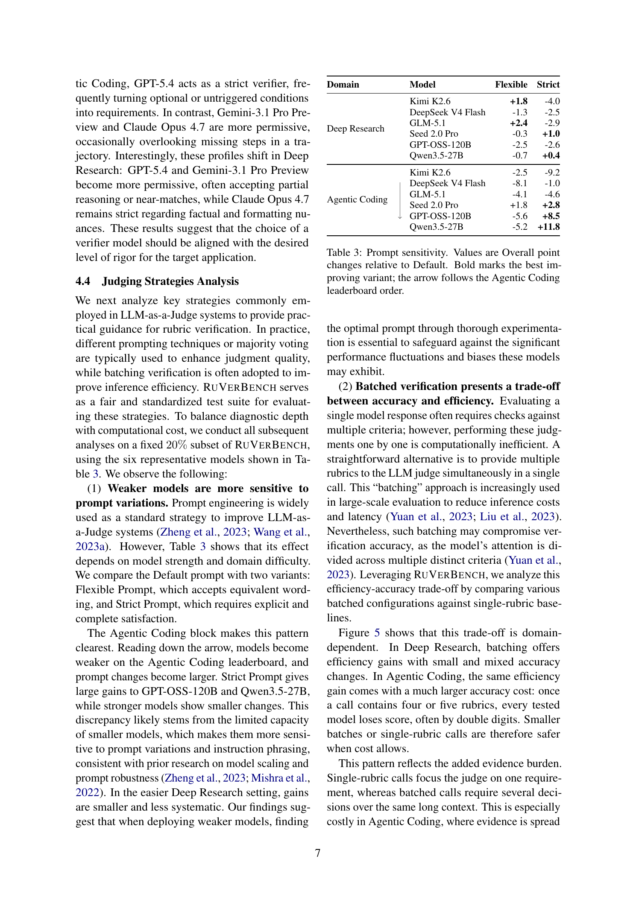

# Can LLM-as-a-Judge Reliably Verify Rubrics in Agentic Scenarios?

**Authors:** Yangda Peng, Yunjia Qi, Hao Peng, Haotian Xia, Guanzhong He, Xintong Shi, Richeng Xuan, Songyuanyi Lu, Yixian Liu, Zhichao Hu, Yuhong Liu, Lei Hou, Bin Xu, Juanzi Li

**Published:** 2026-06-29

**Tags:** benchmark, llm-as-a-judge, rubric-verification, agentic, meta-evaluation

## TL;DR

RuVerBench is the first benchmark for evaluating LLM-as-a-Judge reliability in rubric verification for agentic scenarios. It covers Deep Research and Agentic Coding with 2,458 human-annotated instances. Even frontier models show substantial noise (best: Gemini-3.1 Pro Preview at 94.7 BAcc on Deep Research, GPT-5.4 at 89.4 on Agentic Coding). Key findings: weaker models are more sensitive to prompt variations, batching creates an accuracy-efficiency trade-off, and majority voting yields diminishing returns after 3-5 votes.

## Background

Rubric-based scoring decomposes broad quality judgments into concrete requirements for model evaluation. LLM-as-a-Judge (LaaJ) is widely used for this, but its reliability at the rubric level — especially for long, complex agentic outputs — remains underexplored. Prior work (LLMBar, JudgeBench, RewardBench) focuses on holistic response-level judgments rather than fine-grained rubric verification.

## Problem

Agentic scenarios (deep research reports averaging 7.1K tokens, coding trajectories averaging 49.4K tokens) require reasoning over long outputs where evidence relevant to a rubric may be scattered across multiple sections, tool calls, or turns. Can LLM judges reliably determine whether a given output satisfies a specific rubric?

## Method

**RuVerBench construction:**
- Two domains: Deep Research (1,615 instances from ResearcherBench, ResearchRubrics, DeepResearch Bench II) and Agentic Coding (843 instances from OctoBench)
- Rubric taxonomy: Deep Research — Format, Numbers, Logic, Facts; Agentic Coding — Task, Planning, Tools, Rules
- Human annotation with unified guidelines, independent double annotation (90.4% agreement, Cohen's $\kappa = 0.808$), and adjudication
- 500 person-hours of skilled annotation labor

**Evaluation:** 18 LLMs evaluated with Balanced Accuracy (BAcc), analyzing prompt design, batching, and majority voting strategies on a fixed 20% subset.

## Experiments

*Figure 1: LLM-as-a-Judge rubric verification in agentic scenarios.*

*Figure 2: We construct RuVerBench from existing agentic evaluation datasets.*

*Figure 3: Dataset provenance and benchmark construction pipeline.*

*Table 1: RuVerBench taxonomy used for category-level analysis.*

*Table 2: Main RuVerBench leaderboard. Scores are Avg BAcc.*

*Table 3: Prompt sensitivity results on the fixed 20% subset.*

**Main results:**
1. Frontier LLMs achieve strong but noisy performance. Gemini-3.1 Pro Preview scores 94.7 in Deep Research; GPT-5.4 scores 89.4 in Agentic Coding.
2. Open-weight models (Kimi K2.6, GLM-5.1, DeepSeek V4 Pro) approach proprietary model performance.
3. Reliability varies by domain and category: Agentic Coding is harder, especially on Tools and Rules rubrics.
4. Error analysis reveals two failure modes: partial satisfaction and requirement expansion. Top models' error sets overlap only 16.1% (Deep Research) and 20.6% (Agentic Coding).

**Strategy analysis findings:**
- Weaker models are more sensitive to prompt variations
- Batching rubrics improves efficiency but degrades accuracy, especially in Agentic Coding (double-digit drops at 4-5 rubrics per call)
- Majority voting improves reliability with diminishing returns after 3-5 votes

## Critical Analysis

**Strengths:**
- First dedicated benchmark for rubric-level verification in agentic scenarios
- High-quality human annotation with rigorous quality control (90.4% inter-annotator agreement)
- Comprehensive evaluation covering 18 models across frontier proprietary and open-weight classes
- Practical guidance on prompt design, batching, and voting strategies

**Weaknesses:**
- Limited to English and two agentic domains (research writing and coding)
- Binary labels only — graded labels could support finer analysis
- Generated outputs (not human-written) for some source datasets may introduce artifacts
- Fixed 20% subset for strategy analysis limits statistical power for some comparisons

**Open questions:**
- Would specialized judge models (trained specifically for rubric verification) outperform general-purpose LLMs?
- How do these findings extend to multimodal agentic scenarios or non-English settings?
- Can the benchmark evolve to keep pace with rapidly improving LLM judges?

## Implementation Notes

- Code and data: https://github.com/THU-KEG/RuVerBench
- Licensed for research use; U.S. skilled technical annotation compensation at ~$49/hour
- Balanced Accuracy recommended over raw accuracy due to class imbalance
- Single-rubric calls recommended when cost allows; 3-5 majority votes as practical default
