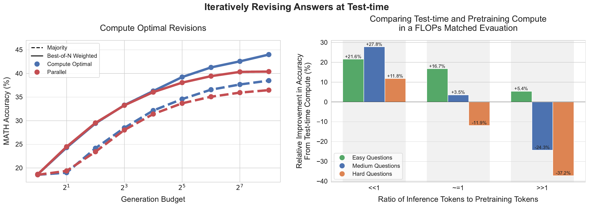
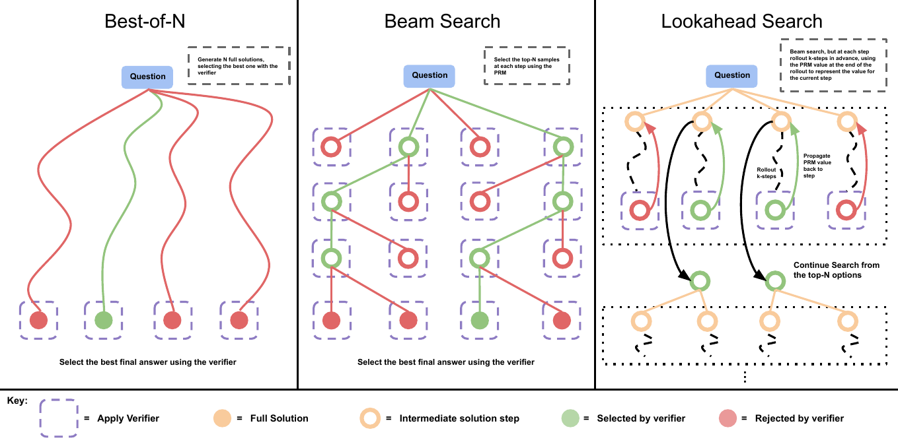
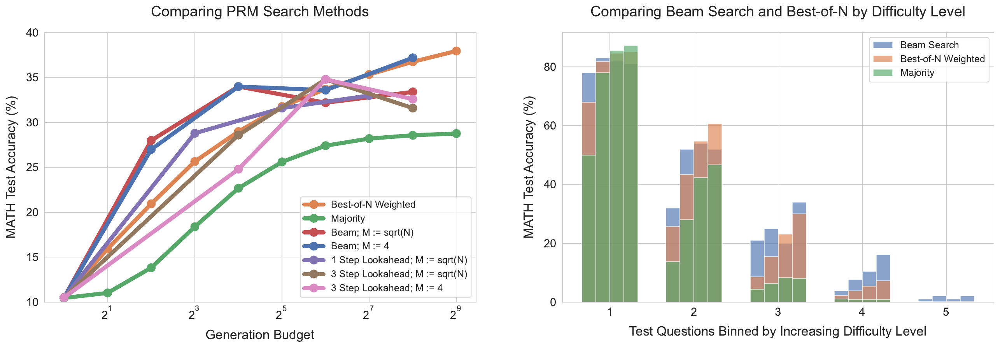

# Scaling LLM Test-Time Compute Optimally can be More Effective than Scaling Model Parameters

**Authors:** Charlie Snell, Jaehoon Lee, Kelvin Xu, Aviral Kumar  
**Published:** 2024-08-06  
**Tags:** test-time-compute, inference-scaling, process-reward-model, self-refinement, math-reasoning, compute-optimal

## TL;DR

This paper studies how to spend a fixed inference budget on difficult prompts instead of treating test-time compute as simple best-of-​N sampling. On 500 MATH problems with a PaLM 2-S* (Codey) base model, the authors compare process-reward-model (PRM) search and sequential revision models, then choose the best allocation as a function of prompt difficulty. Easy questions benefit from local sequential revisions, while harder questions benefit from broader parallel sampling or beam search. A difficulty-conditioned policy can match or nearly beat a best-of-N baseline with up to roughly 4× less generation compute. In FLOPs-matched comparisons with a model about 14× larger, extra test-time compute is often preferable for easy and intermediate questions or low inference loads, while additional pretraining remains better for the hardest questions and high inference loads.

Source: [arXiv:2408.03314](https://arxiv.org/abs/2408.03314), [PDF](https://arxiv.org/pdf/2408.03314.pdf)

## Background

Best-of-​N sampling is the standard way to scale inference: generate many independent answers and select one with a verifier. It is attractive because it is simple, but it spends the same kind of compute on every prompt. Other approaches change the proposal distribution itself, for example by asking a model to revise an earlier solution, or use a process reward model (PRM) to search over intermediate solution steps.

The paper argues that these mechanisms are complementary. A model that already has a plausible solution may gain more from editing that solution, whereas a very difficult problem may require exploring unrelated high-level approaches. The central question is therefore not merely whether more inference tokens help, but which inference-time strategy should receive the budget for this particular prompt.

## Problem

Given a prompt (q), a ground-truth answer (y^*(q)), and a generation budget (N), the ideal policy chooses test-time hyperparameters (	heta) that maximize expected correctness:

\[
\theta^*_{q,y^*(q)}(N) = \arg\max_\theta \; \mathbb{E}_{y \sim \operatorname{Target}(\theta,N,q)}[\mathbf{1}(y=y^*(q))].
\]

The answer-dependent optimum is unavailable at deployment, so the paper approximates it with a five-level difficulty statistic. Oracle difficulty bins use pass@1 estimated from 2,048 samples and ground-truth checking. Model-predicted bins replace correctness with the average final score of a learned verifier. The authors use two-fold cross-validation within bins to avoid selecting and evaluating a policy on the same fold.

## Method

### Two axes of test-time scaling

The study separates two ways to alter the base model's output distribution:

1. **Verifier optimization:** score candidate solutions with a PRM and search over prefixes.
2. **Proposal refinement:** condition on previous attempts and sample sequential revisions.

### PRM search

The experiments use a PRM trained without human step labels. For each prefix, Monte Carlo rollouts estimate the probability of eventually reaching a correct answer. The last-step PRM score is used as the full-answer score, and *best-of-​N weighted* selection sums scores across candidates that share the same final answer.

Three search families are compared:

- **Best-of-​N:** sample (N) complete solutions independently and select with the PRM.
- **Beam search:** sample initial prefixes, keep the highest-scoring prefixes, and expand them until (N) final candidates are produced. Both (M=4) and (M=\sqrt{N}) beam widths are tested.
- **Lookahead search:** use deterministic (k)-step rollouts before scoring a beam prefix. Its cost is counted as (N(k+1)) sampled generations.

### Revision model

The revision model is fine-tuned on trajectories containing several incorrect answers followed by a correct answer. To make the context useful, the authors sample 64 responses in parallel, pair each correct answer with up to four correlated incorrect responses using character edit distance, and train with supervised fine-tuning. At inference, revisions are generated sequentially while retaining the most recent four attempts in context. A verifier or majority vote selects the final answer, because a correct intermediate answer is sometimes revised into an incorrect one.

The budget can be divided between independent chains and sequential revisions. This exposes a continuum between global exploration (parallel samples) and local repair (sequential revisions).

### Pretraining versus inference FLOPs

For the FLOPs-matched comparison, pretraining and inference costs are approximated by

\[
X = 6ND_{\text{pretrain}}, \qquad Y = 2ND_{\text{inference}},
\]

where (N) is parameter count. Scaling parameters by a factor (M) multiplies both the pretraining and greedy-inference costs. The smaller model receives additional inference generations until its total FLOPs match the larger model. The comparison is reported for (R=D_{\text{inference}}/D_{\text{pretrain}} \in \{0.16, 0.79, 22\}).

## Experiments

The evaluation uses the 12k-train/500-test MATH split and a PaLM 2-S* (Codey) model fine-tuned separately for revision and verification. Generation budgets reach 256 samples. The main findings are:

- **Search depends on difficulty and budget.** Beam search is strongest at small budgets, but its advantage shrinks or reverses at large budgets. Lookahead search generally underperforms after its extra rollout cost is counted. On easy questions, aggressive beam optimization can exploit spurious PRM features and lower accuracy; on medium-hard questions, beam search is more useful than best-of-​N. The hardest bin shows little progress from any tested method.
- **Adaptive PRM allocation.** Selecting the best search strategy per difficulty bin nearly matches the best-of-​N curve with as little as 16 generations where the baseline uses 64. Oracle and verifier-predicted difficulty produce broadly similar curves at low budgets.
- **Revisions improve the proposal distribution.** Pass@1 rises across a sequential revision chain, including beyond the four previous answers seen during training. Sequential generation narrowly beats parallel generation under both verifier and majority selection, although about 38% of correct answers can be turned incorrect by a naive next revision.
- **The best sequential/parallel ratio is prompt dependent.** Easy problems prefer mostly sequential revisions. Harder problems benefit from a mixture that preserves multiple independent approaches. Difficulty-conditioned revision policies again outperform parallel best-of-​N with up to about 4× less compute.
- **Parameter scaling is not uniformly superior.** In the FLOPs-matched study, test-time compute tends to beat a roughly 14× larger model on easy/intermediate bins and when (R\ll1). For hard bins or (R\gg1), extra pretraining is more effective. Thus the two forms of compute are not interchangeable at a fixed rate.

## Critical Analysis

The paper's strongest contribution is a useful decision-theoretic framing of inference scaling. It turns a collection of sampling tricks into a prompt-conditional resource-allocation problem and shows that a small, interpretable statistic—model-specific difficulty—can capture much of the variation in which strategy works.

The verifier experiments also expose an important failure mode: a stronger optimizer can amplify verifier errors. Beam search and lookahead are not monotonically better as their budgets grow, especially when the PRM has learned superficial signals. The revision results complement this observation by showing that changing the proposal distribution can be more valuable than selecting among independent samples.

There are several limitations. The policy selection is still an offline analysis that uses 2,048 samples per question; the cost of estimating difficulty is not included in the headline efficiency numbers. Oracle bins require ground-truth checking, and predicted bins require a verifier whose calibration may shift in deployment. The experiments use one MATH split and PaLM 2-S* models specially fine-tuned for revision and verification, so transfer to current general-purpose models and non-math tasks is untested. The FLOPs exchange rate is a coarse accounting model that omits memory, verifier cost, latency, and parallel hardware utilization. Finally, the study does not combine PRM tree search with revision chains, nor does it test richer critique-and-revise or learned difficulty predictors.

## Implementation Notes

- Treat difficulty estimation as a first-class cost. A practical system could use a cheap uncertainty probe, verifier entropy, or an early partial rollout before committing to a large budget.
- Maintain separate policies for easy, medium, and hard prompts. A simple router can send easy items to sequential refinement, medium items to low-width beam search, and hard items to parallel exploration plus verifier selection.
- Monitor verifier reward hacking. Compare verifier-selected outputs with an independent checker, and inspect for short, repetitive, or low-information solutions as the search budget grows.
- Keep budget accounting in sampled generations (including lookahead rollouts and verifier calls), not only in the number of final answers. This is necessary for fair comparisons and production latency estimates.
- For revision models, cap the in-context history and use a selector over the entire chain. Without a selector, a later revision can overwrite a correct earlier answer.
- When comparing model size and inference compute, report the assumed token ratio (R), batch/parallelism assumptions, and whether verifier computation is included; otherwise the apparent exchange rate is difficult to reproduce.

## Captured Figures and Tables

No tables were captured from this paper; the source tables are embedded in the main PDF rather than standalone compilable environments in the available toolchain.
