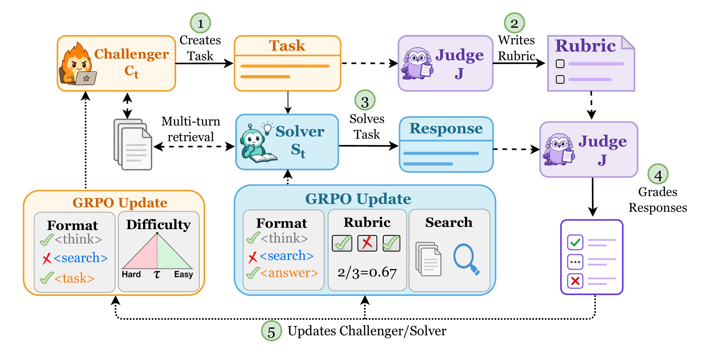
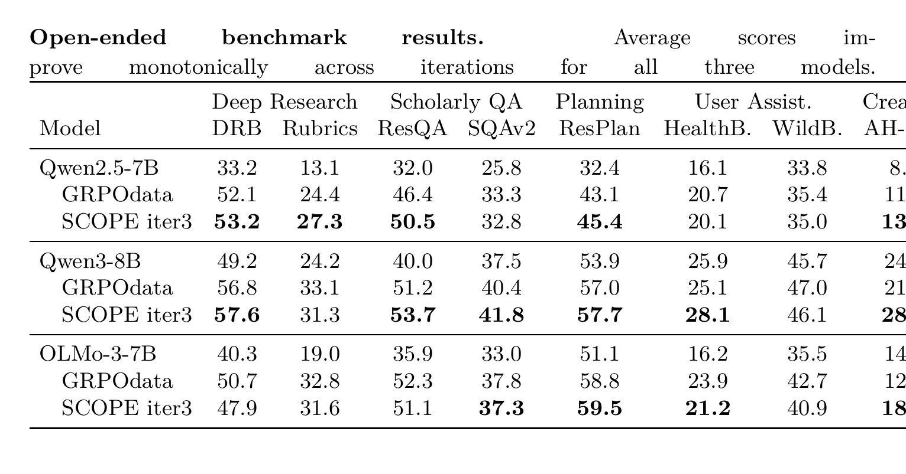
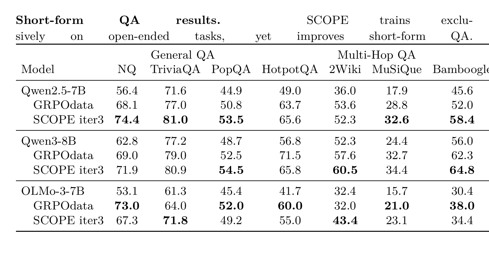
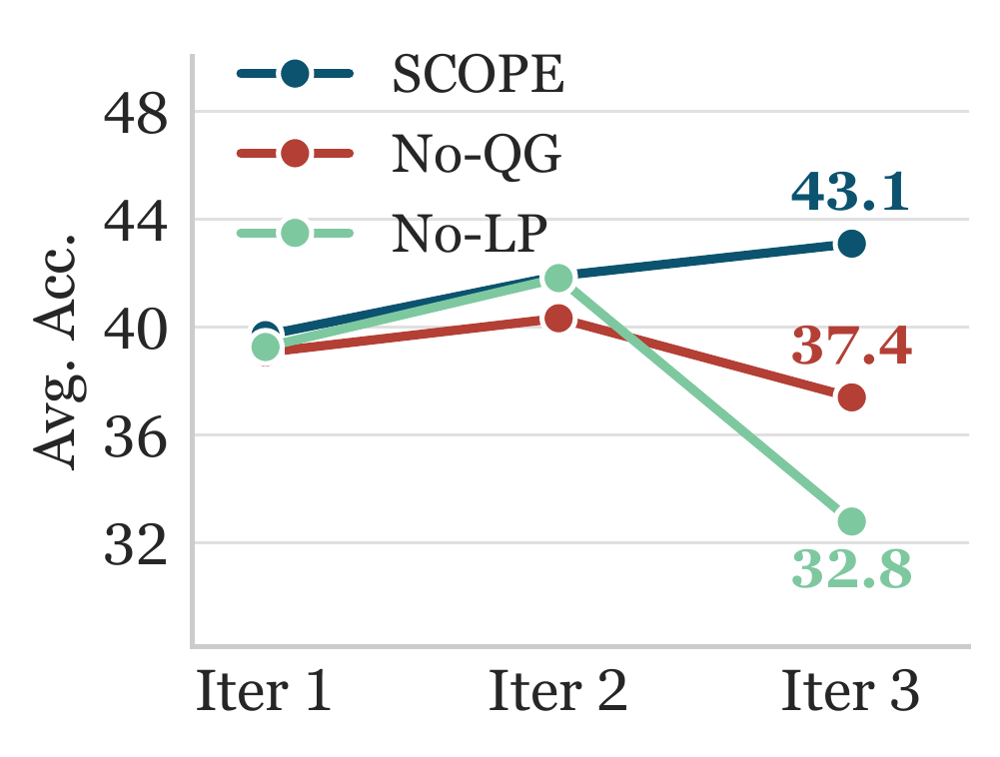
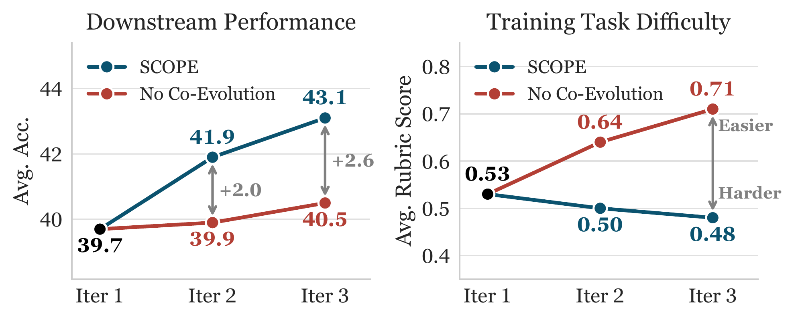
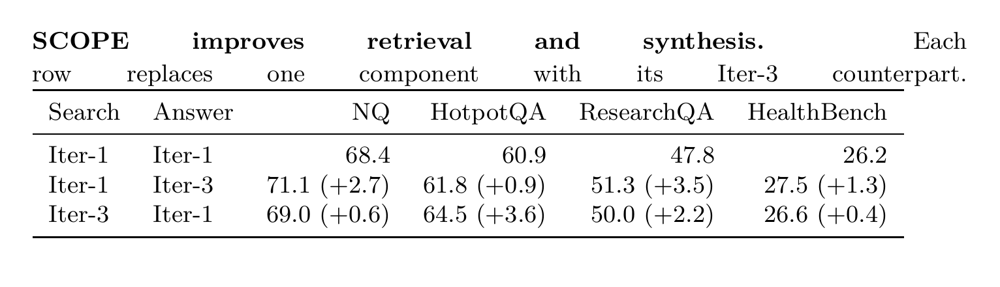

# SCOPE: Self-Play via Co-Evolving Policies for Open-Ended Tasks

**Authors:** Wai-Chung Kwan, Aryo Pradipta Gema, Joshua Ong Jun Leang, Pasquale Minervini

**Published:** 2026-05-29

**Tags:** data-free, open-ended-generation, reinforcement-learning, self-play, rubric-rewards

## TL;DR

SCOPE extends data-free self-play to open-ended tasks by co-evolving a Challenger (task generator) and Solver (task solver) with a frozen Judge that writes task-specific rubrics from source documents. Across three 7–8B models (Qwen2.5, Qwen3, OLMo-3), SCOPE improves open-ended performance by up to +10.4 points, matches or exceeds GRPOdata trained on ~9K curated prompts, and transfers gains to held-out short-form QA by up to +13.8 points — all without curated data or frontier-model supervision.

## Background

Self-play has driven superhuman performance in games, and recent work applies it to LLM post-training by co-evolving task generators and solvers. However, all prior data-free self-play methods depend on verifiable answers — string match, numerical equality, or code execution — leaving open-ended tasks (research, writing, complex QA) dependent on curated prompts or frontier-model judges. Rubric-based evaluation offers an alternative for open-ended domains, but existing rubric-RL methods still require curated prompts (RaR, DR Tulu) or frontier-model judges (RPG), tethering performance to human-level supervision.

## Problem

Can data-free self-play be extended to open-ended tasks without curated prompts, reference answers, or frontier-model judges? Specifically: how can a model generate its own training curriculum for tasks that admit many valid responses?

## Method

SCOPE organises self-play around three roles, all initialised from the same base model $M_0$:

- **Challenger** $C_t$ (evolving): generates document-grounded open-ended tasks via multi-turn retrieval over a corpus $D$, trained to produce tasks at the Solver's capability frontier.
- **Solver** $S_t$ (evolving): answers tasks via multi-turn retrieval-augmented generation, trained to maximise rubric scores.
- **Judge** $J = M_0$ (fixed): generates task-specific evaluation rubrics from the source document, scores Solver responses, and applies quality gates to Challenger tasks.

**Training loop** (each iteration alternates two stages):

1. **Train Challenger.** For a source document $d$, the Challenger generates a task $q$. The Judge applies quality gates (entity identifiability, source relevance), generates rubrics $G$, and grades the previous Solver's rollouts. The Challenger reward targets tasks at the difficulty sweet spot ($\bar{g} \approx 0.5$):

$$R_C = \lambda_{\text{fmt}} \cdot r_{\text{fmt}} + \lambda_{\text{diff}} \cdot \mathbb{1}[QG] \cdot f_{\text{diff}}(\bar{g}; \tau)$$

2. **Train Solver.** The trained Challenger generates candidate tasks; only moderate-difficulty tasks ($\bar{g} \in [0.2, 0.8]$) are retained. The Solver reward combines rubric score with a cosine length penalty $L(a)$ to prevent length inflation:

$$R_S = \lambda_{\text{acc}} \cdot L(a) \cdot g(o, G) + \lambda_{\text{fmt}} \cdot r_{\text{fmt}} + \lambda_{\text{search}} \cdot r_{\text{search}}$$

**Sustainable self-improvement** is justified through two information-theoretic conditions: (1) task grounding ($I(q; d) > 0$) ensures the Solver lacks information it needs; (2) a hidden-rubric gap ($I(G; d \mid q) > 0$) ensures the learning signal depends on information beyond the task itself.

## Experiments

*Figure 1: Overview of SCOPE. The Challenger generates document-grounded tasks, the Solver answers via multi-turn retrieval, and the fixed Judge writes rubrics and grades responses.*

**Setup:** Three instruction-tuned models (Qwen2.5-7B, Qwen3-8B, OLMo-3-7B), 3 GRPO iterations of 20 steps per role, trained on English Wikipedia. Four task types: long-form QA, summarisation, planning, writing. Compared against GRPOdata trained on ~9K curated prompts.

*Table 2: Open-ended benchmark results. SCOPE gains +5.4 to +10.4 points across iterations, matching or exceeding GRPOdata.*

**Key results:**
- **Open-ended:** +10.4 for Qwen2.5-7B (24.4 → 34.8), +7.8 for OLMo-3-7B (30.7 → 38.5), +5.4 for Qwen3-8B (37.7 → 43.1)
- **Matches curated data:** SCOPE/GRPOdata: 34.8/33.4 (Qwen2.5), 43.1/41.5 (Qwen3), 38.5/39.0 (OLMo-3)
- **Creative writing:** SCOPE surpasses GRPOdata on all three backbones (up to +7.4), while GRPOdata regresses on two of them
- **Transfer to short-form QA:** +7.8 to +13.8 points despite training only on open-ended tasks

*Table 3: Short-form QA results. SCOPE surpasses GRPOdata across models despite never training on short-form tasks.*

**Ablations:**

*Figure 2: Reward design ablation on Qwen3-8B. Quality gates (No-QG) and length penalty (No-LP) each prevent a distinct reward-hacking failure.*

- **Quality gates:** Without them, the Challenger drifts to generic tasks unrelated to source documents (37.4 vs 43.1 at iter-3)
- **Length penalty:** Without it, the Solver exploits the rubric judge's bias toward longer outputs, eventually collapsing training (32.8)
- **Co-evolution is necessary:** A frozen Challenger limits gains to +0.8 (vs +3.4 with co-evolution); tasks drift to trivially easy (rubric score 0.71 vs 0.48)

*Figure 3: The Challenger must co-evolve. Co-evolution keeps tasks near the 0.5 difficulty sweet spot; a frozen Challenger drifts to trivially easy tasks.*

**Retrieval vs synthesis:**

*Table 4: Controlled replay experiment. Gains arise from both retrieval and synthesis, with the dominant source tracking each task's bottleneck.*

**Self-Judge analysis:** Rubric generation quality, not grading capacity, is the bottleneck. Varying grader size (4B–32B) changes performance by only 0.7 points, but a 4B rubric generator drops it by 2.8 points. 4B rubrics often omit document-specific facts, while 8B+ rubrics ground criteria in concrete source details.

## Critical Analysis

**Strengths:**
- First data-free self-play method for open-ended tasks — eliminates curated prompts, reference answers, and frontier-model judges
- Co-evolution mechanism is well-justified theoretically (task grounding + hidden-rubric gap) and empirically
- Matches or exceeds GRPOdata on average while generalising more broadly (better on creative writing and short-form QA)
- Clean ablation design: quality gates and length penalty each prevent distinct failure modes
- Three-model evaluation demonstrates generality across architectures

**Weaknesses:**
- Only 3 iterations tested; extended training shows diminishing gains (+2.0 to +0.4 per iteration)
- Rubric quality bottleneck at 4B suggests the Judge must be at least as capable as the Solver — unclear if this holds at larger scales
- Evaluation still uses GPT-5.4-mini as judge, introducing external supervision at test time
- Training on English Wikipedia only; domain diversity of self-generated tasks is limited
- The difficulty target $\tau = 0.5$ is fixed; adaptive scheduling might improve sustained learning

**Open questions:**
- Can the framework scale beyond 7–8B models, or does the rubric-quality bottleneck become harder at larger scales?
- How does the choice of training corpus affect the diversity and transferability of self-generated tasks?
- Could adaptive difficulty scheduling (rather than fixed $\tau = 0.5$) sustain longer training runs?

## Implementation Notes

- Code: https://github.com/EdinburghNLP/SCOPE
- Models: https://huggingface.co/collections/wckwan/scope
- Logs: https://wandb.ai/cyruskwan/SCOPE/table
- Training: GRPO with 3 iterations, 20 steps per role per iteration
- Corpus: English Wikipedia
- Task types: long-form QA, summarisation, planning, writing
- Reward weights: $\lambda_{\text{fmt}}=1.0$, $\lambda_{\text{diff}}=0.5$, $\lambda_{\text{acc}}=1.0$, $\lambda_{\text{search}}=0.1$
- Length penalty: $\ell_{\text{soft}}=512$, $\ell_{\text{hard}}=4096$, $\ell_{\text{min}}=0.1$
- Difficulty window: $[0.2, 0.8]$, target $\tau = 0.5$
- Evaluation: gpt-5.4-mini for open-ended, gpt-5-mini for short-form QA
