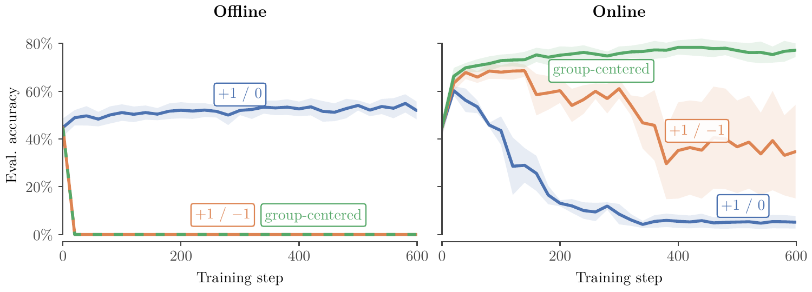
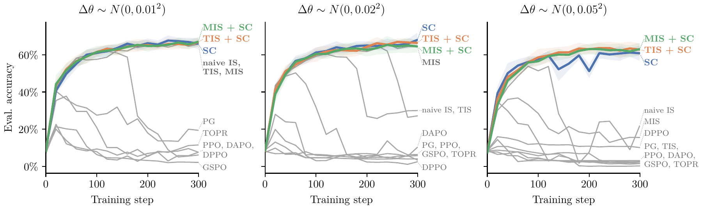

# Score Centering Stabilizes Off-policy Reinforcement Learning

## TL;DR

Training-inference mismatch (TIM) destabilises LLM RL not through noise but through drift: under a sampler $q_\theta \ne p_\theta$, the policy-gradient update contains a term $\mathbb{E}_q[R]\bar{s}$ that distills the trainer toward a biased, moving copy of itself, compounding every sync into collapse. Score centering (SC) subtracts the sampler-expected score $\bar{s}$ from every token score, cancelling drift exactly and additively with no importance ratios, clipping, or hyperparameters. On Qwen3-0.6B/Countdown and Qwen3-30B-A3B/INTELLECT-2 math, SC alone matches or beats truncated/masked importance sampling under quantization (30% vs 12% for TIS and <5% for everything else under INT8 W/A + INT4 KV), while SC composed with TIS/MIS dominates under severe staleness.

Source: [arXiv:2609.20807](https://arxiv.org/abs/2609.20807), [PDF](https://arxiv.org/pdf/2609.20807.pdf), [Code](https://github.com/martin-marek/score-centering)

## Background

LLM policy-gradient RL needs two forward passes per batch: the sampler (inference engine) generates rollouts $y \sim q_\theta$, and the trainer computes $\nabla_\theta \log p_\theta(y)$. On-policy theory assumes $q_\theta = p_\theta$, so that:

$$
\nabla_\theta \mathbb{E}_{p_\theta}[R] = \mathbb{E}_{p_\theta}[R \nabla_\theta \log p_\theta(y)].
$$

In practice $q_\theta \ne p_\theta$ for many reasons, ordered by severity in the paper:

- Different precisions or independent sampler/trainer codebases with subtly different bugs.
- Same kernels but different reduction orders: autoregressive sampling vs parallel training over the sequence dimension changes floating-point summation order (non-associativity of fp arithmetic).
- Update staleness from disaggregated async training/inference with continuous batching: one batch can mix rollouts from several checkpoints, worst in long-horizon agentic coding.
- MoE expert-routing disagreement between sampler and trainer (not replayed in the 30B runs).

The standard fix is per-token importance sampling $r = p_\theta(y)/q_\theta(y)$, but raw ratios have unbounded variance on rare tokens, so every practical method clips or drops them (PPO, DAPO, GSPO, TOPR, TIS, MIS, DPPO — tabulated as a grid in the paper's Table 1), which reintroduces bias. Prior reports disagree on severity (FP8 rollouts stable with token IS in one work, bf16 runs diverging despite minimised TIM in another); the paper argues both are consistent once drift is seen as accumulating over steps.

## Problem

The paper isolates two distinct instabilities with a controlled experiment: Qwen3-1.7B on Countdown with fixed Gaussian perturbation $\theta_{sampler} = \theta_{trainer} + \Delta\theta$, trained offline (sampler frozen) vs online (sampler synced each step) under three reward modes ($+1/0$, $+1/-1$, group-centered).

- Offline training is only stable with non-negative $+1/0$ rewards. With negative rewards, $\log p$ is unbounded below and diverges to $-\infty$ against a fixed teacher (citing Ren & Sutherland 2025).
- Online training under TIM shows the reverse ranking: $+1/0$ is the *least* stable, group-centered the most stable.

Since offline $+1/0$ is just distillation (stable) and the only change online is that the teacher tracks the student, the instability must come from the moving-teacher feedback loop, not from reward scale. Group centering shrinks but does not remove the effect, because centering zeroes advantages per prompt group while drift acts per prefix (a prefix already doomed has negative expected advantage, a promising one positive — drift is nonzero exactly where learning signal lives).

## Method

### Drift decomposition

Fix a prefix $y_{<t}$, let $s_v = \nabla_\theta \log p_v$ be the token score and $\bar{s} = \sum_v q_v s_v$ its sampler expectation. By the covariance identity:

$$
\mathbb{E}_q[R s_{y_t}] = \underbrace{\mathbb{E}_q[R]\bar{s}}_{\text{drift}} + \underbrace{\mathrm{Cov}_q(R, s_{y_t})}_{\text{signal}}.
$$

On-policy $\bar{s} = \nabla_\theta \sum_v p_v = 0$ and drift vanishes. Off-policy, $\bar{s} = -\nabla_\theta \mathrm{CE}(q\|p)$ is the distillation gradient toward the sampler, scaled by mean reward at that prefix. Each step pulls the trainer toward a biased copy of itself; weights sync back to the sampler; error compounds instead of converging.

### Score centering

Replace each score by its centered version:

$$
\tilde{s}_{y_t} = s_{y_t} - \bar{s}, \qquad \mathbb{E}_q[\tilde{s}_{y_t}] = 0.
$$

Then $\mathbb{E}_q[R\tilde{s}_{y_t}] = \mathrm{Cov}_q(R, \tilde{s}_{y_t}) = \mathrm{Cov}_q(R, s_{y_t})$: the expected update equals the on-policy update up to the distribution the covariance is measured under ($q_\theta$ instead of $p_\theta$). Key contrasts with IS:

- IS also cancels drift exactly, but multiplicatively and per sampled token — high variance, hence clipping, hence reintroduced drift. SC is additive, deterministic given the prefix, and exact.
- Reward baselines / score-function control variates subtract zero-mean quantities on-policy for variance reduction; SC subtracts a nonzero-mean quantity off-policy for bias correction. An exact per-prefix value function would cancel drift in expectation too, but needs a critic; SC needs none.
- Classical off-policy RL cannot compute $\bar{s}$ (intractable action expectation), so it uses IS. LLM RL under TIM is the unusual case where the expectation is both nonzero and exactly computable as a sum over next-token logprobs.

### Implementation

Storing full $152$K-vocab logprobs per token ($\sim$608KB/token in fp32, $\sim$20TB for 1024×32K batch) is infeasible, so the paper logs top-$k$ ($k=128$) sampler logprobs and models the tail with rescaled trainer probabilities. With head $H$, tail $T$, and tail-mass ratio $\rho = (1-\sum_H q_v)/(1-\sum_H p_v)$:

$$
\hat{q}_v = q_v\;(v \in H), \quad \hat{q}_v = \rho p_v\;(v \in T), \qquad \mathbb{E}_{\hat{q}}[s] = \sum_{v \in H}(q_v - \rho p_v)s_v,
$$

using $\mathbb{E}_p[s]=0$ to fold the tail into a head-only sum. As a scalar loss with stop-gradient:

$$
L = -R \log p_{y_t} - \sum_{v \in H} \mathrm{sg}[q_v - \rho p_v]\log p_v.
$$

Minimal JAX (single token, vanilla SC):

```python
def score_centering_loss(train_logp, samp_logp, topk_ids, sampled_token, advantage):
    train_head_logp = train_logp[topk_ids]
    tail_mass_ratio = (1 - jnp.exp(samp_logp).sum()) / (1 - jnp.exp(train_head_logp).sum())
    head_prob_residual = jnp.exp(samp_logp) - tail_mass_ratio * jnp.exp(train_head_logp)
    logp_correction = (stop_gradient(head_prob_residual) * train_head_logp).sum()
    return -advantage * (train_logp[sampled_token] - logp_correction)
```

Composing with an IS weight $w_v = f(p_v/q_v)$ (e.g. TIS $f(r)=\min(r,2)$) means centering the *weighted* score, $\mathbb{E}_{\hat{q}}[\hat{w}s] = \sum_H (q_v w_v - \alpha p_v)s_v$ with $\alpha = \rho f(1/\rho)$. Pure IS $f(r)=r$ gives $\alpha=1$ and zero centering term, as expected. Overhead is reported within 1% wall-clock on matched hardware; vLLM/SGLang expose top-$k$ logprobs natively.

## Experiments

**Shared objective.** All corrections are compared on the same base — REINFORCE with group-centered rewards $A_i = R_i - \bar{R}_{group}$, $R_i \in \{-1,+1\}$ — one SGD step per batch (lr $10^{-2}$, following Mukherjee et al. 2026, saving up to 240GB vs AdamW), 8 completions/prompt. Qwen3-0.6B-Instruct on Countdown: 64 prompts/batch, 512 max tokens. Qwen3-30B-A3B-Base on INTELLECT-2 math: 16 prompts/batch, 1024 max tokens. All ratios use logged sampler probabilities. Baselines: naive IS, TIS, MIS, PPO, DAPO, GSPO, TOPR, DPPO with paper/very defaults.

**Synthetic weight noise (0.6B, Figure 3).** $\Delta\theta \sim \mathcal{N}(0,\sigma^2)$, $\sigma \in \{0.01,0.02,0.05\}$. SC, TIS, MIS (+ SC compositions) lead; under the largest noise only SC-family trains stably. Collapse steps shrink with $\sigma$ (e.g. DPPO at ~160/80/20), consistent with drift accumulation.

**INT8 sampler and staleness-64 (0.6B, Figure 4).** Sampler-only INT8 (W+A+KV) mirrors the noise ranking: SC alone and SC+TIS/MIS best. Sampler synced only every 64 steps flips the order slightly: SC+TIS/MIS dominate, vanilla SC trails. The paper's explanation is that SC measures covariance under $q$ (Equation 5); TIS partially corrects the sampling distribution and SC removes residual drift. PPO/DAPO survive staleness (their clip targets policy-movement ratios) but collapse under quantization/weight noise (numerical-error ratios).

**30B scale (Figure 1).** FP8 sampler: even uncorrected PG stable at 58%. FP8 + FP4 KV: PG collapses within 200 steps, MIS late; SC 52%, TIS 51%. INT8 + INT4 KV: SC 30%, TIS 12%, everything else <5%. MoE router indices are not replayed (noted as suboptimal in practice).

**Top-$k$ ablation (Figure 5).** $k=32$ and $k=128$ match full-vocab centering in every setting including the worst tail distortion (INT8+INT4 at 30B: head covers 99.45% mean, 95.8% worst batch; elsewhere >99.9%).

Total compute $\sim$6,180 H100-hours over 296 runs; 30B runs mostly single-seed except leaders (SC 5/4, TIS 4/3 seeds in FP4/INT4 panels).

## Critical Analysis

The drift derivation is the paper's strongest asset: one covariance identity explains the offline/online reward-mode reversal, why group centering helps but cannot cure, why offline distillation from a wholly different model is stable while online RL collapses under fp rounding, and why mild TIM needs many steps to show damage. Demonstrating that cancelling drift *alone* with no ratios stabilises severe quantization is a clean causal test, not just another baseline win.

The composition result is the most practically useful nuance: SC fixes the mean under $q$, IS fixes the distribution toward $p$; under quantization the former suffices, under staleness you want both. The PPO/DAPO split across the two mismatch types corroborates that different TIM sources produce qualitatively different ratio spectra — a point RL infrastructure work should internalise.

Weaknesses are stated honestly but still bind. The headline 30B numbers are deliberately severe mismatches on short sequences (512–1024 tokens) as a proxy for long training under mild TIM; transfer of that proxy to production-scale runs with longer contexts is assumed, not shown. Most 30B curves are single-seed. The remaining $q$-vs-$p$ covariance gap under staleness is acknowledged as a limitation — SC is not a full off-policy correction, just a drift cancellation. The top-$k$ tail model assumes the trainer's tail shape approximates the sampler's up to a scalar; it holds empirically here but could degrade under vocabulary-level distortions (e.g. different tokenizers would break it entirely). Finally, the method adds sampler-side logging (top-$k$ per token) that async serving stacks must plumb through; the 1% overhead claim is on matched JAX hardware, not measured for vLLM/SGLang.

## Implementation Notes

- Log top-$k$ sampler logprobs ($k=128$ conservative, $k=32$ tested equal) plus the sampled token's sampler logprob (needed for composed weights when the sample falls outside the head). Floor tail masses at eps for stability.
- Floor the loss exactly as Equation 12: detach both the sampled weight $w_{y_t}$ and the centering coefficients $(q_v w_v - \alpha p_v)$. Differentiating through them breaks the centering guarantee.
- Under staleness or large policy movement between syncs, compose with TIS ($\min(r,2)$) or MIS ($r \in [0.5,5]$ else 0): `weight_fn=tis_weight` in the appendix listing, with $\alpha = \rho f(1/\rho)$. Under pure quantization, vanilla SC suffices.
- Keep the shared-objective discipline when ablating: same sampler, trainer, optimizer, advantages, one SGD step/batch. Bundled recipes (DAPO dynamic sampling, IcePop inter-version PPO) confound the correction comparison.
- Diagnostics that predicted collapse in the paper: per-prefix drift magnitude, steps-to-collapse vs TIM scale, and training-accuracy (mean rollout reward, centered moving average) rather than held-out accuracy for Figures 1/4/5.
- Reference: [github.com/martin-marek/score-centering](https://github.com/martin-marek/score-centering). Requires router-index replay for MoE in production (Ma et al. 2025), omitted in the paper's 30B runs.

## Captured Figures and Tables





