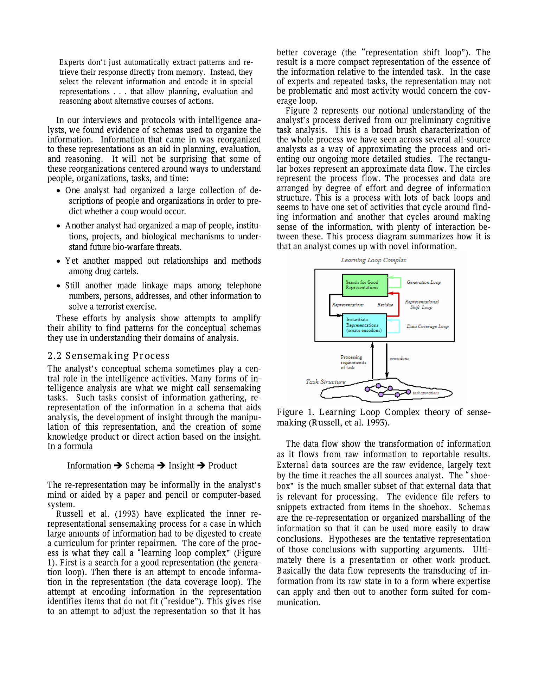
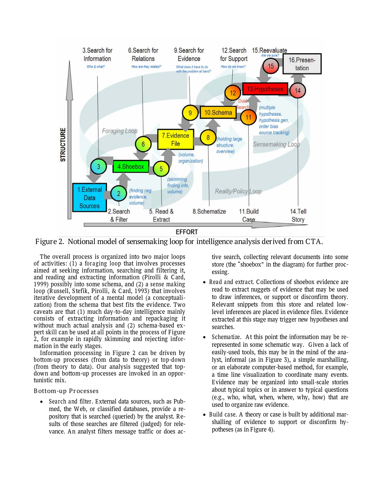
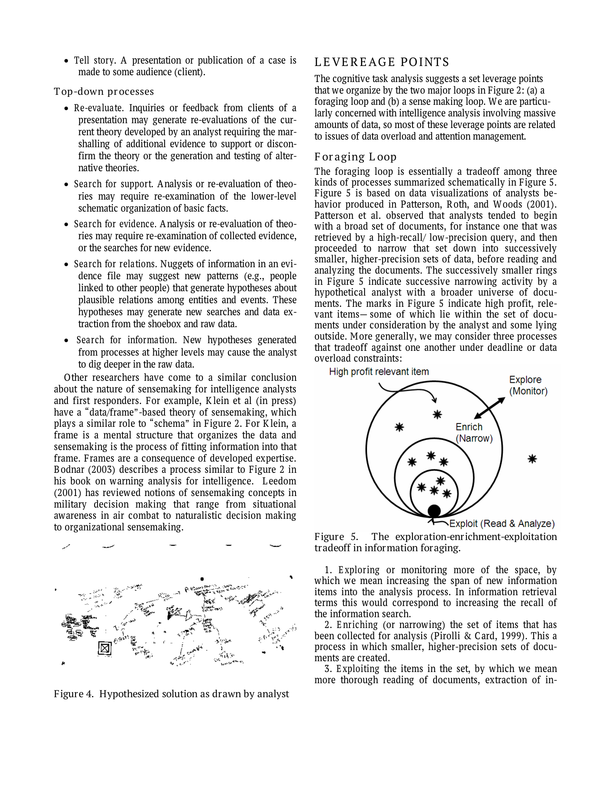

# The Sensemaking Process and Leverage Points for Analyst Technology

## TL;DR

Pirolli and Card frame intelligence analysis as a sensemaking activity that transforms raw information into schemas, hypotheses, and communicable products. The paper's useful contribution is not a new algorithm, but a process model: analysts cycle between a foraging loop that finds and filters evidence and a sensemaking loop that organizes evidence into hypotheses. The model gives system designers concrete leverage points for analyst tools, especially attention management, evidence organization, hypothesis generation, and support for disconfirming evidence.

Source: [PDF](https://andymatuschak.org/files/papers/Pirolli,%20Card%20-%202005%20-%20The%20sensemaking%20process%20and%20leverage%20points%20for%20analyst%20technology%20as.pdf)

## Background

The paper is written against a gap in intelligence-analysis research. Much prior work offered normative advice about how analysts should reason, but there were fewer descriptive studies of what analysts actually do when they face large, messy, uncertain information spaces.

Pirolli and Card connect intelligence analysis to two strands of cognitive science. One is expertise research: experienced analysts develop schemas that help them recognize patterns, decide what information matters, and reorganize raw material into task-specific representations. The other is information foraging: analysts allocate time across searching, filtering, reading, extracting, and following new leads under severe attention limits.

This makes the paper especially relevant to modern AI and data-analysis tools. It treats analysis as a workflow with cost structures, not just as a reasoning step that happens after retrieval.

## Problem

The target problem is how to identify useful technology interventions for intelligence analysts working under data overload. A tool can fail even if it has strong retrieval, visualization, or reasoning capabilities, because the analyst's bottleneck may sit somewhere else in the larger loop.

The paper's compact model is:

\[
\text{Information} \rightarrow \text{Schema} \rightarrow \text{Insight} \rightarrow \text{Product}
\]

The hard part is that this is not a straight pipeline. Analysts move opportunistically between bottom-up evidence gathering and top-down theory checking. New evidence can trigger a new hypothesis; a new hypothesis can trigger a new search; client feedback can force re-evaluation of a nearly finished product.

So the design question becomes: where in this loop can technology change the cost, capacity, or reliability of analyst work?

## Method

The paper reports preliminary results from cognitive task analysis and verbal protocol analysis with intelligence analysts. Instead of treating analysis as a single mental operation, the authors sketch a notional process model with two interacting loops.

The foraging loop covers the lower-structure, lower-effort part of the work:

- Searching and filtering external data sources.
- Collecting relevant material into a smaller working set, called the "shoebox."
- Reading and extracting snippets or nuggets of evidence.
- Following new searches suggested by extracted evidence.

The sensemaking loop covers the higher-structure, higher-effort work:

- Re-representing information as schemas.
- Building cases from evidence and hypotheses.
- Searching for support, relations, or disconfirming evidence.
- Re-evaluating the case and telling the final story to an audience.

The authors also reuse Russell et al.'s learning-loop-complex model, where analysts search for a useful representation, encode information into it, notice residue that does not fit, and shift representations when needed. In implementation terms, this is a loop over representation design:

\[
R_{t+1} = \operatorname{Revise}(R_t, E_t, \operatorname{Residue}(R_t, E_t))
\]

Here \(R_t\) is the current schema or representation and \(E_t\) is the evidence gathered so far. The important point is that representation is not a passive container; it determines what the analyst can notice and reason about.

## Experiments

This is not an experimental benchmark paper. The evidence is qualitative and model-building oriented: cognitive task analysis, interviews, verbal protocols, and prior empirical studies of analysts and related expert work.

The main empirical result is the process model itself. The authors observe that analysts repeatedly reorganize information around people, organizations, tasks, time, relations, and mechanisms. They also describe analysts moving through both bottom-up and top-down paths: from search results to evidence files to hypotheses, and from hypotheses back down into targeted searches for relations, support, or missing evidence.

The paper identifies leverage points in the foraging loop:

- Changing the cost structure of exploration, enrichment, and exploitation.
- Helping analysts scan, recognize, and select relevant items faster.
- Reducing the cost of attention shifts when new questions or anomalies appear.
- Supporting follow-up searches triggered by new inferences.

It also identifies leverage points in the sensemaking loop:

- Expanding the span of attention for evidence and hypotheses.
- Helping analysts generate alternative hypotheses.
- Counteracting confirmation bias by making disconfirming evidence more visible.

## Critical Analysis

The strongest part of the paper is its process-level framing. It gives tool builders a way to ask where a proposed feature intervenes: retrieval recall, filtering precision, evidence extraction, schema construction, hypothesis management, presentation, or re-evaluation. That is still a useful design discipline for search tools, analyst notebooks, RAG systems, and AI agents.

The foraging and sensemaking split is also productive. Many systems optimize retrieval quality but ignore the analyst's downstream capacity to organize and test hypotheses. Conversely, many visualization and reasoning tools assume evidence has already been selected well. The paper makes those dependencies explicit.

The main limitation is that the model is deliberately broad and preliminary. It abstracts across different intelligence tasks, analyst domains, and organizational settings. That makes it useful as a design map, but not sufficient as a predictive model of a specific team or workflow.

A second limitation is evaluation. The paper proposes leverage points and suggests metrics such as cost curves for information foraging, but it does not validate a concrete tool intervention. Later systems still need task-specific measurement: time to relevant evidence, missed critical evidence, hypothesis diversity, calibration, product quality, and resistance to confirmation bias.

Finally, the model is analyst-centered. That is a strength, but it means automation should be designed as cognitive support rather than as a replacement for judgment. A tool that accelerates evidence collection can still make outcomes worse if it narrows hypotheses, hides uncertainty, or amplifies existing schemas without forcing checks.

## Implementation Notes

For modern knowledge-work systems, the paper suggests separating evidence flow from hypothesis flow. A practical system should not just store documents; it should maintain explicit objects for evidence, schemas, hypotheses, support relations, and open questions.

A useful data model might look like:

\[
\text{EvidenceItem} \rightarrow \text{Claim} \rightarrow \text{Hypothesis} \rightarrow \text{ReportSection}
\]

with typed relations such as `supports`, `contradicts`, `explains`, `depends_on`, and `needs_follow_up`. This makes the sensemaking loop visible instead of burying it in notes or chat transcripts.

The paper also argues for changing costs, not only adding capabilities. In a software system, that means:

1. Make broad, low-fidelity scanning cheap with summaries, facets, entity highlights, and clustering.
2. Make high-fidelity exploitation available on demand with source views, provenance, and extracted evidence.
3. Preserve the shoebox as an explicit intermediate workspace rather than forcing users to jump directly from search to final writing.
4. Track residue: evidence that does not fit the current schema should remain visible.
5. Build hypothesis prompts and views that ask for alternatives and disconfirming evidence, not just more support.

For AI-agent design, the model is a warning against single-pass retrieval-answering. Serious analysis needs an inspectable loop: retrieve, collect, extract, schematize, hypothesize, search for support, search for contradictions, and revise.

## Captured Figures and Tables

